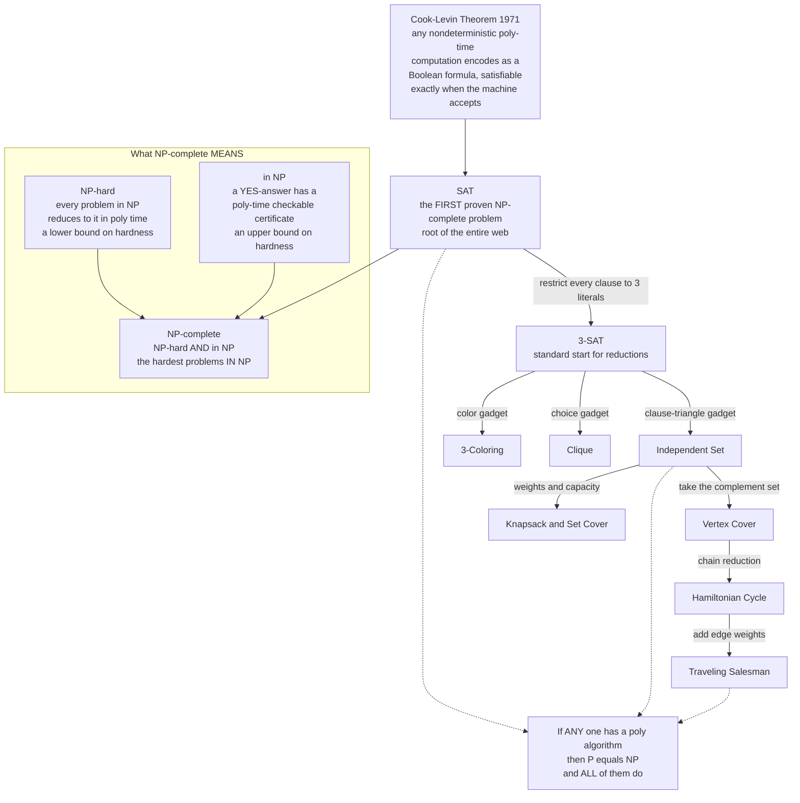

# 🧩 NP-Completeness and the Cook-Levin Theorem

> [!abstract] TL;DR
> **NP-completeness** identifies the **hardest problems in NP** — a problem is NP-complete if it is (1) **in NP** (a claimed "yes" answer can be *checked* in polynomial time) and (2) **NP-hard** (every problem in NP **polynomial-time reduces** to it). The magic is that these problems are all secretly **the same problem in disguise**: a fast algorithm for *any one* of them would give a fast algorithm for *all* of NP, settling **P = NP**. The **Cook-Levin theorem** (Cook 1971; Levin independently) is the keystone: it proves **Boolean satisfiability (SAT) is NP-complete** by showing any nondeterministic polynomial-time computation can be *encoded as a giant Boolean formula* — "the computation is a formula." SAT became the **root** from which reductions grew thousands of NP-complete problems across every field.

---

## Intuition

**Analogy — the load-bearing pillars of a cathedral.** Imagine a vast cathedral (the class NP) held up by thousands of stone pillars — each pillar is a hard problem: scheduling, routing, packing, circuit design. Most pillars are ordinary. But a special set of pillars are **load-bearing and secretly wired together**: if any *single one* of them can be effortlessly lifted (solved fast), a hidden chain of levers lifts **all** of them at once, and the whole cathedral floats — that would be **P = NP**. Conversely, if the roof is genuinely heavy (P ≠ NP), then *every one* of these pillars is genuinely stuck. These interconnected pillars are the **NP-complete** problems. They stand or fall **together**, never one at a time.

Now the second half of the picture. To *prove* a pillar is one of these load-bearing ones, you must show it is wired to all the others — an infinite job. **Cook and Levin did it once, for a single pillar: SAT.** They showed that the very act of a machine *verifying* a solution can be rewritten as asking whether a Boolean formula is satisfiable — so SAT holds up everything in NP. After that, nobody has to redo the infinite job: to show a new pillar is load-bearing, you only need to wire it to **SAT** (or its cousin 3-SAT) with a single polynomial-time cable — a **reduction**. That is why one 1971 theorem detonated into a catalogue of thousands of NP-complete problems.

---

## How It Works

### Core Mechanics

**1. Polynomial-time (Karp / many-one) reductions.** A reduction from problem `A` to problem `B` is a function `f`, computable in **polynomial time**, that transforms any instance `x` of `A` into an instance `f(x)` of `B` such that

$$x \text{ is a YES-instance of } A \iff f(x) \text{ is a YES-instance of } B.$$

We write `A ≤ₚ B`. The reduction **preserves the yes/no answer** and runs fast, so it lets a `B`-solver double as an `A`-solver: solve `A(x)` by computing `f(x)` and asking `B`. The direction is the whole point — `A ≤ₚ B` means **`B` is at least as hard as `A`** (a fast `B` gives a fast `A`). This is *exactly* the same tool used to prove problems undecidable (see [[Reductions_and_Undecidable_Problems]]), only now **resource-bounded**: undecidability reductions just need to be computable; hardness reductions must be *polynomial*.

**2. The two definitions.**
- **NP-hard:** a problem `H` such that **every** problem `L` in NP reduces to it: `L ≤ₚ H` for all `L ∈ NP`. Intuitively, `H` is *at least as hard as everything in NP*. An NP-hard problem **need not be in NP** — it could be far harder (even undecidable, like the halting problem, which is NP-hard).
- **NP-complete:** a problem that is **NP-hard AND itself in NP**. This pins it *exactly* at the top of NP — among the hardest problems that are still in NP. That two-sided membership is the crucial distinction: NP-hard is a *lower bound* on difficulty; NP-complete adds the *upper bound* "still verifiable in poly time."

**3. Why they stand or fall together.** Suppose one NP-complete problem `C` had a polynomial-time algorithm. Because `C` is NP-hard, **every** `L ∈ NP` satisfies `L ≤ₚ C`; chaining the poly-time reduction with the poly-time solver for `C` solves `L` in polynomial time. So `NP ⊆ P`, hence **P = NP**, and *every* NP-complete problem becomes easy. This is why a single fast algorithm for SAT, or TSP, or graph coloring would collapse the entire class (see [[P_versus_NP]]).

**4. The bootstrapping problem — and Cook-Levin's answer.** The definition of NP-hard quantifies over *all infinitely many* problems in NP. How could you ever verify that for even one problem? You cannot check them one by one. **Cook and Levin's insight:** every `L ∈ NP` has, by definition, a **verifier** — a polynomial-time machine `M` that, given input `x` and a candidate certificate, decides whether the certificate proves `x ∈ L`. A nondeterministic machine "guesses" that certificate. The theorem encodes the *entire computation* of `M` on `x` — its tape contents at every step, cell by cell, time-step by time-step — as Boolean variables, and writes down clauses asserting "the tape starts as `x`", "each step obeys `M`'s transition rules", and "the machine ends in an accepting state." The resulting formula `φ` is **satisfiable exactly when some certificate makes `M` accept `x`**. Building `φ` takes only polynomial time and space (the tableau is polynomial × polynomial). Thus **any** NP problem reduces to SAT: `L ≤ₚ SAT`. SAT is NP-hard, and since SAT is obviously in NP (a satisfying assignment is a checkable certificate), **SAT is NP-complete**. Slogan: *"the computation is a formula."*

**5. The explosion — Karp's 21 problems.** Once you have **one** NP-complete problem, proving a new problem `B` NP-complete is easy: show `B ∈ NP` (exhibit a poly-checkable certificate) and pick an *already-known* NP-complete problem `A`, then build a reduction `A ≤ₚ B`. By transitivity of `≤ₚ`, everything in NP reduces to `B` through `A`. In 1972 **Richard Karp** did exactly this for **21 classic problems** (clique, vertex cover, Hamiltonian cycle, knapsack, set cover, ...), all rooted at SAT. **3-SAT** — SAT restricted to clauses of exactly three literals, itself NP-complete — became the favorite *starting point* because its rigid clause structure makes gadget constructions clean. The catalogue now numbers in the thousands across scheduling, biology, cryptography, and games (see [[Reductions_and_NP_Complete_Problems]]).

**6. Practical significance — a proof of difficulty.** An NP-completeness proof is a **certificate that you should stop looking for a fast exact algorithm** (unless you intend to prove P = NP). Instead you pivot to: **approximation algorithms** (accept a provably-near-optimal answer), **heuristics** (SAT solvers, branch-and-bound), **restricted special cases** (trees, planar graphs, bounded parameters), or **exponential exact methods** that are fine for small inputs. Knowing a problem is NP-complete is one of the most *useful* negative results in all of engineering.

### Flow / Architecture



*Solid arrows are polynomial-time reductions carrying hardness **outward** from SAT; every downstream problem inherits NP-hardness from its parent. The dashed arrows show the collapse property: crack any single node in polynomial time and the whole web falls to P.*

---

## Key Concepts

**Secondary (intuitive, no CS background needed)**
- **"All the same problem in disguise"** — a family of puzzles so tightly linked that a shortcut for one is a shortcut for every one of them.
- **Checking vs solving** — it is easy to *check* a completed Sudoku but (seemingly) hard to *solve* a blank one; NP is the world of easy-to-check problems.
- **Proof of difficulty** — showing your problem is "one of the hard ones" so you can justify using approximations instead of chasing a perfect fast method.
- **A reduction** — a translator that turns your problem into a known hard problem, transferring its difficulty.

**Undergraduate (a first theory / algorithms course)**
- **Polynomial-time (Karp) reduction `A ≤ₚ B`** — a poly-time map preserving yes/no answers; proves `B` is at least as hard as `A`.
- **NP-hard vs NP-complete** — NP-hard = at least as hard as all of NP (maybe harder, maybe not even in NP); NP-complete = NP-hard **and** in NP.
- **The Cook-Levin theorem** — SAT is NP-complete; the first, obtained by encoding an NP verifier's computation as a Boolean formula.
- **3-SAT** — the go-to NP-complete starting point; its 3-literal clauses make gadget reductions (to Independent Set, Vertex Cover, Clique, 3-Coloring) clean.
- **The collapse property** — one NP-complete problem in P forces P = NP (see [[P_versus_NP]]).
- **Recipe to prove `B` NP-complete** — (i) show `B ∈ NP`; (ii) reduce a known NP-complete problem to `B`.

**Graduate (advanced complexity)**
- **The tableau / computation-history construction** — the polynomial `time × space` grid of cells and the local "window" consistency clauses at the heart of Cook-Levin.
- **Reduction taxonomy** — many-one (Karp) vs Turing (Cook) reductions; log-space reductions used for finer classes; why polynomial many-one is the right granularity for NP.
- **coNP-completeness and structure** — TAUTOLOGY / UNSAT are coNP-complete; NP = coNP is open and would follow oddly from short proofs of unsatisfiability.
- **Ladner's theorem** — if P ≠ NP, there exist **NP-intermediate** problems (in NP, not in P, not NP-complete); NP is not just P plus NP-complete.
- **Sparse languages and Mahaney's theorem** — no sparse language is NP-complete unless P = NP, constraining what NP-complete sets can look like.
- **Approximation hardness and the PCP theorem** — reductions that preserve *gaps* prove that even approximating many NP-complete problems is itself NP-hard.

---

## Python Demo

```python
# A CONCRETE polynomial-time reduction:  3-SAT  ->  Independent Set.
# ----------------------------------------------------------------------------
# Classic Karp gadget. For a 3-CNF formula with m clauses:
#   * each clause becomes a TRIANGLE of 3 vertices (one per literal) -> edges
#     inside a triangle force us to pick AT MOST ONE literal per clause;
#   * add a CONFLICT edge between any two vertices holding complementary
#     literals x and NOT-x -> forbids choosing a variable true and false at once.
# Claim: the formula is satisfiable  <=>  the graph has an independent set of
# size exactly m (one vertex per clause). We build the graph, FIND such a set,
# translate it back to a satisfying assignment, VERIFY it, and draw the gadget.
# numpy / matplotlib only.

import numpy as np
import matplotlib.pyplot as plt
from itertools import combinations

# --- 1. A 3-CNF formula. A literal is (var_index, negated?) ------------------
#     (x1 v x2 v NOT x3) AND (NOT x1 v NOT x2 v x3) AND (x1 v x2 v x3)
clauses = [
    [(1, False), (2, False), (3, True)],
    [(1, True),  (2, True),  (3, False)],
    [(1, False), (2, False), (3, False)],
]
m = len(clauses)                     # target independent-set size k = #clauses

# --- 2. Build the reduction graph (this whole step is polynomial time) -------
#     Vertex id = (clause_index, position_in_clause); it "holds" one literal.
vertices, lit_of = [], {}
for ci, cl in enumerate(clauses):
    for pi, lit in enumerate(cl):
        v = (ci, pi)
        vertices.append(v)
        lit_of[v] = lit

edges = set()
# (a) triangle edges: fully connect the 3 vertices inside each clause
for ci in range(m):
    for u, w in combinations([(ci, 0), (ci, 1), (ci, 2)], 2):
        edges.add(frozenset((u, w)))
# (b) conflict edges: connect complementary literals across clauses
for u, w in combinations(vertices, 2):
    (vu, nu), (vw, nw) = lit_of[u], lit_of[w]
    if vu == vw and nu != nw:        # same variable, opposite polarity
        edges.add(frozenset((u, w)))

def is_independent(S):
    return all(frozenset((u, w)) not in edges for u, w in combinations(S, 2))

# --- 3. Find an independent set of size m (instance is tiny -> brute force) ---
solution = next((c for c in combinations(vertices, m) if is_independent(c)), None)

print("REDUCTION  3-SAT  ->  Independent Set")
print("clauses           :", m, " -> target independent-set size k =", m)
print("graph             :", len(vertices), "vertices,", len(edges), "edges")

def lit_str(lit):
    v, neg = lit
    return ("NOT x%d" if neg else "x%d") % v

if solution is None:
    print("\nNo independent set of size", m, " => formula is UNSATISFIABLE")
    assign = None
else:
    print("\nIndependent set of size", m, "found:")
    for v in solution:
        print("   vertex", v, "holds literal", lit_str(lit_of[v]))
    # translate: make each chosen literal TRUE  (conflict edges guarantee consistency)
    assign = {}
    for v in solution:
        var, neg = lit_of[v]
        assign[var] = (not neg)
    for var in (1, 2, 3):            # unconstrained vars: pick anything
        assign.setdefault(var, True)
    print("\nDerived assignment:", {("x%d" % k): v for k, v in sorted(assign.items())})

# --- 4. VERIFY the derived assignment actually satisfies the formula ----------
def lit_true(lit, a):
    var, neg = lit
    return (not a[var]) if neg else a[var]

if assign is not None:
    ok = all(any(lit_true(l, assign) for l in cl) for cl in clauses)
    print("Assignment satisfies EVERY clause:", ok,
          " <=  independent set  <=>  satisfying assignment")

# --- 5. Draw the gadget graph ------------------------------------------------
pos = {}
tri = np.array([[0.0, 0.62], [-0.52, -0.4], [0.52, -0.4]])   # triangle shape
for ci in range(m):
    center = np.array([ci * 3.0, 0.0])
    for pi in range(3):
        pos[(ci, pi)] = center + tri[pi]

fig, ax = plt.subplots(figsize=(11, 6))
for e in edges:                      # edges: grey solid = triangle, red dashed = conflict
    u, w = tuple(e)
    (xu, yu), (xw, yw) = pos[u], pos[w]
    if u[0] == w[0]:
        ax.plot([xu, xw], [yu, yw], "-", color="0.7", lw=1.6, zorder=1)
    else:
        ax.plot([xu, xw], [yu, yw], "--", color="#d1495b", lw=1.3, zorder=1)

chosen = set(solution) if solution else set()
for v in vertices:
    x, y = pos[v]
    ax.scatter(x, y, s=1500, zorder=2, edgecolor="black", lw=1.6,
               color="#2a9d8f" if v in chosen else "#a8dadc")
    ax.text(x, y, lit_str(lit_of[v]).replace("NOT ", "~"),
            ha="center", va="center", fontsize=10, fontweight="bold", zorder=3)

for ci in range(m):
    ax.text(ci * 3.0, 1.25, "clause %d" % (ci + 1), ha="center",
            fontsize=10, style="italic")

ax.set_title("3-SAT -> Independent Set gadget\n"
             "grey = clause triangle (pick <=1 per clause),  "
             "red dashed = conflict (x vs ~x),  "
             "green = independent set = satisfying assignment")
ax.axis("off"); ax.set_aspect("equal")
plt.tight_layout()
plt.savefig("threesat_to_independent_set.png", dpi=130)
print("\nSaved gadget graph to threesat_to_independent_set.png")
```

Running it prints the reduction's shape (3 clauses → a 9-vertex graph), finds an independent set of size 3, translates it back into the assignment `x1 = True, x2 = False, x3 = True`, and **verifies that assignment satisfies every clause** — the two sides of the `⇔` matching exactly. The saved figure shows three clause-triangles wired by red conflict edges, with the chosen independent set highlighted. The takeaway: an *Independent-Set solver* would have just *solved 3-SAT for free*, so hardness flows straight through the reduction — the mechanism by which one NP-complete problem breeds thousands more.

---

## Real-World Applications

> **Example — industrial SAT solvers turning theory on its head.** Cook-Levin says SAT is the *canonical hard* problem, yet modern **CDCL SAT solvers** (MiniSat, Glucose, Kissat) routinely dispatch formulas with *millions* of variables. Hardware companies encode "does this chip circuit ever violate its spec?" as a Boolean formula and hand it to a SAT solver for **formal equivalence checking and model checking** (Intel and every major EDA vendor). NP-completeness is precisely *why* SAT is the universal target: because *every* NP problem reduces to it, a great SAT solver is a great everything-solver, so decades of engineering pour into that one problem.

- **Deciding your engineering strategy.** The first thing to ask about a new optimization problem is "is it NP-complete?" If yes, you stop hunting for an exact polynomial algorithm and reach for approximation, heuristics, ILP/SAT/SMT solvers, or parameterized algorithms — the single most consequential design decision, and the direct payoff of a hardness proof (see [[Time_Complexity_Classes]]).
- **Operations research and logistics.** Vehicle routing, crew scheduling, bin packing, and facility location are NP-complete; industry solves them with branch-and-bound, cutting planes, and metaheuristics rather than exact polynomial methods that provably do not exist unless P = NP.
- **Compilers and verification.** Register allocation reduces to **graph coloring** (NP-complete); instruction scheduling and bounded model checking reduce to SAT. Compilers use heuristic colorings and SAT/SMT back-ends.
- **Computational biology.** Protein folding, multiple sequence alignment, and phylogeny reconstruction are NP-hard; practical pipelines use approximations and dynamic-programming special cases.
- **Cryptography's mirror image.** Security wants problems that are *hard on average*; NP-completeness (worst-case hardness) motivated but is not sufficient for crypto, spurring the study of average-case and lattice hardness.

---

## Common Pitfalls

- **Confusing NP-hard with NP-complete.** NP-hard only means "at least as hard as all of NP" — such a problem **need not be in NP** and can be strictly harder (the halting problem is NP-hard but *undecidable*). NP-complete adds the second requirement "**and in NP**." Every NP-complete problem is NP-hard; the converse fails.
- **Reducing in the wrong direction.** To prove `B` is NP-hard you must reduce a **known-hard** problem *to* `B` (`known ≤ₚ B`), showing `B` is at least as hard. Students often build `B ≤ₚ known`, which proves `B` is *easy* (no harder than something already solvable) — the exact opposite of the goal.
- **Forgetting to prove membership in NP.** A reduction alone shows NP-hardness. To claim NP-**complete**ness you must *also* exhibit a polynomial-time-checkable certificate proving `B ∈ NP`. Skip this and you have only half the proof.
- **"NP means non-polynomial."** No — NP means **N**ondeterministic **P**olynomial, i.e. verifiable in polynomial time. P ⊆ NP, and whether the inclusion is strict is open (see [[P_versus_NP]]). Many people mis-expand the acronym and then reason wrongly.
- **Letting the reduction run in exponential time.** A reduction must itself be **polynomial** in size and runtime. Blowing the formula up exponentially (e.g. naive CNF conversion by distributing ORs over ANDs) breaks the argument; use the **Tseitin transformation** to keep it linear.
- **Thinking NP-complete means "unsolvable in practice."** These problems are **decidable** and often tractable on real instances — SAT solvers, ILP, and heuristics crush enormous cases daily. NP-completeness is a *worst-case* statement, not a verdict on every instance.
- **Believing NP = P plus NP-complete.** By **Ladner's theorem**, if P ≠ NP there are **NP-intermediate** problems living strictly between; NP is richer than a clean two-way split.

---

## Related Concepts

- [[The_Class_NP_and_Verification]] — defines NP via polynomial-time verifiers and certificates; NP-completeness identifies the *hardest* members of exactly this class.
- [[Reductions_and_NP_Complete_Problems]] — the catalogue and mechanics of gadget reductions (3-SAT → Clique, Vertex Cover, Hamiltonian Cycle, ...) that grew from the Cook-Levin root.
- [[P_versus_NP]] — the million-dollar question these problems all hinge on; one NP-complete problem in P forces P = NP.
- [[The_Class_P_and_Efficient_Computation]] — the class of "efficiently solvable" problems; NP-complete problems are the ones (conjecturally) *outside* it.
- [[Reductions_and_Undecidable_Problems]] — the same reduction technique in the *computability* setting; NP-hardness reductions are its polynomial-time-bounded analogue.
- [[Theory_of_Computation_Overview]] — parent map placing complexity theory relative to automata and computability.
- [[Time_Complexity_Classes]] — the applied DSA view of P, NP, and growth rates that tells engineers when to stop optimizing.
- [[Backtracking]] — the practical exact solver (DFS with pruning) used on NP-complete search problems like SAT and N-Queens when inputs are small.

---

## Review Questions

1. **(Recall / conceptual)** State precisely what it means for a problem to be **NP-hard** versus **NP-complete**, and explain why the halting problem is NP-hard but *not* NP-complete. What single extra requirement separates the two definitions?
2. **(Scenario)** Your manager asks you to write an *exact, always-optimal, polynomial-time* algorithm for a warehouse-packing problem. You suspect it is NP-complete. Describe exactly what you would do to *prove* that (the two obligations), and — assuming the proof succeeds — what four practical strategies you would propose instead of the impossible exact algorithm.
3. **(Trade-off / analysis)** The Cook-Levin theorem reduces *every* NP problem to SAT, yet real SAT solvers handle millions of variables routinely. Reconcile this apparent contradiction: what precise kind of statement is "SAT is NP-complete," and why does it not prevent SAT from being practical? Then explain why, despite this, discovering a *provably* polynomial worst-case SAT algorithm would be world-changing.

---

## Sources

- Cook, S. A. "The Complexity of Theorem-Proving Procedures." *Proc. 3rd ACM STOC*, 1971 — the founding paper proving SAT is NP-complete. [ACM](https://dl.acm.org/doi/10.1145/800157.805047)
- Karp, R. M. "Reducibility Among Combinatorial Problems." *Complexity of Computer Computations*, 1972 — the 21 NP-complete problems that launched the field. [PDF](https://people.eecs.berkeley.edu/~luca/cs172/karp.pdf)
- Levin, L. A. "Universal Sequential Search Problems." *Problems of Information Transmission*, 1973 — the independent Soviet discovery of the same phenomenon.
- Sipser, M. *Introduction to the Theory of Computation*, 3rd ed., Chapter 7 "Time Complexity." Cengage, 2013 — clear proof of Cook-Levin and the reduction toolkit. [Publisher](https://www.cengage.com/c/introduction-to-the-theory-of-computation-3e-sipser/)
- Garey, M. R., Johnson, D. S. *Computers and Intractability: A Guide to the Theory of NP-Completeness*. W. H. Freeman, 1979 — the canonical NP-completeness reference and problem catalogue.
- Arora, S., Barak, B. *Computational Complexity: A Modern Approach*, Chapter 2. Cambridge University Press, 2009. [Book site](https://theory.cs.princeton.edu/complexity/)

---

#theory-of-computation #np-completeness #cook-levin #sat #reductions
