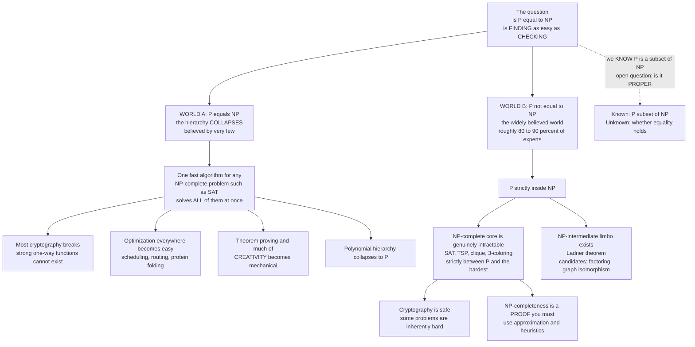

# 🏆 P versus NP

> [!abstract] TL;DR
> **P versus NP** is the most important open question in computer science and one of the seven Clay **Millennium Prize Problems** (a correct proof is worth 1,000,000 USD). It asks one deceptively simple thing: **is finding a solution as easy as checking one?** Formally, $\mathrm{P}$ is the class of problems *solvable* quickly (in polynomial time) and $\mathrm{NP}$ is the class of problems whose proposed solutions can be *verified* quickly. We know $\mathrm{P} \subseteq \mathrm{NP}$ — anything you can solve fast you can certainly check fast. The trillion-dollar question is whether that containment is **proper**: does there exist a problem you can *verify* fast but provably *cannot solve* fast? Almost everyone believes **$\mathrm{P} \neq \mathrm{NP}$** (hard problems are genuinely hard), but after fifty years no one has proved it either way. If instead $\mathrm{P} = \mathrm{NP}$, the entire hierarchy of "hard" problems collapses at once: **SAT, TSP, protein folding, optimal scheduling** all get efficient algorithms, most cryptography breaks, and — most philosophically unsettling — much of what we call *creativity* becomes mechanically automatable.

---

## Intuition

**Analogy — the jigsaw puzzle and the finished picture.** Imagine someone hands you a completed 5,000-piece jigsaw puzzle and asks, "Is this assembled correctly?" You glance at it, run your eyes along the seams, and answer in seconds — **checking** a solution is trivially easy. Now imagine they hand you the same 5,000 loose pieces in a box and say, "Assemble it." That could take you all weekend — **finding** the solution is agonizingly hard. The gap between "check in seconds" and "solve in a weekend" feels obvious and permanent. P versus NP asks whether that gap is *real* or an *illusion*: **is there always a clever method that makes finding the solution as fast as checking one — for every problem where checking is fast?**

Push the stakes further. A sudoku is easy to *verify* (scan every row, column, and box) but can be hard to *solve*. A mathematical proof is easy to *check* line by line, but finding the proof took a genius years. A password is trivial to *verify* against a login, but searching for it means trying astronomically many candidates. Every one of these is a problem where **verification is cheap and search is expensive**. If $\mathrm{P} = \mathrm{NP}$, then *in every such case a fast search algorithm secretly exists* — meaning the sudoku, the proof, and the password all fall to a polynomial-time method. Creativity, discovery, and secrecy would all be, at bottom, the same easy mechanical act as checking. If $\mathrm{P} \neq \mathrm{NP}$, the universe genuinely makes **finding fundamentally harder than checking**, and some walls are permanent. Nobody knows which world we live in — and the answer would reshape mathematics, security, biology, and economics overnight.

---

## How It Works

### The question, stated precisely

Two classes anchor everything (see [[The_Class_P_and_Efficient_Computation]] and [[The_Class_NP_and_Verification]]):

- **$\mathrm{P}$ (Polynomial time)** — decision problems a deterministic Turing machine can *solve* in time bounded by a polynomial $n^k$ in the input size $n$. This is the standard formal proxy for **"efficiently solvable"**: sorting, shortest paths, primality, linear programming.
- **$\mathrm{NP}$ (Nondeterministic Polynomial time)** — decision problems for which a *yes*-answer comes with a short **certificate** (a proposed solution) that a deterministic machine can *verify* in polynomial time. For SAT, the certificate is a satisfying assignment; for the traveling salesman decision problem, a tour under the budget; for graph coloring, the coloring itself.

The one direction we can prove is easy:

$$\mathrm{P} \subseteq \mathrm{NP}$$

If you can *solve* a problem in polynomial time, you can *verify* any claimed solution in polynomial time — just ignore the certificate and solve it yourself. The open question is the **reverse containment**:

$$\text{Is } \mathrm{NP} \subseteq \mathrm{P}, \text{ i.e. is } \mathrm{P} = \mathrm{NP}?$$

Restated in one line: **is every problem whose solutions can be verified quickly also solvable quickly? Is finding as easy as checking?** The containment $\mathrm{P} \subseteq \mathrm{NP}$ is known; whether it is *proper* ($\mathrm{P} \subsetneq \mathrm{NP}$) is the whole mystery.

### Why NP-completeness makes it all-or-nothing

The reason P vs NP is a *single* question rather than thousands of separate ones is **NP-completeness** ([[NP_Completeness_and_the_Cook_Levin_Theorem]]). The **Cook–Levin theorem** (1971) proved that **Boolean satisfiability (SAT)** is NP-complete: every problem in $\mathrm{NP}$ can be *reduced* to SAT in polynomial time ([[Reductions_and_NP_Complete_Problems]]). Karp (1972) then showed 21 more classic problems — TSP, clique, vertex cover, Hamiltonian cycle, subset-sum, 3-coloring — are all NP-complete, and today the list runs into the thousands.

The consequence is dramatic. NP-complete problems are the **hardest problems in $\mathrm{NP}$**, and they are all *polynomially equivalent*:

$$\text{one NP-complete problem} \in \mathrm{P} \;\Longleftrightarrow\; \mathrm{P} = \mathrm{NP} \;\Longleftrightarrow\; \text{every NP-complete problem} \in \mathrm{P}$$

So a single fast algorithm for SAT (or TSP, or any one NP-complete problem) would instantly yield fast algorithms for *all* of them. This "**if any one falls, all fall**" structure is exactly why $\mathrm{P} = \mathrm{NP}$ feels *too good to be true*: it would be a miracle that no one has stumbled on even one such algorithm across thousands of intensely studied problems.

### The two possible worlds

**World A — $\mathrm{P} = \mathrm{NP}$ (the collapse).** A single polynomial-time algorithm for an NP-complete problem would be *constructive*: it collapses the distinction between searching and checking. The staggering downstream effects:

- **Most cryptography breaks.** Public-key security rests on the belief that certain problems are hard to *solve* but easy to *verify* — the essence of a **one-way function**. If $\mathrm{P} = \mathrm{NP}$, one-way functions cannot exist in the strong sense, so much of modern crypto founded on computational hardness would fall ([[Asymmetric_Cryptography_and_PKI]], [[Information_Theoretic_Security_and_Privacy]]). (Note: RSA rests specifically on *factoring*, which is in $\mathrm{NP} \cap \mathrm{coNP}$ and not known to be NP-complete — but a general collapse would still crack it.)
- **Optimization everywhere becomes easy.** Scheduling, routing, chip layout, protein folding, portfolio optimization — the NP-complete/NP-hard core of operations research would become tractable at scale.
- **Insight mechanizes.** Finding a short mathematical proof is an $\mathrm{NP}$ search (the proof is a short, checkable certificate). If $\mathrm{P} = \mathrm{NP}$, an efficient machine could *find* proofs, designs, and theorems, not just verify them — a large slice of what we call **creativity** would be automatable. Scott Aaronson's aphorism: if $\mathrm{P} = \mathrm{NP}$, "everyone who could appreciate a symphony would be Mozart; everyone who could follow a step-by-step argument would be Gauss."

**World B — $\mathrm{P} \neq \mathrm{NP}$ (the believed world).** NP-complete problems are **genuinely intractable**: no polynomial algorithm exists, so worst-case instances demand exponential effort. Cryptography stands, some problems are *inherently* hard, and the engineering stance of "reach for approximation and heuristics when you hit NP-completeness" is *provably* justified rather than merely pragmatic. This is the world almost every expert bets on.

### Why almost everyone believes $\mathrm{P} \neq \mathrm{NP}$

There is no proof, only overwhelming circumstantial evidence:

1. **Decades of failure.** Thousands of NP-complete problems have been attacked by the world's best algorithmists since 1971. Not one polynomial algorithm has emerged. Given the "all fall together" structure, the persistent absence of *even one* is strong evidence none exists.
2. **The collapse is too clean.** $\mathrm{P} = \mathrm{NP}$ would make an implausibly large number of hard-seeming things easy simultaneously — it would be, in Aaronson's phrase, a world "too beautiful to be true."
3. **Expert consensus.** Repeated polls of complexity theorists find roughly 80–90 percent expecting $\mathrm{P} \neq \mathrm{NP}$.

But belief is not proof — and the problem's *difficulty* is itself a deep subject.

### Why proving it is so hard: the barriers

Three formal **barrier theorems** show that essentially every proof technique we already have provably *cannot* settle P vs NP. Any solution must invent genuinely new mathematics.

- **Relativization (Baker–Gill–Solovay, 1975).** Many classical results — including the halting-problem diagonalization that separates classes — still hold when both machines are given the same **oracle** (a free subroutine). BGS built one oracle $A$ with $\mathrm{P}^A = \mathrm{NP}^A$ and another oracle $B$ with $\mathrm{P}^B \neq \mathrm{NP}^B$. Since any *relativizing* proof would give the same answer under every oracle, no relativizing technique (like plain diagonalization) can resolve P vs NP.
- **Natural proofs (Razborov–Rudich, 1994).** Most circuit-lower-bound arguments define a "largeness/constructivity" property that distinguishes hard functions from easy ones. Razborov and Rudich showed that any such **natural** proof of $\mathrm{P} \neq \mathrm{NP}$ would, ironically, break the very **pseudorandom generators** whose existence complexity theorists also believe in — so if strong one-way functions exist, no natural proof can work.
- **Algebrization (Aaronson–Wigderson, 2008).** A newer technique (arithmetization) escaped relativization for some results, but Aaronson and Wigderson showed it, too, hits a wall: any *algebrizing* proof cannot separate $\mathrm{P}$ from $\mathrm{NP}$ either.

The upshot: relativization, natural proofs, and algebrization together rule out nearly the entire existing toolkit. Resolving P vs NP requires **fundamentally new, non-relativizing, non-natural, non-algebrizing ideas** — which is why it has resisted for half a century.

### The surrounding class structure

P vs NP sits at the center of a web of related classes ([[Time_Complexity_Classes]]):

- **coNP.** The class where *no*-answers have short certificates (unsatisfiability, for instance). It is open whether $\mathrm{NP} = \mathrm{coNP}$; if $\mathrm{P} = \mathrm{NP}$ then $\mathrm{NP} = \mathrm{coNP}$, but the converse is not known.
- **The Polynomial Hierarchy (PH).** An infinite tower of classes ($\Sigma_k^p, \Pi_k^p$) generalizing $\mathrm{NP}$ and $\mathrm{coNP}$ with alternating quantifiers. A key theorem: **if $\mathrm{P} = \mathrm{NP}$, the entire polynomial hierarchy collapses to $\mathrm{P}$.** A whole infinite structure would flatten to a single level.
- **NP-intermediate problems (Ladner's theorem, 1975).** If $\mathrm{P} \neq \mathrm{NP}$, then there must exist problems in $\mathrm{NP}$ that are **neither in $\mathrm{P}$ nor NP-complete** — a strictly-between-limbo. The leading real-world *candidates* are **integer factoring** and **graph isomorphism**: both are in $\mathrm{NP}$, neither is known to be in $\mathrm{P}$, and neither is believed NP-complete (graph isomorphism has a quasi-polynomial algorithm due to Babai, 2015). Their peculiar status is only meaningful *because* we assume $\mathrm{P} \neq \mathrm{NP}$.

### Flow / Architecture — the two possible worlds



---

## Key Concepts

### Secondary (intuitive, no CS background needed)
- **Checking versus solving.** It is often easy to *verify* a right answer (does this key open the lock?) yet hard to *find* it (search all keys). P vs NP asks whether that gap is real.
- **The million-dollar question.** It is one of seven Clay Millennium Prize Problems; a correct proof pays 1,000,000 USD — and would be far more valuable than the prize.
- **The dominant guess.** Almost all experts bet that hard problems really are hard ($\mathrm{P} \neq \mathrm{NP}$) — but nobody has proven it.
- **Why it matters to everyone.** If finding were as easy as checking, passwords, bank encryption, and much of secrecy would collapse — while science and logistics would leap forward.

### Undergraduate (a first theory or algorithms course)
- **$\mathrm{P}$, $\mathrm{NP}$, and certificates.** $\mathrm{P}$ = polynomial-time *solvable*; $\mathrm{NP}$ = polynomial-time *verifiable* given a short certificate. $\mathrm{P} \subseteq \mathrm{NP}$ is provable; equality is open.
- **NP-completeness and Cook–Levin.** SAT is NP-complete; every $\mathrm{NP}$ problem reduces to it in polynomial time, so all NP-complete problems rise and fall together.
- **Polynomial-time reductions.** The tool that spreads NP-completeness ([[Reductions_and_NP_Complete_Problems]]): if $A \le_p B$ and $A$ is hard, then $B$ is at least as hard.
- **NP-hard versus NP-complete.** NP-hard = at least as hard as everything in $\mathrm{NP}$ (may lie outside $\mathrm{NP}$, e.g. the halting problem); NP-complete = NP-hard *and* in $\mathrm{NP}$.
- **The practical stance.** Proving a problem NP-complete is a licence to stop hunting for an exact fast algorithm and instead use approximation, heuristics, or exponential algorithms on small inputs.

### Graduate (advanced complexity theory)
- **The barriers.** Relativization (Baker–Gill–Solovay), natural proofs (Razborov–Rudich), and algebrization (Aaronson–Wigderson) each provably rule out large families of proof techniques; a resolution needs new mathematics.
- **coNP and the polynomial hierarchy.** $\mathrm{NP}$ vs $\mathrm{coNP}$ is open; $\mathrm{P} = \mathrm{NP}$ forces the *entire* PH to collapse to $\mathrm{P}$, a widely-used "if X then collapse" lever for showing X is unlikely.
- **Ladder theorem (Ladner).** If $\mathrm{P} \neq \mathrm{NP}$, NP-intermediate problems exist — infinitely many degrees strictly between $\mathrm{P}$ and NP-complete.
- **Structural landmarks.** $\mathrm{NP} \subseteq \mathrm{PSPACE}$; the PCP theorem recasts $\mathrm{NP}$ via probabilistically checkable proofs and yields hardness-of-approximation; $\mathrm{BPP}$, $\mathrm{BQP}$ (quantum) and their relation to $\mathrm{NP}$ (quantum computers are *not* known to solve NP-complete problems efficiently).
- **Average-case and one-way functions.** Cryptography needs *average-case* hardness and one-way functions, strictly stronger than $\mathrm{P} \neq \mathrm{NP}$ (worst-case). $\mathrm{P} \neq \mathrm{NP}$ is necessary but not obviously sufficient for secure crypto.
- **Factoring and graph isomorphism.** The premier NP-intermediate candidates; factoring is in $\mathrm{NP} \cap \mathrm{coNP}$ (so likely not NP-complete unless $\mathrm{NP} = \mathrm{coNP}$) and falls to Shor's *quantum* algorithm; graph isomorphism has Babai's quasipolynomial classical algorithm.

---

## Python Demo

```python
# P vs NP made visceral: the exponential wall, and the search-vs-verify gap.
#
# Part 1 -- THE STAKES. For an NP-complete problem like SAT or TSP, the best
# known EXACT algorithms run in time that grows EXPONENTIALLY with input size
# (about 2**n for SAT brute force, n! for naive TSP). If P = NP, some POLYNOMIAL
# algorithm (say ~ n**3) secretly exists. We plot both against realistic input
# sizes to show the chasm: polynomial stays trivial while exponential explodes
# past the number of atoms in the universe.
#
# Part 2 -- WHAT THE QUESTION IS REALLY ABOUT. For SAT with n variables, the
# SEARCH space is 2**n candidate assignments (exponential), but VERIFYING one
# given assignment costs only ~ n work (linear). P vs NP asks whether that huge
# search-vs-verify gap can always be closed. We plot the gap directly.
#
# numpy + matplotlib only.

import numpy as np
import matplotlib.pyplot as plt

# ---------------------------------------------------------------------------
# Reference scales to make "how big is 2**n" concrete.
# A fast supercomputer does ~1e18 basic operations per second (exascale).
# ---------------------------------------------------------------------------
OPS_PER_SEC   = 1e18                       # exascale machine
SECONDS_YEAR  = 3.15e7
OPS_PER_YEAR  = OPS_PER_SEC * SECONDS_YEAR # ops one exascale machine does in a year
AGE_UNIVERSE  = 1.38e10                     # years
ATOMS_UNIVERSE = 1e80                       # rough count of atoms in observable universe

# ---------------------------------------------------------------------------
# Part 1: exponential vs polynomial operation counts
# ---------------------------------------------------------------------------
n = np.arange(1, 101)                      # input sizes 1..100
exp_2n   = 2.0 ** n                         # ~ SAT brute force over assignments
poly_n3  = n.astype(float) ** 3            # a hypothetical polynomial algo if P = NP
poly_n2  = n.astype(float) ** 2

# how large an instance can each solve within one year on an exascale machine?
def max_n_within_budget(times, budget_ops):
    ok = np.where(times <= budget_ops)[0]
    return int(n[ok[-1]]) if len(ok) else 0

print("Largest instance solvable in ONE YEAR on a 1e18 ops/sec machine")
print(f"  exponential 2**n : n = {max_n_within_budget(exp_2n,  OPS_PER_YEAR):>4}")
print(f"  polynomial  n**3 : n = {max_n_within_budget(poly_n3, OPS_PER_YEAR):>4}")
print(f"  polynomial  n**2 : n = {max_n_within_budget(poly_n2, OPS_PER_YEAR):>4}")
print()

# a table of wall-clock time for the exponential algorithm at a few sizes
print(f"{'n':>4} | {'2**n ops':>12} | {'time on exascale machine':>28}")
print("-" * 52)
for ni in [20, 30, 40, 50, 60, 80, 100]:
    ops = 2.0 ** ni
    secs = ops / OPS_PER_SEC
    if secs < 1:
        t = f"{secs*1e3:.3g} ms"
    elif secs < SECONDS_YEAR:
        t = f"{secs:.3g} s"
    else:
        yrs = secs / SECONDS_YEAR
        t = f"{yrs:.3g} years"
        if yrs > AGE_UNIVERSE:
            t += f"  ({yrs/AGE_UNIVERSE:.2g}x age of universe)"
    print(f"{ni:>4} | {ops:>12.3g} | {t:>28}")

# ---------------------------------------------------------------------------
# Part 2: the search-vs-verify gap for SAT
# ---------------------------------------------------------------------------
n2 = np.arange(1, 61)
search_cost = 2.0 ** n2        # candidate assignments to search (worst case)
verify_cost = n2.astype(float) # cost to CHECK one given assignment (linear)

# ---------------------------------------------------------------------------
# Plots
# ---------------------------------------------------------------------------
fig, ax = plt.subplots(1, 2, figsize=(15, 5.6))

# Left: exponential wall vs polynomial floor (log scale)
ax[0].semilogy(n, exp_2n,  color="crimson",   lw=2.2, label="2^n  (best exact SAT/TSP: EXPONENTIAL)")
ax[0].semilogy(n, poly_n3, color="seagreen",  lw=2.2, label="n^3  (hypothetical algo IF P = NP)")
ax[0].semilogy(n, poly_n2, color="steelblue", lw=1.8, ls="--", label="n^2  (polynomial)")
ax[0].axhline(OPS_PER_YEAR,   color="black", ls=":",  lw=1.3,
              label="ops one exascale machine does / year")
ax[0].axhline(ATOMS_UNIVERSE, color="purple", ls="-.", lw=1.3,
              label="atoms in observable universe (~1e80)")
ax[0].set_xlabel("input size n")
ax[0].set_ylabel("operations required (log scale)")
ax[0].set_title("The exponential wall: why NP-complete problems terrify\n"
                "polynomial stays trivial; exponential blows past the universe")
ax[0].set_ylim(1, 1e120)
ax[0].legend(fontsize=8, loc="upper left")
ax[0].grid(True, which="major", alpha=0.3)

# Right: search (hard) vs verify (easy) -- what P vs NP is really about
ax[1].semilogy(n2, search_cost, color="crimson",  lw=2.2,
               label="SEARCH: 2^n candidate assignments (FIND)")
ax[1].semilogy(n2, verify_cost, color="seagreen", lw=2.2,
               label="VERIFY: ~n work to CHECK one assignment")
ax[1].fill_between(n2, verify_cost, search_cost, color="crimson", alpha=0.08)
ax[1].set_xlabel("number of SAT variables n")
ax[1].set_ylabel("operations (log scale)")
ax[1].set_title("The gap P vs NP is about:\nchecking is cheap, searching is (apparently) astronomically hard")
ax[1].annotate("this gap =\nthe P vs NP question:\ncan it ALWAYS be closed?",
               xy=(45, 2.0**45), xytext=(12, 1e9),
               fontsize=9, color="darkred",
               arrowprops=dict(arrowstyle="->", color="darkred"))
ax[1].legend(fontsize=9, loc="upper left")
ax[1].grid(True, which="major", alpha=0.3)

plt.tight_layout()
plt.show()

print("\nPunchline: if P = NP, the crimson EXPONENTIAL curves collapse onto the")
print("green POLYNOMIAL ones -- SAT, TSP, protein folding, optimal scheduling and")
print("thousands more become trivially solvable, and the search/verify gap vanishes.")
```

**What the demo shows.** *Left panel:* on a log scale, the polynomial curves ($n^2$, $n^3$) hug the bottom — an exascale machine chews through instances of size in the hundreds or thousands in a blink — while the exponential $2^n$ curve rockets upward, crossing "operations per machine-year" around $n \approx 90$ and blowing past the number of atoms in the universe ($\sim 10^{80}$) shortly after. The printed table drives it home: $2^{50}$ finishes in about a millisecond, but $2^{100}$ would take vastly longer than the age of the universe. That cliff is *exactly* the practical meaning of "NP-complete and $\mathrm{P} \neq \mathrm{NP}$." *Right panel:* for SAT, checking one proposed assignment costs only $\sim n$ work (the flat green line), while blindly searching costs $2^n$ (the exploding red line). The shaded chasm between them **is** the P vs NP question — and if $\mathrm{P} = \mathrm{NP}$, that chasm can always be closed and every red curve collapses onto a green one.

---

## Real-World Applications

> **Example — RSA and the entire public-key internet bet on $\mathrm{P} \neq \mathrm{NP}$-style hardness.** When your browser opens a TLS session ([[Asymmetric_Cryptography_and_PKI]]), it relies on a **one-way function**: multiplying two large primes is easy (polynomial), but *factoring* the product back is believed intractable. This is the search-versus-verify gap monetized — anyone can *verify* a factorization instantly, but *finding* it is (conjecturally) hard. If someone proved $\mathrm{P} = \mathrm{NP}$ *constructively*, the hardness assumptions underpinning much of modern cryptography would evaporate and the secure internet would need rebuilding on different foundations. This is why complexity theory is not academic decoration: **civilization's digital security is a wager on the P vs NP world we live in.**

- **Cryptography and one-way functions.** Public-key crypto, digital signatures, and secure key exchange all require that certain problems be easy to verify but hard to solve. $\mathrm{P} \neq \mathrm{NP}$ is a *necessary* condition for their security (crypto actually needs the stronger *average-case* hardness and one-way functions). See also [[Information_Theoretic_Security_and_Privacy]] for the one scheme — the one-time pad — that is secure *regardless* of P vs NP.
- **Operations research and logistics.** Vehicle routing, crew scheduling, facility location, and chip layout are NP-hard. Because we assume $\mathrm{P} \neq \mathrm{NP}$, industry ships **approximation algorithms, integer-programming solvers, and metaheuristics** rather than hunting for a nonexistent exact polynomial method ([[Integer_Programming]]).
- **AI planning and SAT solvers.** Modern SAT and SMT solvers routinely crack instances with millions of variables *in practice*, exploiting structure even though the worst case is exponential — a daily reminder that "NP-complete" bounds the *worst* case, not every instance.
- **Bioinformatics.** Protein-folding and multiple-sequence-alignment formulations are NP-hard; heuristics and, recently, learned models (AlphaFold) sidestep the worst-case wall.
- **Verification and proof search.** Automated theorem proving is an $\mathrm{NP}$-style search over short certificates; $\mathrm{P} = \mathrm{NP}$ would make mechanized discovery of proofs and designs efficient — the "automation of insight."

---

## Common Pitfalls

- **Confusing "hard" (intractable) with "impossible" (undecidable).** NP-complete problems are perfectly *decidable* — an algorithm exists, it is just (probably) exponential. The halting problem is a different, absolute barrier: no algorithm exists at any speed. See [[Theory_of_Computation_Overview]] for the complexity-versus-computability split.
- **Thinking "NP" means "non-polynomial" or "not solvable in polynomial time."** $\mathrm{NP}$ stands for **Nondeterministic Polynomial**, and it *contains* $\mathrm{P}$. Every problem in $\mathrm{P}$ is also in $\mathrm{NP}$. "NP" describes *verifiability*, not un-solvability.
- **Assuming quantum computers solve NP-complete problems efficiently.** They are *not* known to. Shor's algorithm factors integers fast, but factoring is an *NP-intermediate candidate*, not NP-complete. There is no known efficient quantum algorithm for SAT or TSP; $\mathrm{BQP}$ is not believed to contain $\mathrm{NP}$.
- **Believing $\mathrm{P} \neq \mathrm{NP}$ has been proved.** It has not. Both directions remain open. The near-universal *belief* is not a *proof* — and the barrier theorems show why a proof is so elusive.
- **Treating a fast solver on real instances as evidence $\mathrm{P} = \mathrm{NP}$.** SAT solvers crushing industrial instances exploit *structure*; NP-completeness is a *worst-case* statement. Practical success on structured inputs says nothing about the existence of a polynomial *worst-case* algorithm.
- **Equating $\mathrm{P} = \mathrm{NP}$ with "instantly usable."** Even if someone proved $\mathrm{P} = \mathrm{NP}$ *non-constructively*, or with an algorithm of complexity $n^{100}$ or a monstrous hidden constant, the practical revolution might not follow. The prize is settling the *question*; the real-world impact depends on the *nature* of the proof.
- **Assuming $\mathrm{P} \neq \mathrm{NP}$ alone secures cryptography.** Crypto needs *average-case* hardness and one-way functions, which are strictly stronger than the worst-case separation $\mathrm{P} \neq \mathrm{NP}$. Proving $\mathrm{P} \neq \mathrm{NP}$ would not by itself guarantee secure encryption exists.

---

## Related Concepts

- [[The_Class_P_and_Efficient_Computation]] — defines $\mathrm{P}$, the formal stand-in for "efficiently solvable"; one half of the equation.
- [[The_Class_NP_and_Verification]] — defines $\mathrm{NP}$ via short, quickly-checkable certificates; the "verification is easy" half.
- [[NP_Completeness_and_the_Cook_Levin_Theorem]] — why one fast algorithm for SAT would collapse all of $\mathrm{NP}$; the "all fall together" mechanism.
- [[Reductions_and_NP_Complete_Problems]] — polynomial-time reductions, the tool that spreads NP-completeness and makes P vs NP a single question.
- [[Time_Complexity_Classes]] — the broader map of P, NP, PSPACE, EXP and the growth rates that define "tractable."
- [[Big_O_Notation]] — the asymptotic language in which "polynomial vs exponential" is stated precisely.
- [[Space_Complexity]] — PSPACE and the space-bounded classes that bracket $\mathrm{NP}$ from above.
- [[Asymmetric_Cryptography_and_PKI]] — public-key security founded on one-way functions and assumed hardness; the direct beneficiary of $\mathrm{P} \neq \mathrm{NP}$.
- [[Information_Theoretic_Security_and_Privacy]] — the contrast: unconditional (one-time-pad) security that holds *regardless* of P vs NP.
- [[Kolmogorov_Complexity_and_Algorithmic_Information]] — a sibling "intrinsic difficulty" measure, tied to uncomputability rather than intractability.
- [[Integer_Programming]] — a canonical NP-hard optimization workhorse where the assumed hardness forces solvers, heuristics, and approximation.
- [[Theory_of_Computation_Overview]] — the vault entry point situating complexity theory beside automata and computability.

---

## Review Questions

1. **(Conceptual)** State the P vs NP question in terms of *verifying* versus *finding* a solution, and explain precisely why $\mathrm{P} \subseteq \mathrm{NP}$ is easy to prove while the reverse direction is the open problem. Why does the existence of NP-complete problems turn thousands of separate questions into a *single* one?
2. **(Scenario)** You reduce your company's scheduling problem and prove it is NP-complete. A manager asks you to "just find the polynomial algorithm — surely one exists." Assuming the standard $\mathrm{P} \neq \mathrm{NP}$ stance, explain what NP-completeness tells you to do *instead*, and what would have to be true about the world for the manager's request to be satisfiable.
3. **(Trade-off / deep)** Suppose tomorrow someone proves $\mathrm{P} = \mathrm{NP}$ with an explicit $O(n^3)$ algorithm for SAT. Walk through the consequences for (a) public-key cryptography, (b) automated mathematics and "creativity," and (c) the polynomial hierarchy. Then contrast that with a *non-constructive* proof, or a proof yielding an $O(n^{100})$ algorithm — why might the practical impact differ enormously even though the same theorem is proved? Finally, explain why the barrier theorems (relativization, natural proofs, algebrization) make *either* resolution so difficult.

---

## Sources

- Cook, S. A. (1971). "The Complexity of Theorem-Proving Procedures." *Proceedings of the 3rd ACM Symposium on Theory of Computing (STOC)*, 151–158. — The founding NP-completeness paper (SAT).
- Karp, R. M. (1972). "Reducibility Among Combinatorial Problems." In *Complexity of Computer Computations*, 85–103. Plenum. — The original 21 NP-complete problems.
- Baker, T., Gill, J., & Solovay, R. (1975). "Relativizations of the P =? NP Question." *SIAM Journal on Computing*, 4(4), 431–442. — The relativization barrier.
- Razborov, A. A., & Rudich, S. (1997). "Natural Proofs." *Journal of Computer and System Sciences*, 55(1), 24–35. — The natural-proofs barrier.
- Cook, S. (2000). "The P versus NP Problem." *Clay Mathematics Institute Millennium Problem Official Statement.* — The authoritative problem description behind the 1,000,000 USD prize.
- Aaronson, S. (2016). "P =? NP." In *Open Problems in Mathematics*, 1–122. Springer. — A modern survey of the question, its stakes, and the barriers.
- Arora, S., & Barak, B. (2009). *Computational Complexity: A Modern Approach*. Cambridge University Press. — Standard graduate text on P, NP, PH, and the barriers.

---

#theory-of-computation #p-vs-np #millennium-problem #complexity #open-problem
