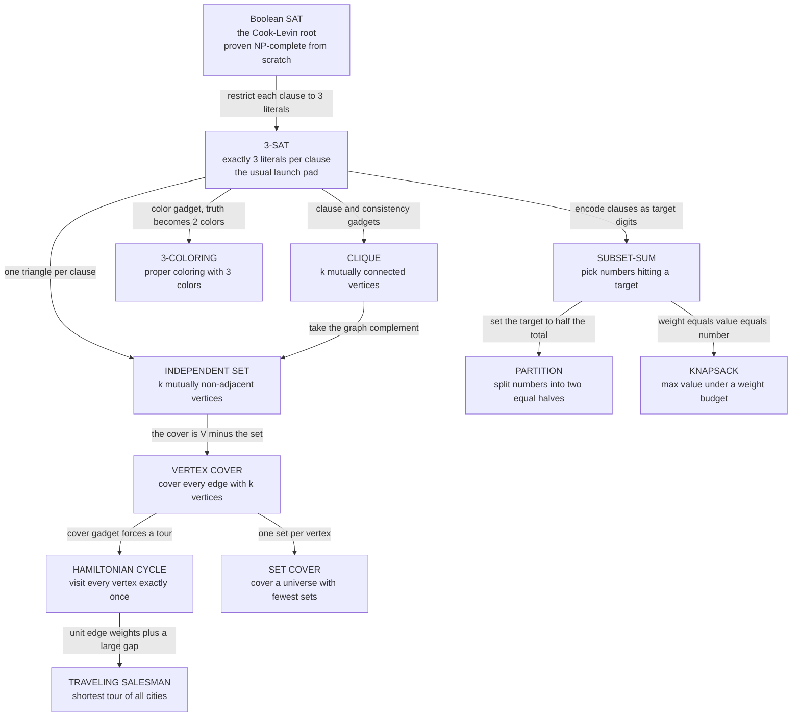

# 🧩 Reductions and the Zoo of NP-Complete Problems

> [!abstract] TL;DR
> A **polynomial-time reduction** is a fast translator that rewrites every instance of problem *A* as an instance of problem *B*, so that a solver for *B* instantly solves *A*. Because reductions **compose**, a single hardness proof — the Cook–Levin theorem, which shows Boolean **SAT** is NP-complete from first principles — cascades outward: SAT reduces to 3-SAT, which reduces to **CLIQUE**, **VERTEX COVER**, **3-COLORING**, **HAMILTONIAN CYCLE**, **SUBSET-SUM**, and thousands more, all now proven equally hard. To prove a *new* problem *X* NP-complete you do two things: show *X* is in **NP** (exhibit a fast verifier), then reduce a **known** NP-complete problem *into* *X*. The payoff is intensely practical: once you recognize your real problem is NP-complete, you **stop hunting for a fast exact algorithm** and switch to approximation, heuristics, tractable special cases, or exponential search on small inputs.

---

## Intuition

**Analogy — a family tree of hard problems, where each new member is proven hard by inheritance.** Imagine one ancestor problem that a mathematician proved, painstakingly and from scratch, to be genuinely hard: call it SAT. Now you meet a brand-new problem and suspect it is hard too. You do **not** re-do the scratch proof. Instead you show your problem is **"just SAT in disguise"**: you write a mechanical, cheap procedure that dresses any SAT question up as a question in your problem, such that answering yours answers the original SAT. Because SAT was hard, and your translator is cheap, your problem must be at least as hard. Do this again and again and you grow a vast **family tree of intractability**, every node a different-looking problem, every edge a translation, all tracing their difficulty back to the one ancestor.

The technical version: a **reduction** from *A* to *B* is a polynomial-time function that maps yes-instances of *A* to yes-instances of *B* and no-instances to no-instances. If it exists, then *B* is "at least as hard as" *A*. The single most valuable skill this buys you is **recognition** — the moment you see your scheduling task, your routing problem, or your layout constraint is *clique in disguise*, you know to stop chasing an impossible fast algorithm and reach for the tools that actually help.

---

## How It Works

### Core Mechanics

**1. What a polynomial-time reduction actually is.** A reduction from language *A* to language *B*, written *A* ≤ₚ *B*, is a function *f* computable in polynomial time such that for **every** input *w*:

$$w \in A \iff f(w) \in B$$

Read it as: "*f* rewrites an *A*-question into an equivalent *B*-question, cheaply." If you own a polynomial-time solver for *B*, then `solve_A(w) = solve_B(f(w))` is a polynomial-time solver for *A*. Contrapositive, and this is the one that matters: **if *A* is hard, *B* must be hard too**, because a fast *B* would leak a fast *A*. This specific style — a single deterministic mapping of instances — is a **Karp reduction** (many-one reduction). A looser variant that may call the *B*-solver many times is a **Cook reduction** (Turing reduction); Karp reductions are the standard currency of NP-completeness.

**2. Definitions that pin down the landscape.**
- **NP** — problems whose *yes* answers have a short **certificate** checkable in polynomial time (a proposed solution you can verify fast, even if finding it is hard).
- **NP-hard** — at least as hard as *every* problem in NP: *every* NP problem reduces to it. NP-hard problems need **not** be in NP and need not even be decision problems.
- **NP-complete** — the intersection: **in NP** *and* **NP-hard**. These are the *hardest problems that are still in NP* — the pointed tips of the family tree. Solve any one in polynomial time and P = NP.

**3. Transitivity is the engine — and it is rooted at SAT.** Reductions compose: if *A* ≤ₚ *B* and *B* ≤ₚ *C*, then *A* ≤ₚ *C* (chain the two polynomial translators; polynomial-of-polynomial is still polynomial). The **Cook–Levin theorem** (1971) does the one hard job from scratch: it proves **Boolean satisfiability (SAT)** is NP-complete by encoding the entire computation of *any* polynomial-time verifier as a giant Boolean formula. That single result is the **root of the tree**. After it, you never again argue "every NP problem reduces to mine." You only reduce *one already-crowned* NP-complete problem into your new one, and transitivity carries the full weight of NP down to you for free.

**4. The two-step recipe to prove a NEW problem *X* is NP-complete.** This is the craft you actually practice.

1. **Show *X* is in NP.** Describe a **certificate** and a polynomial-time **verifier** that checks it. (For VERTEX COVER: the certificate is a set of *k* vertices; the verifier walks every edge and confirms at least one endpoint is in the set — clearly polynomial.) Skipping this step is the most common student error: you then prove *X* is NP-*hard* but not NP-*complete*.
2. **Show *X* is NP-hard** by picking a **known** NP-complete problem *K* and building a reduction *K* ≤ₚ *X*. **The direction is the whole game.** You reduce **FROM** the known-hard problem **TO** your new one — you transform *K*-instances into *X*-instances, not the reverse. Reducing *X* to *K* proves the wrong thing (it would show *X* is *easy* if *K* is easy). Mnemonic: *"to prove X is hard, make X do K's work."*

**5. Karp's 21 problems — the founding web.** In 1972 Richard Karp took Cook's single result and, with a burst of clever reductions from SAT, proved **21 classic combinatorial problems** NP-complete in one paper: SAT → 3-SAT → CLIQUE, INDEPENDENT SET, VERTEX COVER, then on to SET COVER, HAMILTONIAN CYCLE, 3-COLORING, KNAPSACK, PARTITION, and more. This showed intractability was not a quirk of one artificial problem but a **shared fate of the everyday problems of scheduling, packing, routing, and design**. Garey and Johnson's 1979 catalogue later listed hundreds; today the count is in the thousands.

**6. The canonical residents and how they relate.**
- **3-SAT** — SAT with exactly three literals per clause; the usual **launch pad** because its rigid structure makes gadget-building easy.
- **The graph trio — CLIQUE, INDEPENDENT SET, VERTEX COVER** — near-identical under simple transformations. *S* is an **independent set** of *G* iff *S* is a **clique** in the complement graph *Ḡ*; and *S* is an independent set of *G* iff *V \ S* is a **vertex cover** of *G*. So a max clique, a max independent set, and a min vertex cover are the **same instance viewed three ways** (this is exactly the Python demo below).
- **3-COLORING** — can the graph be properly colored with 3 colors? Reached from 3-SAT via a color-gadget that makes "true/false" into two of the three colors.
- **HAMILTONIAN CYCLE and TSP** — a tour visiting every vertex once; TSP asks the shortest such tour and is the **optimization** cousin. Ham cycle reduces to TSP by unit weights plus one large gap.
- **The number problems — SUBSET-SUM, PARTITION, KNAPSACK** — pick numbers hitting a target; PARTITION is SUBSET-SUM with the target set to half the total; KNAPSACK is the optimization form. These are the **weakly NP-complete** ones (see strong vs weak below).
- **SET COVER and STEINER TREE** — cover a universe with fewest sets; connect required nodes at minimum cost. VERTEX COVER reduces to SET COVER by making one set per vertex.

**7. Gadgets — how a reduction is actually built (worked sketch: 3-SAT ≤ₚ INDEPENDENT SET).** Given a 3-SAT formula with *m* clauses, build a graph: for each clause make a **triangle** of three vertices, one per literal (a clause is satisfied iff you pick one of its literals). Then add a **consistency edge** between every vertex labeled `x` and every vertex labeled `¬x` across triangles, forbidding you from choosing a variable and its negation simultaneously. Ask for an independent set of size *k = m*. Such a set must pick exactly one vertex per triangle (they are mutually adjacent) and never a contradictory pair — precisely a satisfying assignment. The construction is clearly polynomial, and yes-maps-to-yes both directions. That is a complete NP-hardness proof for INDEPENDENT SET.

**8. Strong vs weak NP-completeness and pseudo-polynomial algorithms.** SUBSET-SUM has a dynamic-programming solution running in `O(n · T)` time where *T* is the target sum. That looks polynomial — but *T* can be exponential in the **number of bits** used to write it, so the algorithm is only **pseudo-polynomial** (polynomial in the numeric *value*, not the input *length*). Problems like SUBSET-SUM/KNAPSACK are **weakly NP-complete**: they crumble when the numbers are small. Problems that stay NP-complete even when all numbers are bounded by a polynomial (e.g. TSP, 3-PARTITION) are **strongly NP-complete** and have no pseudo-polynomial algorithm unless P = NP. This distinction decides whether "just use DP" is a real escape hatch.

**9. Decision vs optimization, and the practical payoff.** Textbook NP-completeness is about **decision** problems ("is there a vertex cover of size ≤ *k*?") so the yes/no certificate framing works. Real life wants the **optimization** version ("find the smallest vertex cover"), which is **NP-hard** but not literally NP-complete (its answer is a number, not yes/no). They are equivalent up to a polynomial factor via binary search on *k*. Once you have identified NP-completeness, the verdict tells you to **abandon the search for an efficient exact algorithm** and instead deploy:

- **Approximation algorithms** with proven ratios (2-approximation for VERTEX COVER; `ln n` for SET COVER via greedy).
- **Heuristics and industrial solvers** — modern **SAT/ILP solvers**, **branch-and-bound**, simulated annealing, genetic algorithms — often crushing real instances despite the worst-case wall.
- **Tractable special cases** — VERTEX COVER is polynomial on **bipartite** graphs (König's theorem, via maximum matching); 2-SAT and 2-COLORING are polynomial; interval-scheduling variants are easy.
- **Parameterized / FPT algorithms** — solve in `f(k) · n^{O(1)}` when a parameter *k* (e.g. cover size, treewidth) is small.
- **Exact exponential methods** on genuinely small inputs, or **pseudo-polynomial DP** for weakly-hard number problems.

**10. NP-complete is NOT undecidable.** This is the sharpest boundary. NP-complete problems are perfectly **solvable** — brute force always terminates with the right answer. They are (believed) only **inefficient**. Undecidable problems like the halting problem admit **no algorithm at any speed**. Intractability is an economic barrier; undecidability is an absolute one.

### Flow / Architecture



*Every arrow is a polynomial-time reduction pointing from the already-hard source to the newly-hardened target. Because reductions compose, hardness flows down from the single Cook–Levin root at the top to every leaf. The double arrow region CLIQUE–IS–VC is the tightest: those three are the same instance under graph complement and set complement.*

---

## Key Concepts

**Secondary (intuitive, no CS background needed)**
- **Reduction as translation** — a cheap procedure that rewrites one puzzle as another so a solver for the second solves the first.
- **"Just X in disguise"** — recognizing your problem is a known hard one under a costume.
- **The hardest problems in NP** — NP-complete problems are the toughest members of a big club; crack one fast and you crack them all.
- **Hard, not impossible** — you can always solve these; you just cannot (believed) solve them fast for large inputs.

**Undergraduate (a first theory / algorithms course)**
- **Karp (many-one) reduction** *A* ≤ₚ *X* — a single polynomial map with *w* ∈ *A* iff *f(w)* ∈ *X*.
- **The two-step NP-completeness proof** — (1) *X* in NP via a polynomial verifier; (2) *X* NP-hard by reducing a known NP-complete problem **into** *X*. Direction is everything: reduce **from** hard **to** new.
- **Cook–Levin theorem** — SAT is NP-complete from first principles; the root that makes all later reductions valid via transitivity.
- **Karp's 21 problems** — the founding web of classic NP-complete problems (SAT, 3-SAT, CLIQUE, VERTEX COVER, HAM CYCLE, KNAPSACK, ...).
- **Gadgets** — the clause/variable/consistency widgets that encode logic into graphs and numbers.
- **The graph-trio equivalences** — clique in *Ḡ* = independent set in *G* = complement of a vertex cover.

**Graduate (advanced complexity)**
- **Strong vs weak NP-completeness** — whether hardness survives when numbers are polynomially bounded; **pseudo-polynomial** algorithms exist only for weakly-hard problems.
- **NP-hard optimization vs NP-complete decision** — the number-valued optimization form is NP-hard; equivalent to decision via binary search on the objective.
- **Cook (Turing) vs Karp (many-one) reductions** — many-one is the finer, standard tool; Turing reductions blur NP with coNP.
- **Approximation, PCP, and inapproximability** — the PCP theorem yields hardness-of-approximation; some problems (e.g. general TSP) admit no constant-factor approximation unless P = NP, others are **APX-hard**.
- **Parameterized complexity (FPT, W[1]-hardness)** — CLIQUE is W[1]-hard (no known `f(k)·n^{O(1)}`), VERTEX COVER is FPT — same-looking problems, different parameterized fates.
- **Self-reducibility** — search reduces to decision for NP-complete problems, letting a decision oracle reconstruct the actual solution.

---

## Python Demo

```python
# One instance, three NP-complete problems. We show that a MINIMUM VERTEX COVER,
# a MAXIMUM INDEPENDENT SET, and a MAXIMUM CLIQUE (in the complement graph) are
# the SAME combinatorial object seen through two "reductions":
#     S is an independent set of G   <=>   V \ S is a vertex cover of G
#     S is an independent set of G   <=>   S is a clique in the complement of G
# We brute-force the minimum vertex cover, derive the other two solutions by
# complementation, verify all three, and visualize the graph transformations.
# numpy / matplotlib only.

import numpy as np
import matplotlib.pyplot as plt
from itertools import combinations

# ---------------------------------------------------------------------------
# 1. Build a small undirected graph as an adjacency matrix.
# ---------------------------------------------------------------------------
n = 6
edges = [(0, 1), (0, 2), (1, 2), (1, 3), (2, 4), (3, 4), (3, 5), (4, 5)]
A = np.zeros((n, n), dtype=int)
for i, j in edges:
    A[i, j] = A[j, i] = 1

V = set(range(n))
Ac = 1 - A - np.eye(n, dtype=int)   # complement graph: edge iff NOT in G (no self-loops)

def is_vertex_cover(S):
    return all(i in S or j in S for i, j in edges)

def is_independent_set(S, M):          # no edge inside S under adjacency M
    return all(M[i, j] == 0 for i, j in combinations(sorted(S), 2))

def is_clique(S, M):                    # every pair inside S adjacent under M
    return all(M[i, j] == 1 for i, j in combinations(sorted(S), 2))

# ---------------------------------------------------------------------------
# 2. Brute-force the MINIMUM vertex cover (feasible only because n is tiny --
#    that tininess is the whole point of NP-completeness).
# ---------------------------------------------------------------------------
min_cover = None
for k in range(n + 1):
    for S in combinations(range(n), k):
        if is_vertex_cover(set(S)):
            min_cover = set(S)
            break
    if min_cover is not None:
        break

# ---------------------------------------------------------------------------
# 3. Derive the other two solutions purely by complementation (the reductions).
# ---------------------------------------------------------------------------
max_ind_set = V - min_cover                    # complement set  -> independent set of G
max_clique  = max_ind_set                      # same vertices   -> clique in complement graph

# ---------------------------------------------------------------------------
# 4. Verify that the "reductions" preserved the solution across all 3 problems.
# ---------------------------------------------------------------------------
print("Graph edges           :", edges)
print("Minimum VERTEX COVER  :", sorted(min_cover), "size", len(min_cover))
print("Maximum INDEPENDENT SET (= V \\ cover):", sorted(max_ind_set), "size", len(max_ind_set))
print("Maximum CLIQUE in complement (same set):", sorted(max_clique), "size", len(max_clique))
print()
print("check  cover covers every edge          :", is_vertex_cover(min_cover))
print("check  V\\cover is independent in G       :", is_independent_set(max_ind_set, A))
print("check  same set is a clique in complement:", is_clique(max_clique, Ac))
assert is_vertex_cover(min_cover)
assert is_independent_set(max_ind_set, A)
assert is_clique(max_clique, Ac)
print("\nAll three NP-complete problems solved by ONE brute force + complementation.")

# ---------------------------------------------------------------------------
# 5. Visualize the three views on a shared circular layout.
# ---------------------------------------------------------------------------
ang = 2 * np.pi * np.arange(n) / n + np.pi / 2
pos = np.column_stack([np.cos(ang), np.sin(ang)])

def draw(ax, M, highlight, title, hcolor):
    for i, j in combinations(range(n), 2):
        if M[i, j] == 1:
            ax.plot(pos[[i, j], 0], pos[[i, j], 1], color="#b0b0b0", lw=1.2, zorder=1)
    for v in range(n):
        c = hcolor if v in highlight else "#dddddd"
        ax.scatter(*pos[v], s=650, color=c, edgecolors="black", zorder=2)
        ax.text(*pos[v], str(v), ha="center", va="center",
                fontsize=11, fontweight="bold", zorder=3)
    ax.set_title(title, fontsize=10.5, fontweight="bold")
    ax.set_xlim(-1.4, 1.4); ax.set_ylim(-1.4, 1.4)
    ax.set_aspect("equal"); ax.axis("off")

fig, axes = plt.subplots(1, 3, figsize=(13, 4.6))
draw(axes[0], A,  min_cover,   "G: minimum VERTEX COVER\ncovers every edge",           "#ff6b6b")
draw(axes[1], A,  max_ind_set, "G: maximum INDEPENDENT SET\n= V minus the cover",       "#51cf66")
draw(axes[2], Ac, max_clique,  "complement of G: maximum CLIQUE\nsame vertices, now all linked", "#4dabf7")
fig.suptitle("One instance, three NP-complete problems linked by reduction",
             fontsize=12.5, fontweight="bold")
plt.tight_layout()
plt.savefig("np_complete_trio.png", dpi=130)
print("Saved the three-view figure to np_complete_trio.png")
```

Running it prints the minimum vertex cover, then derives — by pure set/graph complementation, the two reductions — the maximum independent set of *G* and the maximum clique of *Ḡ*, verifies all three constraints hold, and saves a three-panel figure showing the identical vertex set playing three different roles. The brute force is only tractable because *n* is tiny, which is exactly the lesson: for large *n* none of these three has a known fast exact algorithm.

---

## Real-World Applications

> **Example — SAT and ILP solvers turning "intractable" into "solved by Tuesday."** Hardware and software verification, chip design (EDA), and AI planning all reduce their core questions to **SAT** or **integer linear programming** — provably NP-complete — and then feed them to industrial solvers like MiniSat, Z3, Gurobi, or CPLEX. The worst case is exponential, yet these engines routinely dispatch instances with millions of variables because real structure is far from the adversarial worst case. Recognizing "this is SAT" is not defeat; it is the trigger to *stop coding a bespoke exact algorithm* and hand the problem to a decades-tuned solver.

The NP-complete zoo reaches almost everywhere:
- **Scheduling and timetabling** — exam/shift/course scheduling is graph coloring and constraint satisfaction; airlines and hospitals run heuristic and ILP solvers on it daily.
- **Logistics and routing** — the **Traveling Salesman** and Vehicle Routing problems sit under every delivery fleet; solved in practice by branch-and-bound plus approximation and metaheuristics ([[Integer_Programming]]).
- **VLSI design and compilers** — chip layout minimizes wire length (Steiner tree, partitioning); **register allocation** in compilers is graph coloring of the interference graph.
- **Bioinformatics** — genome assembly (shortest superstring, Hamiltonian/Eulerian path), multiple sequence alignment, and **protein folding** are NP-hard; the field lives on heuristics and approximations.
- **Networks and operations** — facility location, **set cover** for sensor/ad placement, and network design are NP-hard optimizations tackled with greedy `ln n`-approximations and LP rounding.
- **Games and puzzles** — Sudoku, Minesweeper consistency, and generalized versions of many board games are NP-complete, which is *why* they are fun and *why* no fast perfect solver exists.

---

## Common Pitfalls

- **Reducing in the wrong direction.** To prove *X* hard you must reduce a **known-hard** problem **into** *X* (K ≤ₚ X), not *X* into something. Reducing *X* to SAT only shows *X* is *in* NP-ish territory; it proves nothing about *X* being hard. Mnemonic: *make X do the hard problem's work.*
- **Forgetting the NP-membership step.** A reduction alone proves NP-**hardness**. Without also exhibiting a polynomial-time **verifier**, you have not shown NP-**completeness** — and some NP-hard problems (e.g. the optimization TSP, or undecidable ones) are not in NP at all.
- **A reduction that is not polynomial.** If your gadget construction blows the instance up super-polynomially (exponential number of gadgets), the reduction is invalid — it must run in polynomial time and produce polynomial-size output.
- **Confusing NP-hard with NP-complete.** NP-hard means "at least as hard as all of NP" and may lie *outside* NP (harder, or not even a decision problem). NP-complete is the in-NP subset. The halting problem is NP-hard but wildly *not* NP-complete — it is undecidable.
- **Believing pseudo-polynomial DP "beats" NP-completeness.** SUBSET-SUM's `O(n·T)` DP is polynomial only in the numeric value *T*, exponential in its bit-length. It rescues **weakly** NP-complete problems with small numbers, but strongly NP-complete problems (TSP, 3-PARTITION) have no such escape.
- **Confusing NP-complete with undecidable.** NP-complete problems are always solvable, just slowly; undecidable problems admit no algorithm at all. Conflating them leads to the wrong engineering move — giving up on a solvable problem, or hunting forever for one that cannot exist.
- **Assuming a fast heuristic on your inputs disproves the hardness.** Solvers thrashing real instances is normal; it reflects benign structure, not a polynomial-time algorithm. The worst case still bites, and no heuristic settles P vs NP.

---

## Related Concepts

- [[Theory_of_Computation_Overview]] — the parent map; this note fills in Section 5 (Complexity Theory), the NP-completeness catalogue it points toward.
- [[Time_Complexity_Classes]] — defines P, NP, and the exponential blowup that makes NP-complete problems infeasible at scale.
- [[Big_O_Notation]] — the asymptotic language distinguishing the polynomial reductions from the exponential solvers they connect.
- [[Graph_Theory]] — formal definitions of clique, independent set, coloring, and Hamiltonian cycle that the graph-flavored NP-complete problems are built on.
- [[Integer_Programming]] — the practical NP-hard optimization workhorse; branch-and-bound and LP relaxation are how these reductions get solved in industry.
- [[Knapsack_01]] and [[Knapsack_Unbounded]] — the canonical weakly NP-complete number problem; their DP is the pseudo-polynomial escape hatch discussed above.
- [[DP_Patterns]] — dynamic programming as the exact method for weakly-hard problems and tractable special cases.
- [[Backtracking]] — the exhaustive-search skeleton behind branch-and-bound on small NP-complete instances.
- [[Bipartite_Matching]] — König's theorem makes VERTEX COVER polynomial on bipartite graphs, the classic "tractable special case."
- [[Minimum_Spanning_Tree]] — a polynomial-time contrast to the NP-hard Steiner tree; a tiny change in requirements crosses the tractability line.
- [[Greedy_Fundamentals]] — greedy gives the `ln n` approximation for SET COVER and the 2-approximation intuition for VERTEX COVER.

---

## Review Questions

1. **(Conceptual)** A colleague "proves" that VERTEX COVER is NP-complete by reducing VERTEX COVER to 3-SAT (transforming any vertex-cover instance into a satisfiability question). Explain precisely why this is the wrong reduction, what it actually demonstrates, and how the correct proof must be structured — including the step your colleague omitted entirely.
2. **(Scenario)** Your team's route optimizer for a delivery fleet is confirmed to be an instance of the Traveling Salesman Problem. Management asks for "a fast algorithm that always finds the optimal route." Given that TSP is strongly NP-hard, lay out the four or five concrete engineering strategies you would actually pursue instead, and say for each what guarantee (if any) it buys you.
3. **(Trade-off / distinction)** SUBSET-SUM and TSP are both NP-complete, yet SUBSET-SUM has a useful `O(n·T)` dynamic program while TSP has nothing comparable. Explain the strong-vs-weak NP-completeness distinction that accounts for this, why the SUBSET-SUM DP does **not** prove P = NP, and how you would decide, for a *new* NP-hard problem with numeric inputs, whether to even attempt such a DP.

---

## Sources

- Cook, S. A. "The Complexity of Theorem-Proving Procedures." *Proc. 3rd ACM STOC*, 1971 — proves SAT is NP-complete; the root of the whole tree.
- Karp, R. M. "Reducibility Among Combinatorial Problems." *Complexity of Computer Computations*, 1972 — the 21 classic NP-complete problems and the founding reduction web.
- Garey, M. R., Johnson, D. S. *Computers and Intractability: A Guide to the Theory of NP-Completeness*. W. H. Freeman, 1979 — the definitive catalogue and craft manual for reductions.
- Sipser, M. *Introduction to the Theory of Computation*, 3rd ed. Cengage, 2013 — Chapter 7: worked NP-completeness proofs and the reduction technique.
- Cormen, T. H., Leiserson, C. E., Rivest, R. L., Stein, C. *Introduction to Algorithms* (CLRS), 3rd ed., Chapter 34 — NP-completeness with detailed gadget reductions.
- Arora, S., Barak, B. *Computational Complexity: A Modern Approach*. Cambridge University Press, 2009 — Cook–Levin, approximation, and the modern landscape.

---

#theory-of-computation #np-complete #reductions #karp #np-hard
