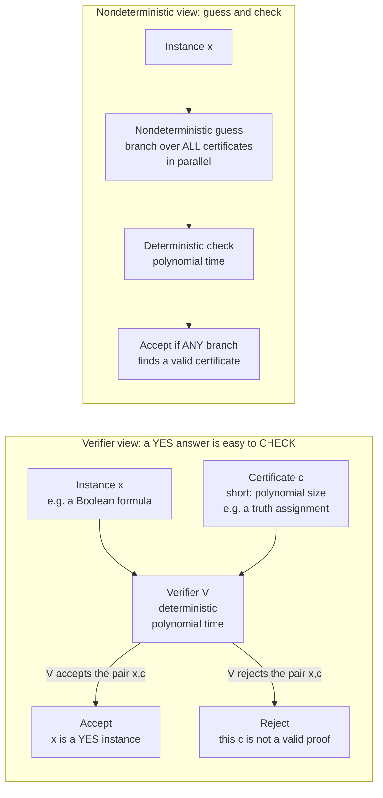

# 🧩 The Class NP and Verification

> [!abstract] TL;DR
> **NP** is the class of decision problems whose **"yes" answers come with a short proof you can check quickly** — a polynomial-size **certificate** verifiable in polynomial time. Equivalently, NP is what a **nondeterministic** Turing machine solves in polynomial time by *guessing* that certificate and checking it. The **N stands for *nondeterministic*, not "non-polynomial."** NP captures a huge swath of practical problems — [[NP_Completeness_and_the_Cook_Levin_Theorem|SAT]], scheduling, routing, packing — where a candidate solution is **trivial to check but seemingly hard to find**, and whether "checkable fast" also means "solvable fast" is the [[P_versus_NP|P vs NP]] question.

---

## Intuition

**Analogy first.** Think of a **completed Sudoku grid** handed to you. Deciding whether it is a *valid* completed puzzle takes seconds: scan every row, column, and box, confirm 1–9 appear once each. But being handed a *blank* Sudoku and asked to *find* the solution is a different beast entirely — you may grind through enormous numbers of possibilities. The same asymmetry shows up with a **jigsaw puzzle** (assembling it is slow; glancing at the finished picture to confirm it matches the box is instant) or a **maze** (finding the exit path is hard; tracing a highlighted path to confirm it reaches the exit is easy).

That gap — **hard to FIND, easy to CHECK** — *is* NP. A problem is in NP when any "yes" instance comes with a **witness** (the filled-in grid, the assembled jigsaw, the highlighted path) that a fast checker can validate. NP says nothing about how you *found* the witness; it only demands that, once someone shows it to you, you can be **convinced in polynomial time**.

---

## How It Works

### Core Mechanics

A **decision problem** is a yes/no question about an input string `x` (e.g. "does this graph have a clique of size `k`?"). A problem `L` is in **NP** when there exists a **verifier** `V` — an ordinary deterministic, polynomial-time algorithm — and a polynomial bound `p` such that:

1. **Completeness (yes has a proof).** If `x` is a **yes** instance, then there exists a **certificate** `c` (also called a *witness* or *proof*) of length at most `p(|x|)` for which `V(x, c)` **accepts**.
2. **Soundness (no cannot be faked).** If `x` is a **no** instance, then **for every** candidate certificate `c`, `V(x, c)` **rejects** — no string can fool the verifier.

Two properties make this work: the certificate is **short** (polynomial size, so it can even be *read* in polynomial time) and the check is **fast** (polynomial time). Together they mean a "yes" answer is always accompanied by a *convincing, efficiently checkable* proof.

**The equivalent nondeterministic definition.** A **nondeterministic Turing machine (NTM)** may, at each step, "branch" into several possible next moves; it **accepts** if *any* branch reaches an accepting state. Picture it as **guess-and-check**: the machine first *magically guesses* the certificate `c` (writing down some string), then *deterministically checks* it. Because acceptance requires only that **one** branch succeeds, the NTM effectively **tries all certificates in parallel** and accepts iff a valid one exists. `L` is in NP iff some NTM decides it in polynomial time. The two definitions — verifier-based and NTM-based — describe **exactly the same class**; the certificate is precisely the "lucky guess" the NTM would have made.

> [!warning] The name is a trap
> **NP = Nondeterministic Polynomial time.** It does **not** mean "non-polynomial." Many NP problems are trivially in polynomial time (all of [[The_Class_P_and_Efficient_Computation|P]] is inside NP). The "N" refers to the *machine model* used to define membership, not to the difficulty.

### P inside NP, and co-NP

- **P ⊆ NP.** Any problem you can *solve* in polynomial time you can also *verify* in polynomial time — just **ignore the certificate and solve it yourself**. So every efficient problem is trivially verifiable. Whether the containment is **proper** (`P ≠ NP`) is the famous open question in [[P_versus_NP]].
- **co-NP.** NP verifies **yes** answers with a certificate; **co-NP** verifies **no** answers with one. The asymmetry is real: to prove a formula **is** satisfiable you exhibit a satisfying assignment (a short certificate — NP), but to prove it is **unsatisfiable** you must rule out *all* assignments, and no short certificate is known (co-NP). Whether **NP = co-NP** is another major open problem, widely believed false.

### Flow / Architecture



---

## Key Concepts

### Secondary (intuitive)
- NP = **"easy to check."** If a friend claims the answer is *yes* and shows you the solution, you can confirm it fast.
- The solution they show you is the **certificate / witness / proof**.
- **Finding** the certificate may be brutally slow; **verifying** one is always polynomial. That gap is the whole idea.
- Classic NP problems all share the shape *"find a structure meeting a constraint"*: [[NP_Completeness_and_the_Cook_Levin_Theorem|SAT]] (an assignment making a formula true), **graph coloring** (a valid `k`-coloring), **clique** (a set of `k` mutually connected vertices), **Hamiltonian cycle** (a tour visiting every vertex once), **subset-sum** (a subset hitting a target), **TSP decision** (a tour under length `L`), **integer programming** (integers satisfying linear constraints).

### Undergraduate (formal)
- **Verifier definition.** `L ∈ NP` iff there is a polynomial-time `V` and polynomial `p` with: `x ∈ L` ⇔ `∃ c, |c| ≤ p(|x|)` and `V(x, c) = accept`. The **`∃`** (there exists a certificate) is the essence of NP.
- **Nondeterministic definition.** `L ∈ NP` iff a nondeterministic TM decides `L` in polynomial time. **Guess** phase writes a certificate nondeterministically; **check** phase verifies deterministically. Equivalent to the verifier definition.
- **Containments.** `P ⊆ NP ⊆ EXP` (see [[Time_and_Space_Complexity]]). `P ⊆ NP` because a solver ignores the certificate; `NP ⊆ EXP` because you can brute-force **all** `2^{p(|x|)}` certificates in exponential time.
- **NP-complete** problems (via [[NP_Completeness_and_the_Cook_Levin_Theorem|Cook–Levin]] and [[Reductions_and_NP_Complete_Problems|reductions]]) are the *hardest* problems in NP: if any one is in P, then **P = NP** and all of NP collapses.

### Graduate (deep)
- **Self-reducibility: search reduces to decision.** For NP problems the *decision* version ("does a solution exist?") and the *search* version ("produce one") are **polynomially equivalent**. Example — SAT: to build a satisfying assignment, ask the decision oracle "is the formula satisfiable with `x1 = true`?"; fix `x1` accordingly, recurse on `x2`, and so on. `n` oracle calls extract a full witness. So the seemingly harder *find* task is no harder (up to polynomial factors) than the *decide* task — a structural gift that not all problems share.
- **NP as a projection / existential quantifier.** `NP = { x : ∃ c. R(x, c) }` for a polynomial-time-decidable relation `R` with `c` polynomially bounded — NP is exactly the class of **polynomially-bounded existential quantifications over P**. Adding a universal quantifier gives **co-NP**; alternating quantifiers builds the **polynomial hierarchy (PH)**, with NP and co-NP as its first level.
- **Fagin's theorem.** NP is *characterized without any machine* as the problems expressible in **existential second-order logic** — the first tie between complexity and descriptive complexity, showing NP is a robust, model-independent notion.
- **NP ≠ intractable-by-definition.** Membership in NP is an *upper bound* on hardness (verifiable), not a proof of difficulty. Many NP problems are in P; the interesting frontier is the **NP-complete** subset believed to lie outside P.

---

## Python Demo

The single most important intuition — **verifying is polynomial, searching is exponential** — made concrete on **subset-sum**: given integers and a target, is there a subset summing exactly to the target? A *certificate* is the subset itself. We implement a fast `verify`, contrast it with a blind `brute_force_search` over all `2^n` subsets, then time and plot both as `n` grows. `numpy` / `matplotlib` only.

```python
# =====================================================================
# The essence of NP on SUBSET-SUM:
#   VERIFY a given subset (certificate) -> polynomial, ~O(n)
#   SEARCH blindly for a subset         -> exponential, ~O(2^n * n)
# A certificate = which items are chosen (a 0/1 vector).
# =====================================================================
import time
import numpy as np
import matplotlib.pyplot as plt

rng = np.random.default_rng(7)

# ---- The VERIFIER: the "easy to CHECK" half of NP -------------------
def verify(nums, target, certificate):
    """Given a candidate subset (0/1 selection), check in ONE linear pass
    whether the chosen numbers sum to target. Cost: O(n)."""
    total = 0
    for take, x in zip(certificate, nums):
        if take:
            total += x
    return total == target

# ---- The blind SEARCH: the "hard to FIND" half ----------------------
def brute_force_search(nums, target):
    """No certificate is given, so try EVERY one of the 2^n subsets and
    verify each. Cost: O(2^n * n). This is 'guess and check' where WE have
    to grind through all the guesses -- no magic nondeterministic luck."""
    n = len(nums)
    for k in range(1 << n):                 # k enumerates all 2^n certificates
        total, bits, i = 0, k, 0
        while bits:                         # decode k into a chosen-subset sum
            if bits & 1:
                total += nums[i]
            bits >>= 1
            i += 1
        if total == target:
            return k                        # found a valid certificate
    return None                             # no subset works

# ---- Part A: the asymmetry on ONE instance --------------------------
n0 = 20
nums0 = rng.integers(1, 100, size=n0)
hidden = rng.integers(0, 2, size=n0).astype(bool)   # plant a real solution
target0 = int(nums0[hidden].sum())

t = time.perf_counter()
ok = verify(nums0, target0, hidden)                 # hand it the RIGHT answer
t_verify = time.perf_counter() - t

t = time.perf_counter()
brute_force_search(nums0, target0)                  # make it FIND an answer
t_search = time.perf_counter() - t

print(f"n = {n0}")
print(f"  verify(correct certificate) -> {ok}   in {t_verify*1e6:9.1f} us")
print(f"  brute-force search          -> found  in {t_search*1e3:9.1f} ms")
print(f"  search / verify slowdown    -> {t_search / max(t_verify, 1e-9):,.0f}x")

# ---- Part B: how each SCALES with n ---------------------------------
ns = list(range(4, 21))
verify_times, search_times = [], []
for n in ns:
    nums = rng.integers(1, 100, size=n)
    unreachable = int(nums.sum()) + 1        # forces the WORST case: full scan
    cert = [1] * n
    reps = 20000                             # repeat verify for a stable reading
    t = time.perf_counter()
    for _ in range(reps):
        verify(nums, unreachable, cert)
    verify_times.append((time.perf_counter() - t) / reps)
    t = time.perf_counter()
    brute_force_search(nums, unreachable)    # scan all 2^n subsets
    search_times.append(time.perf_counter() - t)

ns = np.array(ns)
verify_times = np.array(verify_times)
search_times = np.array(search_times)

fig, ax = plt.subplots(figsize=(8.5, 5))
ax.semilogy(ns, verify_times, "o-", color="tab:green",
            label="VERIFY a certificate  (polynomial, ~O(n))")
ax.semilogy(ns, search_times, "s-", color="tab:red",
            label="SEARCH for a certificate  (exponential, ~O(2^n))")
ax.set_xlabel("problem size n (number of items)")
ax.set_ylabel("time per operation (seconds, log scale)")
ax.set_title("The NP asymmetry: checking is easy, finding is hard")
ax.legend()
ax.grid(True, which="both", alpha=0.3)
plt.tight_layout()
plt.savefig("np_verify_vs_search.png", dpi=120)
print("\nSaved np_verify_vs_search.png")

# ---- Confirm the growth rate numerically ----------------------------
# On a log axis an exponential is a straight line; fit its slope in log2.
slope = np.polyfit(ns, np.log2(search_times), 1)[0]
print(f"\nFitted slope of log2(search time) vs n = {slope:.2f}"
      f"  (theory = 1.0: each extra item ~DOUBLES the search).")
```

**What it shows.** `verify` on the correct certificate returns instantly (microseconds) even at `n = 20`, while the blind search takes orders of magnitude longer to sift the `2^n` candidates — the printed slowdown is typically tens of thousands of times. The plot is the punchline: on a log axis, **verification stays a nearly flat, gently rising line (polynomial)** while **search climbs as a straight line of slope ≈ 1 in log₂ (pure exponential — each extra item doubles the work)**. That widening gap between the green and red curves *is* the class NP: the certificate on the green line always exists and is cheap to check, but nobody knows how to reach it without the red line's blow-up.

---

## Real-World Applications

> **Example — Boolean SAT solvers in the wild.** Deciding whether a formula is satisfiable is the canonical NP problem, yet industrial **SAT/SMT solvers** (MiniSat, Z3, CaDiCaL) solve instances with *millions* of clauses daily. They exploit exactly the NP structure: any claimed "SAT" result ships with a **satisfying assignment** you can verify in linear time, and any "UNSAT" result can ship with a machine-checkable **resolution proof** (a co-NP-style certificate). Verification is trivial; the solver's cleverness is entirely in the *search*.

- **Hardware and software verification.** Model checkers and equivalence checkers reduce "can this circuit reach a bad state?" to SAT; a bug is reported as a short **counterexample trace** (a certificate) that engineers replay to confirm it.
- **Cryptography.** Security often rests on problems easy to *verify* but hard to *invert*. A digital signature is a certificate: fast to check with the public key, infeasible to forge. **Zero-knowledge proofs** and **SNARKs** are literally succinct NP certificates you can verify without redoing the work.
- **Operations research.** Routing (TSP), scheduling, bin-packing, and crew assignment are NP problems solved daily by branch-and-bound and integer-programming solvers (CPLEX, Gurobi); feasibility of any proposed plan is a cheap check.
- **Optimization as decision.** "Find the best" is turned into a ladder of NP decisions "is there a solution of value ≥ k?", solved by binary search over `k` — the search-vs-decision equivalence in production form.

---

## Common Pitfalls

- **"NP means non-polynomial / not solvable in polynomial time."** The most common error. **N = nondeterministic.** All of [[The_Class_P_and_Efficient_Computation|P]] is *inside* NP; many NP problems are easy. NP is an upper bound on *verification* cost, not a difficulty verdict.
- **Confusing NP with NP-complete.** NP is a huge class (including trivial and polynomial problems). **NP-complete** is the *hardest* subset. "This problem is in NP" says almost nothing about difficulty; "this problem is NP-complete" says a lot. See [[Reductions_and_NP_Complete_Problems]].
- **Assuming a short certificate exists for NO answers too.** NP guarantees a certificate only for **yes** instances. Certifying **no** (e.g. *unsatisfiability*) is **co-NP**, and no short certificate is known in general. Don't assume symmetry.
- **Forgetting the certificate must be polynomial-*size*.** A witness you cannot even *read* in polynomial time does not qualify. Both the certificate's length and the verifier's runtime must be polynomially bounded.
- **Thinking a verifier is a solver.** A verifier only *checks* a supplied answer; it never has to produce one. Building the verifier is usually trivial; that triviality is exactly what makes membership in NP easy to prove.
- **Believing verifiable-fast implies solvable-fast.** That is precisely the **open** [[P_versus_NP]] question — assuming it either way is unproven.

---

## Related Concepts

- [[The_Class_P_and_Efficient_Computation]] — P is the "solvable fast" class; NP is "checkable fast", and `P ⊆ NP` trivially by ignoring the certificate.
- [[P_versus_NP]] — the trillion-dollar open question of whether checkable-fast also means solvable-fast, i.e. whether the containment `P ⊆ NP` is proper.
- [[NP_Completeness_and_the_Cook_Levin_Theorem]] — SAT is NP-complete: the hardest problems *in* NP, whose tractability would collapse the whole class.
- [[Reductions_and_NP_Complete_Problems]] — polynomial-time reductions map one NP problem to another, transferring hardness and building the NP-complete family.
- [[Time_and_Space_Complexity]] — the resource-bounded framework (`P`, `NP`, `EXP`, `PSPACE`) that gives NP its formal home; `P ⊆ NP ⊆ EXP`.
- [[Theory_of_Computation_Overview]] — situates complexity classes atop the computability/automata hierarchy.
- [[Finite_Automata_DFA_and_NFA]] — where nondeterminism first appears; for finite automata it adds no power, but for polynomial-time TMs it may (the crux of P vs NP).
- [[Backtracking]] — the practical algorithmic search through the certificate space (assignments, colorings, tours) that NP formalizes.
- [[Meet_in_the_Middle]] — halves subset-sum's exponent to `O(2^{n/2})`; a concrete attack on an NP search that beats naive brute force without escaping exponential.
- [[Knapsack_01]] — 0/1 knapsack and subset-sum share the certificate-checking structure and admit pseudo-polynomial DP despite NP-hardness of the general case.
- [[Bitmask_DP]] — encodes exponential certificate spaces (subsets, tours) compactly; the algorithmic toolkit for exact solutions to small NP instances.
- [[Network_Flow]] — a reminder that many combinatorial problems (max-flow, bipartite matching) sit comfortably *in P* inside NP, not every constraint problem is hard.
- [[Time_Complexity_Classes]] — the DSA-side view of polynomial vs exponential growth that makes the verify-vs-search gap concrete.

---

## Review Questions

1. **(Conceptual)** State both definitions of NP — the verifier-based and the nondeterministic-machine-based — and argue precisely why they describe the same class. In your argument, identify exactly what role the *certificate* plays and what corresponds to it in the nondeterministic machine.
2. **(Scenario)** You are given a graph and asked "is there a clique of size `k`?" A colleague hands you a set `S` of `k` vertices and claims it proves the answer is *yes*. Describe the polynomial-time verifier you run on `S`. Now your colleague instead claims the answer is *no* — can they hand you an equally short, equally checkable certificate? Explain which complexity class each claim lives in and why the two are asymmetric.
3. **(Trade-off)** Subset-sum has a polynomial-time *verifier* yet, in the worst case, an exponential-time *search*. Given the self-reducibility of NP problems, explain why the ability to *decide* subset-sum in polynomial time would immediately let you *find* the subset in polynomial time. What would that imply about [[P_versus_NP|P vs NP]], and why do practitioners nonetheless solve large instances daily?

---

## Sources

- Sipser, M. *Introduction to the Theory of Computation*, 3rd ed., §7.3 "The Class NP" — [https://math.mit.edu/~sipser/book.html](https://math.mit.edu/~sipser/book.html)
- Arora, S. & Barak, B. *Computational Complexity: A Modern Approach*, Ch. 2 (NP and NP-completeness) — [https://theory.cs.princeton.edu/complexity/](https://theory.cs.princeton.edu/complexity/)
- Garey, M. R. & Johnson, D. S. *Computers and Intractability: A Guide to the Theory of NP-Completeness*, Ch. 2.
- Cook, S. "The Complexity of Theorem-Proving Procedures" (1971), STOC — the paper that launched NP-completeness.
- Wikipedia — *NP (complexity)* — [https://en.wikipedia.org/wiki/NP_(complexity)](https://en.wikipedia.org/wiki/NP_(complexity))

---

#theory-of-computation #complexity-class-np #verification #nondeterminism #np-problems
