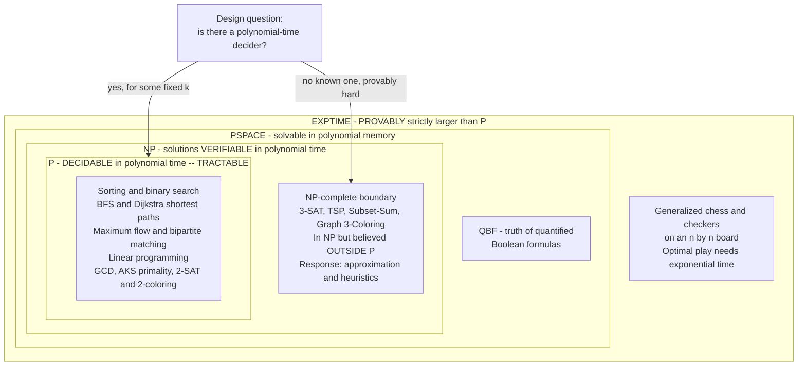

# ⏱️ The Class P and Efficient Computation

> [!abstract] TL;DR
> **P** is the class of decision problems a **deterministic Turing machine** can solve in **polynomial time** — running time bounded by `n^k` for some fixed constant `k`, where `n` is the input size. The **Cobham–Edmonds thesis** identifies this class with the informal ideas of *efficient*, *tractable*, and *feasible* computation. Polynomial is the "right" dividing line because it is **robust**: closed under composition and subroutine calls, model-independent up to polynomial factors, and — for the algorithms that actually matter — usually attained with small exponents. P is the target every algorithm designer aims for, and the fence that **NP-hardness** warns you not to try to cross by brute force.

---

## Intuition

**Analogy — the photocopier test.** Imagine your algorithm's running time is a function of the input size `n`, and next year you buy a computer that is **twice as fast**. Ask: *how much bigger an input can I now handle in the same wall-clock time?*

- If the running time grows like `n`, `n²`, or `n³` (**polynomial**), a 2× faster machine lets you handle a **meaningfully larger** input — roughly `2×`, `1.41×`, `1.26×` bigger. Hardware progress *buys you real headroom*. This is the world of P.
- If the running time grows like `2ⁿ` (**exponential**), that same 2× faster machine lets you handle exactly **one more item**. Buy a machine a *million* times faster and you gain only ~20 items. Exponential problems laugh at Moore's law.

That gulf is the whole point. In P, **doubling the input multiplies the effort by only a constant factor** — the work grows *gently*, so waiting a little longer or buying faster hardware keeps you in the game. Outside P, adding a single element can *double* the work, and the difficulty explodes past the age of the universe within a few dozen inputs.

A second everyday version: **sorting a guest list** versus **finding the perfect seating**. Alphabetizing `n` guests scales gently — double the guests, roughly double the work. But choosing the subset of guests whose combined "compatibility scores" hit an exact target (a subset-sum) means each new guest *doubles* the arrangements to check. At 50 guests that is over a quadrillion combinations. **P is the set of tasks whose difficulty scales like the first job, not the second.** It is the practical frontier of "problems a computer can actually finish."

---

## How It Works

### Core Mechanics

**1. The formal definition.** A language `L` (a decision problem, encoded as a set of strings — see [[Theory_of_Computation_Overview]]) is in **P** if there exists a **deterministic Turing machine** `M` and a constant `k` such that `M` decides membership in `L` — always halting with the correct yes/no answer — using at most `O(n^k)` steps on every input of length `n`. Formally:

$$\mathbf{P} = \bigcup_{k \geq 1} \mathrm{TIME}\!\left(n^{k}\right)$$

The key words are **deterministic** (no lucky guessing — each step is forced), **always halts** (P is a class of *deciders*, not just recognizers), and **some fixed `k`** (the exponent is a constant, not a function of `n`). Time is measured in the standard model discussed in the companion note on **time and space complexity** and in [[Time_Complexity_Classes]].

**2. The Cobham–Edmonds thesis.** Independently in 1965, Alan Cobham and Jack Edmonds proposed identifying **polynomial time with efficient / tractable / feasible computation**. Edmonds called a polynomial algorithm a *"good algorithm."* Why is *polynomial* the robust place to draw the line, rather than, say, "under a billion steps" or "linear time"?

- **Closed under composition.** If you call a polynomial subroutine a polynomial number of times, the total is still polynomial (`poly ∘ poly = poly`). This means you can *build* efficient algorithms out of efficient parts — the way real software is assembled — without ever leaving P. Neither "linear" nor any fixed step-count survives this.
- **Model-independent up to polynomial factors.** A one-tape Turing machine, a multi-tape machine, a RAM, and your laptop simulate each other with only *polynomial* overhead. So membership in P does **not** depend on the machine model — it is an *intrinsic* property of the problem. "Runs in under 10⁹ steps" is meaningless without pinning the machine; "polynomial" is not.
- **Empirically small exponents.** The polynomial algorithms that matter in practice — sorting `n log n`, shortest paths, matching, flows — overwhelmingly have exponents `1`, `2`, or `3`. The theoretical net catches almost exactly the algorithms practitioners already call fast.

**3. The known imperfections of the definition.** Cobham–Edmonds is a *thesis*, not a theorem, and it is deliberately imperfect at the edges:

- An `n^100` algorithm is **in P** but utterly **useless** — at `n = 10` it already needs `10^100` operations. So-called *galactic algorithms* (best known asymptotic complexity, astronomically large constants) live here.
- An algorithm running in `2^{0.001 n}` is **not in P**, yet is perfectly usable for `n` up to tens of thousands.
- **Pseudo-polynomial** algorithms (like the `O(n·T)` dynamic program for subset-sum) *look* polynomial but are exponential in the *bit-length* of the numbers, since `T` can be exponential in its encoding size.

These caveats do not sink the definition — they sharpen it. P is the best available *asymptotic* proxy for tractability, and it is right far more often than it is wrong. But "in P" and "practically fast" are correlated, not identical.

**4. Classic problems that live in P.** The catalogue is huge; the landmarks:

| Problem | Polynomial algorithm | Note |
|---|---|---|
| **Sorting & searching** | merge/heap sort `O(n log n)`, binary search `O(log n)` | the bread and butter — see [[Merge_Sort]], [[Binary_Search]] |
| **Shortest paths** | BFS `O(V+E)`, [[Dijkstra]] `O((V+E) log V)`, [[Floyd_Warshall]] `O(V³)` | see [[BFS]] |
| **Maximum flow** | Edmonds–Karp / Dinic, polynomial | see [[Network_Flow]] |
| **Bipartite / general matching** | Hopcroft–Karp, Edmonds' blossom algorithm | see [[Bipartite_Matching]] |
| **Linear programming** | Khachiyan's ellipsoid (1979), Karmarkar's interior-point (1984) | *surprising* — simplex is exponential in the worst case, but LP itself is in P; see [[Simplex_Method]] |
| **Primality testing** | AKS (Agrawal–Kayal–Saxena, 2002) | finally proved **PRIMES ∈ P**, deterministically — see [[Miller_Rabin_Primality]], [[Sieve_of_Eratosthenes]] |
| **Greatest common divisor** | Euclid's algorithm, `O(log n)` divisions | ancient, and polynomial in bit-length |
| **2-SAT & 2-coloring** | implication graph + SCC / BFS, linear | note the sharp cliff: **3**-SAT and 3-coloring are NP-complete |

The last row is the most instructive: **2-SAT is in P but 3-SAT is NP-complete.** The tractable/intractable boundary is not a fuzzy gradient — it can turn on a single parameter.

**5. Robustness and closure of P.** P is a *stable* notion precisely because of its closure properties:

- **Closed under complement.** If `L ∈ P`, so is its complement `L̄` — just run the decider and flip the answer (deciders always halt, so flipping is legal). This is *not* known for NP, where whether `NP = coNP` is a famous open question. The asymmetry is a genuine clue that P and NP differ.
- **Closed under union, intersection, concatenation, and polynomial-time reductions.** If `A` reduces to `B` in polynomial time and `B ∈ P`, then `A ∈ P`. Reductions *stay inside* P.
- **Transitive and composable.** Chaining polynomial reductions and polynomial subroutines never escapes P. This transitivity is exactly what makes "in P" a durable classification rather than an accident of one algorithm.

**6. P versus the harder classes.** Every efficiently *solvable* problem is efficiently *verifiable* — given a solution, re-running the polynomial decider checks it in polynomial time — so **P ⊆ NP**. Whether the containment is *strict* is the **P versus NP** question, the central open problem of computer science and a Clay Millennium Prize. Problems believed to lie *outside* P are the **NP-complete** ones (SAT, TSP, subset-sum, graph coloring); if any single NP-complete problem turned out to be in P, then P = NP and *all* of them would be. Higher still, `P ⊊ EXPTIME` is a *proven* strict separation (by the time hierarchy theorem) — so we know for certain that some decidable problems are genuinely beyond polynomial time.

### Flow / Architecture



*The nesting shows the proven and conjectured landscape: `P ⊆ NP ⊆ PSPACE ⊆ EXPTIME`, with `P ⊊ EXPTIME` proven and `P` versus `NP` open. Everything inside the innermost box is "efficiently solvable." The NP-complete ring sits inside NP but — under the standard `P ≠ NP` conjecture — outside P, which is exactly where you must abandon exact brute force for approximation.*

---

## Key Concepts

**Secondary (intuitive, no CS background needed)**
- **Tractable vs intractable** — some tasks scale gently as they grow, others explode. P is the gentle-scaling side.
- **Input size `n`** — how big the problem is (number of items, cities, bits). Runtime is measured *as a function of `n`*.
- **The exponential wall** — with `2ⁿ` work, each new item doubles the effort; hardware never catches up.
- **Efficient algorithm** — informally, one you can actually run to completion on realistic inputs.

**Undergraduate (a first algorithms / theory course)**
- **P = ⋃ₖ TIME(nᵏ)** — decidable on a deterministic TM in polynomial time.
- **Cobham–Edmonds thesis** — polynomial time ≙ feasible computation; why polynomial (not linear, not fixed) is the robust line.
- **Closure properties** — P is closed under complement, union, intersection, composition, and polynomial-time reductions.
- **Model independence** — the extended Church–Turing view: reasonable machines simulate each other with polynomial overhead, so P is model-free.
- **P ⊆ NP** — solving fast implies verifying fast; the strictness is the open **P vs NP** question.
- **Canonical P problems** — sorting, shortest paths, flows, matching, LP, GCD, primality (AKS), 2-SAT.

**Graduate (advanced complexity)**
- **Strongly vs weakly polynomial** — LP has weakly-polynomial algorithms (ellipsoid, interior-point) whose running time depends on bit-length; whether a *strongly* polynomial LP algorithm exists is open (Smale's 9th problem).
- **Pseudo-polynomial and parameterized tractability** — `O(n·T)` subset-sum is pseudo-polynomial; FPT (`f(k)·nᶜ`) refines "tractable" for fixed parameters.
- **P vs coNP, P vs NC, P vs BPP, P vs L** — is P closed under efficient *parallelism* (NC), *randomness* (BPP ⊇ P; widely believed BPP = P), and *logspace* (L ⊆ P, strictness open)?
- **The time hierarchy theorem** — proves `P ⊊ EXPTIME`: strictly more time buys strictly more languages, so some problems are provably outside P.
- **Relativization and natural proofs** — why separating P from NP resists standard techniques.

---

## Python Demo

```python
# P vs the exponential wall: why "polynomial = tractable" is not hyperbole.
# We TIME a polynomial algorithm (sorting, ~n log n) against an exponential one
# (brute-force subset-sum, 2^n) on growing inputs, then EXTRAPOLATE the
# exponential to sizes we could never run. Finally we plot operation counts to
# show the exponential curve smashing through the age of the universe while
# polynomials stay earthbound -- and that an n^100 "polynomial" is a cautionary
# tale (the theory-vs-practice caveat to Cobham-Edmonds).
# numpy / matplotlib / stdlib only.

import time
import numpy as np
import matplotlib.pyplot as plt

rng = np.random.default_rng(0)

# ---------------------------------------------------------------------------
# 1. POLYNOMIAL work: sort n random numbers. Roughly n log n comparisons.
# ---------------------------------------------------------------------------
def time_sort(n):
    a = rng.integers(0, 1_000_000, size=n)
    t0 = time.perf_counter()
    np.sort(a)                         # O(n log n) -- comfortably in P
    return time.perf_counter() - t0

# ---------------------------------------------------------------------------
# 2. EXPONENTIAL work: brute-force subset-sum. Does SOME subset of the n items
#    hit the target? The naive method enumerates all 2^n subsets -> exponential.
# ---------------------------------------------------------------------------
def brute_subset_sum(items, target):
    n = len(items)
    for mask in range(1 << n):         # 2^n subsets -- the wall
        s, m, i = 0, mask, 0
        while m:
            if m & 1:
                s += items[i]
            m >>= 1
            i += 1
        if s == target:
            return True
    return False

def time_subset_sum(n):
    items = rng.integers(1, 50, size=n).tolist()
    target = int(sum(items)) + 1       # unreachable -> forces the full 2^n scan
    t0 = time.perf_counter()
    brute_subset_sum(items, target)
    return time.perf_counter() - t0

# ---------------------------------------------------------------------------
# Measure both and print the contrast.
# ---------------------------------------------------------------------------
print("POLYNOMIAL  sorting  (n log n) -- doubling n barely moves the needle")
for n in [10_000, 100_000, 1_000_000, 10_000_000]:
    print(f"  n = {n:>10,}   sort time = {time_sort(n) * 1e3:8.2f} ms")

print("\nEXPONENTIAL brute-force subset-sum (2^n) -- each +1 to n DOUBLES the work")
sizes, secs = [], []
for n in [12, 15, 18, 20]:
    t = time_subset_sum(n)
    sizes.append(n); secs.append(t)
    print(f"  n = {n:>3}   2^n = {2**n:>12,}   time = {t * 1e3:9.2f} ms")

# Extrapolate the SAME brute force to sizes we could never actually run.
rate = (2 ** sizes[-1]) / secs[-1]     # subsets processed per second
print("\nExtrapolating the exponential to larger n at the measured rate:")
for n in [50, 80, 100]:
    years = (2 ** n) / rate / (60 * 60 * 24 * 365)
    print(f"  n = {n:>3}   estimated wall-clock = {years:.3e} years")

# ---------------------------------------------------------------------------
# 3. The landscape: operation counts vs input size, log scale.
#    Includes n^100 -- a POLYNOMIAL that is nonetheless hopeless, the caveat
#    that "in P" does not automatically mean "usable".
# ---------------------------------------------------------------------------
n = np.arange(1, 101)
curves = {
    "n log n  (sorting)":        n * np.log2(n + 1),
    "n^2":                       n.astype(float) ** 2,
    "n^3  (all-pairs paths)":    n.astype(float) ** 3,
    "2^n  (brute force)":        2.0 ** n,
    "n^100  (huge exponent)":    n.astype(float) ** 100,
}

# ~1e9 ops/sec times ~13.8 billion years, in operations.
AGE_UNIVERSE_OPS = 1e9 * 4.35e17

fig, ax = plt.subplots(figsize=(10, 6))
for label, y in curves.items():
    style = "--" if "n^100" in label else "-"
    ax.plot(n, y, style, lw=2, label=label)
ax.axhline(AGE_UNIVERSE_OPS, color="black", ls=":", lw=1.5)
ax.text(3, AGE_UNIVERSE_OPS * 4,
        "operations doable in the age of the universe", fontsize=9)
ax.set_yscale("log")
ax.set_ylim(1, 1e260)
ax.set_xlabel("input size n")
ax.set_ylabel("operations required (log scale)")
ax.set_title("Polynomials stay under the line; 2^n and n^100 blow past it")
ax.legend(loc="lower right", fontsize=9)
ax.grid(True, which="both", ls=":", alpha=0.4)
plt.tight_layout()
plt.savefig("p_vs_exponential.png", dpi=130)
print("\nSaved growth-rate comparison to p_vs_exponential.png")

# Takeaways the run makes concrete:
#   * sorting 10 MILLION items finishes in milliseconds (n log n is in P);
#   * brute-force subset-sum at n=50 needs ~1e6 years, at n=80 ~1e15 years;
#   * 2^n crosses the age-of-universe line near n ~= 90;
#   * n^100 -- though "polynomial" and thus IN P -- crosses that same line at
#     n=2, proving that "P" is a robust proxy for tractable, not a guarantee.
```

Running it prints two tables (sorting stays in milliseconds even at 10 million elements; subset-sum roughly *doubles* with each `+1` to `n` and is projected to take ~`10⁶` years at `n = 50`), then saves `p_vs_exponential.png`. The plot's punchline is visual: `n log n`, `n²`, and `n³` hug the bottom, `2ⁿ` rockets through the "age of the universe" line around `n ≈ 90`, and the dashed `n^100` — *a polynomial, hence technically in P* — pierces that line already at `n = 2`, making the Cobham–Edmonds caveat impossible to forget.

---

## Real-World Applications

> **Example — the daily work of algorithm engineering.** Every time an engineer establishes that a task is *in P*, they have license to stop searching for shortcuts and *design the polynomial algorithm*, because one is guaranteed to exist. Conversely, an **NP-hardness** proof is a red flag that says "do not hunt for an exact efficient algorithm — reach for approximation, heuristics, or restricted special cases instead." Recognizing which side of the P line a problem sits on is arguably the single most consequential judgment call in practical algorithm design (see [[Time_Complexity_Classes]]).

Concrete deployments of "it's in P, so solve it exactly and fast":

- **Routing and maps.** Turn-by-turn navigation runs [[Dijkstra]] / A\* variants; shortest paths are firmly polynomial, so planet-scale road networks are queried in real time ([[BFS]] for unweighted hops, [[Floyd_Warshall]] for dense all-pairs).
- **Logistics, scheduling, and ad allocation.** Assignment and [[Bipartite_Matching]] problems (Hopcroft–Karp, Hungarian algorithm) and [[Network_Flow]] (Dinic, push–relabel) power crew scheduling, bandwidth provisioning, and matching advertisers to slots — all polynomial.
- **Operations research and ML.** [[Simplex_Method]] is exponential in the worst case, yet **linear programming is in P** (ellipsoid/interior-point), which is why LP relaxations are trusted as a workhorse for planning, portfolio optimization, and as subroutines inside larger solvers.
- **Cryptographic key generation.** Generating large primes relies on primality testing; AKS proved **PRIMES ∈ P** in 2002, while the polynomial-time randomized [[Miller_Rabin_Primality]] test is what production RSA/ECC key generators actually call ([[Sieve_of_Eratosthenes]] for small primes).
- **SAT-adjacent tooling.** **2-SAT** (implication-graph SCCs) resolves certain configuration, consistency, and constraint problems in linear time — a reminder that many "logic" problems land safely in P even though their 3-variable cousins do not.

---

## Common Pitfalls

- **"Polynomial means fast" (the `n^100` fallacy).** Membership in P is an *asymptotic* statement, not a promise of usability. Galactic algorithms with enormous exponents or constants are in P yet unrunnable. Always check the *actual* exponent and constants before celebrating.
- **"Not in P means useless" (the `2^{0.001n}` fallacy).** Sub-exponential and small-base exponential algorithms, pseudo-polynomial dynamic programs (subset-sum's `O(n·T)`), and FPT algorithms are often perfectly practical on real inputs. NP-hardness forbids *guaranteed* polynomial worst-case behavior — it does not forbid solving your instances.
- **Confusing pseudo-polynomial with polynomial.** The `O(n·T)` subset-sum DP is polynomial in the *numeric value* `T`, which is *exponential* in `T`'s bit-length. Complexity is measured in the size of the *encoding*, not the magnitude of the numbers — a classic trap.
- **Forgetting the model of computation.** "In P" is model-robust only across *reasonable* models. Cheating models (unit-cost arbitrary-precision arithmetic, unbounded parallelism) can fake polynomial time. Fix the word-RAM or Turing model before making claims.
- **Thinking `P ⊆ NP` is the hard part.** `P ⊆ NP` is *easy* (a fast solver is trivially a fast verifier). The open, million-dollar question is whether the containment is **strict**, i.e., whether `P ≠ NP`.
- **Assuming P is closed like NP is unknown to be.** P is provably closed under **complement**; the analogous `NP = coNP` question is *open*. Do not transfer P's clean closure properties onto NP.
- **Treating "in P" as "has a good implementation."** Cache behavior, memory footprint, and constant factors decide real performance. P is necessary for scalable exactness, not sufficient for a fast product.

---

## Related Concepts

- [[Time_Complexity_Classes]] — the applied companion: how P, NP, and Big-O growth rates classify the concrete algorithms you write.
- [[Theory_of_Computation_Overview]] — the section entry point; situates P within automata, computability, and the full complexity landscape.
- [[Big_O_Notation]] — the asymptotic vocabulary (`O(n^k)`) in which the definition of P is stated.
- [[Space_Complexity]] — the memory-side analogue; P's cousin classes L, NL, and PSPACE are defined by space rather than time.
- [[Master_Theorem]] — how divide-and-conquer recurrences resolve to the polynomial bounds that place algorithms inside P.
- [[Dijkstra]] — canonical P membership: single-source shortest paths in `O((V+E) log V)`.
- [[BFS]] — linear-time shortest paths on unweighted graphs; a textbook P algorithm.
- [[Floyd_Warshall]] — all-pairs shortest paths in `O(V³)`, polynomial with a modest exponent.
- [[Network_Flow]] — max-flow / min-cut solved in polynomial time (Edmonds–Karp, Dinic).
- [[Bipartite_Matching]] — polynomial matching (Hopcroft–Karp) underpinning assignment problems.
- [[Simplex_Method]] — the LP algorithm that is worst-case exponential, yet LP itself is in P — a headline surprise.
- [[Miller_Rabin_Primality]] — the practical polynomial-time primality test; AKS later proved PRIMES ∈ P deterministically.
- [[Merge_Sort]] / [[Binary_Search]] — the archetypal `O(n log n)` and `O(log n)` residents of P.

---

## Review Questions

1. **(Conceptual)** Explain why *polynomial* time — rather than "linear time" or "fewer than 10⁹ steps" — is the robust dividing line for tractability. Reference at least two closure/robustness properties (composition and model-independence) and state precisely why each fails for the alternatives.
2. **(Scenario)** A colleague proves their new scheduling algorithm runs in `O(n^40)` time and declares the problem "solved because it's in P." Separately, another team ships a `2^{0.002 n}` heuristic that handles all their real inputs. Which algorithm would you actually deploy, and what does this reveal about the gap between "in P" and "efficient in practice"? Tie your answer to the Cobham–Edmonds thesis and its known imperfections.
3. **(Trade-off / distinction)** You reduce your problem to subset-sum and find an `O(n·T)` dynamic program. Is your algorithm polynomial-time? Explain *pseudo-polynomiality* using input encoding size, contrast it with a genuinely polynomial algorithm, and describe when the `O(n·T)` solution is nonetheless the right engineering choice.

---

## Sources

- Sipser, M. *Introduction to the Theory of Computation*, 3rd ed. Cengage, 2013 — Chapter 7 defines P, proves closure, and motivates the polynomial-time thesis.
- Arora, S., Barak, B. *Computational Complexity: A Modern Approach*. Cambridge University Press, 2009 — the graduate treatment of P, NP, and the extended Church–Turing thesis.
- Cobham, A. "The Intrinsic Computational Difficulty of Functions." *Proc. 1964 Congress for Logic, Methodology and Philosophy of Science*, 1965 — origin of identifying polynomial time with feasibility.
- Edmonds, J. "Paths, Trees, and Flowers." *Canadian Journal of Mathematics*, 1965 — introduces "good (polynomial) algorithms" alongside the blossom matching algorithm.
- Agrawal, M., Kayal, N., Saxena, N. "PRIMES is in P." *Annals of Mathematics*, 160(2), 2004 — the deterministic polynomial-time primality algorithm.

---

#theory-of-computation #complexity-class-p #polynomial-time #tractability #algorithms
