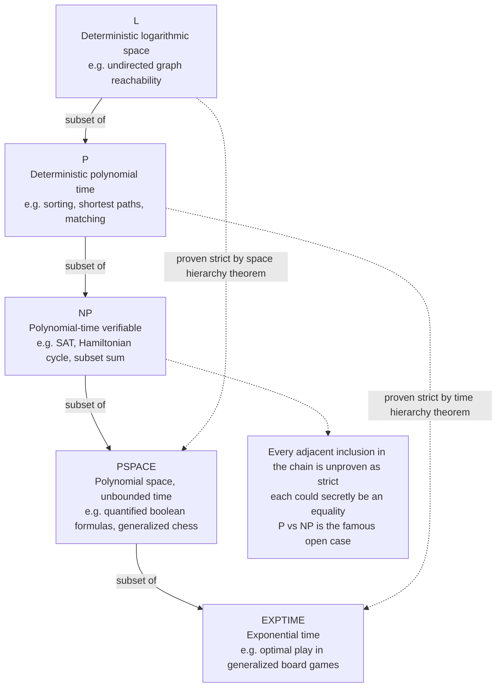

# ⏱️ Time and Space Complexity

> [!abstract] TL;DR
> **Computability** asks whether a problem can be solved *at all*; **complexity** asks whether it can be solved *before the universe ends*. Complexity theory measures the two resources every computation spends — **time** (number of steps) and **space** (memory cells used) — as functions of the input size *n*, using the Turing machine as a precise, machine-independent yardstick. Sorting these functions by growth rate produces the great **complexity classes** — **L ⊆ P ⊆ NP ⊆ PSPACE ⊆ EXPTIME** — and the divide between *polynomial* (tractable) and *exponential* (intractable) growth is the wall that decides which problems we even attempt to solve exactly.

---

## Intuition

**Analogy — the maze and the dying flashlight.** Two very different questions can be asked about a maze:

1. **"Is there *any* path out?"** — a yes/no fact about the maze that does not care how long you search. This is the flavor of a **computability** question: does a solution *exist in principle*?
2. **"Can you get out *before your flashlight battery dies*?"** — now the size of the maze and the *rate* at which searching burns resources decide everything. Double the maze and a clever explorer barely slows down, while a brute-force wanderer who tries every corridor combination runs out of battery long before finishing. This is the flavor of a **complexity** question: can a solution be reached *within a resource budget*?

Complexity theory makes the second question rigorous. It fixes two budgets — the **time** you may spend (steps taken) and the **space** you may use (scratch memory) — and asks, *as the input grows*, how fast each budget must grow to keep up. A method whose cost grows like `n²` scales; one whose cost grows like `2ⁿ` hits a wall where adding a single item to the input *doubles* the work. Everything downstream — which algorithms are worth writing, which problems are believed unbreakable enough to guard your bank password — is a consequence of *where a problem sits on that growth ladder*.

The move from [[Theory_of_Computation_Overview|computability]] to complexity is a shift in the question from *"solvable?"* to *"solvable **efficiently**?"* — and the second question turns out to have its own deep, mostly unsolved, mathematical structure.

---

## How It Works

### Core Mechanics

**1. What we measure, and against what.** A problem is encoded as a language (a set of strings). For an input of length *n*:

- **Time complexity** `t(n)` = the maximum number of computation steps the machine takes on any input of size *n* (worst case).
- **Space complexity** `s(n)` = the maximum number of distinct memory cells (tape squares) it ever writes on, again worst-case. For sub-linear space we count only the *work tape*, letting the read-only input tape sit free — this is what makes classes like **L** (logarithmic space) meaningful.

Both are functions of *n*, and complexity theory studies the *shape* of those functions, not their exact value.

**2. Why the Turing machine.** The step count of "an algorithm" is meaningless until you fix what a *step* is. The **Turing machine** pins it down: one step = one read/write/move of the head. Because the *efficient Church-Turing thesis* holds — every reasonable model (multi-tape TMs, RAM machines, your laptop, the lambda calculus) simulates every other with only **polynomial overhead** — the *class* a problem lands in (polynomial vs exponential) is the same on all of them. This machine-independence is what makes "polynomial time" a robust, model-free notion rather than an artifact of one architecture. *(The one contested frontier is quantum computation, where a quantum machine may give a super-polynomial speedup for special problems like factoring; whether that ever collapses a classical class is open.)*

**3. Asymptotics and worst-case — why growth rate beats constants.** We describe `t(n)` with **Big-O** ([[Big_O_Notation]]): `O(n²)`, `O(n log n)`, `O(2ⁿ)`. Constant factors and low-order terms are dropped because a machine that is 1000× faster only shifts a constant — it never turns an exponential algorithm into a polynomial one. At `n = 10⁶`, an `O(n log n)` method finishes in a blink while an `O(2ⁿ)` method would outlast the age of the universe on any conceivable hardware. Complexity theory uses **worst-case** cost by default (a *guarantee* over all inputs), distinct from **average-case** (expected cost over a distribution), which can be far kinder — quicksort is `O(n²)` worst-case but `O(n log n)` on average.

**4. The major classes and their containment.** Grouping problems by their best-possible resource bound gives:

| Class | Resource bound | Intuition | Canonical member |
|---|---|---|---|
| **L** | `O(log n)` **space** | just enough memory for a few pointers | undirected graph reachability |
| **P** | `n^k` **time** | "efficiently solvable" | sorting, shortest paths, matching |
| **NP** | `n^k` **time to *verify*** a given certificate | "answer easy to check" | SAT, Hamiltonian cycle, subset-sum |
| **PSPACE** | `n^k` **space** (any time) | reusable memory, huge time | quantified boolean formulas, generalized chess |
| **EXPTIME** | `2^{n^k}` **time** | brute force over exponentially many options | optimal play in generalized board games |

These nest:

$$\mathbf{L} \subseteq \mathbf{P} \subseteq \mathbf{NP} \subseteq \mathbf{PSPACE} \subseteq \mathbf{EXPTIME}$$

**5. Time vs space — space is the more powerful resource.** Two structural facts tie them together:

- **A machine running in time `t(n)` uses at most `t(n)` space** (it cannot touch more cells than it has steps to visit). Hence `P ⊆ PSPACE`.
- **Space can be *reused*; time cannot.** A polynomial amount of memory can drive an *exponential* number of steps by overwriting itself, which is why `PSPACE` reaches all the way up toward `EXPTIME`.
- **Savitch's theorem (1970):** nondeterministic space is barely more powerful than deterministic space — `NSPACE(s) ⊆ DSPACE(s²)`, so in particular **NPSPACE = PSPACE**. Contrast this with time, where the analogous `P = NP` is the famous *open* question: for *space*, nondeterminism costs only a squaring; for *time*, we do not even know if it costs anything.

**6. The hierarchy theorems — the separations we can actually prove.** By **diagonalization** (the same self-reference trick that proves the halting problem undecidable), the **time hierarchy theorem** and **space hierarchy theorem** show that *strictly more resource buys strictly more power*: there are problems solvable in `O(n³)` time but not `O(n²)`, and likewise for space. These give the *only* proper separations in the chain that we can prove today: **L ⊊ PSPACE** (space hierarchy) and **P ⊊ EXPTIME** (time hierarchy). Every *adjacent* inclusion above — including `P ⊊ NP` — remains **open**. We know the chain does not collapse *entirely*, but we cannot pin down where the strictness lives.

**7. The tractable / intractable divide (Cobham–Edmonds thesis).** The working definition adopted in the 1960s: **polynomial time = "efficient / tractable."** It is imperfect — an `n^{100}` algorithm is polynomial yet useless, and a `1.0001^n` algorithm is exponential yet fine for small *n* — but it is *robust* (closed under composition, model-independent) and empirically most natural polynomial algorithms have small exponents. This is why classifying a real algorithm or problem as "in P" versus "NP-hard / needs exponential time" is the first thing an engineer wants to know: it decides whether to hunt for an exact fast method or retreat to heuristics and approximation ([[Time_Complexity_Classes]]).

### Flow / Architecture



*Solid arrows are containments we can prove trivially from the definitions. The two dashed skip-level arrows are the only **proper** separations we can prove at all — everything in between, including whether P equals NP, is open.*

---

## Key Concepts

**Secondary (intuition, no CS background needed)**
- **Two budgets** — every computation spends *time* (steps) and *space* (memory); complexity is the study of how those budgets grow with problem size.
- **The doubling wall** — if adding one item to the input *doubles* the work, you have an exponential problem and it will not scale, no matter how fast your computer.
- **Growth beats speed** — a better method matters more than a faster machine once inputs get large.

**Undergraduate (a first theory / algorithms course)**
- **Big-O, worst-case vs average-case** — the asymptotic vocabulary; guarantees vs expectations ([[Big_O_Notation]], [[Time_Complexity_Classes]]).
- **P and NP** — polynomial-time *solvable* versus polynomial-time *verifiable*; the certificate/verifier view of NP.
- **Space classes L and PSPACE** — logarithmic and polynomial memory; why input-tape-read-only lets us go below linear space.
- **The tractability line** — Cobham–Edmonds: polynomial = efficient, as a useful working definition.
- **`P ⊆ PSPACE`** — time bounds space; the easy containment.

**Graduate (advanced complexity)**
- **Hierarchy theorems** — time and space hierarchy via diagonalization; the source of `L ⊊ PSPACE` and `P ⊊ EXPTIME`.
- **Savitch's theorem and NPSPACE = PSPACE** — nondeterministic space costs only a squaring; the sharp contrast with the open `P vs NP` for time.
- **Efficient Church–Turing thesis** — polynomial-time robustness across models, and the quantum caveat (BQP).
- **Relativization / oracle barriers** — why diagonalization alone cannot resolve `P vs NP`.
- **Completeness and reductions** — polynomial-time and log-space reductions that give each class its hardest problems (SAT for NP, QBF for PSPACE).

---

## Python Demo

```python
# Empirically measuring the growth rate of four algorithms of increasing
# complexity class -- and watching the polynomial/exponential "wall" appear.
#
#   linear scan      -> O(n)        | all three of these are POLYNOMIAL time,
#   comparison sort  -> O(n log n)  | i.e. class P: the "tractable" side.
#   nested-loop pairs-> O(n^2)      |
#   subset-sum brute -> O(2^n)      -> EXPONENTIAL: the brute force typical of
#                                      an NP-complete problem, the intractable side.
#
# We time each on growing inputs and plot seconds vs n on a LOG y-axis, so an
# exponential curve becomes a straight line that shoots past every polynomial.
# numpy / matplotlib only (time is standard library).

import time
import numpy as np
import matplotlib.pyplot as plt

rng = np.random.default_rng(0)

def best_time(fn, *args, repeats=3):
    """Return the fastest of a few runs (least noisy estimate)."""
    best = float("inf")
    for _ in range(repeats):
        t0 = time.perf_counter()
        fn(*args)
        best = min(best, time.perf_counter() - t0)
    return best

# --- O(n): one pass to find the maximum -------------------------------------
def linear_scan(a):
    m = a[0]
    for x in a:
        if x > m:
            m = x
    return m

# --- O(n log n): a comparison sort ------------------------------------------
def n_log_n_sort(a):
    return np.sort(a, kind="mergesort")

# --- O(n^2): count zero-sum pairs with a nested loop ------------------------
def nested_pairs(a):
    n = len(a)
    count = 0
    for i in range(n):
        for j in range(i + 1, n):
            if a[i] + a[j] == 0:
                count += 1
    return count

# --- O(2^n): subset-sum brute force -- try every one of the 2^n subsets -----
def subset_sum_bruteforce(a, target):
    n = len(a)
    for mask in range(1 << n):          # 2^n subsets
        s = 0
        for i in range(n):
            if mask & (1 << i):
                s += a[i]
        if s == target:
            return True
    return False

# --- Measure each on its own feasible range of n ----------------------------
series = {}

ns_lin = np.array([2_000, 4_000, 8_000, 16_000, 32_000, 64_000])
series["O(n) linear scan"] = (
    ns_lin,
    [best_time(linear_scan, rng.integers(0, 1_000_000, n)) for n in ns_lin],
    "C0",
)

ns_sort = ns_lin
series["O(n log n) sort"] = (
    ns_sort,
    [best_time(n_log_n_sort, rng.integers(0, 1_000_000, n)) for n in ns_sort],
    "C2",
)

ns_quad = np.array([100, 200, 400, 800, 1_600])
series["O(n^2) nested loop"] = (
    ns_quad,
    [best_time(nested_pairs, rng.integers(-50, 50, n)) for n in ns_quad],
    "C1",
)

ns_exp = np.array([12, 14, 16, 18, 20, 22])
series["O(2^n) subset-sum"] = (
    ns_exp,
    [best_time(subset_sum_bruteforce, rng.integers(-20, 20, n), 999_999)
     for n in ns_exp],   # unreachable target -> forces the full 2^n search
    "C3",
)

# --- Report the numbers ------------------------------------------------------
print(f"{'algorithm':<22}{'n':>8}{'seconds':>14}")
print("-" * 44)
for name, (ns, ts, _) in series.items():
    for n, t in zip(ns, ts):
        print(f"{name:<22}{n:>8}{t:>14.6f}")

# --- Plot: seconds vs n on a log y-axis -------------------------------------
fig, ax = plt.subplots(figsize=(9, 6))
for name, (ns, ts, color) in series.items():
    ax.semilogy(ns, ts, "o-", color=color, label=name)

ax.set_xlabel("input size  n")
ax.set_ylabel("runtime (seconds, log scale)")
ax.set_title("Polynomial vs exponential growth: the tractable / intractable wall")
ax.grid(True, which="both", ls=":", alpha=0.5)
ax.legend()

# annotate the exponential blow-up
ns_exp, ts_exp, _ = series["O(2^n) subset-sum"]
ax.annotate("each +1 to n roughly DOUBLES the work\n(the exponential wall)",
            xy=(ns_exp[-1], ts_exp[-1]),
            xytext=(ns_exp[-1] - 6, ts_exp[-1] * 6),
            arrowprops=dict(arrowstyle="->", color="C3"),
            fontsize=9, color="C3")

plt.tight_layout()
plt.savefig("complexity_wall.png", dpi=130)
print("\nSaved runtime-vs-n plot to complexity_wall.png")

# Takeaway: the three polynomial curves (class P) stay shallow -- doubling n
# multiplies their cost by a small constant. The O(2^n) curve is a straight
# line on the log axis and crosses the others almost immediately: at n ~ 22 it
# already needs ~4 million subset evaluations. This gap IS the boundary
# between P (tractable) and the exponential brute force behind NP-hard problems.
```

Running it prints a timing table and saves `complexity_wall.png`. The three polynomial series (`O(n)`, `O(n log n)`, `O(n²)` — all inside **P**) climb gently, while the `O(2ⁿ)` subset-sum curve is a straight line on the log axis that rockets past them: adding a single element roughly *doubles* its runtime. That single visual is the whole point of complexity theory — the wall separating what we can compute at scale from what we cannot.

---

## Real-World Applications

> **Example — cryptography is a bet on complexity.** RSA and elliptic-curve encryption are secure *only because* integer factoring and discrete-log are believed to sit outside efficient (polynomial-time) computation. There is no proof they are hard — the security of the entire internet rests on the *unproven* conjecture that these problems are not in P. Shor's quantum algorithm factoring in polynomial *quantum* time is exactly why "post-quantum cryptography" exists: a shift in the complexity landscape would break the assumption.

Beyond cryptography, resource complexity drives concrete engineering:

- **Algorithm and system design.** Knowing a task is in P (find a fast exact algorithm) versus NP-hard (give up on exact optimality; use heuristics, ILP solvers, or approximation) is the first decision in any nontrivial scheduling, routing, or allocation system ([[Time_Complexity_Classes]], [[Big_O_Notation]]).
- **Formal verification and model checking.** Checking whether a hardware or protocol design satisfies a temporal-logic spec is **PSPACE-complete** (QBF-style). Its polynomial *space* but exponential *time* character is precisely why model checkers can verify surprisingly large systems within memory limits yet still time out — the `PSPACE ⊆ EXPTIME` relationship made tangible.
- **Database query evaluation.** The complexity of evaluating relational-algebra and Datalog queries is classified exactly by these classes (e.g. query evaluation is often PSPACE- or EXPTIME-complete in combined complexity), telling engine designers which query features are inherently expensive.
- **Space-bounded streaming.** Algorithms that must process a huge stream with tiny memory live near class **L** and its relatives; the theory of what is computable in logarithmic space directly bounds what a streaming or embedded system can do.

---

## Common Pitfalls

- **Confusing "hard" with "impossible."** NP-hard and EXPTIME problems are *decidable* — an algorithm exists, it is just slow. Undecidable problems (the halting problem) are an absolute barrier: no algorithm at any speed. Complexity theory and computability theory answer *different* questions; do not treat "intractable" as "unsolvable."
- **Reading polynomial as "always fast."** The Cobham–Edmonds identification of P with "efficient" is a *useful fiction*. An `n^{100}` or `10^{9}·n` algorithm is polynomial yet unusable ("galactic algorithms"), and a `1.001^n` algorithm beats it for realistic *n*. P is the right *asymptotic* dividing line, not a promise about your input size.
- **Ignoring the constants and low-order terms the model hides.** Big-O deliberately drops them, but real deadlines are decided by them. An `O(n log n)` sort with a huge constant can lose to an `O(n²)` sort at small *n* — asymptotics are a *scaling* tool, not a stopwatch.
- **Assuming space and time behave alike.** They do not: space is *reusable* (Savitch squares nondeterministic space; NPSPACE = PSPACE), whereas the analogous question for time — does nondeterminism help, i.e. P vs NP — is famously open. Reasoning about one resource by analogy to the other is a trap.
- **Believing P vs NP (or any adjacent containment) is settled.** Only `L ⊊ PSPACE` and `P ⊊ EXPTIME` are proven. Every step of `L ⊆ P ⊆ NP ⊆ PSPACE` could, as far as anyone can prove, be an *equality*. Do not assert `P ≠ NP` as fact.
- **Forgetting worst-case is the default.** Stating "this is O(f(n))" almost always means worst-case. A problem being NP-complete does not stop *typical* instances from solving fast — SAT solvers crush enormous industrial formulas daily. Worst-case hardness is not average-case hardness.

---

## Related Concepts

- [[Theory_of_Computation_Overview]] — the parent map; this note is the complexity branch that follows the automata and computability branches, moving the question from "solvable?" to "solvable efficiently?"
- [[Time_Complexity_Classes]] — the applied DSA face of the same idea: O(1) through O(n!) growth rates and their feasibility at real input sizes.
- [[Big_O_Notation]] — the asymptotic language used throughout to state time and space bounds precisely and drop constants.
- [[Space_Complexity]] — the practical counterpart on memory usage, including recursion-stack and auxiliary-space accounting.
- [[Master_Theorem]] — the standard tool for extracting the time-complexity class of divide-and-conquer recurrences (e.g. why merge sort is `O(n log n)`).
- [[Mathematical_Logic_and_Set_Theory]] — the logic side where Turing machines, diagonalization, and the Church–Turing thesis live, underpinning both the hierarchy theorems and undecidability.

---

## Review Questions

1. **(Foundational)** Using the "maze and dying flashlight" analogy, explain the difference between a *computability* question and a *complexity* question about the same problem. Then give one everyday reason why an exponential-time algorithm is useless at scale even on a computer a million times faster.
2. **(Undergraduate)** Justify each containment in `P ⊆ NP ⊆ PSPACE` from the definitions. Why does a machine that runs in time `t(n)` automatically use at most `t(n)` space, and why does the reverse fail — why can a machine using only *polynomial space* run for *exponentially* many steps?
3. **(Graduate / trade-off)** We can prove `L ⊊ PSPACE` and `P ⊊ EXPTIME` via the hierarchy theorems, yet `P vs NP` is open. Savitch's theorem settles the *space* analogue of that question by showing NPSPACE = PSPACE. Explain why the same diagonalization that gives the hierarchy theorems does *not* resolve `P vs NP`, and why space nondeterminism turned out to be so much cheaper than (apparently) time nondeterminism.

---

## Sources

- Sipser, M. *Introduction to the Theory of Computation*, 3rd ed. Cengage, 2013 — Part Three: time and space complexity, the classes, Savitch's theorem, and the hierarchy theorems.
- Arora, S., Barak, B. *Computational Complexity: A Modern Approach*. Cambridge University Press, 2009 — the standard graduate treatment of the class chain, relativization barriers, and P vs NP.
- Papadimitriou, C. H. *Computational Complexity*. Addison-Wesley, 1994 — classic reference on complexity classes, reductions, and completeness.
- Hartmanis, J., Stearns, R. E. "On the Computational Complexity of Algorithms." *Transactions of the AMS*, 1965 — founds the field and proves the time hierarchy theorem.
- Savitch, W. J. "Relationships Between Nondeterministic and Deterministic Tape Complexities." *J. Computer and System Sciences*, 1970 — proves NSPACE(s) ⊆ DSPACE(s²), hence NPSPACE = PSPACE.

---

#theory-of-computation #complexity-theory #time-complexity #space-complexity #complexity-classes
