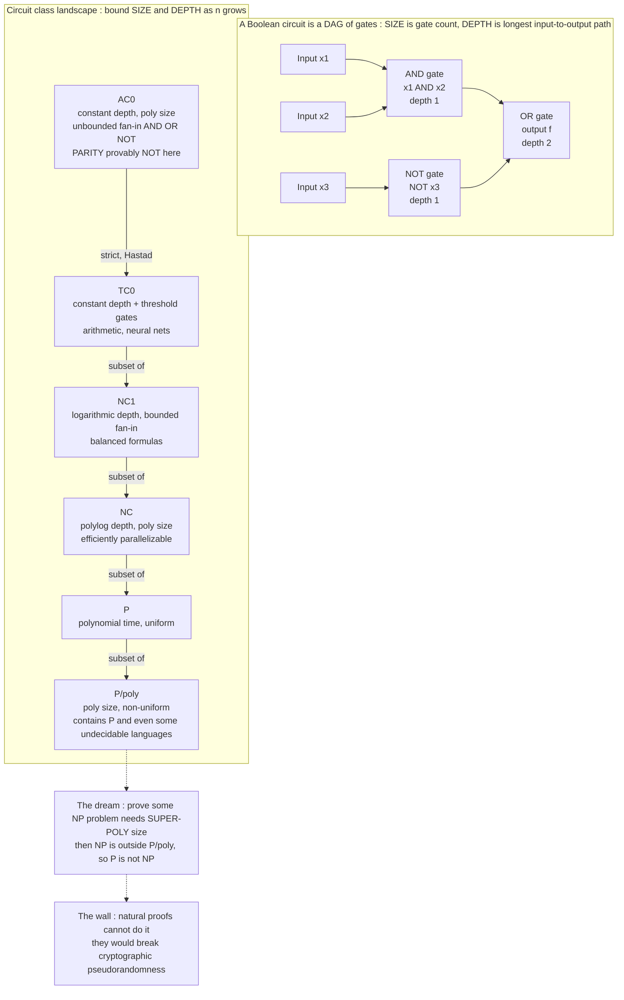

# ⚙️ Circuit Complexity

> [!abstract] TL;DR
> **Circuit complexity measures a problem not by the steps a Turing machine takes, but by the *size* and *depth* of the smallest AND/OR/NOT logic-gate circuit that computes it** — a *non-uniform*, hardware-flavored model where you are allowed a *different* circuit for each input length. Its central promise is brutal and simple: since every polynomial-time problem has polynomial-size circuits (**P ⊆ P/poly**), proving that some NP problem needs *super-polynomial-size* circuits would prove **P ≠ NP**. That is why circuit lower bounds are the main frontal assault on P vs NP — and why the field is defined as much by its spectacular partial victories (**PARITY is provably not in AC0**) as by the deep barrier (**natural proofs**) that explains why the full prize stays out of reach.

---

## Intuition

**Analogy — grading a problem by the smallest machine that solves it, not the time it takes.** Imagine you must build a physical box out of nothing but AND, OR, and NOT gates that lights a bulb exactly when the answer is "yes." Two boxes can both be *correct* yet wildly different in cost: one might use a handful of gates wired in a few layers, another a galaxy of gates stacked hundreds deep. Circuit complexity says the *true difficulty* of a problem is the size of the **smallest such box** — the fewest gates, or the shallowest wiring — that can ever compute it. A problem is "easy" if a *small, shallow* box exists and "hard" if *every* correct box must be *enormous*.

This flips the usual [[Time_and_Space_Complexity|time/space]] question on its head. Instead of one program that runs on all inputs, you get a *fresh custom circuit for each input length n* — a non-uniform, build-to-order view of computation. And here is the seductive part: proving a problem is hard becomes a **geometry problem about circuits**. If you could show that *no* small circuit — not one anybody has thought of, not one anybody ever *will* think of — can compute some NP problem, you would have proved P ≠ NP by pure counting of gates. Circuit complexity is the arena where that dream both comes closest to reality and runs into its most beautiful wall.

---

## How It Works

### Core Mechanics

**1. What a Boolean circuit is.** A Boolean circuit on `n` inputs is a **directed acyclic graph** whose sources are the input bits `x₁…xₙ` (and constants 0, 1) and whose internal nodes are **gates** drawn from AND, OR, NOT. One gate is the designated output. The circuit *computes* the Boolean function `f: {0,1}ⁿ → {0,1}` obtained by evaluating the DAG. Two cost measures matter:

- **SIZE** = the number of gates. This is the circuit analogue of *time* — the total hardware/work.
- **DEPTH** = the length of the longest path from an input to the output. This is the analogue of *parallel time* — how many sequential gate-delays the signal must ripple through if every gate fires simultaneously.

A third knob is **fan-in**: whether an AND/OR gate takes exactly two inputs (**bounded fan-in**) or arbitrarily many (**unbounded fan-in**). It sounds cosmetic but it redraws the entire low-depth map, because unbounded fan-in lets a single gate collapse a whole layer.

**2. The non-uniform model — a separate circuit per input length.** A Turing machine is *one* finite object that must handle inputs of *every* length. A **circuit family** `{Cₙ}` is a *sequence* of circuits, `Cₙ` handling exactly the `n`-bit inputs, with *no requirement that the circuits be related to each other or even computable*. This is **non-uniform** computation: you are handed the right circuit for free, as "advice," once the input length is fixed. The consequence is startling — a circuit family can compute some **undecidable** languages. Take any undecidable *unary* language `L ⊆ {1}*`; for each `n` the circuit `Cₙ` just needs one constant bit ("is `1ⁿ ∈ L`?"), which is a legal size-1 circuit even though *no algorithm* can decide `L`. So the non-uniform model is, in this one respect, *strictly more powerful* than Turing machines. That is exactly why proving circuit *lower bounds* is meaningful: a lower bound in this generous model is a very strong statement.

**3. The class P/poly.** `P/poly` is the class of languages decidable by circuit families of **polynomial size** (`size(Cₙ) ≤ n^k` for some fixed `k`). Two facts make it the linchpin of the whole theory:

- **P ⊆ P/poly.** Any polynomial-time Turing machine can be "unrolled" into a polynomial-size circuit for each input length (the standard tableau/Cook–Levin construction — the same one behind [[NP_Completeness_and_the_Cook_Levin_Theorem|Cook–Levin]]). So efficient uniform computation implies small circuits.
- **The contrapositive is the attack plan.** If we could exhibit a *single explicit NP problem* (say SAT) and prove it has **no** polynomial-size circuits — i.e. `NP ⊄ P/poly` — then because `P ⊆ P/poly`, that problem could not be in P either, so **P ≠ NP**. Circuit lower bounds are therefore a *sufficient* route to separating P from NP, and one that sidesteps the messy uniformity of Turing machines.

**4. The low-depth landscape (the classes with real lower bounds).** Bounding *both* size and depth carves out the classes where the field has actually won battles:

| Class | Depth | Size | Gates | Captures |
|---|---|---|---|---|
| **AC⁰** | O(1) constant | poly | unbounded fan-in AND/OR/NOT | trivially local functions; **cannot** do PARITY |
| **TC⁰** | O(1) constant | poly | + MAJORITY / threshold gates | integer arithmetic, and the natural home of neural nets |
| **NC¹** | O(log n) | poly | bounded fan-in AND/OR/NOT | balanced formulas, regular languages |
| **NC** | O(logᵏ n) polylog | poly | bounded fan-in | **efficiently parallelizable** problems |
| **P/poly** | poly | poly | any | everything with small circuits (⊇ P) |

with containments `AC⁰ ⊊ TC⁰ ⊆ NC¹ ⊆ NC ⊆ P ⊆ P/poly`. **NC** ("Nick's Class") is the circuit-world definition of *what can be sped up by throwing processors at it*: polylog depth means polylog parallel time with a polynomial number of processors — the theoretical ceiling of parallel/distributed computing.

**5. The crown jewel: PARITY is not in AC⁰.** `PARITY(x) = x₁ ⊕ x₂ ⊕ … ⊕ xₙ` (is the number of 1-bits odd?) looks trivial, yet **Furst–Saxe–Sipser (1984)** and then, optimally, **Håstad (1986)** proved that *no* constant-depth polynomial-size circuit computes it. Håstad's **switching lemma** shows any depth-`d` circuit for PARITY needs size at least `2^(c · n^(1/(d-1)))` — super-polynomial for every fixed `d`. This is one of the few **unconditional** lower bounds in all of complexity theory: not "we believe," but "we *proved*," with no unproven assumption. It is what makes AC⁰ the field's shining proof-of-concept that circuit lower bounds are *possible at all*.

**6. Why the *general* case is so hard.** The victories are all for *restricted* circuits (constant depth, monotone gates, bounded fan-in). For **general** polynomial-size circuits with no restrictions, we are almost helpless: we cannot prove that any explicit function in NP needs even a **super-linear** number of gates. The best known lower bound for an explicit function against unrestricted circuits is roughly `5n` gates — laughably far from the super-polynomial bound P ≠ NP would require. Decades of effort have not budged the general case.

**7. The Natural Proofs barrier (Razborov–Rudich, 1994).** *Why* is the general case stuck? Razborov and Rudich identified that essentially every successful lower-bound technique (including the switching lemma) is a **natural proof**: it works by finding a property that (a) is *large* — most functions have it — and (b) is *constructive* — efficiently checkable. They then proved a devastating meta-theorem: **if a natural proof separated P from NP, it would also break every pseudorandom generator**, and hence break the cryptographic hardness assumptions the internet relies on. Since we strongly believe strong pseudorandom generators exist, natural proofs *provably cannot* prove P ≠ NP. This is a genuine, self-referential wall (kin to the relativization barrier around [[Time_and_Space_Complexity|diagonalization]]): the very tools that beat AC⁰ are the ones certified not to reach the summit. Any proof of P ≠ NP must be *un-natural* — must dodge either largeness or constructivity.

**8. Two structural gifts: Karp–Lipton and threshold/ML connections.** Even without a lower bound, the framework yields theorems. **Karp–Lipton (1980):** *if* NP ⊆ P/poly (i.e. NP problems *do* have small circuits), then the **polynomial hierarchy collapses** to its second level. Since a total collapse is considered implausible, this is strong *evidence* that NP has no small circuits — pushing the same direction as P ≠ NP. Separately, **TC⁰**'s threshold gates are exactly artificial neurons ([[Neural_Network_Basics|perceptrons]]): a depth-`d` threshold circuit *is* a `d`-layer neural network. The modern question of whether **deep** nets are exponentially more expressive than **shallow** ones is, formally, a circuit-*depth* separation question — circuit complexity is the mathematics of "why depth matters."

### Flow / Architecture



*The top box is a concrete 3-gate circuit of size 3 and depth 2. The bottom chain is the class hierarchy; only the AC⁰-to-TC⁰ step is a **proven** strict separation (via PARITY). The dashed nodes state the goal and the barrier that guards it.*

---

## Key Concepts

**Secondary (intuition, no CS background needed)**
- **A problem's difficulty = the smallest gate-box that solves it.** Fewer gates, fewer layers → easier.
- **Size vs depth** — *size* is total hardware; *depth* is how many gate-delays the answer takes (parallel time).
- **A different box for each input length** — the non-uniform trick; you are *given* the right circuit once you know how many input bits there are.

**Undergraduate (a first theory / algorithms course)**
- **P/poly and P ⊆ P/poly** — polynomial-size circuits; every efficient program unrolls into small circuits.
- **The lower-bound strategy** — proving NP ⊄ P/poly would prove P ≠ NP; this is *the* motivation.
- **AC⁰, NC, TC⁰** — constant / polylog depth; NC = the class of efficiently parallelizable problems.
- **PARITY ∉ AC⁰** — the celebrated *unconditional* lower bound; constant depth cannot count parity with poly size.
- **Non-uniformity is genuinely stronger** — circuit families can even "decide" some undecidable unary languages.

**Graduate (advanced complexity)**
- **Håstad's switching lemma** — random restrictions collapse depth; yields the `2^(n^(1/(d-1)))` bound for depth-`d` PARITY.
- **Natural Proofs (Razborov–Rudich)** — largeness + constructivity ⇒ breaks PRGs; why current techniques provably stall on general circuits.
- **Karp–Lipton** — NP ⊆ P/poly collapses PH to Σ₂; evidence that NP lacks small circuits.
- **The ~5n frontier** — best explicit lower bound against *general* circuits; measures how far we are from the goal.
- **TC⁰ and learning theory** — threshold circuits = neural nets; depth-hierarchy separations = expressivity of deep vs shallow networks.

---

## Python Demo

```python
# Circuit complexity, made concrete:
#   * build REAL Boolean circuits (AND / OR / NOT) for PARITY, MAJORITY, and
#     binary ADDITION, and verify them on full truth tables;
#   * measure SIZE (gate count) and DEPTH (longest input->output path) and
#     watch them grow with the input width;
#   * illustrate the AC0 lower-bound flavor (Hastad's switching lemma): pinning
#     the depth to a CONSTANT forces PARITY's size to blow up SUPER-polynomially,
#     which is exactly why PARITY is not in AC0.
# numpy / matplotlib only.

import numpy as np
import matplotlib.pyplot as plt


class Circuit:
    """A DAG of AND/OR/NOT gates. Wire k < n is input k; wire n+j is gate j."""
    def __init__(self, n_inputs):
        self.n = n_inputs
        self.gates = []                       # each gate: (op, a, b)

    def _add(self, op, a, b=None):
        self.gates.append((op, a, b))
        return self.n + len(self.gates) - 1

    def AND(self, a, b): return self._add("AND", a, b)
    def OR(self, a, b):  return self._add("OR", a, b)
    def NOT(self, a):    return self._add("NOT", a)

    def XOR(self, a, b):
        # a XOR b = (a AND NOT b) OR (NOT a AND b)  -- 5 primitive gates, depth 3
        na, nb = self.NOT(a), self.NOT(b)
        return self.OR(self.AND(a, nb), self.AND(na, b))

    def size(self):
        return len(self.gates)

    def depth(self, out):
        d = [0] * self.n                      # inputs sit at depth 0
        for op, a, b in self.gates:
            db = d[b] if b is not None else 0
            d.append(1 + max(d[a], db))
        return d[out]

    def eval(self, x, out):
        v = list(x)
        for op, a, b in self.gates:
            if   op == "AND": v.append(v[a] & v[b])
            elif op == "OR":  v.append(v[a] | v[b])
            else:             v.append(1 - v[a])          # NOT
        return v[out]


# ---------- builders -------------------------------------------------------
def parity_tree(n):
    """XOR of all n bits as a BALANCED tree -> size ~ O(n), depth ~ O(log n)."""
    c, wires = Circuit(n), list(range(n))
    while len(wires) > 1:
        nxt = [c.XOR(wires[i], wires[i + 1]) for i in range(0, len(wires) - 1, 2)]
        if len(wires) % 2:                     # odd one carries up untouched
            nxt.append(wires[-1])
        wires = nxt
    return c, wires[0]

def majority3():
    """MAJ(a,b,c) = (a AND b) OR (b AND c) OR (a AND c)."""
    c = Circuit(3)
    ab, bc, ac = c.AND(0, 1), c.AND(1, 2), c.AND(0, 2)
    return c, c.OR(c.OR(ab, bc), ac)

def ripple_adder(k):
    """Ripple-carry adder of two k-bit numbers -> size & depth both O(k)."""
    c = Circuit(2 * k)
    a, b = list(range(k)), list(range(k, 2 * k))
    carry, outs = None, []
    for i in range(k):
        axb = c.XOR(a[i], b[i])
        if carry is None:
            outs.append(axb)                                   # sum bit 0
            carry = c.AND(a[i], b[i])                          # carry out
        else:
            outs.append(c.XOR(axb, carry))                     # sum bit i
            carry = c.OR(c.AND(a[i], b[i]), c.AND(carry, axb)) # new carry
    outs.append(carry)                                         # top carry bit
    return c, outs


# ---------- verify correctness on FULL truth tables ------------------------
def bits(x, n):
    return [(x >> i) & 1 for i in range(n)]

for n in range(2, 11):
    c, out = parity_tree(n)
    assert all(c.eval(bits(x, n), out) == bin(x).count("1") % 2
               for x in range(2 ** n)), f"parity wrong at n={n}"

cm, om = majority3()
assert all(cm.eval(bits(x, 3), om) == (bin(x).count("1") >= 2) for x in range(8))

k = 3
ca, oa = ripple_adder(k)
for x in range(2 ** (2 * k)):
    got = sum(ca.eval(bits(x, 2 * k), o) << i for i, o in enumerate(oa))
    assert got == (x & ((1 << k) - 1)) + (x >> k)
print("all circuits verified correct on full truth tables\n")

# ---------- measure SIZE and DEPTH vs input width --------------------------
ns = [2, 4, 8, 16, 32, 64, 128]
p_size, p_depth = [], []
for n in ns:
    c, out = parity_tree(n)
    p_size.append(c.size()); p_depth.append(c.depth(out))

ks = list(range(1, 17))
a_size, a_depth = [], []
for kk in ks:
    c, outs = ripple_adder(kk)
    a_size.append(c.size()); a_depth.append(c.depth(outs[-1]))

print(f"{'PARITY n':>9}{'size':>7}{'depth':>7}   (size grows ~ n, depth grows ~ log n)")
for n, s, d in zip(ns, p_size, p_depth):
    print(f"{n:>9}{s:>7}{d:>7}")

# ---------- the AC0 lower-bound flavor (Hastad switching lemma) ------------
# ANY depth-d AND/OR/NOT circuit for PARITY needs SIZE >= 2^(n^(1/(d-1))).
# Take the log2 of that (the "size exponent"): it is a POSITIVE POWER of n.
# A polynomial budget n^10 has size exponent 10*log2(n) -- only LOGARITHMIC.
# A power of n always overtakes a logarithm -> constant depth is impossible
# at polynomial size. That gap IS "PARITY is not in AC0".
nn = np.logspace(0.7, 9, 200)                 # input width n, from ~5 to 1e9
size_exp = {d: nn ** (1.0 / (d - 1)) for d in (2, 3, 4)}   # log2(required size)
poly_exp = 10.0 * np.log2(nn)                 # log2 of a generous n^10 budget

# ---------- plots ----------------------------------------------------------
fig, (ax1, ax2) = plt.subplots(1, 2, figsize=(13, 5.2))

ax1.semilogy(ns, p_size,  "o-",  color="C0", label="PARITY size  ~ O(n)")
ax1.semilogy(ns, p_depth, "s-",  color="C1", label="PARITY depth ~ O(log n)")
ax1.semilogy(ks, a_size,  "^--", color="C2", label="ADDER size   ~ O(k)")
ax1.semilogy(ks, a_depth, "v--", color="C3", label="ADDER depth  ~ O(k)")
ax1.set_xlabel("input width  n  (or k)")
ax1.set_ylabel("gate count / depth  (log scale)")
ax1.set_title("Measured SIZE vs DEPTH of real circuits\ndepth is the parallel time")
ax1.grid(True, which="both", ls=":", alpha=0.5)
ax1.legend(fontsize=8)

for d, col in zip((2, 3, 4), ("C3", "C1", "C0")):
    ax2.loglog(nn, size_exp[d], color=col, label=f"const depth d={d}: exponent n^(1/{d-1})")
ax2.loglog(nn, poly_exp, "k--", lw=2, label="polynomial budget n^10: exponent 10 log2 n")
ax2.set_xlabel("input width  n")
ax2.set_ylabel("size exponent  =  log2(required gates)")
ax2.set_title("Why PARITY is NOT in AC0\nfixed depth forces a super-polynomial size")
ax2.grid(True, which="both", ls=":", alpha=0.5)
ax2.legend(fontsize=8)

plt.tight_layout()
plt.savefig("circuit_complexity.png", dpi=130)
print("\nSaved figure to circuit_complexity.png")

# Takeaway: the left panel shows honest engineering -- PARITY needs only O(n)
# gates if you ALLOW O(log n) depth (a tree). The right panel shows the
# theorem: forbid depth from growing (AC0) and each constant-depth curve is a
# straight line of positive slope on log-log axes, forever climbing above the
# nearly-flat polynomial-exponent curve. Depth is the resource you cannot cheat.
```

Running it verifies every circuit against its truth table, prints the size/depth tables (PARITY: size ≈ `5(n−1)` gates, depth ≈ `3⌈log₂n⌉`), and saves `circuit_complexity.png`. The left panel is the practical story — parity is cheap *if* you spend logarithmic depth. The right panel is the impossibility — clamp depth to a constant and the required size exponent becomes a *power* of `n`, which on log-log axes is a straight line that permanently outruns any polynomial's merely-logarithmic exponent. That crossing *is* the Furst–Saxe–Sipser / Håstad lower bound made visual.

---

## Real-World Applications

> **Example — TC⁰, threshold gates, and deep learning's "why depth?"** A neural network is literally a **threshold circuit**: each artificial neuron computes a weighted sum and fires if it clears a threshold — exactly a **TC⁰** MAJORITY-style gate ([[Neural_Network_Basics|perceptrons]]). A network's *number of layers* is its circuit **depth**. So the empirical mantra that "deeper networks express more with fewer parameters than shallow ones" is, word for word, a **circuit-depth separation** conjecture. Results showing depth-`d` circuits need exponentially more gates than depth-`(d+1)` circuits are the theoretical backbone of why depth pays — and why a two-layer net can be exponentially larger than a ten-layer net computing the same function.

Beyond ML, the framework drives concrete work:

- **Parallel and distributed computing.** **NC** is the formal definition of "parallelizable with polynomial hardware in polylog time." Asking whether a problem (e.g. linear-system solving, matching) is *in NC* is asking whether a datacenter of processors can genuinely accelerate it, or whether it is inherently sequential (**P-complete**). Circuit depth = the ideal parallel time.
- **Hardware synthesis and EDA.** Chip design *is* circuit minimization: given a Boolean function, build a correct circuit of minimal gate count (area/cost) and minimal depth (critical-path delay / clock speed). The size-vs-depth trade-off in this note is the daily tension in every logic-synthesis tool ([[Boolean_Algebra_and_Logic_Gates|Boolean minimization]], [[Combinational_Circuits|combinational design]]).
- **Cryptography, via the barrier.** The natural-proofs result is a two-way street: the *reason* we cannot prove strong circuit lower bounds is that doing so would *break* pseudorandom generators. So the security of stream ciphers and PRGs is entangled with the *unprovability* of circuit lower bounds — a rare case where a proof barrier is itself a security guarantee.
- **Fine-grained hardness.** Even sub-polynomial circuit questions (does a function need super-linear circuits?) inform which problems can plausibly have ultra-fast hardware, guiding where to invest in accelerators.

---

## Common Pitfalls

- **Thinking P/poly = P.** They are different: P is *uniform* (one machine for all lengths), P/poly is *non-uniform* (a possibly-uncomputable circuit per length). P ⊊ P/poly — indeed P/poly contains *undecidable* unary languages. "Small circuits exist" does **not** imply "an algorithm exists." Non-uniformity gives you the circuits for free.
- **Believing a circuit lower bound is "almost done."** We can beat *AC⁰* and *monotone* circuits, but against **general** circuits we cannot even prove an explicit NP function needs more than about `5n` gates. The gap between the restricted victories and the general goal is not a gap — it is a chasm guarded by the natural-proofs barrier.
- **Confusing size and depth.** Size is total work (≈ time); depth is critical path (≈ parallel time). A function can be tiny in size yet require large depth, or vice versa. PARITY is *linear size* but the whole AC⁰ result is about *depth*: cheap in gates, impossible in constant depth.
- **Assuming unbounded fan-in is a technicality.** It is load-bearing. AC⁰ *requires* unbounded fan-in; switch to bounded fan-in and constant depth can no longer even read all `n` inputs. The fan-in convention *defines* which class you are in.
- **Reading "PARITY ∉ AC⁰" as "PARITY is hard."** PARITY is trivially easy overall — linear size, log depth, in NC¹ and in P. The lower bound is *only* against the crippled AC⁰ model. A lower bound is always relative to a resource restriction; state the restriction or the claim is meaningless.
- **Expecting a clever new gadget to crack P vs NP via circuits.** Razborov–Rudich shows any *natural* (large + constructive) technique provably fails against general circuits. A solution must be *un-natural*; brute-force gate-counting or another switching-lemma variant will not get there.

---

## Related Concepts

- [[Time_and_Space_Complexity]] — the *uniform* Turing-machine view of resources; circuit complexity is its non-uniform mirror, with SIZE ↔ time and DEPTH ↔ parallel time, and P ⊆ P/poly bridges the two.
- [[NP_Completeness_and_the_Cook_Levin_Theorem]] — the tableau construction that unrolls a poly-time machine into a poly-size circuit is exactly what proves P ⊆ P/poly; SAT is the target function circuit lower bounds hope to prove is hard.
- [[The_Class_NP_and_Verification]] — the class whose separation from P is the prize; showing NP ⊄ P/poly would settle P vs NP.
- [[Boolean_Algebra_and_Logic_Gates]] — the AND/OR/NOT/NAND gate algebra and De Morgan identities that these circuits are physically built from; circuit minimization is the applied face of "smallest circuit."
- [[Combinational_Circuits]] — real acyclic hardware (adders, MUXes, ALUs); the ripple adder in the demo is a canonical example, and critical-path delay *is* circuit depth.
- [[Neural_Network_Basics]] — artificial neurons are threshold (TC⁰) gates and layers are depth; the deep-vs-shallow expressivity debate is a circuit-depth separation question.

---

## Review Questions

1. **(Foundational)** Using the "smallest gate-box" analogy, explain the difference between a circuit's **size** and its **depth**, and why depth is called "parallel time." Then explain, in one sentence, why being allowed *a different circuit for each input length* makes the model able to "compute" some problems that no algorithm can solve.
2. **(Undergraduate)** State precisely why proving that SAT has **no polynomial-size circuits** would prove **P ≠ NP**. Which containment (P ⊆ P/poly or NP ⊆ P/poly) does the argument rely on, and why is the other one exactly the statement we are trying to refute?
3. **(Graduate / trade-off)** We have an *unconditional* proof that PARITY ∉ AC⁰ (Håstad), yet no proof that any explicit NP problem needs super-linear *general* circuits. Explain how the **Natural Proofs** barrier accounts for this gap: what two properties make a proof "natural," and why would a natural proof of P ≠ NP contradict the existence of cryptographic pseudorandom generators? What does this tell you about the *kind* of proof a resolution of P vs NP must be?

---

## Sources

- Arora, S., Barak, B. *Computational Complexity: A Modern Approach*. Cambridge University Press, 2009 — Ch. 6 (Boolean circuits, P/poly, Karp–Lipton), Ch. 14 (circuit lower bounds, AC⁰), Ch. 23 (natural proofs).
- Furst, M., Saxe, J., Sipser, M. "Parity, Circuits, and the Polynomial-Time Hierarchy." *Mathematical Systems Theory*, 1984 — first super-polynomial lower bound placing PARITY outside AC⁰.
- Håstad, J. "Almost Optimal Lower Bounds for Small Depth Circuits." *STOC*, 1986 — the switching lemma and the optimal `2^(n^(1/(d-1)))` bound for depth-`d` PARITY.
- Razborov, A., Rudich, S. "Natural Proofs." *Journal of Computer and System Sciences*, 1997 (STOC 1994) — the barrier: natural lower-bound techniques would break pseudorandom generators.
- Karp, R., Lipton, R. "Turing Machines That Take Advice." *L'Enseignement Mathématique*, 1982 — if NP ⊆ P/poly then the polynomial hierarchy collapses to Σ₂.

---

#theory-of-computation #circuit-complexity #boolean-circuits #lower-bounds #natural-proofs
