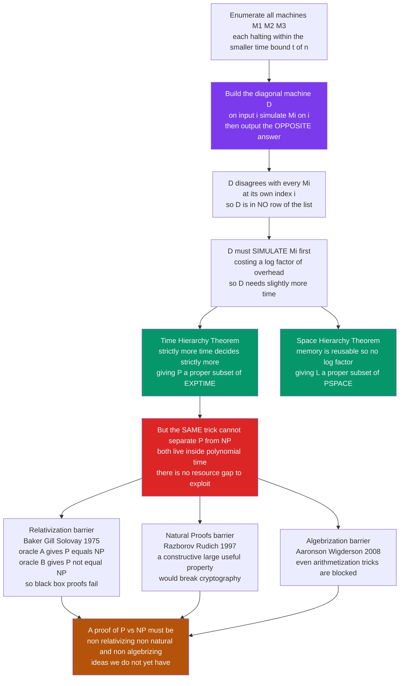

# 🪜 Complexity Hierarchies and Diagonalization

> [!abstract] TL;DR
> There are only a **handful** of complexity separations we can actually **prove** unconditionally, and they all come from one 19th-century idea: **diagonalization** — the same self-reference trick Cantor used for the reals and Turing used for the halting problem, now made **resource-bounded**. The **Time Hierarchy Theorem** shows that with (a little more than) strictly more time you can decide **strictly more languages**, giving us `P ⊊ EXPTIME`; the **Space Hierarchy Theorem** does the same for memory. But these theorems only separate classes with a **resource gap** — they are powerless to split `P` from `NP`, because both live inside polynomial time. Worse, three proven **barriers** — **relativization** (Baker–Gill–Solovay), **natural proofs** (Razborov–Rudich), and **algebrization** (Aaronson–Wigderson) — show that our standard toolkit, including diagonalization itself, **provably cannot** resolve `P vs NP`. This note is the honest map of what we can prove, what we cannot, and *why* the walls are where they are.

---

## Intuition

**Analogy — the copy machine that can always print a page no book contains.** Imagine a library that claims to hold *every possible book* written in a fixed shorthand. You are handed the complete catalogue: book 1, book 2, book 3, and so on, each a list of pages. You do something mischievous. You take **page 1 of book 1** and change one word; you take **page 2 of book 2** and change one word; **page 3 of book 3**, and so on down the diagonal. Bind those altered pages into a new book `D`.

Now ask the librarian: *"Is `D` on your shelves?"* It cannot be book 1 — its first page differs. It cannot be book 2 — its second page differs. It cannot be book *n* for **any** *n*, because you deliberately changed page *n* to disagree with book *n*. You have built, by pure construction, a book that the "complete" library provably does **not** contain. The claim to hold *everything* was self-defeating.

That single move is the beating heart of the whole subject. Replace "books" with **machines that run within a fixed time budget**, replace "changing a word" with **outputting the opposite answer**, and you get a machine `D` that **differs from every fast machine on that machine's own input** — so `D` decides a language no fast machine can. Give `D` a *little* more time (enough to simulate each fast machine and flip its answer) and you have proven, with no assumptions whatsoever, that **more time buys more power**. The genuinely surprising part is not that this works — it is that this trick, and essentially *only* this trick, is what we know how to do. The separations we most want, like `P ≠ NP`, sit just out of its reach, and we can prove *that they are out of reach* too.

---

## How It Works

### Core Mechanics

**1. The diagonal machine, resource-bounded.** Fix a time bound `t of n` (say `n²`). Every Turing machine has a finite description, so we can **enumerate** all machines `M₁, M₂, M₃, …`. Build a new machine `D` that, on input `i` (the encoding of the *i*-th machine), does this: **simulate `Mᵢ` on input `i` for up to a bit more than `t of i` steps, then output the OPPOSITE of whatever `Mᵢ` said.** By construction, `D(i) ≠ Mᵢ(i)` for every `i`. So the language `D` decides is **different from the language of every machine that halts within `t of n`** — it disagrees with each of them somewhere (namely, on that machine's own index). Therefore `D`'s language is **not** decidable within the smaller bound. This is Cantor's diagonal and Turing's halting proof wearing a stopwatch.

**2. The one subtlety: simulation costs a little.** `D` cannot flip an answer for free — it must **simulate** `Mᵢ` first, and a universal machine simulating a `t of n`-time machine pays a small overhead (a logarithmic factor for a multitape simulation). That overhead is exactly why `D` lands in a *slightly larger* class, not the same one. This gives the sharp statement of the **Time Hierarchy Theorem**:
> If `f` and `g` are **time-constructible** and `f of n · log f of n = o of g of n`, then `DTIME of f` is a **proper** subset of `DTIME of g`.

So `DTIME of n²` ⊊ `DTIME of n³` — there really are problems solvable in `O of n³` but **not** in `O of n²`. The log factor is not laziness; it is the price of universal simulation, and the theorem is essentially tight.

**3. The unconditional prize: `P ⊊ EXPTIME`.** Chaining the hierarchy theorem, `P ⊆ DTIME of 2ⁿ ⊊ DTIME of 2^{n²} ⊆ EXPTIME`. This is one of the **very few** separations of natural classes we can prove with **no assumptions at all**. It tells us, for instance, that optimal play in generalized chess or Go (`EXPTIME`-complete) has **no polynomial-time algorithm, ever** — that is a theorem, not a conjecture.

**4. The Space Hierarchy Theorem — the same, but cleaner.** Memory is **reusable**, so simulation overhead for space is only a *constant* factor, and the log disappears:
> If `f` and `g` are **space-constructible** and `f of n = o of g of n`, then `DSPACE of f` is a **proper** subset of `DSPACE of g`.

Hence `L ⊊ PSPACE` and `PSPACE ⊊ EXPSPACE`, again unconditionally. Space hierarchy is tighter than time hierarchy precisely because you can overwrite the tape.

**5. What the hierarchy theorems CANNOT do.** Diagonalization separates classes that differ by a **genuine resource gap** — polynomial vs exponential *time*, log vs polynomial *space*. But `P` and `NP` both sit inside **polynomial time**; there is no resource gap between them to exploit. To diagonalize an `NP` machine against all polynomial-time deterministic machines, the diagonal machine would have to **simulate-and-flip in polynomial time**, and nondeterministic verification does not hand you that power. So the separations we crave — `P vs NP`, `NP vs PSPACE`, `L vs P` — are exactly the ones with no gap, and diagonalization stalls.

**6. Oracle machines and relativization.** An **oracle Turing machine** `M^A` is an ordinary machine bolted to a **black box** for a language `A`: in one step it may ask "is string `x` in `A`?" and get an instant yes/no. This defines **relativized** classes like `P^A` and `NP^A`. A proof technique **relativizes** if it stays valid when *every* machine in it is given the same oracle. Diagonalization relativizes — attaching an oracle to both the enumerated machines and the diagonal machine changes nothing about the argument.

**7. The relativization barrier (Baker–Gill–Solovay, 1975).** They exhibited **two oracles**:
- An oracle `A` (e.g. any `PSPACE`-complete language) with `P^A = NP^A` — the black box is so powerful it collapses the distinction.
- An oracle `B` with `P^B ≠ NP^B` — built by diagonalization so that `NP^B` can "hide" a needle that `P^B` cannot find fast.

Since `P vs NP` comes out **both ways** depending on the oracle, **no relativizing proof can settle it** — a relativizing proof would have to give the *same* verdict in every relativized world. Diagonalization relativizes, so diagonalization alone can never resolve `P vs NP`. This is the first great "no-go" theorem about proofs themselves.

**8. The natural-proofs barrier (Razborov–Rudich, 1997).** Most attempts at `NP ⊄ P/poly` try to prove **circuit lower bounds** by finding a property of Boolean functions that hard functions have and easy ones lack. Call such a property **natural** if it is **constructive** (efficiently checkable), **large** (a random function has it), and **useful** (having it forces large circuits). Razborov and Rudich showed: **if a natural property strong enough to prove the lower bound existed, you could use it to break pseudorandom generators — i.e. to break the very cryptography we believe is secure.** Since we strongly believe strong one-way functions exist, natural proofs almost certainly **cannot** prove `P ≠ NP`. Because nearly every known circuit-lower-bound technique is natural, this blocks the whole family at once.

**9. The algebrization barrier (Aaronson–Wigderson, 2008).** Some celebrated results — `IP = PSPACE`, the PCP theorem — **do not relativize**; they escape barrier 7 by **arithmetization** (lifting Boolean formulas to low-degree polynomials over a field). Hope flared that arithmetization could crack `P vs NP`. Aaronson and Wigderson defined a subtler notion, **algebrization** (relativization where the oracle can also be queried on its low-degree extension), and proved that these arithmetization-based techniques **algebrize** — and that algebrizing techniques *also* cannot resolve `P vs NP`. So even our cleverest known non-relativizing tools are provably insufficient.

**10. The upshot.** Resolving `P vs NP` requires ideas that are simultaneously **non-relativizing, non-natural, and non-algebrizing** — a combination no one currently possesses. This is why complexity lower bounds are among the hardest open problems in mathematics: we have not just failed to find a proof, we have **proven that our standard proof methods cannot succeed**.

### Flow / Architecture



*Read top-down: one construction (simulate-and-flip) gives every separation we can prove; the red node marks where it dies; the three barriers explain why nothing in our current toolkit revives it.*

---

## Key Concepts

**Secondary (intuitive, no CS background needed)**
- **More resources genuinely buy more power.** Give a machine strictly more time (or memory) and it can solve strictly more problems. This is not obvious — it is a *theorem*, and it is proven by the copy-machine-that-prints-a-missing-page trick.
- **A "separation" is a proof that two classes are actually different**, not equal in disguise. We have shockingly **few** of them.
- **The diagonal trick** builds one object guaranteed to differ from everything on a list, so it cannot be on the list. Same idea behind "there are more real numbers than counting numbers" and "no program can detect all infinite loops."
- **A barrier** is a proof about *proofs*: it says "any argument of this popular kind will fail," saving us from chasing dead ends.

**Undergraduate (a first theory / complexity course)**
- **Time Hierarchy Theorem.** `f log f = o of g`, `f, g` time-constructible ⟹ `DTIME of f ⊊ DTIME of g`. Corollary: `P ⊊ EXPTIME`, `NP ⊊ NEXP`.
- **Space Hierarchy Theorem.** `f = o of g`, space-constructible ⟹ `DSPACE of f ⊊ DSPACE of g`. Corollary: `L ⊊ PSPACE ⊊ EXPSPACE`. No log factor, because space is reusable.
- **Time-constructibility.** Why the theorems need it: without it, **Blum's Gap Theorem** produces bizarre bounds with *no* problems in the gap between `f` and `2^f`. The constructibility hypothesis is not decorative.
- **Oracle Turing machines and relativization.** `P^A`, `NP^A`; a proof "relativizes" if it holds with any oracle attached. Diagonalization relativizes.
- **Baker–Gill–Solovay.** Two oracles giving opposite `P vs NP` answers ⟹ no relativizing proof settles it.
- **Why hierarchy theorems miss `P vs NP`.** No resource gap between `P` and `NP`; both are polynomial-time.

**Graduate (advanced complexity)**
- **The BGS construction in detail.** `A` = a `PSPACE`-complete oracle collapses `P^A = NP^A = PSPACE`; `B` built by stage-wise diagonalization to keep a "unary" language in `NP^B \ P^B`.
- **Natural proofs.** Formal definition (constructivity, largeness, usefulness); the pseudorandom-function argument that a natural property useful against `P/poly` breaks sub-exponentially hard one-way functions. Which lower bounds are *non*-natural: `AC⁰` (Håstad), monotone circuits (Razborov), and the celebrated `NEXP ⊄ ACC⁰` (Williams, 2011) via algorithmic methods.
- **Algebrization.** Oracle plus its low-degree extension over a field; `IP = PSPACE` and PCP arithmetize hence algebrize; algebrizing techniques cannot separate `P` from `NP` or prove `NEXP ⊄ P/poly`.
- **Non-relativizing results.** `IP = PSPACE` (Shamir), `MIP = NEXP`, the PCP theorem — arithmetization escapes barrier 7 but not barrier 9.
- **Ladner's theorem.** If `P ≠ NP`, there exist **`NP`-intermediate** languages (neither in `P` nor `NP`-complete), constructed by **delayed diagonalization** (blowing holes into an `NP`-complete language on a slowly growing schedule).
- **The frontier.** Williams' `ACC⁰` lower bound as a template for **non-natural, non-relativizing** progress; geometric complexity theory (Mulmuley–Sohoni) as a proposed route around the barriers via algebraic geometry and representation theory.

---

## Python Demo

```python
# ---------------------------------------------------------------
# Diagonalization made concrete -- the engine behind BOTH the
# halting problem and the time/space hierarchy theorems.
#
# Suppose we could tabulate EVERY machine (here: every 0/1-valued
# decision function) that runs within some fixed budget.  Row i is
# machine M_i; column j is input j; cell M[i, j] is the bit that
# machine i outputs on input j.
#
# Cantor's / Turing's move: walk down the DIAGONAL M[i, i] and FLIP
# each bit.  The function  D(i) = 1 - M[i, i]  disagrees with machine
# M_i exactly at input i, so D can equal NO row of the table.  A
# function guaranteed to be OUTSIDE a list that claimed to hold "all
# of them" is exactly what proves "more time decides strictly more."
# numpy / matplotlib only.
# ---------------------------------------------------------------

import numpy as np
import matplotlib.pyplot as plt
from matplotlib.patches import Rectangle

rng = np.random.default_rng(0)
N = 12                                    # the "first N machines" we tabulate

M = rng.integers(0, 2, size=(N, N))       # M[i, j] = output of machine i on input j
diag = np.diagonal(M).copy()              # M_i(i) down the diagonal
D = 1 - diag                              # the diagonal function: flip each M_i(i)

# --- Run the proof by contradiction ---
print("Is the diagonal function D equal to any machine M_k in the table?")
matches = [k for k in range(N) if np.array_equal(D, M[k])]
print(f"  rows equal to D: {matches}   -> empty, as the theorem guarantees")
print("  Why: at input k, D(k) = 1 - M_k(k) != M_k(k), so D differs from")
print("  EVERY machine at the one input equal to that machine's own index.\n")

# --- Confirm the guaranteed disagreement at every diagonal cell ---
print("D disagrees with M_i at input i for all i:", bool((D != diag).all()))
print("So the language D decides is NOT in the tabulated (smaller-budget) class.")
print("D only needs enough EXTRA time to simulate each M_i and flip its bit --")
print("a logarithmic overhead. That gap is the Time Hierarchy Theorem in one line.\n")

# --- Visualize ---
fig, axes = plt.subplots(1, 2, figsize=(13, 5.5))

# Panel 1: the machine-vs-input table, diagonal cells outlined in red
ax = axes[0]
ax.imshow(M, cmap="Blues", vmin=0, vmax=1)
for i in range(N):
    ax.add_patch(Rectangle((i - 0.5, i - 0.5), 1, 1, fill=False,
                           edgecolor="#dc2626", lw=2.5))
    ax.text(i, i, str(diag[i]), ha="center", va="center",
            color="#dc2626", fontsize=9, fontweight="bold")
ax.set_title("Table of machines vs inputs\nred = diagonal cell M_i(i)")
ax.set_xlabel("input  j")
ax.set_ylabel("machine  M_i")
ax.set_xticks(range(N))
ax.set_yticks(range(N))

# Panel 2: the diagonal M_i(i) vs the flipped diagonal D(i) -> always disagree
ax = axes[1]
grid = np.vstack([diag, D])
ax.imshow(grid, cmap="coolwarm", vmin=0, vmax=1, aspect="auto")
for j in range(N):
    ax.text(j, 0, str(diag[j]), ha="center", va="center", fontsize=10)
    ax.text(j, 1, str(D[j]),    ha="center", va="center", fontsize=10)
ax.set_yticks([0, 1])
ax.set_yticklabels(["M_i(i)  (the diagonal)", "D(i) = 1 - M_i(i)"])
ax.set_xticks(range(N))
ax.set_xlabel("index  i")
ax.set_title("D flips every diagonal bit\nso D is NOT any machine in the list")

plt.tight_layout()
plt.savefig("diagonalization_grid.png", dpi=130)
print("Saved the disagreement grid to diagonalization_grid.png")
```

Running it prints an **empty** list of rows equal to `D` (the theorem guarantees no machine in the table can be `D`), confirms that `D` disagrees with `Mᵢ` at input `i` for *every* `i`, and saves a two-panel figure: the left panel is the machine-vs-input table with the diagonal cells outlined in red; the right panel stacks the diagonal `Mᵢ(i)` directly above the flipped `D(i)`, every column a guaranteed mismatch. The visceral point: the flip is **local** (one cell per machine) yet **global** in consequence (`D` escapes the entire list). Make the machines *time-bounded* and add just enough time for `D` to simulate-and-flip, and this same picture becomes the Time Hierarchy Theorem — proof that strictly more time decides strictly more languages.

---

## Real-World Applications

> **Example — why breaking `P vs NP` the "easy way" would break cryptography (the natural-proofs barrier in one sentence).** Modern cryptography (RSA, AES-style constructions, TLS) rests on the belief that certain functions are **hard to invert** — equivalently, that strong **pseudorandom generators** exist. Razborov and Rudich proved that a *natural* circuit-lower-bound proof of `P ≠ NP` could be turned into an algorithm that **distinguishes pseudorandom bits from truly random ones**, i.e. it would break the crypto. So the security of the internet and the difficulty of proving `P ≠ NP` are two sides of one coin: the smoother our usual lower-bound tools are, the more they threaten cryptography, and vice versa. This is a genuine, load-bearing dependency in real systems, not a curiosity.

- **Unconditional intractability guides algorithm design.** Because `P ⊊ EXPTIME` and `PSPACE ⊊ EXPSPACE` are *proven*, we know `EXPTIME`-complete problems (optimal play in generalized chess, Go, checkers) have **no** polynomial algorithm — full stop. Designers do not waste effort seeking one; they build heuristics and approximations instead.
- **Interactive proofs and zk-SNARKs.** The hunt for **non-relativizing** techniques produced **arithmetization**, which gave `IP = PSPACE` and the PCP theorem. Those results are the theoretical foundation of today's **zero-knowledge proofs** and succinct blockchain verification — a direct dividend of studying what diagonalization *cannot* do.
- **Setting an honest research agenda.** The barriers tell researchers *which directions are futile*. Progress like Williams' `NEXP ⊄ ACC⁰` (2011) was deliberately engineered to be **non-natural and non-relativizing**, guided by knowing exactly which walls to avoid.
- **Compiler and verification limits, sharpened.** Beyond undecidability, hierarchy theorems tell tool-builders that some *decidable* analyses are provably exponential (e.g. certain regular-expression and temporal-logic problems), so "it is decidable" is not the same as "we can run it" — the resource gap is real and proven.
- **Descriptive and fine-grained complexity.** The same diagonal spirit underlies lower-bound programs (SETH-based conditional bounds) that explain *why* your `O of n²` string-alignment or edit-distance code is likely optimal.

---

## Common Pitfalls

- **"The hierarchy theorems almost separate `P` from `NP`."** They do not, and the reason is structural: `P` and `NP` differ by **no resource gap** (both are polynomial time). Diagonalization needs a gap to exploit — it separates `P` from `EXPTIME`, never `P` from `NP`. Do not expect a "tighter" hierarchy theorem to close the gap; there is nothing to tighten.
- **Forgetting time/space-constructibility.** The hierarchy theorems *require* the bounding functions to be constructible. Drop that hypothesis and **Blum's Gap Theorem** produces functions `f` with `DTIME of f = DTIME of 2^f` — a gap containing **no** new problems. The constructibility clause is doing real work.
- **Treating an oracle result as the "real" answer.** `P^A = NP^A` for some `A` does **not** hint that `P = NP`; `P^B ≠ NP^B` for another `B` does **not** hint the opposite. Oracle results tell us only which **proof techniques fail** (the relativizing ones). They are statements about our methods, not about the unrelativized world.
- **Confusing the relativization barrier with independence from ZFC.** "No relativizing proof settles `P vs NP`" is *not* "`P vs NP` is undecidable in ZFC." The former is a limit on a *style of argument*; the latter is an open (and widely doubted) logical claim. They are different assertions.
- **Believing the natural-proofs barrier means "circuit lower bounds are impossible."** It only blocks *natural* proofs. **Non-natural** lower bounds exist and matter: `AC⁰` (parity is hard), monotone circuits (clique), and `NEXP ⊄ ACC⁰`. Progress lives precisely in the non-natural corner.
- **Assuming diagonalization is "old and superseded."** It is the source of *every* unconditional separation we possess (`P ⊊ EXPTIME`, `L ⊊ PSPACE`, the arithmetical and Turing-degree hierarchies) and, via **delayed diagonalization**, of Ladner's `NP`-intermediate theorem. It is not obsolete — it is simply *insufficient by itself* for the gap-free separations.
- **Reading `P ⊊ EXPTIME` as `P ≠ NP` evidence.** They are unrelated in strength: one is a proven gap-based separation, the other a gap-free open problem. Citing the first as support for the second is a category error.

---

## Related Concepts

- [[Time_and_Space_Complexity]] — defines `L ⊆ P ⊆ NP ⊆ PSPACE ⊆ EXPTIME`; this note supplies the diagonalization proofs behind the two *strict* inclusions it states and houses the open `P vs NP` question.
- [[The_Halting_Problem_and_Undecidability]] — the **unbounded** ancestor of this note's argument; simulate-and-flip with no time limit gives undecidability, with a time limit gives the hierarchy theorems.
- [[The_Limits_of_Computation]] — the capstone showing halting, Gödel, Tarski, and Rice as one diagonal engine; complexity hierarchies are that engine made resource-bounded.
- [[Set_Theory_and_Relations]] — Cantor's original diagonal argument and uncountability, the mathematical seed of every proof here.
- [[Logic_and_Proof_Techniques]] — proof by contradiction and diagonal constructions, the formal machinery underneath.
- [[Mathematical_Logic_and_Set_Theory]] — the logic-side home of self-reference, oracles as relativized truth, and independence results.
- [[Theory_of_Computation_Overview]] — the field map placing computability, complexity, and these advanced separations in context.

---

## Review Questions

1. **(Conceptual)** Using the "copy machine that prints a page no book contains" analogy, explain why the Time Hierarchy Theorem needs the diagonal machine to *simulate* each smaller-time machine, and why that simulation is exactly what forces the strictly-larger time bound. Why does the analogous space theorem *not* pay a log factor?
2. **(Scenario)** A colleague announces a proof that `P ≠ NP` by "carefully diagonalizing an `NP` machine against all polynomial-time deterministic machines." Before reading a single line, you can predict the proof is flawed. Cite Baker–Gill–Solovay and explain, in terms of oracles, exactly which property of *any* diagonalization argument dooms this approach — and what a valid proof would have to avoid.
3. **(Trade-off / graduate)** Contrast the three barriers — relativization, natural proofs, algebrization — along two axes: *which class of techniques each rules out*, and *what a surviving proof must therefore look like*. Then explain why Williams' `NEXP ⊄ ACC⁰` is celebrated specifically as a template for escaping the first two, and why cryptography's existence is what gives the natural-proofs barrier its teeth.

---

## Sources

- Hartmanis, J. and Stearns, R. E. "On the Computational Complexity of Algorithms." *Transactions of the AMS*, 117, 1965 — the original Time Hierarchy Theorem (Turing Award work).
- Baker, T., Gill, J., and Solovay, R. "Relativizations of the P =? NP Question." *SIAM Journal on Computing*, 4(4), 1975 — the two oracles and the relativization barrier.
- Razborov, A. A. and Rudich, S. "Natural Proofs." *Journal of Computer and System Sciences*, 55(1), 1997 — the natural-proofs barrier.
- Aaronson, S. and Wigderson, A. "Algebrization: A New Barrier in Complexity Theory." *ACM Transactions on Computation Theory*, 1(1), 2009 — the algebrization barrier.
- Sipser, M. *Introduction to the Theory of Computation*, 3rd ed., Cengage, 2013 — Chapter 9 on hierarchy theorems, relativization, and provable intractability.
- Arora, S. and Barak, B. *Computational Complexity: A Modern Approach*, Cambridge, 2009 — Chapters 3 (hierarchy), 20 (oracles/relativization), and 23 (natural proofs, algebrization).

---

#theory-of-computation #diagonalization #hierarchy-theorem #relativization #complexity
