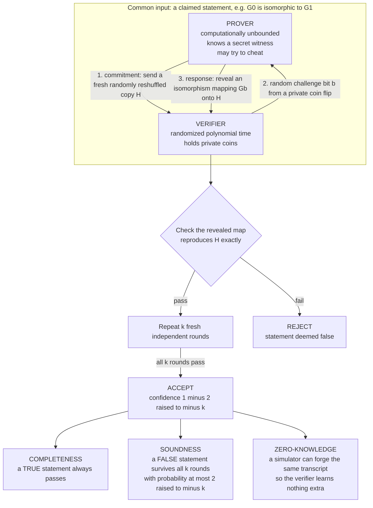

# 🎭 Interactive Proofs and Zero-Knowledge

> [!abstract] TL;DR
> An **interactive proof** replaces the [[The_Class_NP_and_Verification|static NP certificate]] with a **conversation**: an all-powerful but untrusted **Prover** tries to convince a skeptical, coin-flipping, polynomial-time **Verifier** that a statement is true, through a back-and-forth of messages. Two guarantees make it a proof — **completeness** (a true statement can always be argued successfully) and **soundness** (a false statement is exposed with high probability no matter how the prover lies). Adding **randomness and interaction** is stunningly powerful: the class **IP** of everything provable this way equals **PSPACE** (Shamir, 1992) — vastly beyond NP's reach. Interaction also enables **zero-knowledge proofs** (Goldwasser–Micali–Rackoff), where the verifier becomes convinced a statement is true while learning *nothing else whatsoever* — the mathematical engine behind [[Zero_Knowledge_Proofs|zk-SNARKs, zk-STARKs]], privacy coins, rollups, and password-free authentication.

---

## Intuition

**Analogy first.** Imagine two ways to be convinced of a claim. The **NP way** is reading a **static written proof**: someone hands you a finished document, you check every line, and if it holds you are convinced. It is a monologue — the proof cannot adapt, and you cannot probe it. The **interactive way** is a **courtroom cross-examination**: a witness (the Prover) claims something, and instead of accepting a prepared statement, a skeptical lawyer (the Verifier) fires **unpredictable, randomly chosen questions**. A truthful witness answers every question consistently forever. A liar might dodge one question, but the *randomness* of which question comes next means a lie eventually contradicts itself — and the more questions asked, the closer to certainty the lawyer gets that the witness is honest.

Two twists make this magical. First, the interrogation can convince you of things **no short written proof could** — such as "these two graphs are *not* isomorphic," a claim with no obvious compact certificate. Second, a clever witness can answer so carefully that the lawyer ends up **certain the claim is true yet learns nothing else at all** — not even *why* it is true. That is **zero-knowledge**: convincing without revealing. The rest of this note makes both twists precise.

---

## How It Works

### Core Mechanics

An **interactive proof system** for a language `L` is a protocol between two parties on a shared input `x`:

1. **The Prover `P`** is **computationally unbounded** (think infinite compute) but **untrusted** — it *wants* the verifier to accept and may lie arbitrarily.
2. **The Verifier `V`** runs in **randomized polynomial time**. It has a private source of **random coins** the prover cannot predict, and it decides at the end whether to **accept** or **reject**.

They exchange a polynomial number of messages, alternating. `V` uses its coins to send **unpredictable challenges**; `P` responds; finally `V` outputs a verdict. The system *proves* membership in `L` when:

- **Completeness** — if `x ∈ L` (statement true), the honest prover makes `V` accept with high probability, say `≥ 2/3`. *Truth can always be argued.*
- **Soundness** — if `x ∉ L` (statement false), then **for every** cheating prover strategy `P*`, `V` accepts with only small probability, say `≤ 1/3`. *No lie survives scrutiny.* The gap between `2/3` and `1/3` is amplified toward certainty by **repetition**: run `k` independent rounds and the soundness error drops to roughly `2^{-k}`.

**Both ingredients are essential.** Strip out the verifier's randomness and interaction collapses back to a single static certificate — you recover exactly **NP** (a deterministic verifier gains nothing from talking, since it could predict every question). Strip out interaction but keep randomness and you get **MA**/Arthur–Merlin, still close to NP. Only **randomness *and* interaction together** unlock the full power. The private, unpredictable coins are what a cheating prover cannot prepare for.

**IP = PSPACE (Shamir, 1992).** The headline theorem: the class **IP** of all languages with interactive proofs equals **PSPACE**, the problems solvable with polynomial *memory* (see [[Time_and_Space_Complexity]]). This is astonishing — interactive proofs can efficiently verify claims believed to sit far above NP and the [[P_versus_NP|polynomial hierarchy]]. The proof technique is **arithmetization**: a Boolean formula is lifted into a **low-degree polynomial** over a finite field, and the verifier pins the prover down with the **sumcheck protocol**, asking for the polynomial's value at random field points. A lying prover would need two different low-degree polynomials to agree at a random point — which they almost never do, since low-degree polynomials that differ disagree almost everywhere. That single algebraic fact is the whole source of soundness.

**Verifying "NO" answers.** The classic surprise is **Graph Non-Isomorphism**: proving two graphs are *different* looks like a co-NP claim with no short certificate. Interactively it is easy — the verifier secretly picks one of the two graphs at random, scrambles it, and challenges the prover to say *which original it came from*. If the graphs are truly non-isomorphic, an all-powerful prover always identifies the source correctly; if they were secretly isomorphic, the scrambled copy is statistically identical either way and the prover can only *guess*, caught with probability `1/2` per round.

### Zero-Knowledge

An interactive proof is **zero-knowledge** if the verifier finishes **convinced the statement is true but having learned nothing beyond that bare fact** — in particular, nothing that would help it convince someone else. The definition is the **simulation paradigm**: a protocol leaks zero knowledge if there exists an efficient **Simulator** that, *without ever talking to the real prover and without knowing the secret*, can fabricate transcripts **statistically indistinguishable** from real ones. If a machine could have produced the conversation *by itself*, the conversation taught it nothing. Under the assumption that **one-way functions exist** (the same foundation as modern [[Asymmetric_Cryptography_and_PKI|public-key cryptography]]), **every NP statement has a zero-knowledge proof** (Goldreich–Micali–Wigderson) — you can prove you know a solution without revealing a single bit of it.

### Flow / Architecture



---

## Key Concepts

### Secondary (intuitive)
- A **proof used to be a static document** you read and check. An interactive proof is a **live interrogation** — the verifier keeps asking fresh random questions.
- **Completeness** = an honest prover telling the truth always passes. **Soundness** = a liar gets caught, and each extra round of questions roughly *halves* their chance of slipping through.
- **Randomness is the secret weapon:** because the prover cannot guess the next question, it cannot pre-script a consistent lie.
- **Zero-knowledge** = convincing someone a claim is true while telling them *nothing else* — like proving you know a password without ever typing it.
- The friendly picture is the **Ali Baba cave**: a ring-shaped cave with a magic door. You prove you know the secret word by always coming out of the side the verifier randomly names — impossible without the word, yet the watcher never hears the word.

### Undergraduate (formal)
- **The class IP.** `L ∈ IP` if there is a polynomial-time randomized verifier `V` such that: *(completeness)* `x ∈ L ⇒ Pr[V accepts] ≥ 2/3` with the honest prover, and *(soundness)* `x ∉ L ⇒ Pr[V accepts] ≤ 1/3` against **every** prover. Constants amplify to `1 − 2^{-k}` and `2^{-k}` by independent repetition.
- **Where NP fits.** NP is the special case of a **deterministic** verifier and a **single** prover message — the certificate. `NP ⊆ IP`, and `IP` is believed strictly larger. `BPP ⊆ IP` too (the verifier can just ignore the prover).
- **Arthur–Merlin (AM).** Interactive proofs where the verifier's coins are **public** (the prover sees them). Surprisingly, public and private coins yield essentially the same power (Goldwasser–Sipser), and constant-round AM sits low in the polynomial hierarchy.
- **IP = PSPACE.** The full theorem. `IP ⊆ PSPACE` because a polynomial-space machine can compute the optimal prover's acceptance probability by recursion over the game tree; `PSPACE ⊆ IP` by arithmetizing a PSPACE-complete problem (**TQBF**, true quantified Boolean formulas) and running **sumcheck**.
- **Zero-knowledge, three flavors.** *Perfect* ZK (simulator's transcripts are identically distributed), *statistical* ZK (negligibly close), and *computational* ZK (indistinguishable to any polynomial-time observer). Computational ZK for all of NP needs **one-way functions**, which power **bit-commitment** (see [[Commitment_Schemes]]).

### Graduate (deep)
- **Arithmetization and sumcheck.** Replace a Boolean formula `φ` on `n` variables by a multilinear polynomial `p̃` over a large field `F`. To verify `Σ_{x ∈ {0,1}^n} p̃(x) = C`, the sumcheck protocol strips one variable per round: the prover sends a **univariate low-degree polynomial**, the verifier checks a consistency equation and challenges at a **random field element**. Soundness rests on **Schwartz–Zippel**: two distinct degree-`d` polynomials agree at a random point with probability `≤ d/|F|`. The verifier does `O(n)` field operations while the prover shoulders the exponential work — the template for all modern succinct proofs.
- **Multi-prover interactive proofs and MIP = NEXP.** Allow **two or more provers** who cannot communicate with each other (like isolated suspects interrogated separately). Their inability to coordinate lets the verifier **cross-check** answers, and the power leaps to **MIP = NEXP** (Babai–Fortnow–Lund, 1991) — nondeterministic *exponential* time.
- **The PCP theorem — proofs you barely read.** `NP = PCP[O(log n), O(1)]`: every NP statement has a **probabilistically checkable proof** that a verifier accepts or rejects by reading only a **constant number of randomly chosen bits**, using `O(log n)` coins. A single wrong bit anywhere is detected with constant probability. The PCP theorem is a scaled-down, non-interactive descendant of MIP = NEXP and is the foundation of **hardness of approximation** — showing many optimization problems cannot even be approximated well unless P = NP.
- **The philosophical shift.** These results redefine "proof." A proof need not be a static text read in full; it can be an **interactive, probabilistic, spot-checkable, knowledge-controlled process**. Correctness becomes a matter of overwhelming statistical confidence, not line-by-line certainty, and *what a proof reveals* becomes a tunable parameter — one of the deepest conceptual advances in theoretical computer science, and the one that made modern verifiable and private computation possible.

---

## Python Demo

We simulate the **Graph-Isomorphism zero-knowledge protocol** (Goldreich–Micali–Wigderson). Each round, the prover commits to a **random relabeling `H`** of one graph, the verifier flips a **private coin `b`**, and the prover must exhibit an isomorphism from `G_b` onto `H`. An **honest prover who knows the secret** answers every challenge and always passes (**completeness**). A **cheating prover** trying to fool the verifier on a *false* statement (two non-isomorphic graphs) can prepare for only one value of `b`, so it is **caught with probability ≥ 1/2 per round** — after `k` rounds its survival probability is `2^{-k}` (**soundness**). We also build the **Simulator** that forges transcripts *without the secret* to show the verifier **learns nothing**. `numpy` / `matplotlib` only.

```python
# =====================================================================
# Graph-Isomorphism ZERO-KNOWLEDGE proof (Goldreich-Micali-Wigderson).
#   COMPLETENESS : honest prover (knows secret sigma) always passes.
#   SOUNDNESS    : cheater on a FALSE claim survives k rounds w.p. 2^-k.
#   ZERO-KNOWLEDGE: a simulator with NO secret forges identical transcripts.
# =====================================================================
import numpy as np
import matplotlib.pyplot as plt

rng = np.random.default_rng(7)

# ---- permutation helpers --------------------------------------------
def random_perm(n):
    return rng.permutation(n)

def relabel(A, perm):
    """Return adjacency of the graph with vertex v renamed to perm[v]:
       B[perm[u], perm[v]] = A[u, v]."""
    inv = np.argsort(perm)
    return A[np.ix_(inv, inv)]

def compose(pi, sigma):
    """(pi after sigma)[v] = pi[sigma[v]]."""
    return pi[sigma]

def random_graph(n, p):
    U = (rng.random((n, n)) < p).astype(int)
    A = np.triu(U, 1)
    return A + A.T                      # symmetric, zero diagonal

# ---- build the common input -----------------------------------------
n = 12
G0 = random_graph(n, 0.45)
sigma = random_perm(n)                  # the PROVER's secret witness
G1_iso = relabel(G0, sigma)            # TRUE statement:  G0 ~= G1_iso
# A genuinely NON-isomorphic partner (different edge count => no iso):
G1_diff = random_graph(n, 0.75)
assert G1_diff.sum() != G0.sum()       # distinct edge counts => not isomorphic

# ---- ONE round of the protocol --------------------------------------
def honest_round(G0, G1, secret):
    """Prover KNOWS secret with relabel(G0, secret) == G1."""
    pi = random_perm(n)
    H  = relabel(G1, pi)               # 1. commitment
    b  = rng.integers(2)              # 2. verifier's private coin
    tau = pi if b == 1 else compose(pi, secret)   # 3. response
    return np.array_equal(relabel(G0 if b == 0 else G1, tau), H)  # verifier check

def cheating_round(G0, G1):
    """Cheater does NOT know any isomorphism (there is none). It gambles:
       prepares H matched to a guessed challenge g; wins only if b == g."""
    g  = rng.integers(2)             # guess which challenge it can answer
    pi = random_perm(n)
    H  = relabel(G1 if g == 1 else G0, pi)
    b  = rng.integers(2)             # verifier's independent coin
    if b == g:
        tau = pi                       # prepared answer works
    else:
        tau = random_perm(n)           # forced to bluff -> fails the check
    return np.array_equal(relabel(G0 if b == 0 else G1, tau), H)

# ---- Part A: completeness vs soundness over k rounds ----------------
trials = 4000
ks = np.arange(1, 13)
honest_pass, cheat_pass = [], []
for k in ks:
    hp = np.mean([all(honest_round(G0, G1_iso, sigma) for _ in range(k))
                  for _ in range(trials)])
    cp = np.mean([all(cheating_round(G0, G1_diff) for _ in range(k))
                  for _ in range(trials)])
    honest_pass.append(hp)
    cheat_pass.append(cp)

honest_pass = np.array(honest_pass)
cheat_pass  = np.array(cheat_pass)
print("k :  honest-pass   cheater-survives   theory 2^-k")
for k, hp, cp in zip(ks, honest_pass, cheat_pass):
    print(f"{k:2d} :   {hp:6.3f}       {cp:8.4f}        {2.0**-k:8.4f}")

# ---- Part B: ZERO-KNOWLEDGE -- simulator needs NO secret ------------
def real_transcript():
    pi = random_perm(n); b = rng.integers(2)
    H  = relabel(G1_iso, pi)
    tau = pi if b == 1 else compose(pi, sigma)
    return H, b, tau
def sim_transcript():
    b = rng.integers(2); tau = random_perm(n)     # pick answer FIRST
    H = relabel(G0 if b == 0 else G1_iso, tau)     # then fit H to it -- no sigma
    return H, b, tau

feat = lambda t: int(t[0][0].sum())                # a scalar feature of H
real_feats = np.array([feat(real_transcript()) for _ in range(20000)])
sim_feats  = np.array([feat(sim_transcript())  for _ in range(20000)])

# ---- Plot -----------------------------------------------------------
fig, (ax1, ax2) = plt.subplots(1, 2, figsize=(13, 5))

ax1.semilogy(ks, cheat_pass, "s-", color="tab:red",
             label="cheater survives (empirical)")
ax1.semilogy(ks, 2.0**-ks.astype(float), "k--",
             label="soundness error 2^-k (theory)")
ax1.semilogy(ks, np.clip(honest_pass, 1e-4, 1), "o-", color="tab:green",
             label="honest prover passes (completeness = 1)")
ax1.set_xlabel("number of rounds k")
ax1.set_ylabel("probability verifier ACCEPTS (log scale)")
ax1.set_title("Soundness: a false claim is exposed as 2^-k")
ax1.legend(); ax1.grid(True, which="both", alpha=0.3)

bins = np.arange(real_feats.min(), real_feats.max() + 2) - 0.5
ax2.hist(real_feats, bins=bins, density=True, alpha=0.6,
         color="tab:blue", label="REAL transcripts (prover knows secret)")
ax2.hist(sim_feats, bins=bins, density=True, histtype="step", lw=2.2,
         color="tab:orange", label="SIMULATED (no secret used)")
ax2.set_xlabel("feature of committed graph H (degree of label 0)")
ax2.set_ylabel("probability")
ax2.set_title("Zero-knowledge: real vs forged transcripts coincide")
ax2.legend()

plt.tight_layout()
plt.savefig("interactive_proofs_zk.png", dpi=120)
print("\nSaved interactive_proofs_zk.png")
```

**What it shows.** The left panel is the punchline of **soundness**: the honest prover on a *true* statement passes every round (green line pinned at probability 1 — completeness), while a cheating prover on a *false* statement sees its survival probability crash along the dashed `2^{-k}` line — by 10 rounds a liar slips through fewer than once in a thousand attempts, and the verifier's confidence is `1 − 2^{-k}`. The right panel demonstrates **zero-knowledge**: transcripts produced by the real prover (who *knows* the secret `sigma`) and by a simulator that **never uses any secret** have **identical distributions**. Since the verifier could have generated the whole conversation by itself, it extracts **zero** information beyond the statement's truth.

---

## Real-World Applications

> **Example — zk-Rollups scaling Ethereum.** A [[Zero_Knowledge_Proofs|validity rollup]] (zkSync, Polygon zkEVM, Scroll, StarkNet) executes thousands of transactions off-chain, then posts a single **succinct non-interactive proof** — a **zk-SNARK** (a few hundred bytes) or **zk-STARK** (tens of KB) — that the new blockchain state is the correct result of valid execution. Ethereum's on-chain verifier checks the proof in milliseconds *without re-running a single transaction*. This is interactive-proof theory made non-interactive via the Fiat–Shamir transform: arithmetization plus sumcheck-style polynomial checks give **completeness and soundness**, delivering 100x–1000x throughput while inheriting layer-1 security.

- **Privacy coins and confidential transactions.** Zcash uses zk-SNARKs so a user can prove "this transaction is valid and balances" while hiding sender, receiver, and amount — soundness stops forgery, zero-knowledge preserves privacy.
- **Verifiable / delegated computation.** Hand a heavy computation to an untrusted cloud and receive a tiny proof it was done correctly; you verify far more cheaply than recomputing — the direct payoff of `IP` and the PCP theorem.
- **Identification and authentication.** Zero-knowledge identification (Fiat–Shamir, Schnorr) proves you hold a secret key **without transmitting it**, so an eavesdropper or a phishing server learns nothing reusable — the modern successor to password exchange, related to challenge-response in [[Asymmetric_Cryptography_and_PKI|PKI]].
- **Hardness of approximation.** The PCP theorem is the tool that proves problems like MAX-3SAT, Clique, and Set-Cover are **NP-hard even to approximate**, guiding where to stop looking for good approximation algorithms.
- **Signatures from proofs.** Many post-quantum and threshold signature schemes are literally **non-interactive zero-knowledge proofs** of knowledge of a secret, built on [[Commitment_Schemes|commitments]] and hash functions ([[Hash_Functions_and_MACs]]).

---

## Common Pitfalls

- **"Interactive proofs are just NP with chat."** No — without the verifier's **private randomness**, interaction adds nothing and you get exactly NP. It is randomness *and* interaction *together* that lift `IP` all the way to **PSPACE**. Removing either collapses the power.
- **Confusing completeness with soundness.** Completeness protects the *honest prover on a true statement* (it should be accepted); soundness protects the *verifier against a lying prover on a false statement*. Repetition shrinks the **soundness** error toward zero; it does not "improve" completeness of a true claim, which is already high.
- **Thinking zero-knowledge means the verifier learns nothing at all.** The verifier *does* learn the one intended bit — that the statement is **true**. Zero-knowledge means it learns **nothing *beyond*** that — in particular nothing that lets it re-prove the claim or extract the witness. "Nothing extra," not "nothing."
- **Assuming zero-knowledge is free.** Computational ZK for all NP **requires one-way functions** (hence commitments). Drop that assumption and the guarantee can vanish. ZK is a cryptographic result, not a purely combinatorial one.
- **Reusing randomness / replaying a transcript.** Soundness assumes **fresh, independent** challenges each round and that the prover **commits before** seeing the coin. Let the prover peek at the challenge first, or reuse coins, and a cheater passes trivially. Commit-then-challenge ordering is load-bearing.
- **Believing a single round is convincing.** One round of the graph protocol lets a liar through **half** the time. Soundness is a *statistical* guarantee that only becomes overwhelming after enough independent rounds — `2^{-k}`, not `0`.
- **Forgetting provers in MIP cannot communicate.** The extra power of MIP = NEXP relies entirely on the provers being **isolated**; let them talk and it collapses back to a single-prover system.

---

## Related Concepts

- [[The_Class_NP_and_Verification]] — the static-certificate baseline; interactive proofs generalize NP's single fixed proof into a randomized, adaptive conversation, and `NP ⊆ IP`.
- [[Time_and_Space_Complexity]] — defines **PSPACE**, the polynomial-*memory* class that `IP` exactly equals by Shamir's theorem, placing interactive proofs far above NP.
- [[P_versus_NP]] — interactive proofs sidestep the find-vs-check question by letting an unbounded prover do the finding while a cheap verifier checks; the PCP theorem descends from this line and drives hardness-of-approximation.
- [[NP_Completeness_and_the_Cook_Levin_Theorem]] — SAT/3-SAT are the canonical NP problems that the PCP theorem re-encodes as spot-checkable proofs.
- [[Reductions_and_NP_Complete_Problems]] — the reduction machinery that, combined with PCP, transfers *inapproximability* across optimization problems.
- [[Theory_of_Computation_Overview]] — situates `IP`, `PSPACE`, and the proof hierarchy within the broader computability and complexity landscape.
- [[Zero_Knowledge_Proofs]] — the applied blockchain view: zk-SNARKs, zk-STARKs, PLONK, and zkEVMs that turn this theory into succinct on-chain proofs.
- [[Commitment_Schemes]] — bit-commitment is the cryptographic primitive that implements the prover's "seal it before the challenge" step enabling zero-knowledge for all NP.
- [[Multi_Party_Computation]] — the GMW zero-knowledge result is a direct ancestor of secure multi-party computation protocols.
- [[Asymmetric_Cryptography_and_PKI]] — the one-way-function / hardness assumptions underpinning computational zero-knowledge and ZK-based identification.
- [[Hash_Functions_and_MACs]] — collision-resistant hashes realize commitments and the Fiat–Shamir transform that makes interactive proofs non-interactive.

---

## Review Questions

1. **(Conceptual)** Explain precisely why **both** randomness and interaction are necessary for `IP` to exceed `NP`. What class do you recover if the verifier is deterministic, and what if the verifier is randomized but the prover sends only one message? Use the graph non-isomorphism protocol to illustrate what randomness buys you.
2. **(Scenario)** You are handed two graphs `G0` and `G1` and must convince a skeptical, polynomial-time verifier that they are **not** isomorphic — a claim with no obvious short certificate. Design the interactive protocol, argue completeness and soundness, and state exactly the per-round probability with which a cheating prover (whose graphs are secretly isomorphic) is caught. How many rounds drive the soundness error below `10^{-6}`?
3. **(Trade-off)** A cloud service offers to run an expensive computation and return either (a) the full execution transcript for you to re-check, or (b) a zk-SNARK proving the result is correct while revealing nothing about intermediate values. Discuss the trade-offs in verifier cost, trust assumptions, and information leakage. Which complexity-theoretic results (`IP = PSPACE`, the PCP theorem, zero-knowledge for NP) justify that option (b) is even possible, and what cryptographic assumption does the zero-knowledge property rely on?

---

## Sources

- Goldwasser, S., Micali, S., & Rackoff, C. "The Knowledge Complexity of Interactive Proof Systems." *SIAM Journal on Computing*, 18(1), 1989 — the paper that introduced interactive proofs and zero-knowledge. [https://dl.acm.org/doi/10.1137/0218012](https://dl.acm.org/doi/10.1137/0218012)
- Shamir, A. "IP = PSPACE." *Journal of the ACM*, 39(4), 1992 — the theorem that interactive proofs capture all of PSPACE. [https://dl.acm.org/doi/10.1145/146585.146609](https://dl.acm.org/doi/10.1145/146585.146609)
- Goldreich, O., Micali, S., & Wigderson, A. "Proofs that Yield Nothing But Their Validity, or All Languages in NP Have Zero-Knowledge Proof Systems." *Journal of the ACM*, 38(3), 1991. [https://dl.acm.org/doi/10.1145/116825.116852](https://dl.acm.org/doi/10.1145/116825.116852)
- Arora, S., & Barak, B. *Computational Complexity: A Modern Approach*, Chs. 8 (Interactive Proofs) and 11 (PCP Theorem and Hardness of Approximation). [https://theory.cs.princeton.edu/complexity/](https://theory.cs.princeton.edu/complexity/)
- Quisquater, J.-J., & Guillou, L. "How to Explain Zero-Knowledge Protocols to Your Children." *CRYPTO 1989* — the Ali Baba cave analogy. [https://link.springer.com/chapter/10.1007/0-387-34805-0_60](https://link.springer.com/chapter/10.1007/0-387-34805-0_60)

---

#theory-of-computation #interactive-proofs #zero-knowledge #ip-pspace #cryptography
