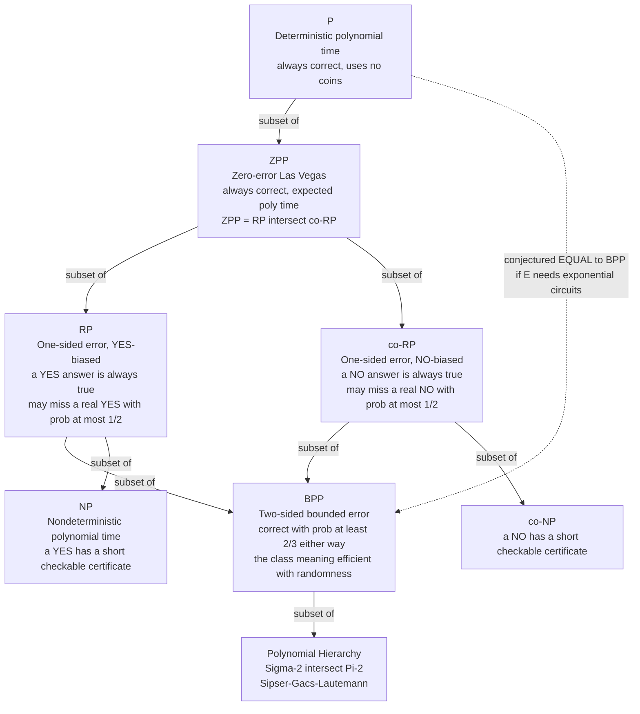

# 🎲 Randomized Complexity Classes

> [!abstract] TL;DR
> Treat **randomness as a computational resource** — a Turing machine that can flip coins — and a new tier of complexity classes appears *between* P and NP. **RP** allows *one-sided* error (a "yes" is always true, but a real "yes" might be missed); **co-RP** is its mirror; **BPP** allows *two-sided bounded* error and is the class most people mean by "efficiently solvable with randomness"; **ZPP** is the *zero-error* class of Las Vegas algorithms that are always correct but run in *expected* polynomial time, and equals **RP ∩ co-RP**. The load-bearing fact is **probability amplification**: independent repetition plus a majority/any vote drives the error *exponentially* toward zero (Chernoff bound), so the exact error constant in BPP is irrelevant. The containment chain is **P ⊆ ZPP ⊆ RP ⊆ BPP**, with **RP ⊆ NP** and **BPP** inside the polynomial hierarchy. The modern shock is the **derandomization** conjecture: most complexity theorists now believe **BPP = P** — that for *decision* problems randomness adds *no* power — provably so if hard functions exist (the hardness-vs-randomness paradigm).

---

## Intuition

**Analogy — the coin-flipping food inspector.** A deterministic inspector must taste *every* dish on a thousand-plate buffet to certify it safe — exhaustive, slow, and an adversarial caterer can arrange the plates to be maximally awkward. A **randomized inspector** instead grabs a *random handful* of plates and tastes those. One random sample gives only a *probabilistic* verdict — maybe a rare bad plate slips through — but the inspector can simply **repeat the sampling**. Each independent round is another roll of the dice against the bad plates, and the chance that *every* round misses them shrinks geometrically: two rounds, four, ten — and the residual error is smaller than the chance of a meteor hitting the kitchen. The inspector never eliminates error entirely, but can drive it **as low as any auditor demands**, cheaply, without ever knowing how the caterer arranged the plates.

That is the whole thesis of this note. **Coins can make an algorithm simpler, faster, and immune to worst-case inputs, in exchange for a controllable sliver of error.** Because the error can be repeated away, the *size* of the sliver barely matters — one-third is as good as one-billionth once you are allowed to repeat. The deep question that follows is whether the coins bought anything *fundamental*, or whether a clever deterministic method could always simulate them.

---

## How It Works

### Core mechanics

**1. The model: a Turing machine with a coin.** A *probabilistic Turing machine* is an ordinary machine plus access to a stream of fair random bits (equivalently, at each step it may branch on a coin flip). On a fixed input it no longer has *one* computation but a *probability distribution* over computations. A language is decided by such a machine if, for every input, the machine outputs the correct yes/no answer *with sufficiently high probability* — where "sufficiently high" is exactly what distinguishes the classes below. Runtime is still bounded by a polynomial in the input size, so these are the *efficient* randomized classes. (Contrast this with resource-bounded *deterministic* computation in [[Time_and_Space_Complexity]].)

**2. Two ways to spend randomness — Monte Carlo vs Las Vegas.** This is the same split as in [[Randomized_Algorithms]], now made into complexity classes:

- **Monte Carlo** — *fixed* (polynomial) running time, output *may be wrong* with bounded probability. This is the flavor of RP, co-RP, and BPP.
- **Las Vegas** — output is *always correct*, but the running time is a random variable with *polynomial expectation*. This is the flavor of ZPP.

**3. The four classes, by error type.** Everything hinges on *which way* the machine is allowed to be wrong and by how much.

| Class | Error type | Formal promise for a machine deciding language L |
|---|---|---|
| **RP** | one-sided, "yes"-biased | if x ∈ L, accepts with prob ≥ 1/2; if x ∉ L, **always** rejects |
| **co-RP** | one-sided, "no"-biased | if x ∉ L, rejects with prob ≥ 1/2; if x ∈ L, **always** accepts |
| **BPP** | two-sided, bounded | correct answer with prob ≥ 2/3, whichever way; error is bounded *away* from 1/2 on **both** sides |
| **ZPP** | zero error | **always** correct; expected running time is polynomial (may occasionally output "don't know" and retry) |

The one-sided classes are precious because a machine in RP *never lies when it says yes*: a single "yes" is a **proof**. If it says "no", that is only "probably no", curable by repetition. co-RP is the exact mirror. BPP relaxes this to allow error on *both* sides, which is why it needs a *majority* vote rather than an *any* vote to amplify.

**4. Probability amplification — why the constant does not matter.** The reason "≥ 1/2" and "≥ 2/3" are not fussy magic numbers is that any noticeable gap can be **amplified exponentially**:

- **One-sided (RP/co-RP): the "any" vote.** Run the machine k independent times. Because a "yes" is never wrong, output "yes" if *any* run says yes. A true "yes" is missed only if *all* k runs miss it, probability ≤ (1/2)^k. Ten rounds already beats one-in-a-thousand; thirty rounds beats one-in-a-billion.
- **Two-sided (BPP): the majority vote.** Run k independent times and output the **majority** answer. Each run is a biased coin landing "correct" with probability p ≥ 2/3. The majority is wrong only if *most* runs happen to err — an event whose probability is crushed by the **Chernoff bound**: it decays like exp(−c·k) for a constant c > 0 that depends only on how far p sits above 1/2. Formally, error ≤ exp(−2k(p − 1/2)²).

The upshot: **the definitional error constant of BPP is cosmetic.** 2/3, 0.51, and 1 − 2^(−n) all define *the same class*, because a polynomial number of repetitions converts any of them into any other. This is why probability, concentration inequalities, and the [[Probability_Theory|law of large numbers]] sit at the technical heart of the field — see also [[Information_Theory_Overview]] on how independent samples accumulate certainty.

**5. The containments.** From the definitions:

- **P ⊆ ZPP** — a deterministic algorithm is a zero-error one that ignores its coins.
- **ZPP = RP ∩ co-RP** — a Las Vegas algorithm is exactly one that is *both* "yes"-sound and "no"-sound; run the RP and co-RP tests, and when they agree you have certainty, when they disagree you retry (expected polynomial time).
- **ZPP ⊆ RP ⊆ BPP** and **ZPP ⊆ co-RP ⊆ BPP** — weakening the guarantee enlarges the class.
- **RP ⊆ NP** — an RP machine's *accepting* random string is a polynomial-size **certificate** that x ∈ L, exactly the NP verifier picture. (co-RP ⊆ co-NP by symmetry.)
- **BPP ⊆ PH** — the **Sipser–Gács–Lautemann theorem** places BPP inside the *second level* of the polynomial hierarchy (Σ₂ ∩ Π₂), even though BPP is not known to be in NP. This is the best *unconditional* upper bound we have on BPP.

Whether any of these inclusions is *strict* — in particular whether **BPP = P** — is open, and is the subject of the derandomization program below.

**6. The derandomization revolution.** For decades randomness looked like genuine extra power. The modern consensus is the opposite: **BPP = P** is *widely believed to be true*. The reason is the **hardness-vs-randomness** paradigm. A **pseudorandom generator** (PRG) stretches a short truly-random seed into a long string that *no efficient test can distinguish* from true randomness. If such a generator exists that fools polynomial-time algorithms, then any BPP algorithm can be *fed pseudorandom coins from a short seed*, and the machine can *deterministically try all seeds* and take the majority — collapsing BPP into P. The landmark result of **Nisan–Wigderson** and then **Impagliazzo–Wigderson (1997)** makes this conditional but precise: *if the class E requires exponential-size circuits (a plausible circuit-lower-bound hardness assumption), then P = BPP.* In slogan form: **enough hardness in nature buys enough pseudorandomness to eliminate the need for real randomness.** Randomness, for *decision* problems, is probably a convenience, not a computational superpower.

### Flow / architecture



*Solid arrows are containments provable from the definitions. The dashed arrow is the derandomization conjecture: under plausible circuit-lower-bound hardness, the whole tower from P up to BPP collapses back onto P.*

---

## Key Concepts

**Secondary (intuition, no CS background needed)**
- **Coins as a resource** — an algorithm allowed to flip coins can be simpler and faster, at the cost of a tiny, controllable chance of a wrong answer.
- **Repeat to be sure** — running a randomized test several independent times and voting makes a mistake astronomically unlikely; each extra run roughly *multiplies* your confidence.
- **Two bargains** — either accept a fixed runtime with a small error (Monte Carlo), or demand a guaranteed-correct answer and accept a variable runtime (Las Vegas).

**Undergraduate (a first theory / algorithms course)**
- **RP, co-RP, BPP, ZPP** — the one-sided, two-sided, and zero-error probabilistic polynomial-time classes and their promise conditions.
- **ZPP = RP ∩ co-RP** — Las Vegas is exactly the intersection of the two one-sided Monte Carlo classes.
- **Amplification** — "any" vote for one-sided error (error ≤ (1/2)^k), "majority" vote for two-sided error (Chernoff decay); the error constant is definition-irrelevant ([[Probability_Theory]]).
- **The chain P ⊆ ZPP ⊆ RP ⊆ BPP and RP ⊆ NP** — and why an accepting random string is an NP certificate.
- **Monte Carlo vs Las Vegas** — the applied face of these classes ([[Randomized_Algorithms]], [[Miller_Rabin_Primality]]).

**Graduate (advanced complexity)**
- **Sipser–Gács–Lautemann: BPP ⊆ Σ₂ ∩ Π₂** — the strongest unconditional upper bound; BPP is "close to" NP without being known inside it.
- **Hardness vs randomness** — Nisan–Wigderson pseudorandom generators built from hard functions; Impagliazzo–Wigderson "E ⊄ SIZE(2^εn) ⟹ P = BPP".
- **Pseudorandom generators fooling efficient tests** — the object that trades a circuit lower bound for derandomization; deep links to [[Kolmogorov_Complexity_and_Algorithmic_Information]] and to cryptographic PRGs ([[Symmetric_Encryption]]).
- **Promise problems and the BPP-vs-P question** — why BPP is a *semantic* (promise) class with no known complete problem.
- **Polynomial identity testing (PIT)** — the flagship problem in co-RP with no known deterministic polynomial algorithm; derandomizing it would imply circuit lower bounds (Kabanets–Impagliazzo).

---

## Python Demo

```python
# Probability amplification: turning a barely-better-than-a-coin randomized
# test into an arbitrarily reliable one by INDEPENDENT REPETITION + voting.
#
# We show TWO real amplification stories on one log-scale plot:
#
#   (A) BPP-style, TWO-SIDED error, MAJORITY vote.
#       A decision procedure that returns the correct answer with prob p = 2/3
#       on each independent run (it can err in EITHER direction -- the defining
#       BPP promise). We run it k times (k odd) and output the majority. The
#       error collapses like a binomial tail -> exponentially in k (Chernoff).
#
#   (B) RP/co-RP-style, ONE-SIDED error, ANY vote.
#       A REAL algorithm: Schwartz-Zippel POLYNOMIAL IDENTITY TESTING over the
#       field Z_p. To decide whether a polynomial is the ZERO polynomial we
#       evaluate it at a random point: if it is identically zero every eval is 0
#       (NEVER a false "nonzero" -> one-sided), while a nonzero degree-d poly has
#       <= d roots, so a random point misses with prob >= 1 - d/p. Repeat k
#       times and declare NONZERO if ANY eval is nonzero: error <= (d/p)^k.
#
# numpy / matplotlib only (math.comb is Python stdlib, used for the exact tail).

from math import comb
import numpy as np
import matplotlib.pyplot as plt

rng = np.random.default_rng(0)
ks = np.arange(1, 42, 2)          # odd repetition counts: 1, 3, 5, ..., 41

# ===========================================================================
# (A) TWO-SIDED BPP amplification by MAJORITY vote
# ===========================================================================
p = 2 / 3                         # per-run probability of being CORRECT
N = 100_000                       # independent instances simulated per k

emp_majority_err = []
for k in ks:
    draws = rng.random((N, k)) < p          # True where that run was correct
    correct_counts = draws.sum(axis=1)
    majority_wrong = correct_counts <= (k // 2)   # need > k/2 correct to win
    emp_majority_err.append(majority_wrong.mean())
emp_majority_err = np.array(emp_majority_err)

def majority_error_exact(k, p):
    """Exact P[majority of k biased coins is WRONG] = lower binomial tail."""
    return sum(comb(k, i) * p**i * (1 - p)**(k - i) for i in range(0, k // 2 + 1))

exact_majority_err = np.array([majority_error_exact(int(k), p) for k in ks])
chernoff_bound = np.exp(-2 * ks * (p - 0.5) ** 2)   # Hoeffding upper bound

# ===========================================================================
# (B) ONE-SIDED co-RP amplification by ANY vote (real Schwartz-Zippel PIT)
# ===========================================================================
P_FIELD = 31                      # prime field size
DEG = 10                          # polynomial degree -> single-round error <= 10/31 ~ 0.32
M = 4000                          # random nonzero polynomials sampled

# Vandermonde powers x^j mod P_FIELD, shape (DEG+1, P_FIELD)
xs = np.arange(P_FIELD)
powers = np.array([[pow(int(x), j, P_FIELD) for x in xs] for j in range(DEG + 1)])

coeffs = rng.integers(0, P_FIELD, size=(M, DEG + 1))
coeffs[:, DEG] = rng.integers(1, P_FIELD, size=M)     # force nonzero leading coeff
values = (coeffs @ powers) % P_FIELD                  # (M, P_FIELD) evaluations
root_frac = (values == 0).mean(axis=1)                # per-poly single-round error

# error after k independent random points, averaged over the random polynomials
pit_err = np.array([np.mean(root_frac ** k) for k in ks])
pit_bound = (DEG / P_FIELD) ** ks                     # worst-case Schwartz-Zippel bound

# ===========================================================================
# Report + plot
# ===========================================================================
print(f"{'k':>3} | {'BPP majority (emp)':>18} | {'BPP exact':>12} | {'PIT any-vote':>12}")
print("-" * 58)
for i, k in enumerate(ks):
    if k <= 15 or k % 10 == 1:
        print(f"{k:>3} | {emp_majority_err[i]:>18.2e} | "
              f"{exact_majority_err[i]:>12.2e} | {pit_err[i]:>12.2e}")

fig, ax = plt.subplots(figsize=(9, 6))
mask = emp_majority_err > 0        # log axis cannot show zeros
ax.semilogy(ks[mask], emp_majority_err[mask], "o", color="C0",
            label="BPP two-sided, majority vote (simulated)")
ax.semilogy(ks, exact_majority_err, "-", color="C0",
            label="BPP exact binomial tail")
ax.semilogy(ks, chernoff_bound, "--", color="C0", alpha=0.6,
            label="Chernoff / Hoeffding upper bound")
ax.semilogy(ks, pit_err, "s-", color="C3",
            label="co-RP polynomial identity test, any vote")
ax.semilogy(ks, pit_bound, ":", color="C3", alpha=0.7,
            label="Schwartz-Zippel bound (d/p)^k")

ax.axhline(1 / 3, color="gray", ls=":", alpha=0.7)
ax.text(1, 0.36, "start: ~1/3 error", color="gray", fontsize=9)
ax.set_xlabel("number of independent repetitions  k")
ax.set_ylabel("probability of a WRONG answer (log scale)")
ax.set_title("Probability amplification: error decays exponentially with repetitions")
ax.grid(True, which="both", ls=":", alpha=0.5)
ax.legend(fontsize=8)
plt.tight_layout()
plt.savefig("amplification.png", dpi=130)
print("\nSaved error-vs-repetitions plot to amplification.png")

# Takeaway: every curve starts near a coin-flip-ish ~1/3 error and plunges as a
# straight line on the log axis -> the error is EXPONENTIAL in k. That is why the
# error constant in BPP is irrelevant: a handful of repetitions makes a randomized
# algorithm as reliable as any deterministic one you could ever build.
```

Running it prints an error table and saves `amplification.png`. Both stories — the two-sided BPP majority vote and the real one-sided polynomial-identity test — start near a one-third error and become **straight descending lines on the log axis**, the visual signature of exponential decay. That single picture *is* the reason BPP's definitional constant is arbitrary: a few dozen repetitions push the error below any threshold you care to name.

---

## Real-World Applications

> **Example — Miller–Rabin and the fate of primality testing.** For decades, deciding whether a giant number is prime was done by the **Miller–Rabin** test, a one-sided (co-RP) Monte Carlo algorithm: a "composite" verdict is always correct because it exhibits a witness, while a "prime" verdict carries error ≤ 4^(−k) that repetition crushes ([[Miller_Rabin_Primality]]). This is *the* textbook randomized algorithm, and it powers RSA key generation in essentially every TLS library. Its punchline for this note: in 2002 **Agrawal–Kayal–Saxena** proved **PRIMES ∈ P** — a *deterministic* polynomial algorithm — showing that for this specific problem, randomness was a convenience that was eventually *derandomized away*, exactly as the BPP = P philosophy predicts.

Other places these classes govern real systems:

- **Cryptography needs both hardness and randomness.** Modern crypto is the *dual* of derandomization: it *wants* problems to be hard and *wants* real entropy. Stream ciphers are literally pseudorandom generators stretching a short key into a long keystream that no efficient adversary can distinguish from random ([[Symmetric_Encryption]]) — the same PRG object that, pointed the other way, derandomizes BPP.
- **Polynomial identity testing in verification.** Checking whether two circuits or symbolic expressions compute the same polynomial is done by evaluating at random points (Schwartz–Zippel). It underlies probabilistic checking of matrix products (Freivalds' algorithm), fingerprinting, and interactive-proof/SNARK verification. It remains the **flagship open derandomization problem**: no deterministic polynomial algorithm is known.
- **Randomized data structures and algorithms in practice.** Randomized [[Quick_Sort|quicksort]] and quickselect, universal and cryptographic [[Hash_Table_Fundamentals|hashing]] (random seeds to defeat hash-flooding), skip lists, treaps, Bloom filters, and count-min sketches all trade a controllable error or expected-time guarantee for simplicity and adversary resistance — see [[Randomized_Algorithms]].
- **Monte Carlo methods everywhere.** Physics simulation, numerical integration, Bayesian inference (MCMC), and reinforcement-learning rollouts are Monte Carlo estimators whose accuracy improves with more samples — the continuous-valued cousin of amplification.

---

## Common Pitfalls

- **Confusing one-sided with two-sided error.** For an RP/co-RP algorithm, *only one direction* can be wrong: Miller–Rabin's "composite" is certain, its "prime" is probabilistic. Amplify one-sided error with an **any** vote, never a majority vote — and know *which* side is the reliable one before you trust it.
- **Thinking BPP's constant is fragile.** Newcomers fret over "why 2/3?". It does not matter: any error bounded a *noticeable* amount below 1/2 (even 1/2 + 1/poly) amplifies to 1 − 2^(−poly). What is *not* allowed is error *equal to or converging to* 1/2 — that is the class PP, which is far larger and not considered efficient.
- **Assuming "randomized" means "more powerful than deterministic".** The prevailing belief is the reverse: **BPP = P** is probably true. Do not present randomness as a proven source of extra decision power; for *decision* problems it likely is not.
- **Ignoring where the randomness comes from.** Amplification assumes **independent** coin flips from a *true* random source. Reuse a predictable PRNG against an adaptive adversary and the independence — hence the exponential decay — evaporates. Cryptographic settings demand a cryptographically secure source.
- **Mixing up ZPP's guarantees.** A Las Vegas / ZPP algorithm is *never wrong*; its *running time* is the random variable, bounded only *in expectation*. Quoting "expected polynomial time" as a hard worst-case bound is the classic error — an unlucky run can be slow, it will just never be incorrect.
- **Believing derandomization is unconditional.** "BPP = P" is a *conjecture* resting on circuit-lower-bound hardness assumptions (Impagliazzo–Wigderson). We cannot yet *prove* it, precisely because proving strong circuit lower bounds is itself open. Do not state it as established fact.

---

## Related Concepts

- [[Time_and_Space_Complexity]] — the deterministic backbone (P, NP, PSPACE, the hierarchy theorems) that these probabilistic classes are wedged into and measured against.
- [[Theory_of_Computation_Overview]] — the parent map; randomized complexity is the branch that asks whether *coins* change what is efficiently computable.
- [[Randomized_Algorithms]] — the DSA-level treatment of Las Vegas vs Monte Carlo, reservoir sampling, and Fisher–Yates; the concrete algorithms that populate these classes.
- [[Miller_Rabin_Primality]] — the canonical co-RP Monte Carlo test, later derandomized into P by AKS — a living case study of the BPP = P story.
- [[Quick_Sort]] — random-pivot quicksort as the archetypal Las Vegas (ZPP-style) algorithm: always correct, expected O(n log n).
- [[Hash_Table_Fundamentals]] — randomized/universal hashing uses random seeds for adversary resistance, a practical use of the coins-as-resource idea.
- [[Time_Complexity_Classes]] — the applied growth-rate view that frames "polynomial time" as the tractability line these classes live on.
- [[Probability_Theory]] — the Chernoff/Hoeffding concentration machinery that makes amplification work.
- [[Kolmogorov_Complexity_and_Algorithmic_Information]] — the theory of "true" randomness and incompressibility underpinning what a pseudorandom generator must fool.
- [[Symmetric_Encryption]] — cryptographic PRGs are the same object as derandomizing PRGs, seen from the opposite side (crypto *wants* hardness and randomness).
- [[Information_Theory_Overview]] — how independent samples accumulate certainty; the information-theoretic view of why repetition amplifies.

---

## Review Questions

1. **(Foundational)** Using the coin-flipping food inspector analogy, explain why a single run of a randomized test gives only a probabilistic verdict, yet a handful of independent runs can make the error "smaller than a meteor hitting the kitchen." Why does the *starting* error rate (1/3 vs 0.49) barely change how many runs you ultimately need?
2. **(Undergraduate)** Precisely state the promise conditions of RP, co-RP, BPP, and ZPP. Prove that **ZPP = RP ∩ co-RP**, and explain why one-sided error is amplified with an "any" vote while two-sided error requires a "majority" vote. For Miller–Rabin, which side is the certain one, and which class does that put it in?
3. **(Graduate / trade-off)** The derandomization theorem states "if E requires exponential-size circuits, then P = BPP." Explain the hardness-vs-randomness intuition: how does a *hard function* yield a *pseudorandom generator*, and how does that generator let a deterministic machine simulate a BPP algorithm by trying all seeds? Given that polynomial identity testing sits in co-RP with no known deterministic polynomial algorithm, what would derandomizing it *cost* us to prove, and why does that make derandomization so hard?

---

## Sources

- Arora, S., Barak, B. *Computational Complexity: A Modern Approach*. Cambridge University Press, 2009 — Ch. 7 (randomized computation, RP/BPP/ZPP, Sipser–Gács–Lautemann) and Ch. 20–21 (derandomization, pseudorandom generators, hardness vs randomness).
- Sipser, M. *Introduction to the Theory of Computation*, 3rd ed. Cengage, 2013 — Section 10.2 on probabilistic algorithms, BPP, and the Miller–Rabin primality test.
- Motwani, R., Raghavan, P. *Randomized Algorithms*. Cambridge University Press, 1995 — the standard reference on Monte Carlo/Las Vegas algorithms and the analysis techniques (Chernoff bounds, Schwartz–Zippel).
- Impagliazzo, R., Wigderson, A. "P = BPP if E requires exponential circuits: Derandomizing the XOR Lemma." *STOC*, 1997 — the conditional collapse of BPP to P under a circuit-lower-bound hardness assumption.
- Nisan, N., Wigderson, A. "Hardness vs Randomness." *Journal of Computer and System Sciences*, 1994 — the pseudorandom-generator construction at the heart of derandomization.
- Agrawal, M., Kayal, N., Saxena, N. "PRIMES is in P." *Annals of Mathematics*, 2004 — the deterministic primality algorithm that derandomized Miller–Rabin.

---

#theory-of-computation #randomized-algorithms #bpp #derandomization #probabilistic
