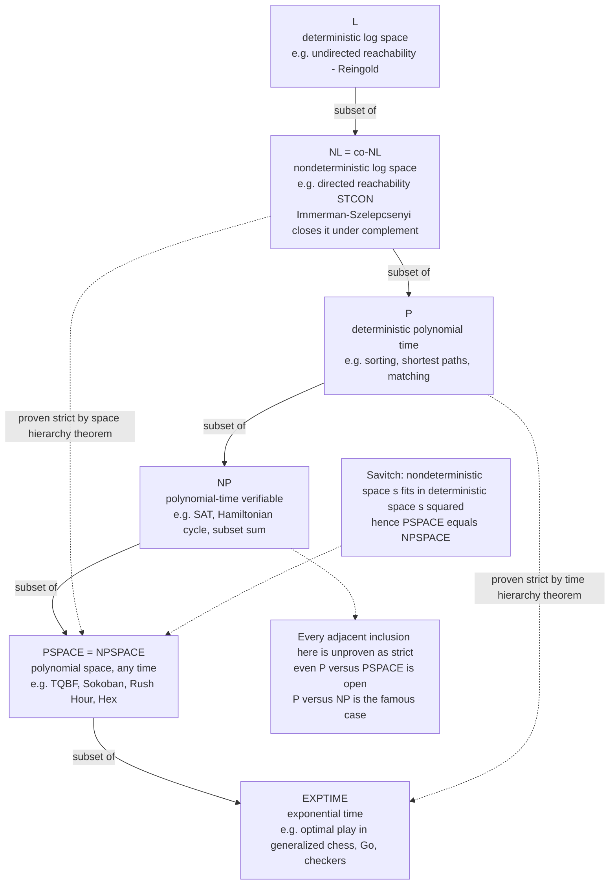

# 🧠 Space Complexity and PSPACE

> [!abstract] TL;DR
> **Space complexity** measures a computation by the **memory** it uses, not the time it spends — and the key asymmetry is that *memory can be reused while time cannot*. This makes the polynomial-space class **PSPACE** surprisingly vast: it contains **P** and **NP**, and captures the difficulty of **two-player games** and **puzzles**, whose "there exists a move such that for all replies…" structure (**alternation**) is exactly what a single-shot NP answer lacks. Two landmark results tame the space world where the time world stays mysterious: **Savitch's theorem** collapses nondeterministic into deterministic space (`PSPACE = NPSPACE`), and the **space hierarchy theorem** guarantees more memory buys more power. The canonical PSPACE-complete problem is **TQBF** — SAT with alternating `∀`/`∃` quantifiers — the space-world analogue of SAT.

---

## Intuition

**Analogy — the whiteboard versus the clock.** Imagine solving a giant logic puzzle at a single whiteboard. You have two very different resources:

- **Time** is the clock on the wall. Every second you spend is *gone forever*; you can never get it back.
- **Space** is the whiteboard. When a line of reasoning dead-ends, you **erase it and reuse the same square inches** for the next attempt. The board never fills up as long as you clean up behind yourself — even if you try *billions* of dead ends over many hours.

That single difference — **space is reusable, time is not** — is the whole personality of space complexity. A problem can take an astronomically long time yet still fit on a *small* whiteboard, because the board is wiped and rewritten again and again. **PSPACE** is the class of problems solvable on a whiteboard whose size grows only *polynomially* with the input — a "reasonable amount of scratch paper," even if the clock runs for exponentially long.

And PSPACE is powerful in a way that is easy to feel. Ask "**is there a satisfying assignment?**" (one existential guess) and you get **NP**. Ask "**does White have a winning strategy?**" and you must reason "*there exists* a White move such that *for all* Black replies, *there exists* a White move…" — a deep tower of alternating quantifiers. Walking that whole game tree takes exponential *time*, but a depth-first search only ever holds **one root-to-leaf path in memory at a time** — polynomial *space*. That is why deciding winners of generalized games and puzzles lands squarely in PSPACE: the game tree is enormous, but the whiteboard you explore it with stays small.

---

## How It Works

### Core Mechanics

**1. How space is measured — and why the input tape is free.** As in [[Time_and_Space_Complexity]], a problem is a language and we measure resources as a function of input length `n`. For space we use a Turing machine with a **read-only input tape** plus a separate **read/write work tape**, and count only the work-tape cells ever written. Ignoring the input tape is what makes **sub-linear** space meaningful: you cannot store the whole input, but you *can* keep a handful of pointers into it. That accounting choice is the birth of the log-space classes.

**2. The three space classes that matter.**

| Class | Space bound | What it means | Canonical / complete problem |
|---|---|---|---|
| **L** | `O(log n)` deterministic | room for a constant number of pointers/counters into the input | **undirected** graph reachability |
| **NL** | `O(log n)` nondeterministic | may *guess* the next pointer, verifying with log memory | **directed** graph reachability (`STCON`) — NL-complete |
| **PSPACE** | `n^k` deterministic | a polynomial-size whiteboard, reused for exponentially long | **TQBF** (quantified boolean formulas) — PSPACE-complete |

- **L** is astonishingly frugal — `O(log n)` bits is just enough to name a position in the input. **Reingold's theorem (2008)** proved the deep fact that **undirected reachability is in L**: you can decide whether two nodes are connected in an undirected graph using only logarithmic memory (via a derandomized "universal exploration" walk), settling that `L = SL`.
- **NL** lets the machine *nondeterministically guess* a path one vertex at a time, remembering only the current vertex and a step counter — so **directed** `s`-`t` reachability is the archetypal NL problem, and is **NL-complete** under log-space reductions.

**3. Immerman–Szelepcsényi — nondeterministic space is closed under complement.** A 1987 surprise (independently by Neil Immerman and Róbert Szelepcsényi) proved **`NL = co-NL`**: the complement of a directed-reachability question ("`t` is *not* reachable from `s`") is *also* solvable in nondeterministic log space, via an **inductive counting** trick that recomputes, level by level, exactly how many vertices are reachable. More generally `NSPACE(s) = co-NSPACE(s)` for `s ≥ log n`. This has no known time analogue — whether `NP = co-NP` is wide open — and it is the *first* hint that nondeterminism behaves very differently for space than for time.

**4. Savitch's theorem — nondeterminism is nearly free for space.** Savitch (1970) proved

$$\mathrm{NSPACE}(s(n)) \subseteq \mathrm{DSPACE}\big(s(n)^2\big),$$

so a nondeterministic machine using space `s` can be simulated *deterministically* using only `s²` space. The proof is a divide-and-conquer on the configuration graph: to check "can configuration `A` reach `B` in at most `2^k` steps," recurse on "is there a midpoint `M` such that `A` reaches `M` in `2^(k-1)` and `M` reaches `B` in `2^(k-1)`," reusing the *same* space for each half. The recursion is `k = O(s)` deep and each frame stores one configuration of size `O(s)`, giving `O(s²)` total. Setting `s = poly(n)` yields the headline result:

$$\boxed{\ \mathbf{PSPACE} = \mathbf{NPSPACE}\ }$$

Nondeterminism buys you **at most a squaring** of memory. Contrast the time world, where the analogous question — does nondeterminism help, i.e. **`P` vs `NP`** — is the most famous open problem in the field. For space we *know* the answer; for time we do not.

**5. The space hierarchy theorem — more memory really is more power.** By **diagonalization** (the self-reference trick behind the [[The_Halting_Problem_and_Undecidability|halting problem]]), the **space hierarchy theorem** shows that if `s₂` grows strictly faster than `s₁` (`s₁ = o(s₂)`, both space-constructible), then `DSPACE(s₁) ⊊ DSPACE(s₂)`. This is what gives us the *only* provable proper separations in the chain below — in particular **`NL ⊊ PSPACE`** and (via the time hierarchy) **`P ⊊ EXPTIME`**.

**6. The containment chain — and what is (still) open.**

$$\mathbf{L} \subseteq \mathbf{NL} \subseteq \mathbf{P} \subseteq \mathbf{NP} \subseteq \mathbf{PSPACE} \subseteq \mathbf{EXPTIME}$$

Two facts pin down the ends but leave the middle unknown:

- **Known strict:** `NL ⊊ PSPACE` (space hierarchy) and `P ⊊ EXPTIME` (time hierarchy). So the chain provably does *not* collapse entirely.
- **Open everywhere else:** whether `L = NL`, `NL = P`, `P = NP`, `NP = PSPACE`, or even the sweeping **`P = PSPACE`** — *all unresolved*. It is consistent with current knowledge that `P = PSPACE` (which would imply `P = NP`), and equally consistent that every inclusion is strict.

**7. Why PSPACE is the class of games — alternation.** An NP problem asks a single existential question: *does there exist* a certificate? A game asks an **alternating** question: *does there exist* a move such that *for all* replies *there exists* a move… PSPACE captures exactly this. Formally, **alternating polynomial time equals PSPACE** (`AP = PSPACE`, Chandra–Kozen–Stockmeyer), and the **polynomial hierarchy (PH)** — which allows a *fixed constant* number of quantifier alternations — sits *inside* PSPACE, where the number of alternations may grow with `n`. The canonical PSPACE-complete problem makes this concrete:

**TQBF (True Quantified Boolean Formula):** given a fully quantified formula `∃x₁ ∀x₂ ∃x₃ … Q xₙ · φ(x₁,…,xₙ)`, is it true? TQBF is **PSPACE-complete** — it is to PSPACE what SAT is to NP (the space-world analogue of the Cook–Levin theorem). Reading the quantifiers as a game — `∃` = "our player picks a value," `∀` = "the adversary picks a value" — TQBF *is* the abstract two-player game, and evaluating it needs only depth-`n` recursion: **polynomial space, exponential time**.

**8. The time–space trade-off.** The same computation can slide along a spectrum: **recursion reuses space** (depth-first game-tree search holds one path, using space proportional to depth), while **memoization / dynamic programming trades space for time** (caching subresults avoids recomputation but must store them). Savitch's proof is itself a trade-off statement — it *saves* space by *spending* time, recomputing reachability instead of tabulating it.

### Flow / Architecture



*Solid arrows are containments immediate from the definitions. The two dashed skip-level arrows are the only **proper** separations we can prove. `NL = co-NL` and `PSPACE = NPSPACE` are theorems (Immerman–Szelepcsényi and Savitch); everything about the strictness of the middle inclusions — including `P = PSPACE` — is open.*

---

## Key Concepts

**Secondary (intuition, no CS background needed)**
- **Reuse is the whole point** — space is a whiteboard you erase and reuse; time is a clock you can never rewind. A hard problem can need little scratch paper yet take ages.
- **Games are harder than puzzles** — a one-shot puzzle asks "does a solution exist?" (NP-flavored); a game asks "is there a winning *strategy* against every reply?" — a tower of "there exists… for all…" that is PSPACE-flavored.
- **PSPACE = a reasonable amount of memory** — the class of everything you can do with polynomial scratch space, no matter how long it takes.

**Undergraduate (a first theory / complexity course)**
- **L, NL, PSPACE** — deterministic/nondeterministic log space and polynomial space; read-only input tape versus work tape is what makes sub-linear space meaningful.
- **Directed vs undirected reachability** — directed reachability is NL-complete; undirected reachability is in **L** (Reingold).
- **The chain** — `L ⊆ NL ⊆ P ⊆ NP ⊆ PSPACE ⊆ EXPTIME`, with only `NL ⊊ PSPACE` and `P ⊊ EXPTIME` known strict.
- **Savitch's theorem** — `NSPACE(s) ⊆ DSPACE(s²)`, hence **PSPACE = NPSPACE**; the sharp contrast with the open `P vs NP`.
- **TQBF and PSPACE-completeness** — quantified SAT is the canonical PSPACE-complete problem; PSPACE-hard problems reduce from it.

**Graduate (advanced complexity)**
- **Savitch's recursion** — the midpoint / `REACH(A,B,2^k)` divide-and-conquer on the configuration graph, giving the `s²` bound.
- **Immerman–Szelepcsényi inductive counting** — proving `NL = co-NL` (and `NSPACE = co-NSPACE`) by nondeterministically recomputing the count of reachable vertices level by level.
- **Space hierarchy theorem** — space-constructible separation by diagonalization; source of `NL ⊊ PSPACE`.
- **Alternation** — `AP = PSPACE` and `ATIME(t) ⊆ SPACE(t) ⊆ ATIME(t²)` (Chandra–Kozen–Stockmeyer); the polynomial hierarchy as bounded-alternation PSPACE.
- **Log-space reductions** — the right reduction notion below P; why `NL`-completeness and `PSPACE`-completeness use `≤_L` / `≤_p` respectively.
- **Open frontier** — `L = NL`? `P = PSPACE`? `NC` vs `P`? Space lower bounds remain among the sharpest tools we have where time lower bounds fail.

---

## Python Demo

```python
# PSPACE IN ONE PICTURE: exponential TIME, polynomial (here: linear) SPACE.
#
# We solve the canonical PSPACE-complete problem, TQBF (True Quantified
# Boolean Formula), which is *literally* a two-player game:
#
#     E x1  A x2  E x3  A x4 ...  phi(x1, ..., xn)
#
#   - 'E' (there-exists) = OUR player picks the bit, trying to make phi TRUE.
#   - 'A' (for-all)      = the ADVERSARY picks the bit, trying to make phi FALSE.
#
# Deciding who wins = evaluating the formula. A depth-first recursive solver
# (minimax over the game tree) explores 2^n leaves -> EXPONENTIAL TIME, but the
# call stack only ever holds ONE root-to-leaf path -> the assignment list is
# popped and REUSED, so SPACE grows only with the recursion DEPTH = n.
#
# That gap -- huge time, tiny reusable space -- is exactly why game-solving
# lives in PSPACE.  numpy / matplotlib only.

import numpy as np
import matplotlib.pyplot as plt

rng = np.random.default_rng(7)


def make_matrix(n):
    """A random 3-CNF over n variables: the quantifier-free 'board' phi."""
    clauses = []
    for _ in range(3 * n):                       # ~3n clauses keeps it nontrivial
        vars_ = rng.choice(n, size=3, replace=False)
        signs = rng.integers(0, 2, size=3).astype(bool)
        clauses.append(list(zip(vars_.tolist(), signs.tolist())))

    def phi(assign):                             # True iff every clause is satisfied
        for clause in clauses:
            if not any(assign[v] if s else (not assign[v]) for (v, s) in clause):
                return False
        return True
    return phi


def solve_qbf(quantifiers, phi):
    """Recursive DFS minimax over the QBF game tree.

    Returns (truth_value, nodes_visited, max_stack_depth).
    `assign` is a SINGLE list reused across the whole search: we append a bit
    going down and pop it coming back up, so memory = current depth, never 2^n.
    """
    stats = {"nodes": 0, "max_depth": 0}
    assign = []                                  # the ONE reused whiteboard

    def rec(depth):
        stats["nodes"] += 1
        stats["max_depth"] = max(stats["max_depth"], depth)
        i = len(assign)
        if i == len(quantifiers):                # leaf: evaluate the board
            return phi(assign)
        results = []
        for bit in (False, True):                # branch on this variable
            assign.append(bit)
            results.append(rec(depth + 1))
            assign.pop()                         # <-- SPACE IS REUSED HERE
        # E = our move (win if ANY child wins); A = adversary (win if ALL do)
        return any(results) if quantifiers[i] == "E" else all(results)

    value = rec(0)
    return value, stats["nodes"], stats["max_depth"]


# --- Run the solver across growing game sizes n --------------------------------
ns = np.arange(4, 19)                            # 4..18 variables (plies)
nodes, depths, values = [], [], []
for n in ns:
    quant = ["E" if k % 2 == 0 else "A" for k in range(n)]   # alternating E,A,E,A
    val, nd, dep = solve_qbf(quant, make_matrix(n))
    nodes.append(nd); depths.append(dep); values.append(val)

nodes = np.array(nodes, dtype=float)
depths = np.array(depths, dtype=float)

# --- Report the numbers --------------------------------------------------------
print(f"{'n (plies)':>10}{'TIME: nodes':>16}{'SPACE: depth':>14}{'winner':>10}")
print("-" * 50)
for n, nd, dep, val in zip(ns, nodes, depths, values):
    print(f"{n:>10}{int(nd):>16,}{int(dep):>14}{'EXISTS' if val else 'FORALL':>10}")

# --- Plot: TIME (nodes, log axis) vs SPACE (depth, linear axis) -----------------
fig, ax_time = plt.subplots(figsize=(9, 6))

ax_time.semilogy(ns, nodes, "o-", color="C3",
                 label="TIME: game-tree nodes visited (log axis)")
ax_time.semilogy(ns, 2.0 ** (ns + 1), "--", color="C3", alpha=0.4,
                 label="reference: 2^(n+1)")
ax_time.set_xlabel("n = number of quantifiers / game plies")
ax_time.set_ylabel("nodes visited  (TIME, log scale)", color="C3")
ax_time.tick_params(axis="y", labelcolor="C3")

ax_space = ax_time.twinx()
ax_space.plot(ns, depths, "s-", color="C0",
              label="SPACE: max recursion depth")
ax_space.set_ylabel("max stack depth  (SPACE, linear scale)", color="C0")
ax_space.tick_params(axis="y", labelcolor="C0")
ax_space.set_ylim(0, depths.max() * 2)

ax_time.set_title("Why game-solving is in PSPACE:\n"
                  "exponential TIME (red) but only linear reusable SPACE (blue)")
lines = ax_time.get_lines() + ax_space.get_lines()
ax_time.legend(lines, [ln.get_label() for ln in lines], loc="center right")
ax_time.grid(True, which="both", ls=":", alpha=0.4)

fig.tight_layout()
fig.savefig("pspace_time_vs_space.png", dpi=130)
print("\nSaved TIME-vs-SPACE plot to pspace_time_vs_space.png")

# Takeaway: the red curve (nodes explored) is a straight line on the log axis --
# it DOUBLES with every extra ply, tracking 2^(n+1). The blue curve (memory) is a
# gentle straight line: depth = n. Exponential work, linear reusable memory. That
# is the signature of PSPACE, and the reason TQBF / game-solving is PSPACE-complete
# rather than merely NP: the alternating E/A quantifiers force the whole tree, but
# a single reused path is all the memory the search ever needs.
```

Running it prints a table and saves `pspace_time_vs_space.png`. The **red** node-count curve is a straight line on the log axis — it *doubles* with each added ply, hugging `2^(n+1)` — while the **blue** memory curve is a shallow straight line `depth = n`. Exponential time, linear reusable space: that single divergence is the entire reason a two-player game (or TQBF) sits in **PSPACE** and not in NP.

---

## Real-World Applications

> **Example — model checking and QBF solvers.** Formal verification asks "does this hardware/protocol design satisfy its temporal-logic specification on *every* execution?" That universal-over-all-runs question is **PSPACE-complete** (LTL model checking; likewise QBF validity). Industrial verification tools reduce such questions to **TQBF** and hand them to **QBF solvers** — the space-world cousins of SAT solvers. Their *polynomial-space, exponential-time* character is exactly why a model checker can verify a surprisingly large system within a memory budget yet still time out: it is exploring an exponential state/game space with a small, reused frontier — `PSPACE ⊆ EXPTIME` made tangible.

Beyond verification, PSPACE-hardness is the fingerprint of "genuinely adversarial or long-horizon" computation:

- **Game AI and puzzle solving.** Two-player games with polynomially bounded play — **Hex, Othello/Reversi, Amazons, Generalized Geography** — are **PSPACE-complete**, and single-player puzzles like **Sokoban** and **Rush Hour** are PSPACE-complete too. This is *why* perfect play on large boards is intractable: the game tree is exponential, and no clever data structure escapes the underlying alternation. Practical engines fall back on bounded-depth [[Minimax_Theorem|minimax]] with alpha–beta pruning over an [[Extensive_Form_and_Game_Trees|explicit game tree]] precisely because solving the game exactly is out of reach.
- **Automated planning.** Classical (STRIPS) planning — "is there a sequence of actions reaching the goal?" — is **PSPACE-complete**, which formally explains why general-purpose planners are hard and why planners restrict the problem (bounded plan length, factored representations) to stay tractable.
- **Program synthesis and reactive controllers.** Synthesizing a controller that must react correctly to *every* environment input is an alternating "for all inputs there exists a response" problem — PSPACE-hard or worse — and is attacked with QBF/game-solving machinery.
- **Streaming and embedded limits.** At the other end, the frugal classes **L / NL** bound what a device with tiny memory can compute: log-space is the theory of "a few pointers into a huge read-only stream," directly limiting embedded and streaming algorithms.

---

## Common Pitfalls

- **Calling generalized chess/Go/checkers "PSPACE-complete."** Careful: two-player games whose play length is *polynomially bounded* (Hex, Othello, Geography) are PSPACE-complete, but games that can last **exponentially long** under standard rules — generalized chess, Go, checkers — are **EXPTIME-complete**, strictly harder. The alternation makes a game PSPACE-*hard*; unbounded length can push it up to EXPTIME. (This is why the containment diagram lists optimal play in generalized board games under EXPTIME.)
- **Thinking "polynomial space" means "fast."** PSPACE contains problems needing *exponential time*. Small memory is not small runtime — a polynomial-space DFS can still visit `2^n` nodes. Space-bounded does not mean tractable.
- **Assuming nondeterminism must help.** For *time*, we suspect it does (`P vs NP`), but for *space* Savitch proves it barely helps (`PSPACE = NPSPACE`) and Immerman–Szelepcsényi proves `NL = co-NL`. Reasoning about space by analogy to time — or vice versa — is a trap; the two resources genuinely differ.
- **Believing the middle inclusions are settled.** Only `NL ⊊ PSPACE` and `P ⊊ EXPTIME` are proven. `L = NL`, `P = NP`, `NP = PSPACE`, and even `P = PSPACE` are all **open**. Never assert `P ≠ PSPACE` (or `P ≠ NP`) as fact.
- **Confusing PSPACE with the polynomial hierarchy.** PH allows a *constant* number of quantifier alternations; PSPACE allows the number of alternations to grow with `n`. `PH ⊆ PSPACE`, and PSPACE is believed strictly larger — but if `PH = PSPACE` the hierarchy would collapse, which is not expected.
- **Forgetting the input tape is not counted.** L and NL are only coherent because sub-linear space measures the *work* tape, with the input read-only and free. Count the input and every class trivially needs linear space, erasing the whole log-space theory.

---

## Related Concepts

- [[Time_and_Space_Complexity]] — the parent note defining time, space, the class chain, Big-O, and the hierarchy/Savitch results at a glance; this note zooms into the *space* half.
- [[Theory_of_Computation_Overview]] — the top-level map placing complexity after automata and computability, moving from "solvable?" to "solvable within a resource budget?"
- [[Turing_Machines_and_the_Church_Turing_Thesis]] — the machine model whose *work tape* is what space complexity counts; the read-only input tape is what makes L and NL meaningful.
- [[The_Halting_Problem_and_Undecidability]] — the source of the diagonalization argument reused by the space hierarchy theorem.
- [[Reductions_and_Undecidable_Problems]] — reductions in the computability world; their resource-bounded cousins (log-space, polynomial-time) are how PSPACE-completeness and NL-completeness are defined.
- [[Minimax_Theorem]] — the game-value theory behind minimax search; PSPACE is the complexity class of deciding those game values on generalized boards.
- [[Extensive_Form_and_Game_Trees]] — the alternating game tree that a polynomial-space DFS explores; the concrete object behind TQBF.
- [[Backward_Induction]] — solving finite games by working backward from leaves; the algorithmic template whose worst case is PSPACE-hard.
- [[Algorithmic_Game_Theory]] — the broader study of computational complexity of solving and playing games.
- [[Space_Complexity]] — the practical DSA view of auxiliary and recursion-stack memory, the everyday face of "space is reusable."
- [[Time_Complexity_Classes]] — the applied growth-rate companion on the time side.

---

## Review Questions

1. **(Foundational)** Using the "whiteboard versus clock" analogy, explain why a computation can take *exponentially long* yet use only *polynomial* memory. Then explain, in one sentence each, why the question "does a satisfying assignment exist?" feels like NP while "does White have a winning strategy?" feels like PSPACE.
2. **(Undergraduate)** State Savitch's theorem and derive `PSPACE = NPSPACE` from it. Contrast this with the status of `P vs NP`: why can we *settle* the deterministic-vs-nondeterministic question for space but not (yet) for time? Then justify each inclusion in `NL ⊆ P ⊆ NP ⊆ PSPACE`.
3. **(Graduate / trade-off)** TQBF is PSPACE-complete and a recursive solver runs in polynomial *space* but exponential *time*. (a) Explain how memoization would trade that space for time, and why doing so would need exponential space. (b) Immerman–Szelepcsényi proves `NL = co-NL`, yet `NP = co-NP` is open — what does the inductive-counting argument exploit about *space* that has no known analogue for *time*? (c) Is it possible that `P = PSPACE`? What would that imply for `P vs NP`?

---

## Sources

- Sipser, M. *Introduction to the Theory of Computation*, 3rd ed. Cengage, 2013 — Chapter 8: space complexity, Savitch's theorem, PSPACE-completeness, TQBF, L and NL.
- Arora, S., Barak, B. *Computational Complexity: A Modern Approach*. Cambridge University Press, 2009 — space classes, Savitch, Immerman–Szelepcsényi, alternation, and PSPACE-completeness.
- Savitch, W. J. "Relationships Between Nondeterministic and Deterministic Tape Complexities." *J. Computer and System Sciences* 4(2), 1970 — proves `NSPACE(s) ⊆ DSPACE(s²)`, hence `PSPACE = NPSPACE`.
- Immerman, N. "Nondeterministic Space is Closed Under Complementation." *SIAM J. Computing* 17(5), 1988; and Szelepcsényi, R. "The Method of Forced Enumeration for Nondeterministic Automata." *Acta Informatica* 26, 1988 — independently prove `NL = co-NL`.
- Reingold, O. "Undirected Connectivity in Log-Space." *Journal of the ACM* 55(4), 2008 — proves undirected reachability is in `L` (`L = SL`).

---

#theory-of-computation #space-complexity #pspace #savitch #complexity-classes
