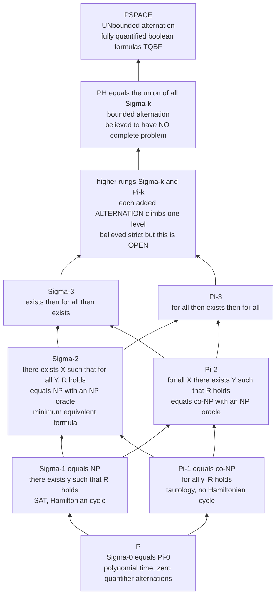

# 🪜 The Polynomial Hierarchy

> [!abstract] TL;DR
> **NP** asks "does *there exist* a short certificate?"; **co-NP** asks "does the check pass *for all* inputs?". The **Polynomial Hierarchy (PH)** is the infinite tower you get by *stacking these quantifiers*: **Σ₂** = "∃ X such that ∀ Y ...", **Π₂** = "∀ X ∃ Y ...", and each extra *alternation* of ∃/∀ builds a strictly harder (believed) level **Σₖ / Πₖ**. Equivalently, **Σₖ₊₁ = NP with a Σₖ oracle** — each rung can call the one below as a subroutine. The whole tower sits **inside PSPACE** (where alternation becomes *unbounded*), and its most powerful lever is the **collapse theorem**: if any two adjacent levels are equal, the *entire* hierarchy collapses to that level — so "if it were in NP, PH would collapse" is a standard way to argue a problem is harder than NP.

---

## Intuition

**Analogy — the escalating debate.** Picture a claim being argued in front of a judge, where each side speaks in turn and the judge only cares whether the *final* position survives.

1. **NP is a single accusation.** "There *exists* an itinerary under budget." The prosecutor simply *hands you one* itinerary (a **certificate**); you check it in polynomial time. One speaker, one ∃.
2. **co-NP is a single, universal defense.** "*Every* itinerary is over budget." Now no single example settles it — the claim must hold *for all* choices. One speaker, one ∀.
3. **Σ₂ is a two-round debate — proposer, then refuter.** "There *exists* a schedule that survives *every* disruption." I (the ∃-player) commit to a schedule; then an adversary (the ∀-player) gets to pick the *worst* disruption; my schedule wins only if it beats **all** of them. "∃ X such that ∀ Y ...".
4. **Π₂ flips who speaks first.** "*For every* attack there *exists* a patch." "∀ X ∃ Y ...".
5. **Σ₃, Σ₄, ...** add more rounds: propose, refute, re-propose, re-refute — a debate with a *bounded* number of turns.

Each extra turn is a **rung of a ladder**. The number of rungs is the number of times the quantifier *alternates* between ∃ and ∀ — not how many quantifiers there are (a run of ∃∃∃ is still one turn). NP and co-NP are the first rung; every added alternation is believed to buy strictly more power. And the ceiling of the ladder is [[Time_and_Space_Complexity|PSPACE]]: a debate with an *unbounded* number of turns is exactly a full two-player game like generalized chess.

---

## How It Works

### Core Mechanics

**0. The base: P, and the first rung.** Recall the certificate/verifier view. A language `L` is in **NP** iff there is a polynomial-time predicate `R` and a polynomial bound such that

$$x \in L \iff \exists\, y\; \big(|y| \le \text{poly}(|x|)\; \wedge\; R(x,y)\big).$$

That single existential quantifier over a short string, checked by a poly-time `R`, is the whole of NP. Its dual, **co-NP**, replaces `∃` with `∀`. In hierarchy notation these are the **first level**:

$$\Sigma_0^p = \Pi_0^p = \mathbf{P}, \qquad \Sigma_1^p = \mathbf{NP}, \qquad \Pi_1^p = \mathbf{co\text{-}NP}.$$

**1. Adding one alternation — Σ₂ and Π₂.** Keep `R` poly-time, but allow *two* quantifier blocks that alternate:

$$x \in \Sigma_2^p \iff \exists\, y\; \forall\, z\; R(x,y,z), \qquad\qquad x \in \Pi_2^p \iff \forall\, y\; \exists\, z\; R(x,y,z).$$

Read Σ₂ as "there exists a candidate `y` that no counterexample `z` can refute." This is exactly the shape of **optimization-with-verification**: *"is there a solution of size ≤ k such that no shorter/better solution exists?"* The classic complete problem is **minimum equivalent expression** — given a boolean formula φ, is there a *smaller* formula ψ with `∀x [ψ(x) = φ(x)]`? That "∃ small ψ, ∀ input x" is intrinsically Σ₂ and (believed) *not* in NP.

**2. The general rung — Σₖ, Πₖ, Δₖ.** Level `k` allows `k` alternating blocks with a poly-time matrix predicate:

$$\Sigma_k^p:\; \exists\,\forall\,\exists\,\cdots \text{ ($k$ blocks, starting with $\exists$)}, \qquad \Pi_k^p:\; \forall\,\exists\,\forall\,\cdots \text{ (starting with $\forall$)}.$$

By definition `Πₖ = co-Σₖ`, and each level sits below the next: `Σₖ ∪ Πₖ ⊆ Σₖ₊₁ ∩ Πₖ₊₁`. A useful in-between class is **Δₖ₊₁ = P with a Σₖ oracle** — for example `Δ₂ = P^NP`, decision problems solvable in poly time given a SAT subroutine (this is where "find the *optimal* value by binary-searching an NP oracle" lives).

**3. The oracle / relativized definition.** The quantifier picture has an exact machine twin:

$$\Sigma_{k+1}^p = \mathbf{NP}^{\Sigma_k^p}, \qquad \Pi_{k+1}^p = \mathbf{coNP}^{\Sigma_k^p}, \qquad \Delta_{k+1}^p = \mathbf{P}^{\Sigma_k^p}.$$

Each rung is "NP that may call the rung below as a free subroutine." The inner ∀-block of a Σ₂ formula is just a co-NP (= Σ₁-oracle) query that the outer NP machine makes. This is why the hierarchy is *self-similar*: it is NP relativized against itself, over and over.

**4. The whole tower and its PSPACE ceiling.** The hierarchy is the union of all rungs:

$$\mathbf{PH} = \bigcup_{k \ge 0} \Sigma_k^p = \bigcup_{k \ge 0} \Pi_k^p.$$

Every level fits in polynomial *space*: a fixed number of quantifier blocks can be evaluated by a depth-first walk that stores only the current assignment (poly bits) and reuses that memory — so `PH ⊆ PSPACE`. Push the number of alternations to *grow with the input* and you get exactly **TQBF** (totally quantified boolean formulas), the PSPACE-complete problem. In the language of **alternating Turing machines**: a *constant* number of alternations gives the PH levels, while *polynomially many* alternations give all of PSPACE. Alternation is the single dial connecting NP to PSPACE.

**5. What we can and cannot prove — the containments.**

$$\mathbf{P} \subseteq \mathbf{NP}\cap\mathbf{coNP} \subseteq \Sigma_2^p\cap\Pi_2^p \subseteq \cdots \subseteq \mathbf{PH} \subseteq \mathbf{PSPACE} \subseteq \mathbf{EXPTIME}.$$

All of these are *containments*; **not one** is known to be strict. It is *believed* the hierarchy is **infinite** (every rung strictly bigger than the last), but this is open and *stronger* than P ≠ NP: if PH is infinite then automatically P ≠ NP. Note Σₖ and Πₖ are (believed) **incomparable** at each level — the tower is not a single chain but a lattice of ∃-flavored and ∀-flavored classes meeting at the Δ's above them.

**6. The collapse theorems — the hierarchy's superpower.** The tower is "load-bearing": knock out one joint and the whole thing falls to that height.

- **Adjacent-level collapse.** If `Σₖ = Πₖ` for any `k` (or if `Σₖ = Σₖ₊₁`), then `PH = Σₖ` — every higher level collapses down. Intuitively, once you can turn a ∀ into a ∃ at one rung, you can absorb every added alternation.
- **P = NP ⇒ PH = P.** If the first rung collapses to the base, the entire tower does — P = NP would make *everything* in PH poly-time solvable.
- **NP = co-NP ⇒ PH = NP.** Equality at level 1 (`Σ₁ = Π₁`) collapses PH to its first rung.
- **Karp–Lipton.** If `NP ⊆ P/poly` (SAT has polynomial-size circuits), then `PH = Σ₂^p`. This is a standard argument that NP-complete problems are unlikely to have small circuits — small circuits would collapse the tower.
- **No complete problem (unless it collapses).** If PH had a `≤_p`-complete problem, that problem would live at some fixed level `k`, forcing `PH = Σₖ`. So, unlike NP or PSPACE, PH is believed to have *no* complete problem — a signature of a genuinely infinite hierarchy. In particular `PH ≠ PSPACE` is believed, since PSPACE *does* have a complete problem (TQBF).

**7. Why PH matters beyond bookkeeping.**

- **Conditional lower bounds.** "This problem is Σ₂-hard, so it is not in NP unless PH collapses" is a routine, powerful way to place a problem *strictly above* NP. The same style shows **graph isomorphism is unlikely to be NP-complete** — if it were, PH would collapse to Σ₂ (Boppana–Håstad–Zachos).
- **Toda's theorem.** `PH ⊆ P^{#P}` — a *single* counting oracle (`#P`, "how many solutions?") is powerful enough to solve *everything* in the entire hierarchy. Counting quietly dominates alternation.
- **Randomness stays low.** By Sipser–Gács–Lautemann, `BPP ⊆ Σ₂^p ∩ Π₂^p` — bounded-error randomization never escapes the second rung, one reason many believe `BPP = P`.

### Flow / Architecture



*Arrows point from a smaller class to a larger one that contains it. Each rung splits into an `∃`-flavored `Σₖ` and a `∀`-flavored `Πₖ` that are believed incomparable, rejoining in the level above. If **any** two adjacent classes turn out equal, the whole tower collapses to that height.*

---

## Key Concepts

**Secondary (intuition, no CS background)**
- **The escalating debate** — NP is one accusation you verify; each added round of "and can you survive *every* comeback?" is a new, harder question.
- **Alternation, not count** — what makes a problem harder is switching between "there exists" and "for all," not how many variables there are.
- **A ladder with a ceiling** — bounded rounds climb the ladder (PH); an unbounded back-and-forth is a full game (PSPACE).

**Undergraduate (a first theory course)**
- **Σₖ / Πₖ by quantifier alternation** — `Σₖ` = `k` alternating blocks starting with `∃`; `Πₖ` starts with `∀`; `Πₖ = co-Σₖ`.
- **Σ₁ = NP, Π₁ = co-NP, Σ₀ = Π₀ = P** — the hierarchy *generalizes* the classes you already know.
- **The oracle view** — `Σₖ₊₁ = NP^{Σₖ}`; each rung calls the one below as a subroutine; `Δₖ₊₁ = P^{Σₖ}` (e.g. `P^NP`).
- **PH ⊆ PSPACE** — a constant number of quantifier blocks is a poly-space depth-first evaluation; unbounded alternation is TQBF.
- **Complete problems per level** — `Σₖ-SAT` (a QBF with `k` alternating blocks) is `Σₖ`-complete; PH *itself* has none.

**Graduate (advanced complexity)**
- **Collapse theorems** — `Σₖ = Πₖ ⇒ PH = Σₖ`; `P = NP ⇒ PH = P`; `NP = co-NP ⇒ PH = NP`.
- **Karp–Lipton** — `NP ⊆ P/poly ⇒ PH = Σ₂^p` (nonuniform-hardness leverage).
- **Toda's theorem** — `PH ⊆ P^{#P}`; counting subsumes bounded alternation.
- **BPP in the hierarchy** — Sipser–Gács–Lautemann: `BPP ⊆ Σ₂^p ∩ Π₂^p`.
- **Alternating Turing machines** — constant alternations = PH levels; polynomial alternations = PSPACE (`AP = PSPACE`); the machine model behind the quantifier definition.
- **Not the arithmetical hierarchy** — the same `Σ/Π` shape appears in [[Mathematical_Logic_and_Set_Theory|computability]], but there quantifiers range over *all* integers and the classes are *undecidable*; here quantifiers are poly-length and everything is inside PSPACE.

---

## Python Demo

```python
# Illustrating quantifier ALTERNATION and its cost.
#
# We evaluate a small Sigma-2 quantified boolean formula (QBF)
#
#        exists (x0, x1) .  for all (y0, y1) .  phi(x, y)
#
# by brute force over the quantifier BLOCKS -- exactly the nested search that
# defines the polynomial hierarchy. One block of a *different* quantifier is one
# ALTERNATION = one rung:  Sigma-1 = NP (a single 'exists' block),
# Pi-1 = co-NP (a single 'for all'), Sigma-2 = exists-then-for-all, ...
# Unbounded alternation -> PSPACE.  numpy / matplotlib only.

import numpy as np
import matplotlib.pyplot as plt
from itertools import product


def phi(x, y):
    """Poly-time-checkable matrix predicate at the leaves of the game tree."""
    x0, x1 = x
    y0, y1 = y
    return (x0 or y0) and (x1 or (not y1)) and ((not x0) or x1 or y0)


blocks = [("E", 2), ("A", 2)]        # Sigma-2:  E x0 x1 .  A y0 y1 .  phi

# --- Brute-force evaluation, block by block, counting leaf evaluations -------
leaves_visited = 0

def evaluate(i, assigned):
    """Fold the quantifier blocks: OR for 'exists', AND for 'for all'."""
    global leaves_visited
    if i == len(blocks):
        leaves_visited += 1
        return phi(assigned[0], assigned[1])
    quant, nvars = blocks[i]
    kids = [evaluate(i + 1, assigned + [list(bits)])
            for bits in product([0, 1], repeat=nvars)]
    return any(kids) if quant == "E" else all(kids)     # exists=OR, forall=AND

answer = evaluate(0, [])
total_vars = sum(n for _, n in blocks)
print("Sigma-2 formula  E x . A y . phi(x, y)  evaluates to:", answer)
print("leaves visited (matrix evaluations)     :", leaves_visited,
      " = 2^(total vars) =", 2 ** total_vars)

# ---------------------------------------------------------------------------
# Panel A: draw the ACTUAL Sigma-2 game tree (alternating OR / AND levels).
# Panel B: show how each added alternation MULTIPLIES the search.
# ---------------------------------------------------------------------------
X_assign = list(product([0, 1], repeat=2))     # 4 exists-branches
Y_assign = list(product([0, 1], repeat=2))     # 4 for-all-branches per X

fig, (axT, axS) = plt.subplots(1, 2, figsize=(15, 6.5),
                               gridspec_kw={"width_ratios": [1.35, 1]})

xnode_x = [1.5 + 4 * k for k in range(4)]      # for-all nodes centered over leaves
root_x = float(np.mean(xnode_x))

# root = 'exists' node (OR)
axT.scatter([root_x], [2], s=900, marker="^", color="#f4b400",
            edgecolor="k", zorder=3)
axT.text(root_x, 2.30, "exists  x0 x1   (OR level)", ha="center",
         fontsize=9, fontweight="bold", color="#a67c00")

winning_x = None
for k, x in enumerate(X_assign):
    all_true = all(phi(x, y) for y in Y_assign)     # this exists-branch beats every leaf?
    if all_true:
        winning_x = k
    axT.plot([root_x, xnode_x[k]], [2, 1], color="#bbbbbb", zorder=1)
    axT.scatter([xnode_x[k]], [1], s=700, marker="v", color="#4285f4",
                edgecolor="k", zorder=3)                 # 'for all' node (AND)
    for j, y in enumerate(Y_assign):
        lx = 4 * k + j
        t = phi(x, y)
        axT.plot([xnode_x[k], lx], [1, 0], color="#dddddd", zorder=1)
        axT.scatter([lx], [0], s=260,
                    color=("#0f9d58" if t else "#db4437"),
                    edgecolor="k", zorder=3)             # leaf = matrix value
        axT.text(lx, -0.24, "T" if t else "F", ha="center", fontsize=7)

axT.text(-3.4, 1, "for all  y0 y1\n(AND level)", ha="left", va="center",
         fontsize=9, fontweight="bold", color="#1a56c4")
if winning_x is not None:
    axT.annotate("this exists-branch beats\nEVERY for-all leaf  ->  formula TRUE",
                 xy=(xnode_x[winning_x], 1),
                 xytext=(xnode_x[winning_x], 2.65),
                 ha="center", fontsize=8, color="#0f9d58",
                 arrowprops=dict(arrowstyle="->", color="#0f9d58"))

axT.set_title("Sigma-2 game tree: 4 exists-branches times 4 for-all-branches"
              " = 16 leaves")
axT.set_xlim(-4, 16)
axT.set_ylim(-0.6, 3.0)
axT.axis("off")

# --- Panel B: leaves grow as 2^(k*b) with the number of alternations k -------
b = 2                              # variables per quantifier block
levels = np.arange(1, 9)          # Sigma-1 .. Sigma-8
leaves = 2.0 ** (b * levels)

axS.semilogy(levels, leaves, "o-", color="#7b1fa2")
for k, lv in zip(levels, leaves):
    axS.annotate(f"Sigma-{k}", (k, lv), textcoords="offset points",
                 xytext=(6, -3), fontsize=8, color="#7b1fa2")

axS.set_xlabel("number of quantifier alternations  k   (rung of the hierarchy)")
axS.set_ylabel("leaves in the game tree  =  2^(k*b)   [log scale]")
axS.set_title("Climbing the ladder: every alternation multiplies the search")
axS.grid(True, which="both", ls=":", alpha=0.5)
axS.text(1.05, leaves[-1] * 0.02,
         "constant k   ->  a fixed level Sigma-k of PH\n"
         "k grows with n  ->  UNbounded alternation  =  PSPACE\n"
         "depth-first eval stores only k*b bits  ->  poly SPACE\n"
         "therefore  PH  is a subset of  PSPACE",
         fontsize=8.5,
         bbox=dict(boxstyle="round", fc="#f3e5f5", ec="#7b1fa2"))

plt.tight_layout()
plt.savefig("polynomial_hierarchy.png", dpi=130)
print("Saved game-tree / alternation plot to polynomial_hierarchy.png")

# Takeaway: the Sigma-2 tree alternates OR (exists) and AND (for all) levels;
# the 'exists' player wins iff SOME branch is all-true under 'for all'. Adding one
# more alternation multiplies the leaf count by 2^b -- the exponential cost of
# each rung. But a depth-first walk needs only k*b bits of memory, which is why
# the whole (constant-alternation) hierarchy stays inside PSPACE, and why letting
# k grow without bound lands you exactly on PSPACE-complete TQBF.
```

Running it prints the Σ₂ evaluation (`True`, `16` leaves = `2⁴`) and saves `polynomial_hierarchy.png`. The left panel is the real game tree: a top **∃/OR** node, four **∀/AND** nodes, sixteen leaves colored by the matrix predicate — the ∃-player wins because one branch (`x = (1,1)`) is true under *every* `y`. The right panel makes the hierarchy's cost visceral: each added alternation multiplies the leaves by `2^b`, yet a depth-first evaluation stores only the current assignment, which is exactly why bounded alternation (PH) never leaves polynomial *space* and unbounded alternation *is* PSPACE.

---

## Real-World Applications

> **Example — logic synthesis and circuit minimization.** Asking "is there a *smaller* circuit computing the same boolean function?" is literally "∃ small circuit `C` such that `∀ input x`, `C(x) = f(x)`" — a **Σ₂** statement. EDA tools that minimize hardware, and the theoretical **Minimum Circuit Size Problem (MCSP)**, sit at exactly this rung; that is why exact minimization is far harder than mere SAT and why practical tools lean on heuristics rather than exact Σ₂ search.

- **AI planning and reactive synthesis.** Conformant and contingent planning ("∃ a plan that works ∀ possible states of the hidden world") and controller synthesis ("∃ a strategy such that ∀ environment moves the spec holds") are naturally Σ₂ / Π₂. The alternation is the planner-versus-adversary structure, mirroring the two-player, bounded-move reading of [[Algorithmic_Game_Theory|games]].
- **Knowledge representation.** Non-monotonic reasoning is a canonical PH client: **abduction** (find an explanation that no observation contradicts) is Σ₂-complete, and reasoning in **default logic** / disjunctive logic programs lands at Π₂. Complexity here tells KR engineers which reasoning tasks are inherently beyond a SAT solver.
- **Databases.** For expressive query classes, **query containment** and **certain-answer** problems climb to Π₂-completeness — a warning that some seemingly innocent query-optimization checks are provably intractable in the worst case.
- **The hierarchy as an argument, not an algorithm.** Its biggest practical use is *negative*: showing a problem is Σₖ-hard proves "it is not in NP unless PH collapses," which is the standard evidence that a problem is *strictly* beyond the reach of a SAT-encoding. The classic case is **graph isomorphism**, argued unlikely to be NP-complete precisely because that would collapse PH to Σ₂.

---

## Common Pitfalls

- **Confusing PH with the arithmetical hierarchy.** They share the `Σ/Π` quantifier-alternation shape, but the arithmetical hierarchy quantifies over *all* natural numbers and its classes (Σ₁ = recursively enumerable, etc.) are *undecidable*. PH quantifies over *polynomial-length* strings with a poly-time matrix, and **all of PH ⊆ PSPACE is decidable**. Same picture, totally different universe.
- **Counting quantifiers instead of alternations.** `∃x∃y∃z φ` is still **Σ₁ (NP)** — a run of like quantifiers collapses into one block. Only a *switch* between `∃` and `∀` adds a level. Miscounting inflates a problem's placement.
- **Treating the levels as a single chain.** `Σₖ` and `Πₖ` are (believed) **incomparable**; the tower is a lattice, not a line. "Σ₂ ⊆ Π₂" is *not* a theorem — both sit inside `Δ₃` above them.
- **Reading "collapse" as "proven equal."** Collapse theorems are **conditional**: *if* two levels coincide *then* the tower falls. Nobody has shown any collapse unconditionally; "PH is infinite" remains open (and would imply P ≠ NP).
- **Assuming a Σ₂-complete problem is "in NP, just harder."** If a Σ₂-hard problem were in NP, PH would collapse to level 1. Barring collapse, these problems are *not* in NP at all — a different, higher class.
- **Forgetting PH ⊆ PSPACE.** A common slip is imagining PH problems as "beyond PSPACE." Every fixed level is poly-space; the tower's ceiling *is* PSPACE. What is (believed) beyond PH is TQBF's *unbounded* alternation, still inside PSPACE.
- **Expecting a PH-complete problem.** Unlike NP or PSPACE, PH is believed to have **no** complete problem — one would pin it to a finite level. If you "find" a PH-complete problem, you have (conditionally) collapsed the hierarchy.

---

## Related Concepts

- [[Time_and_Space_Complexity]] — defines P, NP, co-NP, PSPACE and the chain the hierarchy is threaded through; PH is the fine structure *between* NP and PSPACE.
- [[Reductions_and_Undecidable_Problems]] — the polynomial-time many-one reductions that give each level `Σₖ` its complete problems, and the reduction discipline PH inherits from computability.
- [[Turing_Machines_and_the_Church_Turing_Thesis]] — the base machine model; PH's oracle definition (`NP^{Σₖ}`) and its alternating-Turing-machine characterization extend it.
- [[Algorithmic_Game_Theory]] — the two-player, bounded-move game reading of `Σₖ / Πₖ` (proposer vs refuter); unbounded moves give the PSPACE-complete generalized games.
- [[Mathematical_Logic_and_Set_Theory]] — quantifier alternation and the *arithmetical* hierarchy, the undecidable logical mirror of this resource-bounded tower.
- [[Decidability_and_Recognizability]] — the one-quantifier r.e./co-r.e. distinction is the computability-world analogue of `Σ₁ / Π₁` here.
- [[Theory_of_Computation_Overview]] — parent map; this note is the advanced-complexity branch above the P/NP foundations.
- [[Time_Complexity_Classes]] — the applied growth-rate view of why every added alternation multiplies an exponential search.

---

## Review Questions

1. **(Foundational)** Using the "escalating debate" analogy, explain why co-NP is the *dual* of NP and why Σ₂ ("∃ X ∀ Y ...") is genuinely a different, harder question than NP — not just a bigger NP instance. What is the *one* feature that separates one rung from the next, and why does `∃x∃y` *not* add a level?
2. **(Undergraduate)** Give the two equivalent definitions of `Σ₂^p` — the alternating-quantifier form and the oracle form `NP^{NP}` — and argue informally why they describe the same class. Then explain why every level of PH is contained in PSPACE, and what changes about the quantifier structure to reach TQBF (PSPACE-complete).
3. **(Graduate / trade-off)** State the collapse theorem and derive two of its consequences (e.g. `P = NP ⇒ PH = P`, and `NP = co-NP ⇒ PH = NP`). Then explain how one *uses* collapse as evidence: given a problem you suspect is not in NP, how does showing it Σ₂-hard, or invoking Karp–Lipton, support that suspicion? Why can PH have no complete problem unless it collapses?

---

## Sources

- Stockmeyer, L. J. "The polynomial-time hierarchy." *Theoretical Computer Science*, 3(1), 1976 — the paper that defines and names Σₖ/Πₖ and the union PH.
- Meyer, A. R., Stockmeyer, L. J. "The equivalence problem for regular expressions with squaring requires exponential space." *13th SWAT (FOCS)*, 1972 — the original context in which the hierarchy arose.
- Arora, S., Barak, B. *Computational Complexity: A Modern Approach*. Cambridge University Press, 2009 — Chapter 5: the polynomial hierarchy, oracle definition, collapse and Karp–Lipton.
- Toda, S. "PP is as hard as the polynomial-time hierarchy." *SIAM Journal on Computing*, 20(5), 1991 — proves `PH ⊆ P^{#P}`, linking alternation to counting.
- Sipser, M. *Introduction to the Theory of Computation*, 3rd ed. Cengage, 2013 — alternation, alternating Turing machines, and the QBF / PSPACE connection.

---

#theory-of-computation #polynomial-hierarchy #alternation #sigma-pi #complexity
