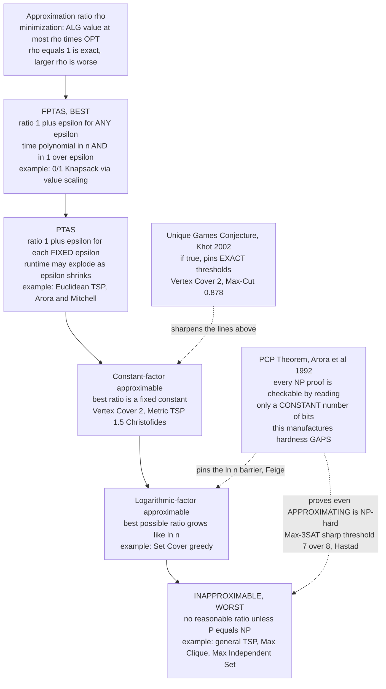

# 🪜 Approximation Algorithms and Inapproximability

> [!abstract] TL;DR
> Once a problem is proven **NP-hard** ([[NP_Completeness_and_the_Cook_Levin_Theorem]]), you cannot expect an exact polynomial algorithm — but you are not defeated. An **approximation algorithm** runs in polynomial time and returns a solution provably within a fixed factor of optimal: its **approximation ratio** $\rho$ guarantees, for a minimization problem, $\text{ALG} \le \rho \cdot \text{OPT}$ on *every* instance. A *2-approximation* is never worse than twice optimal — with a mathematical proof, not a hope. Problems then sort onto a **ladder of approximability**: some admit any ratio $1+\epsilon$ (**FPTAS**, e.g. Knapsack), some for each fixed $\epsilon$ (**PTAS**, e.g. Euclidean TSP), some only a fixed constant (**Vertex Cover** at 2, **metric TSP** at 1.5 via Christofides), some only a logarithmic $\ln n$ (**Set Cover**), and some are **inapproximable** to any reasonable factor unless $\mathrm{P}=\mathrm{NP}$. The **PCP theorem** (Arora–Safra; Arora–Lund–Motwani–Sudan–Szegedy, 1992) recast NP proofs as *probabilistically checkable* by reading only a **constant number of bits**, and — shockingly — this lets us prove that *even approximating* many problems is itself NP-hard (Håstad: Max-3SAT has a sharp threshold at $7/8$). NP-hardness is not the end of the story; it is the start of a refined theory of **how well you can do**.

---

## Intuition

**Analogy — the "good-enough delivery route."** You run a courier company and must plan a route through 200 stops. Finding the *provably shortest* route is the Traveling Salesman Problem — NP-hard, and searching for the true optimum could take longer than the universe has left. But your drivers need to leave at 6 a.m. So you make a deal with reality: instead of the perfect route, you accept a route with a **written guarantee** — "this route is at most 50 percent longer than the theoretical best, no matter what the map looks like." You stop hunting for perfection and settle for *provably good enough*, computed in seconds. That guarantee — "at most $\rho$ times optimal" — is the **approximation ratio**, and it is the difference between a gamble and an engineering commitment.

The technical move is to abandon the exact answer but **keep a proof**. A heuristic might *usually* give a short route but occasionally produce a disaster with no warning. An approximation algorithm gives up the best-case brilliance in exchange for a **worst-case ceiling you can put in a contract**. And the deep companion question is: *how low can that ceiling go?* For some problems you can push $\rho$ arbitrarily close to 1; for others there is a hard floor below which going further is *as hard as solving the problem exactly* — that floor is what **inapproximability** measures.

---

## How It Works

### 1. The approximation ratio — a contract, not a hope

For an optimization problem with optimum value $\text{OPT}$ on a given instance, an algorithm $\text{ALG}$ is a **$\rho$-approximation** if it runs in polynomial time and, on **every** instance:

- **Minimization** (cover, cost, makespan): $\text{ALG} \le \rho \cdot \text{OPT}$, with $\rho \ge 1$.
- **Maximization** (satisfied clauses, cut edges, packed value): $\text{ALG} \ge \frac{1}{\rho}\cdot \text{OPT}$, with $\rho \ge 1$.

The ratio is **worst-case over all inputs**. $\rho = 1$ means exact; a *2-approximation* for a minimization problem is a solemn promise that the answer is *never more than double* the best possible. The engineering payoff of a hardness proof ([[Reductions_and_NP_Complete_Problems]]) is precisely this pivot: *stop chasing $\text{OPT}$; go build a $\rho$ and prove it.*

The recurring trick in every proof below: since $\text{OPT}$ is unknown and NP-hard to compute, we compare $\text{ALG}$ against an **efficiently computable lower bound** $L \le \text{OPT}$ (for minimization). If we can also show $\text{ALG} \le \rho \cdot L$, then $\text{ALG} \le \rho \cdot L \le \rho \cdot \text{OPT}$. *We never need to know $\text{OPT}$ — we sandwich it.*

### 2. Four classic algorithms and their analyses

- **Vertex Cover — ratio 2 (via a maximal matching).** Repeatedly pick any uncovered edge $(u,v)$, add **both** endpoints to the cover, and delete all edges touching $u$ or $v$. The picked edges form a **maximal matching** $M$; the cover has size $2|M|$. Because matched edges are vertex-disjoint, any cover must spend $\ge 1$ vertex per matched edge, so $\text{OPT} \ge |M|$. Hence $\text{ALG} = 2|M| \le 2\,\text{OPT}$. Clean, and the lower bound $|M|$ is free.
- **Set Cover — ratio $H_n \approx \ln n$ (greedy).** Repeatedly pick the set covering the most still-uncovered elements. A charging argument gives $\text{ALG} \le H_n \cdot \text{OPT}$ where $H_n = 1 + \tfrac12 + \dots + \tfrac1n$. This logarithmic factor is essentially the best possible: Feige (1998) showed $(1-o(1))\ln n$ is NP-hard to beat. Greedy is the poster child for the **log-factor rung** ([[Greedy_Fundamentals]]).
- **Metric TSP — ratio 2 (double-tree) and 1.5 (Christofides).** On a graph obeying the triangle inequality: build a minimum spanning tree ([[Minimum_Spanning_Tree]]) — its weight is a lower bound since deleting one edge of the optimal tour yields a spanning path $\ge$ MST. Walk the tree twice (an Eulerian tour of the doubled tree) and shortcut repeats; the triangle inequality guarantees $\text{ALG} \le 2\,\text{MST} \le 2\,\text{OPT}$. **Christofides** improves this to $1.5$ by adding a minimum-weight matching on the odd-degree vertices instead of doubling every edge (a 2022 result of Karlin–Klein–Oveis Gharan nudged it below $1.5$).
- **0/1 Knapsack — an FPTAS.** Knapsack is NP-hard, yet it admits a scheme achieving ratio $1+\epsilon$ for *any* $\epsilon$ in time polynomial in both $n$ and $1/\epsilon$. The idea: the standard dynamic program is polynomial in the *values*; **round/scale** the item values down to a coarse grid controlled by $\epsilon$, run the DP on the small rounded values, and the rounding error is bounded by $\epsilon \cdot \text{OPT}$ ([[Knapsack_01]]).

### 3. The two universal design techniques

- **LP relaxation and rounding.** Write the problem as an **integer program** ([[Integer_Programming]]), relax the integrality constraint $x \in \{0,1\}$ to $x \in [0,1]$, solve the resulting **linear program** in polynomial time, then *round* the fractional solution back to integers. For weighted Vertex Cover, rounding every $x_v \ge \tfrac12$ up to 1 yields a valid cover of cost $\le 2 \cdot \text{LP-OPT} \le 2\,\text{OPT}$ — another route to ratio 2. The gap between the integer optimum and the LP optimum (the **integrality gap**) upper-bounds what rounding alone can achieve ([[LP_Duality]]).
- **Primal-dual.** Grow a feasible **dual** solution and use it to *guide* which primal variables to buy, paying only when a dual constraint goes tight. This avoids solving an LP explicitly and gives fast combinatorial approximations for facility location, Steiner trees, and network design.

### 4. The PCP theorem and hardness of approximation

Classical NP-hardness says the *exact* problem is hard. It says nothing about approximation — maybe a great $\rho$-approximation exists. The breakthrough that closed this gap is the **PCP theorem** ($\mathrm{NP} = \mathrm{PCP}[O(\log n),\,O(1)]$): every NP statement has a **probabilistically checkable proof** that a verifier can validate — with high confidence — by tossing $O(\log n)$ random coins and inspecting only a **constant number of bits** of the proof. Correct proofs always pass; false claims are caught with constant probability no matter how cleverly written.

The consequence is the **gap-preserving reduction**. PCP lets us transform an NP problem into a Max-CSP instance where either *almost all* constraints are satisfiable (yes-instances) or *at most a $c$-fraction* are (no-instances), with a fixed gap between. An approximation algorithm beating that gap would distinguish the two cases — solving the original NP-hard problem. Therefore **approximating past the gap is itself NP-hard**. Landmark thresholds:

- **Max-3SAT:** trivially $7/8$-approximable (a random assignment satisfies $7/8$ of clauses in expectation); **Håstad (2001)** proved beating $7/8 + \epsilon$ is NP-hard. A *sharp* threshold.
- **Max Clique / Max Independent Set:** inapproximable to within $n^{1-\epsilon}$ (Håstad) — essentially *no* nontrivial guarantee is possible.
- **Set Cover:** $(1-o(1))\ln n$ is optimal (Feige/Dinur–Steurer). Greedy is the best you can do.

The **Unique Games Conjecture (UGC)** of Khot (2002) sharpens many of these to *exact* thresholds. If UGC holds, Vertex Cover is NP-hard to approximate below **2** (so the matching algorithm is optimal), and Max-Cut's best ratio is exactly the Goemans–Williamson SDP constant $\approx 0.878$. UGC remains open and is one of the central questions of modern complexity — a 2018 near-resolution (the 2-to-2 Games theorem, Khot–Minzer–Safra) proved a closely related statement.

### The Ladder of Approximability



---

## Key Concepts

**Secondary (intuitive, no CS background needed)**
- **Good enough, guaranteed** — instead of the perfect answer you may never find, take one that comes with a written promise: "at most 50 percent worse than the best."
- **A guarantee versus a hope** — a *heuristic* often works but can fail silently; an *approximation* carries a proof of its worst case.
- **Some problems bend, some do not** — for a few you can get as close to perfect as you like; for others there is a wall you provably cannot climb.

**Undergraduate (a first algorithms / theory course)**
- **Approximation ratio $\rho$** — worst-case bound of $\text{ALG}$ against $\text{OPT}$; the central quality measure of an approximation algorithm.
- **Lower-bound sandwiching** — you never compute $\text{OPT}$; you bound $\text{ALG}$ against a cheap $L \le \text{OPT}$ (matching size, MST weight, LP optimum).
- **Vertex Cover 2-approx, Set Cover greedy $\ln n$, Metric TSP 2-approx** — the three canonical analyses every student learns.
- **PTAS vs FPTAS** — a PTAS gives $1+\epsilon$ for each *fixed* $\epsilon$ (runtime may be, say, $n^{1/\epsilon}$); an FPTAS is polynomial in *both* $n$ and $1/\epsilon$ — strictly stronger.
- **LP relaxation and rounding** — relax $\{0,1\}$ to $[0,1]$, solve the LP ([[LP_Standard_Form]]), round fractionally; the workhorse of modern approximation.

**Graduate (advanced complexity)**
- **The PCP theorem** — $\mathrm{NP} = \mathrm{PCP}[O(\log n), O(1)]$; the verifier reads $O(1)$ proof bits. Equivalent to the existence of NP-hard gap problems.
- **Gap-preserving reductions and the gap-introducing step** — hardness of approximation follows from creating a constant gap between yes- and no-instances that no approximation can straddle.
- **Håstad's optimal inapproximability** — Max-3SAT at $7/8$, Max Clique at $n^{1-\epsilon}$, via the long-code and Fourier analysis of Boolean functions.
- **Unique Games Conjecture** — if true, the basic SDP is *optimal* for a huge class (Raghavendra's dichotomy); pins Vertex Cover at 2 and Max-Cut at the GW constant $\approx 0.878$. The 2-to-2 Games theorem (2018) is partial progress.
- **Integrality gap** — the ratio between the integer optimum and the LP/SDP relaxation optimum; a lower bound on what rounding *that* relaxation can achieve, independent of $\mathrm{P}$ vs $\mathrm{NP}$.
- **APX, PTAS, and the class hierarchy** — APX-hardness (via PCP) rules out a PTAS unless $\mathrm{P}=\mathrm{NP}$; Vertex Cover and Metric TSP are APX-hard, so no PTAS exists for them.

---

## Python Demo

```python
# ---------------------------------------------------------------------------
# Approximation with a PROVABLE guarantee: the 2-approximation for VERTEX COVER.
# ---------------------------------------------------------------------------
# ALGORITHM (Gavril's maximal-matching cover):
#   repeatedly pick ANY uncovered edge (u, v), add BOTH endpoints to the cover,
#   delete every edge touching u or v; stop when no edges remain.
# The picked edges form a MAXIMAL MATCHING M, and the cover has size 2|M|.
#
# WHY THE RATIO IS AT MOST 2 (the whole point of an approximation algorithm):
#   * matched edges are vertex-disjoint, so ANY vertex cover must spend at least
#     one distinct vertex per matched edge         =>  OPT >= |M|.
#   * our cover uses exactly 2|M| vertices         =>  ALG = 2|M| <= 2*OPT.
#   So ALG/OPT <= 2 on EVERY instance -- a worst-case guarantee, not a hope.
#
# We (a) run it on many random graphs, (b) compute the TRUE optimum by brute
# force on small graphs, (c) confirm the achieved ratio ALG/OPT never exceeds
# the proven bound of 2, and (d) plot the evidence.  numpy + matplotlib only.

import numpy as np
import matplotlib.pyplot as plt
from itertools import combinations

rng = np.random.default_rng(7)

# --- random Erdos-Renyi graph as an edge list ------------------------------
def random_graph(n, p):
    return [(u, v) for u, v in combinations(range(n), 2) if rng.random() < p]

# --- the 2-approximation (maximal-matching vertex cover) -------------------
def approx_vertex_cover(edges):
    remaining = set(map(frozenset, edges))
    cover, matching = set(), []
    while remaining:
        u, v = tuple(next(iter(remaining)))          # pick ANY surviving edge
        cover.add(u); cover.add(v)                   # take BOTH endpoints
        matching.append((u, v))
        remaining = {f for f in remaining if u not in f and v not in f}
    return cover, matching

# --- exact minimum vertex cover by brute force (small n only) --------------
def optimal_vertex_cover(n, edges):
    E = [frozenset(e) for e in edges]
    covered = lambda S: all(e & set(S) for e in E)   # every edge meets S
    for k in range(n + 1):                           # try sizes 0,1,2,... upward
        for S in combinations(range(n), k):
            if covered(S):
                return set(S)
    return set(range(n))

# --- experiment: many random graphs, compare ALG vs OPT --------------------
records = []          # (opt_size, alg_size, ratio, matching_lb)
for _ in range(400):
    n = int(rng.integers(6, 15))                     # small enough for exact OPT
    p = float(rng.uniform(0.15, 0.6))
    edges = random_graph(n, p)
    if not edges:
        continue
    cover, matching = approx_vertex_cover(edges)
    opt = optimal_vertex_cover(n, edges)
    records.append((len(opt), len(cover), len(cover) / len(opt), len(matching)))

rec = np.array(records, dtype=float)
opt_sz, alg_sz, ratio, lb = rec[:, 0], rec[:, 1], rec[:, 2], rec[:, 3]

print(f"instances tested         : {len(rec)}")
print(f"max ratio ALG/OPT seen   : {ratio.max():.3f}   (proven bound = 2.000)")
print(f"mean ratio ALG/OPT       : {ratio.mean():.3f}")
print(f"ratio ever exceeded 2    : {bool((ratio > 2 + 1e-9).any())}")
print(f"matching LB <= OPT always: {bool((lb <= opt_sz + 1e-9).all())}   (proof: OPT >= |M|)")

# --- plots -----------------------------------------------------------------
fig, ax = plt.subplots(1, 2, figsize=(14, 5.6))

# Left: histogram of achieved ratio, with the proven bound at 2.0
ax[0].hist(ratio, bins=np.arange(1.0, 2.11, 0.05), color="#4c72b0",
           edgecolor="white", alpha=0.9)
ax[0].axvline(1.0, color="seagreen", lw=2.2, ls="--", label="ratio 1.0 = optimal")
ax[0].axvline(2.0, color="crimson",  lw=2.4, label="proven bound 2.0 (never exceeded)")
ax[0].axvline(ratio.mean(), color="black", lw=1.6, ls=":",
              label=f"mean = {ratio.mean():.2f}")
ax[0].set_xlabel("achieved ratio  ALG / OPT")
ax[0].set_ylabel("number of random instances")
ax[0].set_title("Achieved ratio stays inside [1, 2]\n"
                "the guarantee is worst-case, so NO bar crosses 2.0")
ax[0].legend(fontsize=8)

# Right: ALG vs OPT scatter, bracketed by y=x (optimal) and y=2x (the bound)
jit = rng.uniform(-0.15, 0.15, size=len(rec))
ax[1].scatter(opt_sz + jit, alg_sz + jit, s=28, alpha=0.5,
              color="#4c72b0", label="one random graph")
xs = np.linspace(opt_sz.min(), opt_sz.max(), 50)
ax[1].plot(xs, xs,      color="seagreen", lw=2.2, ls="--", label="ALG = OPT (perfect)")
ax[1].plot(xs, 2 * xs,  color="crimson",  lw=2.4, label="ALG = 2*OPT (the bound)")
ax[1].fill_between(xs, xs, 2 * xs, color="crimson", alpha=0.06)
ax[1].set_xlabel("OPT  (true minimum vertex-cover size)")
ax[1].set_ylabel("ALG  (size of the 2-approximation)")
ax[1].set_title("Every instance lands in the guaranteed band\n"
                "between ALG = OPT and ALG = 2*OPT")
ax[1].legend(fontsize=8, loc="upper left")

plt.tight_layout()
plt.savefig("vertex_cover_2approx.png", dpi=130)
print("\nSaved figure to vertex_cover_2approx.png")
```

**What the demo shows.** Over 400 random graphs it runs the maximal-matching 2-approximation *and* the true brute-force optimum, then reports the achieved ratio. The printout confirms two mathematical facts empirically: the matching size is *always* a valid lower bound ($|M| \le \text{OPT}$), and the achieved ratio **never crosses 2.0** — because the guarantee is worst-case, not statistical. The left histogram shows every instance falling in $[1, 2]$ (often well below 2, since the analysis is conservative); the right scatter shows every point trapped in the wedge between $\text{ALG}=\text{OPT}$ and $\text{ALG}=2\,\text{OPT}$. That wedge *is* the contract an approximation algorithm signs.

---

## Real-World Applications

> **Example — Christofides in delivery and circuit routing.** Metric-TSP approximation is not a toy: logistics planners (parcel delivery, waste collection, meal delivery) and PCB drilling / laser-cutting toolpath planners face millions of tour instances daily. Because exact TSP is hopeless at scale, production systems lean on the **MST-based 2-approximation and Christofides' 1.5-approximation** as a starting tour, then polish with local search (2-opt, Lin–Kernighan). The approximation ratio is what lets an operations team *promise* an upper bound on fuel cost or machine time before a single truck rolls or drill fires.

- **Facility location and clustering.** k-center, k-median, and facility-location are NP-hard; constant-factor approximations (via LP rounding and primal-dual) power warehouse siting, CDN edge placement, and $k$-means initialization (k-means++ is an $O(\log k)$-approximation to the clustering objective).
- **Network design.** Steiner tree and survivable-network design use primal-dual 2-approximations to lay out minimum-cost fiber, telecom backbones, and chip interconnect.
- **Scheduling.** Makespan minimization on parallel machines has a PTAS; the simple greedy **list-scheduling** rule is a $(2 - 1/m)$-approximation used in job schedulers and cloud task placement.
- **Resource allocation via Knapsack FPTAS.** Ad allocation, budgeted selection, and cache admission use the Knapsack FPTAS to hit any target accuracy $1+\epsilon$ with a tunable runtime knob.
- **Set Cover greedy.** Sensor placement, test-suite minimization, and feature/gene selection all reduce to Set Cover, where greedy's $\ln n$ guarantee is provably the best achievable.

---

## Common Pitfalls

- **Confusing a heuristic with an approximation.** Simulated annealing, genetic algorithms, and SAT solvers often work beautifully but carry **no worst-case guarantee** — they can fail silently. An approximation algorithm proves a bound $\rho$ on *every* input. "Usually good" and "provably never worse than $\rho \cdot \text{OPT}$" are different scientific claims.
- **Ratio direction and sign confusion.** For minimization $\rho \ge 1$ and $\text{ALG} \le \rho\,\text{OPT}$; for maximization the convention flips to $\text{ALG} \ge \text{OPT}/\rho$. Mixing them up makes a good algorithm look impossible (or vice versa).
- **Assuming a hard problem is at least *approximable*.** NP-hardness of the exact problem says nothing about approximation. Thanks to PCP, some problems (Max Clique, general non-metric TSP) are hard to approximate to *any* useful factor — approximation buys you nothing there.
- **Forgetting the metric assumption in TSP.** The MST and Christofides guarantees require the **triangle inequality**. General (non-metric) TSP is inapproximable to any constant unless $\mathrm{P}=\mathrm{NP}$ — a reduction from Hamiltonian cycle blows up non-edges to arbitrary cost.
- **Mistaking a PTAS for practical.** A PTAS achieving $1+\epsilon$ may run in $n^{O(1/\epsilon)}$ — for $\epsilon = 0.01$ that exponent is astronomical. An **FPTAS** (polynomial in $1/\epsilon$) is what you actually want; not every problem has one.
- **Believing the integrality gap can be beaten by rounding.** If an LP relaxation has integrality gap $g$, *no* rounding of that relaxation yields ratio better than $g$ — you must strengthen the relaxation (add cuts, lift to an SDP) or the barrier stands regardless of $\mathrm{P}$ vs $\mathrm{NP}$.
- **Treating the Unique Games Conjecture as a theorem.** Many "tight" inapproximability thresholds (Vertex Cover at 2, Max-Cut at 0.878) are conditional on **UGC**, which is still open. State the assumption when you cite the threshold.

---

## Related Concepts

- [[NP_Completeness_and_the_Cook_Levin_Theorem]] — the hardness proof that *triggers* the switch to approximation; NP-completeness is the licence to stop seeking an exact fast algorithm.
- [[Reductions_and_NP_Complete_Problems]] — ordinary reductions spread hardness; *gap-preserving* reductions (via PCP) spread **hardness of approximation**.
- [[P_versus_NP]] — inapproximability results are all of the form "hard unless $\mathrm{P}=\mathrm{NP}$"; approximation is how we cope in the believed world $\mathrm{P}\neq\mathrm{NP}$.
- [[The_Class_NP_and_Verification]] — the PCP theorem is a startling *re-characterization* of NP verification: constant-bit, randomized proof checking.
- [[Time_Complexity_Classes]] — situates polynomial-time approximation against the exponential cost of exact NP-hard solutions.
- [[Integer_Programming]] — the exact ILP formulation whose LP relaxation is the raw material for rounding-based approximations.
- [[LP_Duality]] — the theory behind the **primal-dual** approximation method and LP-rounding bounds.
- [[LP_Standard_Form]] — the relaxation you solve after dropping integrality; the fractional optimum lower-bounds $\text{OPT}$.
- [[Duality_Theory]] — weak/strong duality gives the certificate $L \le \text{OPT}$ that every approximation proof needs.
- [[Simplex_Method]] — one polynomial-in-practice engine for solving the LP relaxations behind approximation algorithms.
- [[Greedy_Fundamentals]] — greedy is the workhorse behind Set Cover ($\ln n$) and list scheduling; approximation analysis is greedy's proof of worth.
- [[Knapsack_01]] — the canonical FPTAS: value scaling turns the pseudo-polynomial DP into a $1+\epsilon$ scheme.
- [[Minimum_Spanning_Tree]] — the lower bound and construction at the heart of the metric-TSP 2-approximation and Christofides.
- [[Dijkstra]] — an example of a problem that *is* in $\mathrm{P}$; contrasts with the NP-hard optimization targets of approximation.
- [[Theory_of_Computation_Overview]] — the vault map placing approximation and inapproximability at the frontier of complexity theory.

---

## Review Questions

1. **(Conceptual)** Define the approximation ratio for a minimization problem, and explain the "sandwiching" technique: why can we prove $\text{ALG} \le 2\,\text{OPT}$ for Vertex Cover *without ever computing $\text{OPT}$*? Identify the concrete lower bound used and why it is valid.
2. **(Scenario)** You must route service vans through a city where distances satisfy the triangle inequality, and the CEO wants a *written guarantee* on cost. Exact TSP is off the table. Which algorithm do you deploy, what guarantee can you promise, and how would your answer change if the cost matrix were arbitrary (non-metric)? Contrast this with handing the job to a simulated-annealing heuristic.
3. **(Trade-off / deep)** The PCP theorem says NP proofs are checkable by reading a constant number of bits. Explain the two-step logic by which this *manufactures* a hardness-of-approximation result: how a gap-preserving reduction turns "solve NP exactly" into "approximate better than threshold $c$." Use Max-3SAT's $7/8$ threshold as your example, and explain what additional assumption (UGC) is needed to pin Vertex Cover's threshold at exactly 2.

---

## Sources

- Vazirani, V. V. *Approximation Algorithms*. Springer, 2003 — the standard graduate text on ratios, LP-rounding, and primal-dual. [Springer](https://link.springer.com/book/10.1007/978-3-662-04565-7)
- Williamson, D. P., & Shmoys, D. B. *The Design of Approximation Algorithms*. Cambridge University Press, 2011 — modern, technique-organized treatment. [Free PDF](https://www.designofapproxalgs.com/)
- Arora, S., Lund, C., Motwani, R., Sudan, M., & Szegedy, M. "Proof Verification and the Hardness of Approximation Problems." *Journal of the ACM*, 45(3), 1998 — the PCP theorem and its inapproximability consequences. [ACM](https://dl.acm.org/doi/10.1145/278298.278306)
- Håstad, J. "Some Optimal Inapproximability Results." *Journal of the ACM*, 48(4), 2001 — the sharp $7/8$ Max-3SAT and $n^{1-\epsilon}$ Max-Clique thresholds. [ACM](https://dl.acm.org/doi/10.1145/502090.502098)
- Khot, S. "On the Power of Unique 2-Prover 1-Round Games." *Proc. 34th ACM STOC*, 2002 — the Unique Games Conjecture. [ACM](https://dl.acm.org/doi/10.1145/509907.510017)
- Arora, S., & Barak, B. *Computational Complexity: A Modern Approach*, Ch. 11 and 22. Cambridge University Press, 2009 — PCP and hardness of approximation in context. [Book site](https://theory.cs.princeton.edu/complexity/)

---

#theory-of-computation #approximation-algorithms #pcp-theorem #inapproximability #np-hard
