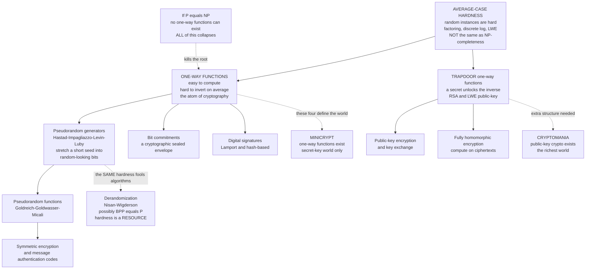

# 🔐 Complexity, Cryptography and Average-Case Hardness

> [!abstract] TL;DR
> Cryptography is **complexity theory weaponized**: it turns "some problems are hard to compute" into "your secrets are safe." But it needs a *special* kind of hardness. **NP-completeness is a worst-case guarantee** — it only says *some* instances of a problem are hard, which is useless if the instance *you* generated (your key) happens to be easy. Cryptography demands **average-case hardness**: a *randomly generated* instance must be hard, so that a randomly generated key is secure. The foundational object is the **one-way function** — easy to compute, hard to invert *on average* — and its existence is a *stronger* assumption than $\mathrm{P} \neq \mathrm{NP}$. From one-way functions flows an entire hierarchy: pseudorandom generators (Håstad–Impagliazzo–Levin–Luby), pseudorandom functions, bit commitments, digital signatures, and symmetric encryption (the world Impagliazzo calls **Minicrypt**); public-key encryption needs the extra structure of a **trapdoor** (the world **Cryptomania**). The same hardness that hides secrets also **fools randomness** — pseudorandom generators built from hard functions can derandomize $\mathrm{BPP}$, so *hardness is a resource*. Modern lattice cryptography (Learning With Errors) is special because it comes with a rare **worst-case-to-average-case reduction**: breaking a random instance is as hard as solving the *worst* case of a lattice problem. The unsettling punchline: **the entire digital world's security rests on unproven complexity conjectures.** Nobody has proved even one one-way function exists.

---

## Intuition

**Analogy — the lock, the key, and the one-way street.** A good padlock has a beautiful asymmetry. If you *have* the key, opening it is instant and effortless — a fraction of a second. If you *do not* have the key, opening it means either destroying the lock or trying keys one by one for what might be centuries. The lock is a **one-way street for effort**: cheap to traverse forward (lock it, verify a key), ruinously expensive to traverse backward (pick it open). Cryptography is the science of manufacturing that asymmetry out of *pure computation* — building mathematical locks where "locking" is a fast polynomial calculation and "picking" is a search that blows up exponentially.

But here is the subtlety that separates cryptography from ordinary complexity theory. It is not enough for the lock to be hard to pick *sometimes*. A padlock company that shipped a million locks where only *one* was genuinely secure and the other 999,999 popped open with a paperclip would be out of business. **Cryptography needs *every* randomly built lock to be hard** — hard on the *typical*, *average*, *randomly-chosen* instance, because that is exactly what a freshly generated key *is*. NP-completeness promises only that the *hardest* lock in the catalogue resists you; cryptography needs the *random* lock to resist you. That gap — between "some instances are hard" (worst-case) and "random instances are hard" (average-case) — is the entire subject.

---

## How It Works

### The two-way street between complexity and cryptography

Complexity theory and cryptography are **duals** that feed each other:

- **Complexity → Cryptography.** Every cryptosystem is a *bet* that some computation is hard. RSA bets factoring is hard; Diffie–Hellman bets discrete log is hard; lattice schemes bet Learning With Errors is hard. Without hard problems there is no cryptography at all.
- **Cryptography → Complexity.** Conversely, the *demands* of cryptography (average-case hardness, one-way functions, pseudorandomness) turned out to be some of the deepest questions in complexity theory — and the machinery built to answer them (pseudorandom generators, hardness amplification, worst-case-to-average-case reductions) reshaped the whole field.

The bridge between them is the observation that **verification is easy, search is hard** — the very asymmetry at the heart of [[P_versus_NP]] and [[The_Class_NP_and_Verification]]. A cryptographic key is precisely a short *certificate* that is trivial to verify but (we hope) infeasible to find.

### Why NP-completeness is *not enough*: worst-case versus average-case

Here is the single most important — and most counterintuitive — idea in the subject.

**NP-completeness is a *worst-case* statement.** When we say SAT is NP-complete ([[NP_Completeness_and_the_Cook_Levin_Theorem]]), we mean: *there exist* SAT instances that (if $\mathrm{P} \neq \mathrm{NP}$) no polynomial algorithm cracks. But "there exist hard instances" says **nothing** about whether a *randomly generated* instance is hard. In fact, many NP-complete problems are *easy on average*: random 3-SAT away from its critical threshold, random graph coloring, random subset-sum — polynomial heuristics solve the *typical* case even though the *worst* case is intractable.

That is fatal for cryptography, because a key is a *random* instance:

$$\text{Worst-case hard} \;\not\Longrightarrow\; \text{Average-case hard} \;\not\Longrightarrow\; \text{Secure key}$$

A cipher whose security rested on NP-completeness alone could be perfectly "hard" in the worst case and yet hand an attacker an easy random key every single time. **Cryptography needs average-case hardness**: the guarantee that if you sample an instance from the *key-generation distribution*, it is hard *with overwhelming probability*. Formalizing "hard on average" is the subject of **average-case complexity theory** — Levin's theory of **distributional NP (DistNP)** and its complete problems — and it remains far more delicate and far less understood than worst-case theory. Whether DistNP-complete (average-case hard) problems even exist is open, and it is one of Impagliazzo's five worlds (below).

### One-way functions: the atom of cryptography

A **one-way function (OWF)** is the minimal object that makes cryptography possible. Informally, $f$ is one-way if:

1. **Easy forward.** $f(x)$ is computable in polynomial time for every $x$.
2. **Hard backward on average.** For a *randomly chosen* $x$, *no* polynomial-time algorithm can find *any* preimage of $f(x)$ except with negligible probability.

Formally, for every probabilistic polynomial-time adversary $A$ there is a negligible function $\varepsilon$ with

$$\Pr_{x \leftarrow \{0,1\}^n}\big[\, A(f(x)) \in f^{-1}(f(x)) \,\big] \le \varepsilon(n).$$

Two facts fix the OWF's place in the complexity universe:

- **OWFs imply $\mathrm{P} \neq \mathrm{NP}$.** Inverting $f$ is an $\mathrm{NP}$ search (a preimage is a short certificate). If $\mathrm{P} = \mathrm{NP}$, that search is easy, so no OWF can exist. Hence **if $\mathrm{P} = \mathrm{NP}$, cryptography as we know it collapses.**
- **But $\mathrm{P} \neq \mathrm{NP}$ does *not* imply OWFs.** The separation is worst-case; OWFs demand average-case hardness *plus* the ability to *sample* hard instances *with* their solution. So OWFs are a **strictly stronger assumption** than $\mathrm{P} \neq \mathrm{NP}$. This is why "P vs NP is settled" would *not* automatically secure — or automatically break — cryptography.

**Candidate one-way functions** (none *proven*, all *conjectured*):

| Candidate | Easy forward | Hard inverse (the conjecture) |
|-----------|--------------|-------------------------------|
| **Multiplication** | $N = p \cdot q$ | **Factoring** $N$ into $p, q$ |
| **Modular exponentiation** | $y = g^x \bmod p$ | **Discrete logarithm**: recover $x$ |
| **Lattices / LWE** | noisy linear system $b = As + e$ | **Learning With Errors**: recover $s$ |

### From one one-way function to the whole edifice

The astonishing theorems of the 1980s–90s show that the *single* assumption "OWFs exist" bootstraps almost all of **symmetric** cryptography:

- **OWF ⟹ Pseudorandom Generator (PRG).** The celebrated **Håstad–Impagliazzo–Levin–Luby (HILL) theorem** (1999): *any* one-way function yields a pseudorandom generator — a deterministic map that stretches a short random seed into a long string no efficient algorithm can distinguish from true randomness.
- **PRG ⟹ Pseudorandom Function (PRF).** The **Goldreich–Goldwasser–Micali (GGM) construction** turns a PRG into a keyed function family indistinguishable from a random function.
- **PRF ⟹ symmetric encryption and message authentication (MACs).** With a PRF you get semantically secure secret-key encryption and unforgeable authentication ([[Symmetric_Encryption]], [[Hash_Functions_and_MACs]]).
- **OWF ⟹ bit commitments and digital signatures.** OWFs alone give commitment schemes (a cryptographic "sealed envelope") and, via Lamport/Merkle, hash-based digital signatures.

What OWFs do **not** obviously give is **public-key encryption**. For that you need extra algebraic structure: a **trapdoor one-way function** — one-way to everyone, but efficiently invertible *if you hold a secret trapdoor* (RSA's private key, an LWE secret). Trapdoors are what let strangers who share no secret still communicate privately ([[Asymmetric_Cryptography_and_PKI]]).

### Impagliazzo's five worlds

Impagliazzo (1995) organized the whole landscape into **five possible worlds**, depending on *which* hardness holds:

1. **Algorithmica** — $\mathrm{P} = \mathrm{NP}$ (or effectively so). Search is as easy as verification. No cryptography, but automated everything.
2. **Heuristica** — $\mathrm{P} \neq \mathrm{NP}$ in the *worst* case, but every NP problem is *easy on average*. Hard instances exist but are impossible to *find*. Still no cryptography.
3. **Pessiland** — average-case hard NP problems exist (DistNP is hard), **but one-way functions do not**. The worst of all worlds: hard problems you cannot exploit, and no cryptography either. You can generate hard instances but never together with a solution.
4. **Minicrypt** — **one-way functions exist**, so all of *symmetric* cryptography works (PRGs, PRFs, MACs, signatures, secret-key encryption) — but public-key encryption does *not*.
5. **Cryptomania** — **trapdoor functions / public-key encryption exist**. The richest world: secure key exchange, public-key encryption, and (with more) fully homomorphic encryption and secure multiparty computation.

We believe we live in **Cryptomania**, but *we cannot prove we are not in Algorithmica.* Every layer of the online world is a bet on which world is real.

### Hardness versus randomness: hardness is a resource

The same machinery has a stunning second life. A pseudorandom generator's job is to **fool** efficient observers into treating deterministic bits as random. But that is exactly what you need to **derandomize** a randomized algorithm — to replace its coin flips with pseudorandom bits and get the same answer deterministically. The **Nisan–Wigderson** paradigm and the hardness-versus-randomness program show:

$$\text{sufficiently hard functions} \;\Longrightarrow\; \text{strong PRGs} \;\Longrightarrow\; \mathrm{BPP} = \mathrm{P}$$

i.e. if certain problems require exponential-size circuits, then *randomness buys nothing* and every efficient randomized algorithm can be made deterministic (see randomized complexity classes such as $\mathrm{BPP}$). This is the beautiful **duality**: the *very same* hardness assumptions that let cryptography *hide* information let complexity theory *eliminate* randomness. **Hardness is not just an obstacle — it is a resource** you can spend on secrecy or on derandomization.

### Lattices, LWE, and the rare worst-case guarantee

Most candidate OWFs (factoring, discrete log) offer only an *average-case conjecture* — we simply *believe* random instances are hard. **Lattice cryptography is different and precious.** Regev's **Learning With Errors (LWE)** problem comes with a **worst-case-to-average-case reduction**: solving a *random* LWE instance is provably *at least as hard* as solving the *worst case* of standard lattice problems (approximate Shortest Vector Problem, GapSVP). This is a rare and powerful guarantee — it means an attacker cannot hope to get lucky with an easy random key unless *all* lattice problems are easy. Lattices also power:

- **Post-quantum security.** No efficient *quantum* algorithm is known for lattice problems, unlike Shor's algorithm which shatters factoring and discrete log. This is why NIST's standardized post-quantum schemes (CRYSTALS-Kyber, CRYSTALS-Dilithium) are lattice-based ([[Post_Quantum_Cryptography]]).
- **Fully homomorphic encryption (FHE).** LWE's structure enables computation *directly on ciphertexts* — Gentry's breakthrough — letting a cloud compute on data it cannot read.

### Flow / Architecture — the hierarchy of cryptography built on hardness



---

## Key Concepts

### Secondary (intuitive, no CS background needed)
- **The one-way street.** A good cipher is easy to run forward (lock it) and ruinously hard to run backward (pick it) unless you hold the key. That asymmetry is the whole game.
- **A random lock, not just a hard lock.** It is not enough that *some* locks are hard to pick — *every* lock you randomly build must be hard, because your key *is* a random lock. This is the difference between "worst-case" and "average-case."
- **Security is a bet.** Every padlock on the internet is a wager that a certain math problem is hard. Nobody has *proved* it — we have only failed to break it for decades.
- **The doomsday scenario.** If someone proved the famous P versus NP question the "easy" way, most encryption would unravel overnight.

### Undergraduate (a first theory / crypto course)
- **One-way function.** Polynomial to compute, hard to invert on a *random* input. The minimal cryptographic primitive.
- **Worst-case vs average-case.** NP-completeness ([[NP_Completeness_and_the_Cook_Levin_Theorem]]) guarantees *some* hard instances; cryptography needs *random* instances hard. The two can diverge wildly — many NP-hard problems are easy on average.
- **OWF ⟹ P ≠ NP, but not conversely.** Inverting an OWF is an NP search, so OWFs force [[P_versus_NP]] to be a strict separation — yet P ≠ NP alone does *not* deliver an OWF.
- **The symmetric hierarchy.** OWF ⟹ PRG (HILL) ⟹ PRF (GGM) ⟹ secret-key encryption and MACs ([[Symmetric_Encryption]], [[Hash_Functions_and_MACs]]); OWF also gives commitments and signatures.
- **Trapdoor functions.** One-way to the world but invertible with a secret; the extra ingredient behind public-key encryption ([[Asymmetric_Cryptography_and_PKI]]).
- **Candidate hard problems.** Factoring, discrete logarithm, and lattice problems (LWE) — the three pillars of deployed cryptography.

### Graduate (advanced complexity / cryptography)
- **Distributional NP and Levin's theory.** DistNP pairs a language with an input distribution; average-case reductions and DistNP-completeness formalize "hard on average." Whether DistNP-complete problems exist is open (Heuristica vs Pessiland vs Minicrypt).
- **HILL and hardness amplification.** *Any* OWF yields a PRG (Håstad–Impagliazzo–Levin–Luby); Yao's XOR lemma and hardcore predicates (Goldreich–Levin) amplify mild hardness into strong pseudorandomness.
- **Impagliazzo's five worlds.** Algorithmica, Heuristica, Pessiland, Minicrypt, Cryptomania — a taxonomy of which primitives survive under which hardness assumptions.
- **Hardness vs randomness.** Nisan–Wigderson: exponential circuit lower bounds yield PRGs that derandomize $\mathrm{BPP}$, potentially $\mathrm{BPP} = \mathrm{P}$; Impagliazzo–Wigderson made this near-tight. Cryptographic PRGs and complexity-theoretic PRGs are two faces of one idea.
- **Worst-case-to-average-case reductions.** Generic for very high complexity (permanent, PSPACE via random self-reducibility) and — crucially — for **lattices**: Regev's reduction ties random LWE to worst-case GapSVP/SIVP, the strongest hardness foundation in deployed cryptography.
- **Beyond OWFs.** Interactive proofs and zero-knowledge, secure multiparty computation, and fully homomorphic encryption sit atop these assumptions; public-key and FHE require trapdoors / LWE structure, not OWFs alone.

---

## Python Demo

```python
# One-way functions made visceral: the forward direction is CHEAP, inverting is
# ASTRONOMICALLY dear -- and the gap grows EXPONENTIALLY with the key's bit length.
#
# We measure the asymmetry directly for two candidate one-way functions:
#
#   (A) DISCRETE LOG.  Forward:  y = g^x mod p   -- fast square-and-multiply,
#       about 1.5 * (bit length) modular multiplications: POLYNOMIAL.
#       Inverse: given y, recover x -- brute force scans up to p ~ 2^bits
#       candidates: EXPONENTIAL.
#
#   (B) FACTORING.  Forward:  N = p * q          -- ONE multiplication.
#       Inverse: given N, recover p, q -- trial division scans up to sqrt(N)
#       ~ 2^(bits/2) candidates: EXPONENTIAL.
#
# We really RUN the fast forward step and really COUNT the brute-force inverse
# steps at small bit sizes (so it finishes), then extrapolate the exponential
# cost to real cryptographic sizes to expose the "one-way" chasm.
# numpy + matplotlib only.

import numpy as np
import matplotlib.pyplot as plt

rng = np.random.default_rng(7)

# --- tiny primality + prime sampler (pure Python ints, no external libs) ------
def is_prime(n):
    if n < 2:
        return False
    if n % 2 == 0:
        return n == 2
    i = 3
    while i * i <= n:
        if n % i == 0:
            return False
        i += 2
    return True

def prime_with_bits(b):
    lo, hi = 2 ** (b - 1), 2 ** b - 1
    n = int(rng.integers(lo, hi + 1)) | 1
    while not is_prime(n):
        n += 2
        if n > hi:
            n = lo | 1
    return n

# --- (A) discrete log: measured brute-force inverse cost ----------------------
def dlog_bruteforce_steps(g, y, p):
    cur = 1
    for t in range(p):          # scan exponents 0,1,2,... until g^t == y
        if cur == y:
            return t + 1
        cur = (cur * g) % p
    return p

dl_bits = np.arange(4, 21)      # up to 2^20 ~ 1e6 steps: runs in a blink
dl_forward, dl_inverse = [], []
for b in dl_bits:
    p = prime_with_bits(b)
    g = 2
    x = int(rng.integers(1, p - 1))
    y = pow(g, x, p)                        # FORWARD: fast built-in modular exp
    dl_forward.append(1.5 * b)              # ~ square-and-multiply mults (poly)
    dl_inverse.append(dlog_bruteforce_steps(g, y, p))
dl_forward = np.array(dl_forward, float)
dl_inverse = np.array(dl_inverse, float)

# --- (B) factoring: measured trial-division inverse cost ----------------------
def factor_trial_steps(N):
    if N % 2 == 0:
        return 1
    i, steps = 3, 0
    while i * i <= N:
        steps += 1
        if N % i == 0:
            return steps
        i += 2
    return steps

fac_bits = np.arange(8, 41, 2)  # smallest factor up to ~2^20: still fast
fac_forward, fac_inverse = [], []
for b in fac_bits:
    half = b // 2
    p = prime_with_bits(half)
    q = prime_with_bits(b - half)
    N = p * q                               # FORWARD: one multiplication
    fac_forward.append(1.0)                 # a single multiply
    fac_inverse.append(factor_trial_steps(N))
fac_forward = np.array(fac_forward, float)
fac_inverse = np.array(fac_inverse, float)

# --- extrapolate the exponential inverse cost to cryptographic key sizes ------
b_ext = np.arange(4, 257)
dl_inv_theory  = 2.0 ** b_ext               # discrete log search space ~ 2^bits
fac_inv_theory = 2.0 ** (b_ext / 2.0)       # factoring search space ~ 2^(bits/2)

# reference lines
OPS_PER_YEAR = 1e18 * 3.15e7                 # exascale machine, one year of ops
ATOMS_UNIVERSE = 1e80

fig, ax = plt.subplots(1, 2, figsize=(15, 5.8))

# Left: DISCRETE LOG -- forward (poly) vs inverse (exp)
ax[0].semilogy(b_ext, dl_inv_theory, color="crimson", lw=2.2,
               label="INVERT (discrete log): ~2^bits  EXPONENTIAL")
ax[0].scatter(dl_bits, dl_inverse, color="crimson", s=28, zorder=5,
              label="measured brute-force steps")
ax[0].semilogy(b_ext, 1.5 * b_ext, color="seagreen", lw=2.2,
               label="COMPUTE forward: ~1.5*bits  POLYNOMIAL")
ax[0].scatter(dl_bits, dl_forward, color="seagreen", s=28, zorder=5)
ax[0].axhline(OPS_PER_YEAR, color="black", ls=":", lw=1.2,
              label="ops one exascale machine does / year")
ax[0].axvline(256, color="purple", ls="-.", lw=1.2,
              label="256-bit key (ECC / Diffie-Hellman scale)")
ax[0].set_xlabel("key bit length")
ax[0].set_ylabel("operations (log scale)")
ax[0].set_title("Modular exponentiation is a one-way street\n"
                "forward hugs the floor; inverting rockets past the universe")
ax[0].set_ylim(1, 1e90)
ax[0].legend(fontsize=8, loc="upper left")
ax[0].grid(True, which="major", alpha=0.3)

# Right: FACTORING -- multiply (trivial) vs factor (exp)
ax[1].semilogy(b_ext, fac_inv_theory, color="crimson", lw=2.2,
               label="FACTOR N: ~2^(bits/2)  EXPONENTIAL")
ax[1].scatter(fac_bits, fac_inverse, color="crimson", s=28, zorder=5,
              label="measured trial-division steps")
ax[1].semilogy(b_ext, np.ones_like(b_ext), color="seagreen", lw=2.2,
               label="MULTIPLY p*q: ~1 op  (essentially free)")
ax[1].axhline(OPS_PER_YEAR, color="black", ls=":", lw=1.2,
              label="ops one exascale machine does / year")
ax[1].axhline(ATOMS_UNIVERSE, color="purple", ls="-.", lw=1.2,
              label="atoms in observable universe (~1e80)")
ax[1].set_xlabel("modulus bit length")
ax[1].set_ylabel("operations (log scale)")
ax[1].set_title("Multiplication vs factoring is a one-way street\n"
                "multiplying is free; factoring blows up exponentially")
ax[1].set_ylim(1, 1e90)
ax[1].legend(fontsize=8, loc="upper left")
ax[1].grid(True, which="major", alpha=0.3)

plt.tight_layout()
plt.show()

# --- print the chasm as raw numbers ------------------------------------------
print("The one-way gap at real cryptographic sizes:")
for b in [64, 128, 256, 512]:
    print(f"  {b:>4}-bit  discrete log: compute ~ {1.5*b:>6.0f} ops   "
          f"invert ~ 2^{b} ~ {2.0**min(b,256):.2e}{'  (and up)' if b>256 else ''}")
print()
print("Punchline: the GREEN forward curves stay trivial while the RED inverse")
print("curves cross a machine-year of work around 60-90 bits and blow past the")
print("number of atoms in the universe. That measured chasm -- easy forward,")
print("infeasible backward, on a RANDOM key -- is EXACTLY what 'one-way function'")
print("means, and it is what your TLS session bets its life on.")
```

**What the demo shows.** We actually run the fast forward map (`pow(g, x, p)` and a single multiply) and actually *count* the brute-force inverse steps at small bit sizes — the crimson dots — then extrapolate the exponential trend. The green "compute forward" curves hug the bottom of the log plot (a few dozen operations even at 256 bits), while the crimson "invert" curves rocket upward: they cross a full machine-year of exascale computation somewhere around 60–90 bits and sail past the $\sim 10^{80}$ atoms in the observable universe shortly after. The measured dots track the theoretical $2^{\text{bits}}$ (discrete log) and $2^{\text{bits}/2}$ (factoring) lines, confirming the blow-up is real, not hand-waved. That visible chasm — cheap forward, infeasible backward, **on a randomly chosen key** — *is* the one-way function, and it is the concrete meaning of "average-case hardness" your encrypted connection depends on.

---

## Real-World Applications

> **Example — every TLS handshake is a live bet on average-case hardness.** When your browser opens an HTTPS connection ([[Asymmetric_Cryptography_and_PKI]]), it runs a key exchange (Diffie–Hellman or, increasingly, a lattice KEM) whose security rests entirely on a *randomly generated* instance of a hard problem being hard. The server did not pick a *worst-case* discrete-log instance — it picked a *random* one. If discrete log were merely worst-case hard but easy on average (Heuristica), your random key would fall in seconds and the "secure" connection would be transparent. The fact that billions of daily handshakes hold is empirical evidence — not proof — that we live in Cryptomania.

- **RSA and Diffie–Hellman (factoring, discrete log).** Deployed public-key cryptography is built on trapdoor one-way functions whose average-case hardness is *conjectured*. Shor's quantum algorithm breaks both — which is why the field is migrating to lattices.
- **Post-quantum standards (lattices / LWE).** NIST's CRYSTALS-Kyber (encryption) and CRYSTALS-Dilithium (signatures) are lattice schemes chosen precisely because LWE resists quantum attack *and* enjoys a worst-case-to-average-case reduction ([[Post_Quantum_Cryptography]]).
- **Symmetric ciphers and hashes (OWF ⟹ PRG ⟹ PRF).** AES and SHA are engineered pseudorandom permutations/functions — the practical embodiment of the Minicrypt hierarchy ([[Symmetric_Encryption]], [[Hash_Functions_and_MACs]]).
- **Fully homomorphic encryption.** LWE's algebra lets a cloud compute on encrypted data it cannot read — privacy-preserving machine learning and outsourced computation rest directly on lattice average-case hardness.
- **Derandomization in algorithm design.** The hardness-vs-randomness program (Nisan–Wigderson) underlies the belief that $\mathrm{BPP} = \mathrm{P}$ — that randomized algorithms can, in principle, be derandomized — reusing the *same* hardness that powers cryptography.
- **The contrast: unconditional security.** The one-time pad is secure *regardless* of any complexity assumption ([[Information_Theoretic_Security_and_Privacy]]) — but it needs a key as long as the message, which is why the whole edifice of *computational* cryptography exists at all.

---

## Common Pitfalls

- **"NP-complete means secure."** The single most common and most dangerous error. NP-completeness is **worst-case**; a cipher built on it can hand out easy *random* keys. Cryptography needs **average-case** hardness, a strictly different and subtler property. Historically, knapsack-based cryptosystems (Merkle–Hellman) were built on an NP-complete problem and were *broken* — because the random instances they generated were easy.
- **"P ≠ NP would prove cryptography is safe."** It would not. $\mathrm{P} \neq \mathrm{NP}$ is *necessary* for one-way functions but nowhere near *sufficient* — you also need average-case hardness and samplable hard instances. We could live in Pessiland: hard problems exist, yet no cryptography.
- **"P = NP would only affect a few algorithms."** It would be catastrophic for security: one-way functions could not exist, so essentially all computational cryptography collapses at once (see [[P_versus_NP]]).
- **Confusing a trapdoor function with a plain one-way function.** OWFs give you *symmetric* cryptography (Minicrypt). Public-key encryption needs the *extra* structure of a trapdoor (Cryptomania). Assuming OWFs automatically yield public-key crypto is a category error.
- **Trusting hardness without a worst-case reduction.** Factoring and discrete log are *only* average-case conjectures; a clever average-case algorithm could exist even if the worst case is hard. Lattices are prized precisely because their worst-case-to-average-case reduction rules this out — do not treat all hardness assumptions as equally solid.
- **Ignoring quantum.** Factoring and discrete log fall to Shor's algorithm on a large quantum computer; a cryptosystem "secure" against classical average-case attack may be dead against quantum ([[Post_Quantum_Cryptography]]).
- **Assuming security has been proven.** It has not. *No one-way function has ever been proved to exist.* All of computational cryptography rests on unproven complexity conjectures — a fact worth stating plainly whenever "provably secure" is claimed (it means *conditionally* secure, given an assumption).

---

## Related Concepts

- [[P_versus_NP]] — the worst-case separation that is *necessary* for cryptography; one-way functions imply $\mathrm{P} \neq \mathrm{NP}$, and $\mathrm{P} = \mathrm{NP}$ would destroy them all.
- [[NP_Completeness_and_the_Cook_Levin_Theorem]] — the archetype of *worst-case* hardness, which is exactly *not* what cryptography needs; the pitfall this note corrects.
- [[The_Class_NP_and_Verification]] — the "verify easily, find hard" asymmetry a cryptographic key exploits; a key is a hard-to-find certificate.
- [[Reductions_and_NP_Complete_Problems]] — reductions are the tool that spreads hardness; average-case and worst-case-to-average-case reductions are the cryptographic analogue.
- [[Asymmetric_Cryptography_and_PKI]] — the deployed public-key world (Cryptomania) built on trapdoor one-way functions like RSA.
- [[Post_Quantum_Cryptography]] — lattice / LWE schemes with worst-case-to-average-case reductions, chosen for quantum resistance.
- [[Symmetric_Encryption]] — the Minicrypt hierarchy in practice: PRGs and PRFs realized as stream and block ciphers.
- [[Hash_Functions_and_MACs]] — practical one-way / pseudorandom primitives underpinning integrity and authentication.
- [[Information_Theoretic_Security_and_Privacy]] — the contrast: one-time-pad security that holds *unconditionally*, independent of any hardness assumption.
- [[Kolmogorov_Complexity_and_Algorithmic_Information]] — a sibling notion of intrinsic hardness (incompressibility) with deep ties to pseudorandomness and one-way functions.
- [[Time_and_Space_Complexity]] — the resource framework in which "polynomial forward, exponential backward" is stated precisely.
- [[Theory_of_Computation_Overview]] — the vault entry point situating complexity and cryptography beside computability and automata.

*(Forthcoming siblings in this vault — randomized complexity classes, interactive proofs and zero-knowledge, and quantum computation / BQP — will deepen the hardness-vs-randomness, proof-system, and post-quantum threads referenced above.)*

---

## Review Questions

1. **(Conceptual)** Explain precisely why NP-completeness — a worst-case notion — is *insufficient* for cryptography, and what "average-case hardness" adds. Then state the two facts that place one-way functions between $\mathrm{P} \neq \mathrm{NP}$ and secure cryptography: why do OWFs imply $\mathrm{P} \neq \mathrm{NP}$, and why does $\mathrm{P} \neq \mathrm{NP}$ *not* imply OWFs?
2. **(Scenario)** A startup proposes an encryption scheme "provably as hard as an NP-complete problem" and markets it as unbreakable. Using the worst-case/average-case distinction and the history of knapsack cryptosystems, explain what could still go wrong, what you would demand to see (e.g. a worst-case-to-average-case reduction), and why lattice-based schemes give a stronger guarantee than factoring-based ones.
3. **(Trade-off / deep)** Walk through Impagliazzo's five worlds and place the following in the correct world: (a) secure public-key encryption, (b) secret-key encryption but no public-key, (c) hard-on-average NP problems with no cryptography at all, (d) $\mathrm{P}=\mathrm{NP}$. Then explain the hardness-versus-randomness duality: how can the *same* hardness assumption both *hide* information (cryptography) and *eliminate* randomness (derandomizing $\mathrm{BPP}$)? What does it mean philosophically that we cannot prove we are not in Algorithmica?

---

## Sources

- Impagliazzo, R. (1995). "A Personal View of Average-Case Complexity." *Proceedings of the 10th Annual Structure in Complexity Theory Conference*, 134–147. — The original "five worlds" essay.
- Håstad, J., Impagliazzo, R., Levin, L. A., & Luby, M. (1999). "A Pseudorandom Generator from any One-Way Function." *SIAM Journal on Computing*, 28(4), 1364–1396. — OWF ⟹ PRG.
- Regev, O. (2009). "On Lattices, Learning with Errors, Random Linear Codes, and Cryptography." *Journal of the ACM*, 56(6), 1–40. — LWE and the worst-case-to-average-case reduction.
- Nisan, N., & Wigderson, A. (1994). "Hardness vs. Randomness." *Journal of Computer and System Sciences*, 49(2), 149–167. — The hardness-versus-randomness / derandomization program.
- Goldreich, O. (2001). *Foundations of Cryptography, Volume 1: Basic Tools.* Cambridge University Press. — Rigorous treatment of OWFs, PRGs, PRFs, and the symmetric hierarchy.
- Katz, J., & Lindell, Y. (2020). *Introduction to Modern Cryptography* (3rd ed.). CRC Press. — Standard text linking computational hardness to cryptographic constructions.
- Arora, S., & Barak, B. (2009). *Computational Complexity: A Modern Approach.* Cambridge University Press. — Average-case complexity, DistNP, and hardness-vs-randomness chapters.

---

#theory-of-computation #cryptography #one-way-functions #average-case-complexity #hardness
