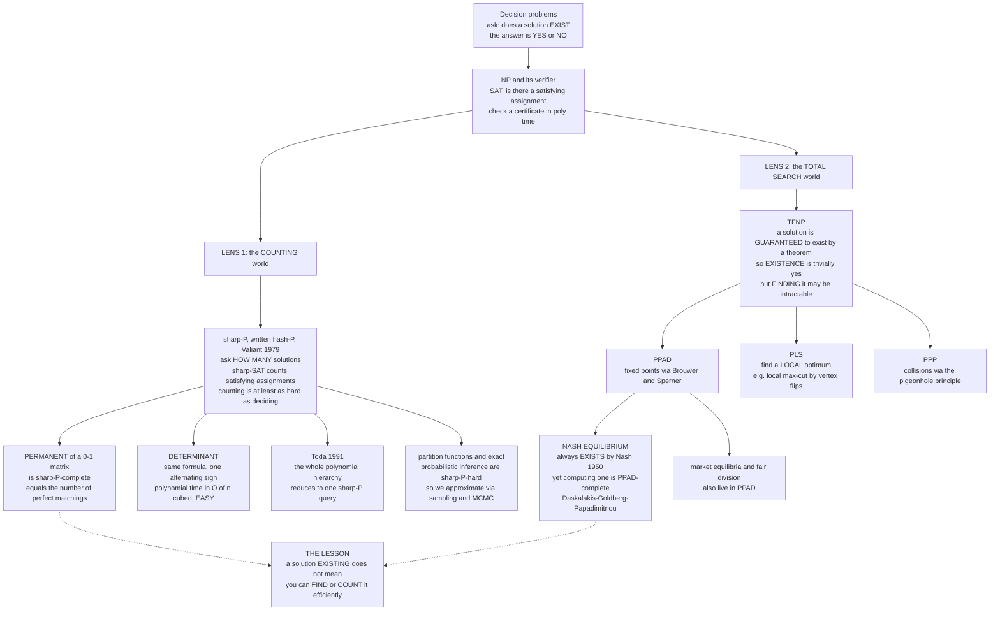

# 🧮 Counting Complexity and the Complexity of Equilibria

> [!abstract] TL;DR
> The classic P-vs-NP lens asks one question — **"does a solution exist?"** — but it is only one lens among many, and two others reveal that "exists" is a low bar. **Counting complexity** (Valiant's class **#P**, pronounced *sharp-P*) replaces "does a satisfying assignment exist?" with **"how many are there?"**; counting is at least as hard as deciding and usually far harder. The showcase is the **permanent** of a 0-1 matrix, which counts perfect matchings: it is **#P-complete**, yet its near-twin the **determinant** — differing only by alternating signs — is computable in polynomial time. **Toda's theorem** shows the entire polynomial hierarchy collapses into $\mathrm{P}^{\#\mathrm{P}}$, so counting is astonishingly powerful. The second lens is **total search**: problems whose solution is *guaranteed to exist* by a theorem, so "does one exist?" is trivially **yes**, but *finding* it may be intractable. This is the class **TFNP** and its subclasses **PPAD**, **PLS**, **PPP**. The crown jewel: every finite game has a mixed **Nash equilibrium** (Nash's theorem), yet **computing one is PPAD-complete** (Daskalakis–Goldberg–Papadimitriou), which raises a deep economic question — *if equilibria are intractable to compute, can we expect real markets to reach them?* The lesson: **a solution existing does not mean you can find or count it efficiently.**

---

## Intuition

**Analogy — the guest book and the seating chart.** Walk into a wedding and ask, *"Is there at least one valid seating that keeps the feuding families apart?"* The planner can often answer **yes** in a heartbeat: she points to one arrangement that works. Now ask a harder-sounding question: *"Exactly **how many** valid seatings are there?"* Suddenly the planner is stuck. To answer honestly she seems forced to march through an astronomical number of arrangements one by one — even though *finding a single one* was trivial. **Deciding existence and counting solutions are utterly different jobs**, and the second can be brutally harder than the first.

Now flip to a stranger phenomenon. Ask, *"Somewhere in this crowded room, are two people whose birthdays fall on the same day?"* If there are 400 guests and 365 days, a **theorem** (the pigeonhole principle) guarantees the answer is **yes** before anyone checks a single ID — existence is *free*. But *finding the actual matching pair* still means doing work. Some of the deepest problems in economics have exactly this flavor: a mathematical theorem promises a solution *must* exist, so "does it exist?" is a non-question — yet **pinning the solution down can be computationally intractable.** A market's equilibrium prices are guaranteed to exist by a fixed-point theorem; that does not mean any process, market, or algorithm can efficiently *reach* them.

These two intuitions — **counting is harder than deciding**, and **existence-by-theorem does not imply findability** — are the two frontier worlds this note maps.

---

## How It Works

This note sits directly above the decision-problem machinery of [[The_Class_NP_and_Verification]], [[NP_Completeness_and_the_Cook_Levin_Theorem]], and [[P_versus_NP]]. Those classes all ask a **yes/no** question. We now change the *question type* twice.

### Lens 1 — Counting: the class #P

An **NP** problem comes with a *verifier*: given a candidate certificate, check it in polynomial time (for SAT, check whether an assignment satisfies the formula). The class **#P** (Valiant, 1979) takes that exact same verifier and asks a *quantitative* question:

$$\text{NP asks: } \exists x?\ \text{(is the number of accepting certificates} \ge 1) \qquad \#\mathrm{P} \text{ asks: } \#\{x\} = ?$$

Formally, a function $f$ is in **#P** if there is a polynomial-time nondeterministic machine whose *number of accepting paths* on input $w$ equals $f(w)$. The canonical member is **#SAT**: *count* the satisfying assignments of a Boolean formula. A **#P-complete** problem is one to which every #P function reduces; #SAT is #P-complete.

Three facts make counting its own universe:

1. **Counting is at least as hard as deciding.** If you could count satisfying assignments, you could decide SAT for free (just ask whether the count is $> 0$). So #SAT is at least as hard as SAT.
2. **Counting can be *much* harder — the permanent/determinant split.** The **determinant** and **permanent** of an $n \times n$ matrix have almost identical definitions:
   $$\det(A) = \sum_{\sigma \in S_n} \operatorname{sgn}(\sigma) \prod_{i} A_{i,\sigma(i)}, \qquad \operatorname{perm}(A) = \sum_{\sigma \in S_n} \prod_{i} A_{i,\sigma(i)}.$$
   The *only* difference is the alternating sign $\operatorname{sgn}(\sigma)$. That sign lets Gaussian elimination compute the determinant in $O(n^3)$ time ([[Matrices_and_Determinants]]). Drop it, and **Valiant (1979) proved the permanent of a 0-1 matrix is #P-complete** — as hard as counting solutions to *any* NP problem. For a 0-1 matrix the permanent equals **the number of perfect matchings** of the corresponding bipartite graph. So *deciding* whether a perfect matching exists is in P (Hopcroft–Karp), yet *counting* them is #P-complete. A tiny algebraic sign is the wall between easy and intractable.
3. **Counting is stunningly powerful — Toda's theorem (1991).** Toda proved $\mathrm{PH} \subseteq \mathrm{P}^{\#\mathrm{P}}$: a single call to a #P oracle is enough to solve *every* problem in the entire polynomial hierarchy. Counting quietly subsumes all the alternating $\exists/\forall$ layers above NP.

**Why physicists and ML people care.** A #P sum is exactly a **partition function** $Z = \sum_{\text{states}} e^{-\beta E(\text{state})}$ in statistical mechanics ([[Classical_Statistical_Mechanics]]) and exactly the **normalizing constant** $\sum_x p(x)$ of a probability model. So **exact probabilistic inference and computing partition functions are #P-hard** — this is the fundamental reason we approximate. **Approximate counting** connects to **sampling**: for many problems, *almost-uniform sampling* of solutions and *approximate counting* are polynomial-time equivalent, which is why **Markov-chain Monte Carlo** ([[Markov_Chains]], [[Bayesian_Statistics]]) is the workhorse. Jerrum, Sinclair, and Vigoda (2004) gave a celebrated **FPRAS** (fully polynomial randomized approximation scheme) for the permanent of a non-negative matrix via a rapidly-mixing Markov chain — so the exact count is #P-hard, but a good *estimate* is tractable.

### Lens 2 — Total search and PPAD: when existence is free but finding is hard

**TFNP** (Total Function NP) is the class of search problems where **every input has a solution** and a solution is verifiable in polynomial time. Because existence is *guaranteed*, the yes/no decision question is vacuous — the challenge is purely to **produce** the object. TFNP has no complete problem under the usual assumptions, so it fractures into subclasses defined by *which existence theorem* guarantees the solution:

- **PPAD** — *Polynomial Parity Argument, Directed.* Solutions guaranteed by **Brouwer's fixed-point theorem** and its combinatorial shadow, **Sperner's lemma** ("a properly 3-colored triangulation must contain a trichromatic cell"). Following a directed path that must have an endpoint.
- **PLS** — *Polynomial Local Search.* Solutions guaranteed because **every finite descent must reach a local minimum**. Finding a **local optimum** of an objective under a neighborhood — e.g. a local max-cut under single-vertex flips — is PLS-complete.
- **PPP** — *Polynomial Pigeonhole Principle.* Solutions guaranteed by the pigeonhole principle: a collision *must* exist.

**The landmark result — Nash equilibrium is PPAD-complete.** Nash (1950) proved via a fixed-point theorem that **every finite game has at least one mixed-strategy equilibrium** ([[Nash_Equilibrium]], [[Mixed_Strategies]]). Existence is a *theorem* — so "does an equilibrium exist?" is always **yes**, uninteresting. But **Daskalakis, Goldberg, and Papadimitriou (2006–2009)** proved that **computing** a Nash equilibrium (even approximately, even for 2-player games by Chen–Deng) is **PPAD-complete** — as hard as finding *any* Brouwer fixed point. There is (conjecturally) no polynomial algorithm.

**Why economists lost sleep over this.** Equilibrium is the central predictive concept of economics ([[Market_Equilibrium]], [[Nash_Equilibrium_Applications]]): we model markets and strategic agents *as if* they settle at an equilibrium. But if computing that equilibrium is PPAD-complete, then **no efficient procedure — and plausibly no real market dynamic — can be guaranteed to reach it.** As Papadimitriou put it, *"if your laptop can't find it, neither can the market."* Intractability becomes a critique of equilibrium as an empirical prediction. **Market equilibria** (Arrow–Debreu) and **fair-division** problems share this PPAD signature.

### Flow / Architecture — two worlds beyond decision



---

## Key Concepts

### Secondary (intuitive, no CS background needed)
- **"Exists" is the easy question.** Asking *whether* a solution exists is often easy; asking *how many* there are, or actually *producing* one, can be vastly harder.
- **Counting harder than finding.** Finding one valid arrangement can be quick, while counting *all* valid arrangements forces you through an astronomical list.
- **Guaranteed but unfindable.** A rule can *promise* an answer exists (400 people, 365 birthdays — a shared birthday must occur) without telling you how to *locate* it cheaply.
- **The economics punchline.** Markets are supposed to reach an equilibrium, but if computing that equilibrium is intractable, we cannot assume the market will actually get there.

### Undergraduate (a first theory or algorithms course)
- **#P and #SAT.** #P counts the accepting certificates of an NP verifier; **#SAT** (count satisfying assignments) is #P-complete. Counting $\ge$ deciding, always.
- **Permanent vs determinant.** Identical formulas up to the sign $\operatorname{sgn}(\sigma)$. Determinant is $O(n^3)$; **permanent of a 0-1 matrix is #P-complete** (Valiant) and equals the number of perfect matchings.
- **Decision easy, counting hard — concretely.** Whether a bipartite graph *has* a perfect matching is in P (Hopcroft–Karp); *counting* the matchings is #P-complete.
- **TFNP intuition.** Search problems with a *guaranteed* solution: existence is trivial, finding is the whole game.
- **Nash is PPAD-complete.** Existence is Nash's theorem (free); computing an equilibrium is complete for PPAD — believed intractable.

### Graduate (advanced complexity theory)
- **Toda's theorem.** $\mathrm{PH} \subseteq \mathrm{P}^{\#\mathrm{P}}$: one #P oracle call subsumes the entire polynomial hierarchy — counting is more powerful than any fixed alternation depth.
- **Valiant's proof and holographic algorithms.** The permanent's #P-completeness launched Valiant's later theory of **holographic algorithms**, where matchgates turn some counting problems polynomial by cancellation.
- **Approximate counting $\equiv$ sampling.** For self-reducible problems, *approximate counting* and *almost-uniform sampling* are polynomial-time interreducible (Jerrum–Valiant–Vazirani); the **JSV** FPRAS estimates the non-negative permanent via a rapidly-mixing Markov chain.
- **TFNP taxonomy.** PPAD $\subseteq$ PPA, plus PLS, PPP, CLS = PPAD $\cap$ PLS; each is defined by the *existence theorem* (Brouwer/Sperner, local search, pigeonhole) certifying totality. TFNP-completeness is unlikely (would imply NP $\cap$ coNP structure), so the subclass structure is essential.
- **Hardness of equilibria.** 2-player Nash is PPAD-complete (Chen–Deng); approximate Nash ($\varepsilon$-NE) is PPAD-hard for inverse-polynomial $\varepsilon$; **local max-cut** and pure Nash in congestion games are **PLS-complete**; Arrow–Debreu market equilibrium is PPAD-complete.
- **Physics/ML link.** Ising/Potts partition functions and permanents of non-negative matrices are #P-hard exactly; this grounds the intractability of exact inference in graphical models ([[Information_Theory_Overview]]) and motivates variational and Monte-Carlo approximation.

---

## Python Demo

```python
# COUNTING vs DECISION, made visceral -- numpy + matplotlib only.
#
# Two demonstrations of the same moral: "a solution exists" is CHEAP,
# but "how many solutions?" is EXPENSIVE.
#
# Panel A -- #SAT.  For a random Boolean formula we show that DECIDING
#   satisfiability (find ONE satisfying assignment) is quick, while
#   COUNTING all satisfying assignments forces a walk over all 2**n rows.
#   We plot: (1) counting cost 2**n, (2) the actual solution count, and
#   (3) the expected work a decision procedure needs to hit its FIRST
#   solution (tiny whenever solutions are plentiful).
#
# Panel B -- PERMANENT vs DETERMINANT.  Same formula up to a sign.
#   The permanent of a 0-1 matrix = number of perfect matchings and is
#   #P-complete; we compute it EXACTLY via Ryser's formula (cost ~2**n).
#   The determinant (one alternating sign) is computed in ~n**3.  We plot
#   the two cost curves to show the exponential-vs-polynomial chasm that a
#   single sign creates.

import numpy as np
import matplotlib.pyplot as plt

rng = np.random.default_rng(7)

# ---------------------------------------------------------------------------
# Panel A: brute-force #SAT on random under-constrained 3-CNF formulas
# ---------------------------------------------------------------------------
def all_assignments(n):
    # rows = 2**n boolean assignments, columns = variables
    idx = np.arange(2 ** n, dtype=np.uint64)
    bits = ((idx[:, None] >> np.arange(n, dtype=np.uint64)) & 1).astype(np.int8)
    return bits  # shape (2**n, n), entries 0/1

def count_sat(n, m, rng):
    """Exact count of satisfying assignments of a random 3-CNF with m clauses."""
    A = all_assignments(n)                 # (2**n, n)
    sat = np.ones(A.shape[0], dtype=bool)  # a row stays True while all clauses hold
    for _ in range(m):
        vars_ = rng.choice(n, size=3, replace=False)
        signs = rng.integers(0, 2, size=3)          # required truth value per literal
        # clause satisfied if ANY literal matches its required sign
        clause = np.zeros(A.shape[0], dtype=bool)
        for v, s in zip(vars_, signs):
            clause |= (A[:, v] == s)
        sat &= clause
    return int(sat.sum())

ns          = np.arange(4, 19)      # variable counts
count_cost  = 2.0 ** ns            # cost to COUNT: must inspect every assignment
sol_counts  = []                   # actual number of satisfying assignments
decide_cost = []                   # expected assignments scanned to find the FIRST

for n in ns:
    m = 2 * n                       # under-constrained -> usually many solutions
    c = count_sat(n, m, rng)
    sol_counts.append(max(c, 0))
    # A decision procedure scanning assignments in random order hits its first
    # solution after ~ 2**n / (count + 1) tries -- tiny when solutions abound.
    decide_cost.append(2.0 ** n / (c + 1))

sol_counts  = np.array(sol_counts, dtype=float)
decide_cost = np.array(decide_cost, dtype=float)

print("Panel A -- #SAT (n variables, m = 2n clauses)")
print(f"{'n':>3} | {'#solutions':>12} | {'count cost 2^n':>14} | {'decide cost ~2^n/(c+1)':>22}")
print("-" * 60)
for n, c, cc, dc in zip(ns, sol_counts, count_cost, decide_cost):
    print(f"{n:>3} | {int(c):>12} | {cc:>14.3g} | {dc:>22.3g}")

# ---------------------------------------------------------------------------
# Panel B: permanent (Ryser, ~2**n) vs determinant (~n**3) of 0-1 matrices
# ---------------------------------------------------------------------------
def permanent_ryser(A):
    """Exact permanent via Ryser's formula: sum over 2**n subsets. Cost ~2**n * n."""
    n = A.shape[0]
    total = 0.0
    # iterate over all nonempty subsets S of columns via bitmasks
    for mask in range(1, 1 << n):
        bits = [(mask >> j) & 1 for j in range(n)]
        cols = np.array(bits, dtype=float)          # indicator of chosen columns
        row_sums = A @ cols                         # sum over chosen columns, per row
        prod = np.prod(row_sums)
        sign = -1.0 if (n - sum(bits)) % 2 else 1.0
        total += sign * prod
    return total  # equals number of perfect matchings for a 0-1 biadjacency matrix

ns_pm    = np.arange(2, 11)
perm_ops = 2.0 ** ns_pm * ns_pm      # Ryser cost ~ 2^n * n  (permanent, #P-complete)
det_ops  = ns_pm.astype(float) ** 3  # Gaussian elimination ~ n^3  (determinant, EASY)

print("\nPanel B -- permanent (=perfect matchings) vs determinant, random 0-1 matrix")
print(f"{'n':>3} | {'permanent':>10} | {'determinant':>12}")
print("-" * 34)
for n in ns_pm:
    M = rng.integers(0, 2, size=(n, n)).astype(float)
    pm = permanent_ryser(M)
    dt = np.linalg.det(M)
    print(f"{n:>3} | {int(round(pm)):>10} | {dt:>12.2f}")

# ---------------------------------------------------------------------------
# Plots
# ---------------------------------------------------------------------------
fig, ax = plt.subplots(1, 2, figsize=(15, 5.6))

# Panel A: counting cost vs decision cost vs actual count
ax[0].semilogy(ns, count_cost,  color="crimson",  lw=2.3, marker="o",
               label="COUNT all solutions: cost = 2^n  (blows up)")
ax[0].semilogy(ns, np.maximum(sol_counts, 0.5), color="darkorange", lw=2.0, marker="s",
               label="actual #satisfying assignments")
ax[0].semilogy(ns, np.maximum(decide_cost, 0.5), color="seagreen", lw=2.3, marker="^",
               label="DECIDE existence: work to find FIRST solution (stays small)")
ax[0].set_xlabel("number of Boolean variables n")
ax[0].set_ylabel("operations / count (log scale)")
ax[0].set_title("#SAT: deciding is cheap, counting explodes\n"
                "(random 3-CNF, m = 2n clauses)")
ax[0].legend(fontsize=8, loc="upper left")
ax[0].grid(True, which="major", alpha=0.3)

# Panel B: permanent (2^n) vs determinant (n^3) -- one sign flip
ax[1].semilogy(ns_pm, perm_ops, color="crimson",  lw=2.3, marker="o",
               label="PERMANENT via Ryser ~ 2^n  (#P-complete)")
ax[1].semilogy(ns_pm, det_ops,  color="steelblue", lw=2.3, marker="s",
               label="DETERMINANT ~ n^3  (polynomial, EASY)")
ax[1].fill_between(ns_pm, det_ops, perm_ops, color="crimson", alpha=0.08)
ax[1].set_xlabel("matrix size n")
ax[1].set_ylabel("operations (log scale)")
ax[1].set_title("One alternating sign is the whole wall:\n"
                "permanent (count matchings) vs determinant")
ax[1].annotate("same formula,\nonly the sign differs",
               xy=(9, 2.0 ** 9 * 9), xytext=(3.2, 1e5),
               fontsize=9, color="darkred",
               arrowprops=dict(arrowstyle="->", color="darkred"))
ax[1].legend(fontsize=9, loc="upper left")
ax[1].grid(True, which="major", alpha=0.3)

plt.tight_layout()
plt.show()

print("\nPunchline: existence is cheap. In Panel A a decision procedure finds a")
print("solution almost instantly while COUNTING them scales as 2^n. In Panel B a")
print("single alternating sign separates the polynomial determinant from the")
print("#P-complete permanent -- deciding a matching exists is easy, counting is hard.")
```

**What the demo shows.** *Panel A:* on a log scale the green "decide" curve (work to find the *first* satisfying assignment) hugs the bottom — when solutions are plentiful, existence is settled almost immediately — while the red "count" curve climbs as $2^n$, because certifying an *exact* count seems to require inspecting every one of the $2^n$ assignments. The orange curve is the actual solution count. *Panel B:* the determinant curve ($n^3$) stays polynomial and low, while the permanent computed by Ryser's formula rockets as $2^n$ — and the *only* difference between the two quantities is the alternating sign $\operatorname{sgn}(\sigma)$. That shaded chasm is Valiant's result made visible: **deciding whether a perfect matching exists is easy, but counting matchings (the permanent) is #P-complete.**

---

## Real-World Applications

> **Example — Nash equilibrium's PPAD-completeness reframes economics and AI.** When a game engine, an auction platform ([[Algorithmic_Game_Theory]]), or a market simulator needs to *predict* how strategic agents will behave, it invokes **Nash equilibrium**: the profile where no player wants to deviate. Nash's theorem guarantees one *exists* for any finite game — so existence is never the obstacle. But because *computing* one is **PPAD-complete**, large games have **no known efficient solver**, and — more profoundly — there is reason to doubt that any *real* market or learning dynamic reliably converges to equilibrium. This is why algorithmic game theory studies the **price of anarchy** ([[Price_of_Anarchy]]) and *approximate* or *correlated* equilibria (which *are* efficiently computable) as more realistic predictions than exact Nash.

- **Probabilistic inference and ML.** The normalizing constant (partition function) of a graphical model is a #P sum, so *exact* inference is #P-hard. This is the root reason production systems use **variational inference, belief propagation, and MCMC sampling** ([[Bayesian_Statistics]], [[Markov_Chains]]) instead of exact marginals ([[Information_Theory_Overview]]).
- **Statistical mechanics.** Computing the Ising-model partition function is #P-hard in general ([[Classical_Statistical_Mechanics]]); physicists rely on Monte-Carlo estimation and exactly-solvable special cases (planar Ising via Pfaffians/determinants — a rare tractable island).
- **Network reliability and counting.** "What fraction of failure scenarios keep the network connected?" is a #P counting problem; engineers estimate it by sampling rather than exact enumeration.
- **Combinatorics and permanents.** Counting perfect matchings (permanents) appears in chemistry (molecular structure enumeration) and physics (dimer coverings); the JSV **FPRAS** provides provable approximate counts where exact counts are hopeless.
- **Local optimization in practice.** Many heuristics (local search for **max-cut**, k-means, hill-climbing) are exactly the PLS setting: a local optimum is *guaranteed* to exist, but reaching it can require exponentially many improving steps in the worst case.

---

## Common Pitfalls

- **Confusing "decision is easy" with "counting is easy."** Perfect-matching *existence* is polynomial (Hopcroft–Karp), but *counting* matchings (the permanent) is #P-complete. Easy decision says nothing about counting cost — they are separate complexity questions.
- **Thinking the determinant/permanent gap is about a hard *problem*.** It is not the matrix that is hard; it is the *sign*. The alternating $\operatorname{sgn}(\sigma)$ enables cancellation and Gaussian elimination. Remove it and cancellation vanishes, so no polynomial method is known. The lesson: tiny changes to a definition can cross the tractability line.
- **Believing "a solution exists" implies "you can find it."** TFNP problems have *guaranteed* solutions by theorem, yet finding them (Nash equilibrium, Brouwer fixed points) can be PPAD-complete. Existence proofs are frequently *non-constructive*.
- **Assuming Nash equilibrium is a safe behavioral prediction for large games.** Its PPAD-completeness means neither algorithms nor plausibly real agents can be assumed to reach it efficiently. Correlated and approximate equilibria are the computationally realistic fallbacks.
- **Treating #P-hardness as "impossible."** #P problems are perfectly *computable* — just (believed) super-polynomial exactly. **Approximate** counting via sampling is often polynomial (the JSV permanent FPRAS), so #P-hardness forbids *exact-and-fast*, not *approximate-and-fast*.
- **Conflating PPAD-hard with NP-hard.** They are different failure modes. NP-hardness is about *deciding* existence; PPAD-hardness is about *finding* an object whose existence is already guaranteed. A PPAD problem cannot be NP-hard unless NP = coNP.
- **Assuming quantum or "more compute" dissolves these.** No known quantum algorithm makes the permanent or Nash tractable; in fact **boson sampling** is *based* on the permanent's #P-hardness as evidence of quantum advantage.

---

## Related Concepts

- [[The_Class_NP_and_Verification]] — the decision-class base: #P reuses NP's *verifier* but asks *how many* certificates instead of *whether one exists*.
- [[NP_Completeness_and_the_Cook_Levin_Theorem]] — SAT's NP-completeness; #SAT is its counting counterpart and is #P-complete.
- [[P_versus_NP]] — the yes/no lens this note transcends; #P sits *above* NP and TFNP sits *inside* the guaranteed-solution world.
- [[Reductions_and_NP_Complete_Problems]] — the reduction machinery, adapted to *parsimonious* (count-preserving) reductions for #P-completeness.
- [[Time_and_Space_Complexity]] — the resource framework in which "polynomial determinant vs exponential permanent" is measured.
- [[Nash_Equilibrium]] — guaranteed to exist by Nash's theorem, yet PPAD-complete to compute; the flagship total-search intractability.
- [[Mixed_Strategies]] — mixed equilibria are what Nash's existence theorem guarantees and what PPAD-hardness makes hard to find.
- [[Algorithmic_Game_Theory]] — the field studying exactly these computational limits of equilibria, prices, and mechanisms.
- [[Price_of_Anarchy]] — a companion response: quantify equilibrium *quality* when reaching exact equilibrium is intractable.
- [[Market_Equilibrium]] — Arrow–Debreu market equilibria are also PPAD-complete, sharpening the "can markets compute?" question.
- [[Nash_Equilibrium_Applications]] — economic uses of equilibrium that the PPAD result calls into question as predictions.
- [[Matrices_and_Determinants]] — the polynomial determinant whose sign-flipped twin, the permanent, is #P-complete.
- [[Markov_Chains]] — the engine of MCMC approximate counting and sampling that sidesteps #P-hardness.
- [[Bayesian_Statistics]] — inference whose normalizing constant is a #P sum, forcing approximate methods.
- [[Classical_Statistical_Mechanics]] — partition functions as #P sums; the physics face of counting complexity.
- [[Information_Theory_Overview]] — inference, entropy, and free energy where #P-hardness of $Z$ explains intractability.

---

## Review Questions

1. **(Conceptual)** Explain precisely why *counting* satisfying assignments (#SAT) is at least as hard as *deciding* satisfiability (SAT), and why the reverse is not obviously true. Then explain how the determinant and permanent, sharing an almost-identical formula, end up on opposite sides of the tractability line — what exactly does the alternating sign buy you?
2. **(Scenario)** Your team models a large multiplayer marketplace and wants to *predict* agent behavior by computing its Nash equilibrium. A stakeholder says, "Nash proved an equilibrium always exists, so we just need to find it." Explain why existence being guaranteed does *not* make the computation easy, name the complexity class involved, and recommend what to compute *instead* if an exact Nash equilibrium is out of reach.
3. **(Trade-off / deep)** You must estimate the partition function $Z = \sum_x e^{-\beta E(x)}$ of a large graphical model. Computing it exactly is #P-hard. (a) Explain why exact inference is #P-hard by relating $Z$ to a counting problem. (b) Describe how *approximate counting via sampling* (MCMC) can be polynomial even though exact counting is not, and what "rapidly mixing" has to hold for this to work. (c) Contrast this #P situation with the PPAD situation for Nash equilibrium: in which case is the obstacle *counting/summation* and in which is it *finding a guaranteed object*, and why does that distinction change which approximation strategy makes sense?

---

## Sources

- Valiant, L. G. (1979). "The Complexity of Computing the Permanent." *Theoretical Computer Science*, 8(2), 189–201. — Introduces #P and proves the 0-1 permanent is #P-complete.
- Toda, S. (1991). "PP is as Hard as the Polynomial-Time Hierarchy." *SIAM Journal on Computing*, 20(5), 865–877. — Toda's theorem: $\mathrm{PH} \subseteq \mathrm{P}^{\#\mathrm{P}}$.
- Jerrum, M., Sinclair, A., & Vigoda, E. (2004). "A Polynomial-Time Approximation Algorithm for the Permanent of a Matrix with Nonnegative Entries." *Journal of the ACM*, 51(4), 671–697. — The JSV FPRAS via a rapidly-mixing Markov chain.
- Daskalakis, C., Goldberg, P. W., & Papadimitriou, C. H. (2009). "The Complexity of Computing a Nash Equilibrium." *SIAM Journal on Computing*, 39(1), 195–259. — Nash equilibrium is PPAD-complete.
- Papadimitriou, C. H. (1994). "On the Complexity of the Parity Argument and Other Inefficient Proofs of Existence." *Journal of Computer and System Sciences*, 48(3), 498–532. — Defines TFNP, PPAD, PLS, PPP.
- Arora, S., & Barak, B. (2009). *Computational Complexity: A Modern Approach*. Cambridge University Press. — Chapters on #P, Toda's theorem, and total search classes.

---

#theory-of-computation #counting-complexity #sharp-p #ppad #nash-equilibrium
