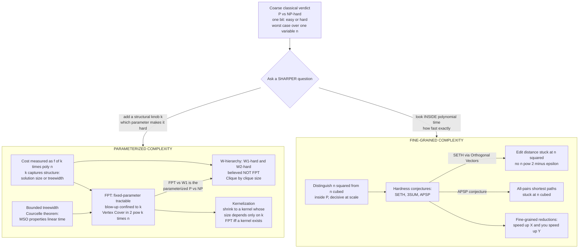

# 🔬 Parameterized and Fine-Grained Complexity

> [!abstract] TL;DR
> Classical complexity delivers a **blunt one-bit verdict** — a problem is in $\mathrm{P}$ (easy) or NP-hard (hard) — but that dichotomy throws away most of what practitioners actually care about. Two modern refinements sharpen the lens. **Parameterized complexity** (Downey–Fellows) measures difficulty in terms of the input size $n$ *and* a secondary **parameter** $k$ capturing some structural feature; a problem is **fixed-parameter tractable (FPT)** if it runs in $f(k)\cdot n^{O(1)}$, so the exponential blow-up is *quarantined inside $k$* and the problem is practical whenever $k$ is small — **Vertex Cover** in $O(2^k\, n)$ is the poster child, versus the naive $n^k$. Its hard core is the **W-hierarchy**: $\mathrm{W[1]}$-hard problems like **Clique parameterized by clique size** are believed *not* FPT — the parameterized analogue of $\mathrm{P}$ vs $\mathrm{NP}$. **Fine-grained complexity** goes *inside* $\mathrm{P}$, distinguishing $n^2$ from $n^3$ from $n^{2.37}$ — a difference that is enormous at scale — and proves **conditional lower bounds** from popular conjectures (**SETH**, **3SUM**, **APSP**). SETH implies **no truly subquadratic algorithm for edit distance**; the APSP conjecture explains why the textbook $n^3$ all-pairs shortest paths has resisted a real breakthrough for 60 years. The payoff is practical: **find the right parameter to exploit, and know which polynomial speedups are likely impossible.**

---

## Intuition

**Analogy — a coarse thermometer versus a diagnostic instrument.** Imagine a doctor whose only tool is a thermometer that reads "fever" or "no fever." That single bit is the classical $\mathrm{P}$ / NP-hard verdict: it tells you *something*, but two patients with identical readings can need wildly different treatments. Parameterized and fine-grained complexity are the diagnostic panel that goes deeper. The **parameterized** question asks *which knob* makes the patient sick: maybe the illness is only dangerous when one specific measurement is large, and if you can keep *that one number* small the patient is fine — even though the disease is "serious" in general. The **fine-grained** question asks *how sick, precisely*: two patients both "not feverish" (both in $\mathrm{P}$) might still be an ocean apart — one needs an afternoon of rest ($n^2$), the other three weeks in bed ($n^3$) — and at scale that gap decides whether the treatment is affordable at all.

Concretely: "NP-hard" says a problem is hard *in the worst case over all inputs*, but real inputs have **structure**. A road network is nearly planar; a scheduling instance may need only a handful of machines swapped; a conflict graph may be *almost* a tree. Parameterized complexity isolates a number $k$ measuring that structure — the solution size, the treewidth, the number of exceptions — and shows the exponential cost attaches to $k$ *alone*, so a genuinely hard problem becomes *tractable on the instances you actually meet*. And "polynomial" is not one thing: an $n^2$ algorithm on a billion-point dataset does $10^{18}$ operations (feasible), while $n^3$ does $10^{27}$ (a supercomputer for millennia). Fine-grained complexity treats *that* gap as first-class and asks whether a decades-old $n^2$ or $n^3$ algorithm can *ever* be beaten — often proving that, conditional on a well-tested conjecture, **it cannot.**

---

## How It Works

### The coarse dichotomy, and two ways to sharpen it

Classical theory ([[NP_Completeness_and_the_Cook_Levin_Theorem]], [[P_versus_NP]]) sorts problems into $\mathrm{P}$ and NP-hard by **worst-case time as a function of one variable, $n$**. Two facts get flattened away:

1. **NP-hard is a worst-case verdict over *unstructured* inputs.** A single hard family of instances condemns the whole problem, even if every instance you will ever solve is highly structured. Parameterized complexity recovers that structure with a second variable $k$.
2. **"Polynomial" hides a universe of difference.** $n$, $n\log n$, $n^2$, $n^{2.37}$, $n^3$ are all "efficient" in the classical sense, yet at web scale the constant in the *exponent* is the entire story. Fine-grained complexity resolves *inside* $\mathrm{P}$.

### Parameterized complexity — quarantine the blow-up in $k$

**The definition.** A parameterized problem attaches to each input a parameter $k$ (a number describing structure — solution size, treewidth, number of colors, ...). The problem is **fixed-parameter tractable (FPT)** if some algorithm solves it in time

$$f(k)\cdot n^{O(1)}$$

where $f$ is *any* computable function (often exponential, like $2^k$ or $k!$) but the dependence on the *input size* $n$ is a fixed polynomial **independent of $k$**. The crucial move: the combinatorial explosion is **confined to $k$**. If $k$ is small — even for enormous $n$ — the problem is practical. Contrast the naive brute force, which typically costs $n^{O(k)}$: there $k$ sits in the *exponent of $n$*, so even $k = 10$ on a big graph is hopeless.

**Canonical example — Vertex Cover is FPT.** *Given a graph and integer $k$, is there a set of $\le k$ vertices touching every edge?* NP-complete in general. But a **bounded search tree** solves it in $O(2^k\, n)$:

- Pick any uncovered edge $\{u, v\}$. **Every** cover must contain $u$ or $v$ (an edge needs a covered endpoint).
- **Branch** into two subproblems: "put $u$ in the cover" and "put $v$ in the cover," each decrementing the budget to $k-1$.
- Recurse. The tree has depth $\le k$ and branching factor $2$, so $\le 2^k$ leaves; each node does $O(n)$ (or $O(\text{edges})$) work. Total $O(2^k\, n)$.

For $k = 20$ that is about a million times a polynomial — trivial — even if $n$ is in the millions. Brute-forcing all $\binom{n}{k} \approx n^k$ subsets is astronomically worse.

**Kernelization — the formal theory of preprocessing.** FPT has an equivalent characterization that captures *what good preprocessing is*: a **kernelization** is a polynomial-time reduction that shrinks an instance $(x, k)$ to an equivalent **kernel** $(x', k')$ whose *size depends only on $k$*, not on $n$. For Vertex Cover, two rules do it: (1) any vertex of degree $> k$ **must** be in the cover — take it, decrement $k$; (2) delete isolated vertices. What remains has $O(k^2)$ vertices (Buss's kernel), later improved to $2k$ vertices. You then brute-force the *tiny* kernel. **A problem is FPT if and only if it has a kernel** — so kernelization is the mathematical formalization of the engineer's instinct "clean up the easy parts first, then the hard core is small."

**The W-hierarchy — parameterized intractability.** Not everything is FPT. **Clique parameterized by the clique size $k$** has an obvious $n^k$ algorithm, but *no* $f(k)\cdot n^{O(1)}$ algorithm is known, and one is believed *not* to exist. To formalize "not FPT," Downey and Fellows built the **W-hierarchy**:

$$\mathrm{FPT} \subseteq \mathrm{W[1]} \subseteq \mathrm{W[2]} \subseteq \cdots \subseteq \mathrm{W[P]}$$

defined by the "weft" (nesting depth of large gates) of circuits that verify solutions. **$\mathrm{W[1]}$-hard** problems (Clique, Independent Set by solution size) are the parameterized analogue of NP-complete: **$\mathrm{FPT} = \mathrm{W[1]}$ is believed false**, exactly as $\mathrm{P} = \mathrm{NP}$ is. So "$\mathrm{W[1]}$-hard" is a *proof that no FPT algorithm exists* (barring a collapse) — the parameterized $\mathrm{P}$ vs $\mathrm{NP}$. **Dominating Set** is $\mathrm{W[2]}$-hard, one level harder. The reductions that place a problem in the hierarchy are **parameterized reductions** ([[Reductions_and_NP_Complete_Problems]]): polynomial-or-FPT-time maps that keep the new parameter bounded by a function of the old.

**Treewidth and structural parameters — why real instances are tractable.** The most powerful parameters measure *how tree-like* a graph is. **Treewidth** $tw$ is small when a graph decomposes into small clusters glued along a tree; trees have $tw = 1$, series-parallel graphs $tw = 2$, an $n\times n$ grid has $tw = n$. A huge swath of NP-hard graph problems — Independent Set, Dominating Set, 3-Coloring, Hamiltonian Cycle — are solvable in $2^{O(tw)}\cdot n$ by **dynamic programming over a tree decomposition** ([[Floyd_Warshall]] and DP intuition; the DP carries a table of partial solutions per bag). **Courcelle's theorem** is the sweeping generalization: *every* graph property expressible in **monadic second-order logic** is decidable in **linear time on graphs of bounded treewidth**. This is why real-world structured instances — control-flow graphs, road networks, dependency graphs — are so often tractable despite worst-case NP-hardness: their treewidth is small, so the "hard" problem is FPT in a parameter that happens to be tiny in practice.

### Fine-grained complexity — resolving *inside* $\mathrm{P}$

Once a problem is in $\mathrm{P}$, classical theory declares victory and stops. But an $n^2$ algorithm and an $n^3$ algorithm are *not* interchangeable at scale, and many bedrock problems have textbook algorithms that have resisted improvement for decades:

- **Edit distance** between two length-$n$ strings: classic $O(n^2)$ dynamic programming ([[Edit_Distance]]), essentially unbeaten since 1965.
- **All-Pairs Shortest Paths (APSP)**: Floyd–Warshall's $O(n^3)$ ([[Floyd_Warshall]]), with only $n^3 / 2^{\Theta(\sqrt{\log n})}$ shavings — no *truly subcubic* ($n^{3-\epsilon}$) algorithm known.
- **3SUM** (do three numbers sum to zero?): easy $O(n^2)$, no truly subquadratic algorithm known.

Fine-grained complexity explains the drought with **conditional lower bounds**: assuming a widely-believed **hardness conjecture**, no substantially faster algorithm exists.

**The hardness conjectures (the "axioms").**

- **SETH — Strong Exponential Time Hypothesis.** CNF-SAT on $n$ variables cannot be solved in $O(2^{(1-\epsilon)n})$ for any $\epsilon > 0$; i.e., as clause width grows, brute-force $2^n$ is essentially optimal. A strengthening of the ETH, which itself strengthens $\mathrm{P}\neq\mathrm{NP}$ ([[P_versus_NP]]).
- **3SUM conjecture.** 3SUM requires $n^{2-o(1)}$ time.
- **APSP conjecture.** APSP requires $n^{3-o(1)}$ time.

**Fine-grained reductions.** The engine is a reduction that is *sensitive to exponents*: a **fine-grained reduction** from $A$ (hard at time $a(n)$) to $B$ shows that a $B$-algorithm running in $b(n)^{1-\epsilon}$ would yield an $A$-algorithm beating $a(n)$ — *"speed up $B$ and you speed up $A$."* The landmark result: **SETH implies edit distance has no $O(n^{2-\epsilon})$ algorithm** (Backurs–Indyk 2015), via the intermediate **Orthogonal Vectors (OV)** problem — SETH $\Rightarrow$ OV needs $n^{2-o(1)}$, and OV reduces fine-grainedly to edit distance. So the 50-year-old $n^2$ DP is *optimal unless SAT has a shocking algorithm*. Likewise the APSP conjecture ties together a whole equivalence class — APSP, negative-triangle detection, min-plus matrix product, second-shortest-path — that all stand or fall together at $n^3$; and 3SUM-hardness explains quadratic barriers across **computational geometry** (collinearity, polygon containment). This mirrors NP-completeness one level down: instead of "if any NP-complete problem is easy then all are" ([[NP_Completeness_and_the_Cook_Levin_Theorem]]), it is "**if any one of these $n^2$ / $n^3$ problems is truly faster, a famous conjecture falls.**"

### Two refinements at a glance



---

## Key Concepts

**Secondary (intuitive, no CS background needed)**
- **The one-bit thermometer problem** — "easy or hard" is too crude; real problems need a diagnostic panel that says *which feature* makes them hard and *how hard*.
- **A small knob** — many "hard" problems become easy when one specific number (how big the answer is, how tree-like the network is) stays small.
- **Not all "fast" is equal** — a fast method on a huge dataset can still take centuries; doubling the exponent from $n^2$ to $n^3$ is the difference between an afternoon and forever.
- **Structure is your friend** — worst-case hardness assumes the ugliest possible input; the inputs you actually meet usually have exploitable structure.

**Undergraduate (a first theory / algorithms course)**
- **Fixed-parameter tractable (FPT)** — runtime $f(k)\cdot n^{O(1)}$; the exponential lives in the parameter $k$, not the input size. Contrast the brute-force $n^{O(k)}$.
- **Bounded search tree** — the branching technique that puts Vertex Cover in $O(2^k\,n)$: on each uncovered edge, branch on which endpoint enters the cover.
- **Kernelization** — polynomial-time preprocessing to an instance whose size is bounded by $g(k)$; the rigorous version of "reduce, then brute-force the small core." **FPT $\iff$ has a kernel.**
- **Treewidth** — a measure of how tree-like a graph is; many NP-hard graph problems are linear-time when treewidth is bounded (DP over a tree decomposition).
- **W[1]-hardness** — the parameterized "you probably can't make this FPT," analogous to NP-hardness; Clique-by-size is the canonical $\mathrm{W[1]}$-hard problem.
- **Fine-grained lower bound** — a proof that *assuming a conjecture* (SETH, 3SUM, APSP), a problem needs essentially $n^2$ or $n^3$ time.

**Graduate (advanced complexity)**
- **The W-hierarchy and weft** — $\mathrm{FPT}\subseteq\mathrm{W[1]}\subseteq\mathrm{W[2]}\subseteq\cdots\subseteq\mathrm{W[P]}\subseteq\mathrm{XP}$; weft = nesting depth of unbounded-fan-in gates in the verifying circuit; parameterized reductions and the weighted-circuit-satisfiability complete problems.
- **ETH / SETH and tight bounds** — the Exponential Time Hypothesis ($k$-SAT needs $2^{\Omega(n)}$) yields *tight* lower bounds: e.g. no $n^{o(k)}$ for Clique, no $2^{o(tw)}$ DP for many bounded-treewidth problems (matching upper bounds).
- **Courcelle's theorem and algorithmic meta-theorems** — MSO-definable properties are linear-time on bounded-treewidth (and, for MSO$_1$, bounded-clique-width) graphs; the logic-meets-parameters bridge.
- **Orthogonal Vectors as a hub** — OV is the central intermediate problem: SETH $\Rightarrow$ OV needs $n^{2-o(1)}$, and OV fine-grainedly reduces to edit distance, LCS, Fréchet distance, and dynamic-time-warping — a web of quadratic barriers.
- **The APSP-equivalence class** — APSP $\equiv$ min-plus product $\equiv$ negative-triangle $\equiv$ replacement paths $\equiv$ radius/median; all subcubic-equivalent, so one truly-subcubic algorithm collapses the class.
- **3SUM-hardness in geometry** — GeomBase, collinearity, and many $\Theta(n^2)$ geometry problems are 3SUM-hard, explaining stubborn quadratic barriers.

---

## Python Demo

```python
# Fixed-Parameter Tractability made concrete on VERTEX COVER.
# --------------------------------------------------------------------------
# We implement the FPT bounded-search-tree algorithm that runs in O(2^k * n):
# repeatedly pick an uncovered edge {u,v} -- every cover must contain u or v --
# and BRANCH on which endpoint to take, decrementing the budget k. The
# combinatorial explosion is confined to the PARAMETER k, not the input size n.
#
# We show three things:
#   (1) the algorithm actually finds a cover of size k on a LARGE graph fast;
#   (2) the search-tree size is controlled by k, NOT by n (pad n massively ->
#       node count is unchanged);
#   (3) plot runtime models vs k for FIXED n: FPT 2^k * n stays feasible while
#       brute force n^k (trying all size-k subsets) explodes immediately.
# numpy + matplotlib only.

import numpy as np
import matplotlib.pyplot as plt

# ---------------------------------------------------------------------------
# The FPT branching algorithm. `edges` is a set of frozenset({u, v}).
# Returns a vertex cover of size <= k, or None if none exists. `counter[0]`
# tallies search-tree nodes -- our proxy for the 2^k blow-up.
# ---------------------------------------------------------------------------
def vertex_cover_fpt(edges, k, counter):
    counter[0] += 1                       # visited one node of the search tree
    if not edges:
        return set()                      # everything covered -> success
    if k == 0:
        return None                       # budget gone but edges remain -> fail
    u, v = tuple(next(iter(edges)))       # pick any uncovered edge {u, v}

    # Branch 1: put u in the cover -> remove every edge incident to u
    e_wo_u = {e for e in edges if u not in e}
    res = vertex_cover_fpt(e_wo_u, k - 1, counter)
    if res is not None:
        return res | {u}

    # Branch 2: put v in the cover
    e_wo_v = {e for e in edges if v not in e}
    res = vertex_cover_fpt(e_wo_v, k - 1, counter)
    if res is not None:
        return res | {v}
    return None

# ---------------------------------------------------------------------------
# (1) LARGE graph with a small planted cover. Hub vertices {0..kc-1} cover
#     every edge, so the minimum vertex cover is <= kc even though n is huge.
# ---------------------------------------------------------------------------
rng = np.random.default_rng(0)
n_big, kc = 5000, 8
hubs = list(range(kc))
edges_big = set()
for leaf in range(kc, n_big):                       # attach each leaf to a hub
    h = int(rng.integers(0, kc))
    edges_big.add(frozenset({h, leaf}))
for _ in range(300):                                # extra hub-to-hub edges
    a, b = rng.integers(0, kc, size=2)
    if a != b:
        edges_big.add(frozenset({int(a), int(b)}))

cnt = [0]
cover = vertex_cover_fpt(edges_big, kc, cnt)
print("(1) FPT on a LARGE graph")
print(f"    n = {n_big} vertices, {len(edges_big)} edges, budget k = {kc}")
print(f"    cover found (size {len(cover)}): search-tree nodes = {cnt[0]}"
      f"   (bounded by 2^(k+1) = {2**(kc+1)})")

# ---------------------------------------------------------------------------
# (2) n-INDEPENDENCE. A matching of m disjoint edges has minimum cover m.
#     Give budget m-1 -> UNSATISFIABLE -> the FULL search tree is explored,
#     showing the worst-case 2^k. Padding with thousands of isolated vertices
#     (huge n) does NOT change the node count: the PARAMETER controls the blow-up.
# ---------------------------------------------------------------------------
def matching_edges(m):
    return {frozenset({2 * i, 2 * i + 1}) for i in range(m)}

m = 12
c_small, c_large = [0], [0]
vertex_cover_fpt(matching_edges(m), m - 1, c_small)         # n ~ 24
vertex_cover_fpt(matching_edges(m), m - 1, c_large)         # same edges; concept:
# isolated padding vertices never appear in `edges`, so the recursion is identical
print("\n(2) The parameter, not n, controls the blow-up")
print(f"    matching of m = {m} edges, budget k = m-1 (unsatisfiable)")
print(f"    search-tree nodes = {c_small[0]}  (independent of how many")
print(f"    isolated vertices pad the graph -> n can be 24 or 24,000,000)")

# ---------------------------------------------------------------------------
# (3) Measured worst-case node counts vs k, plus runtime MODELS for fixed n.
# ---------------------------------------------------------------------------
ks_meas, nodes_meas = [], []
for mm in range(2, 16):
    c = [0]
    vertex_cover_fpt(matching_edges(mm), mm - 1, c)          # forced full tree
    ks_meas.append(mm)
    nodes_meas.append(c[0])
ks_meas = np.array(ks_meas); nodes_meas = np.array(nodes_meas)

n_fixed = 1_000_000                      # a big fixed input size
k = np.arange(1, 31)
fpt_model   = (2.0 ** k) * n_fixed       # O(2^k * n): explosion confined to k
brute_model = n_fixed ** k.astype(float) # O(n^k): trying all size-k subsets
FEASIBLE = 1e18                          # ~ ops an exascale machine does per second

fig, ax = plt.subplots(1, 2, figsize=(15, 5.6))

# Left: measured search-tree size tracks 2^k, independent of n
ax[0].semilogy(ks_meas, nodes_meas, "o-", color="#2a9d8f", lw=2,
               label="MEASURED search-tree nodes (worst case)")
ax[0].semilogy(ks_meas, 2.0 ** (ks_meas + 1), "--", color="crimson", lw=1.8,
               label="2^(k+1) reference bound")
ax[0].set_xlabel("parameter k  (cover size / matching size)")
ax[0].set_ylabel("search-tree nodes (log scale)")
ax[0].set_title("FPT blow-up is controlled by the PARAMETER k\n"
                "(padding the graph to any n leaves this curve unchanged)")
ax[0].legend(fontsize=9, loc="upper left")
ax[0].grid(True, which="major", alpha=0.3)

# Right: FPT vs brute force for FIXED huge n
ax[1].semilogy(k, fpt_model,   color="#2a9d8f", lw=2.2,
               label="FPT   2^k * n   (blow-up in k only)")
ax[1].semilogy(k, brute_model, color="crimson", lw=2.2,
               label="brute force  n^k  (k in the EXPONENT of n)")
ax[1].axhline(FEASIBLE, color="black", ls=":", lw=1.3,
              label="~1e18 ops/sec feasibility line")
ax[1].set_xlabel("parameter k")
ax[1].set_ylabel("operations (log scale)")
ax[1].set_title(f"Fixed n = {n_fixed:,}:  same k, opposite fates\n"
                "FPT stays feasible for large k; brute force explodes at once")
ax[1].set_ylim(1, 1e120)
ax[1].legend(fontsize=9, loc="lower right")
ax[1].grid(True, which="major", alpha=0.3)

plt.tight_layout()
plt.savefig("fpt_vertex_cover.png", dpi=130)
print("\nSaved plot to fpt_vertex_cover.png")
print("Punchline: on a 5,000-vertex graph a cover of size 8 is found in a few")
print("dozen node-visits. It is k -- not n -- that governs the cost. That is FPT.")
```

**What the demo shows.** Part (1): on a **5,000-vertex** graph the algorithm finds a size-8 cover after only a few dozen search-tree visits — far below the $2^{9}$ worst-case bound — because branching prunes aggressively; the giant $n$ barely matters. Part (2): forcing the *unsatisfiable* worst case on a matching of $m$ edges, the node count is *identical* no matter how many isolated vertices pad the graph, making the central claim visceral — **the parameter, not $n$, controls the blow-up.** Part (3, left panel): measured worst-case node counts hug the $2^{k+1}$ reference line, confirming the exponential lives in $k$. Part (3, right panel): for a **fixed** billion-vertex input, the FPT model $2^k\cdot n$ stays under the feasibility line for $k$ in the twenties, while brute force $n^k$ blows past $10^{120}$ almost immediately — the difference between $k$ *quarantined in $f(k)$* versus $k$ sitting *in the exponent of $n$*.

---

## Real-World Applications

> **Example — treewidth-bounded solvers behind SAT, probabilistic inference, and compilers.** Many industrial engines exploit small treewidth without advertising it. **Bayesian-network inference** (junction-tree / belief propagation) is exactly DP over a tree decomposition: exact inference is $2^{O(tw)}\cdot n$, so it is feasible precisely when the network's treewidth is small — and intractable (as it must be, since the problem is #P-hard) when it is large. **Compilers** solve register allocation via graph coloring, NP-hard in general, but the interference graphs of structured (reducible) control flow have small treewidth, and Thorup showed structured programs yield bounded-treewidth graphs — so the "hard" coloring is FPT on the graphs compilers actually see. Modern **SAT/#SAT solvers** and knowledge-compilation tools estimate treewidth to pick a variable-elimination order. In every case the practical lesson of parameterized complexity holds: *identify the structural parameter that is small in your domain and the worst-case wall dissolves.*

- **Computational biology.** Parameterized algorithms are standard where a natural parameter is small: closest-string / motif search parameterized by allowed mutations $d$, phylogeny by number of characters, and network-motif detection via **color-coding** (Alon–Yuster–Zwick), an FPT technique for finding size-$k$ paths and subgraphs in $2^{O(k)}\cdot n$.
- **Database query optimization.** Evaluating conjunctive queries is NP-hard, but tractable when the **query's** treewidth (or hypertree width) is bounded — the theoretical backbone of why acyclic and near-acyclic joins (Yannakakis's algorithm, worst-case-optimal joins) are efficient.
- **Fine-grained barriers guide engineering effort.** Knowing that beating $O(n^2)$ edit distance or $O(n^3)$ APSP ([[Edit_Distance]], [[Floyd_Warshall]]) would refute **SETH / APSP** tells algorithm engineers to **stop hunting for a faster exact worst-case algorithm** and instead pursue approximation, bit-parallelism, or bounded-distance shortcuts — a *positive* use of a *negative* result, exactly parallel to how NP-completeness redirects effort.
- **Similarity search and bioinformatics at scale.** SETH-based lower bounds for edit distance, LCS, and dynamic time warping justify the near-quadratic runtime of aligners and motivate the entire industry of **heuristic seed-and-extend** tools (BLAST, minimap2) that trade exactness for speed.
- **Geometry pipelines.** 3SUM-hardness explains why collinearity testing, motion planning sub-steps, and polygon-containment queries carry stubborn quadratic costs, steering practitioners toward approximate or output-sensitive methods.

---

## Common Pitfalls

- **Confusing FPT with XP ($f(k)\cdot n^{g(k)}$).** An $n^k$ algorithm is polynomial for each *fixed* $k$ (class **XP**) but is **not** FPT — $k$ sits in the *exponent of $n$*. FPT strictly requires $f(k)\cdot n^{O(1)}$ with the polynomial degree *independent of $k$*. Clique is in XP but $\mathrm{W[1]}$-hard, hence believed not FPT.
- **Ignoring the hidden $f(k)$.** "FPT" says nothing about *how bad* $f$ is: $2^{2^k}$ or $k!\cdot 2^k$ are still FPT but useless unless $k$ is tiny. A theoretical FPT result is a starting point, not a deployable algorithm; the race is to shrink $f(k)$.
- **Picking a parameter that is never small.** Parameterization only helps if the chosen $k$ is small *on your instances*. Parameterizing by "input size" or by a quantity that grows with $n$ is pointless. The art is finding the structural knob that stays bounded in practice (solution size, treewidth, distance from triviality).
- **Reducing in the wrong direction (fine-grained).** To prove $B$ needs $n^2$ you must reduce a *believed-hard* problem (OV, 3SUM) *to* $B$ — a fine-grained reduction $A \to B$ shows $B$ is at least as hard. Reducing $B \to A$ proves nothing about $B$'s hardness. Same directional discipline as NP-hardness reductions ([[Reductions_and_NP_Complete_Problems]]).
- **Treating conditional lower bounds as unconditional.** "No subquadratic edit distance" holds **only if SETH is true**. SETH could be false (it is far less settled than $\mathrm{P}\neq\mathrm{NP}$). These are *conditional* results — powerful, but contingent on conjectures that remain open.
- **Believing bounded treewidth makes everything easy.** Courcelle's theorem is linear-time *in $n$* but hides a tower-of-exponentials constant in the formula size and treewidth; and some problems (e.g. those needing MSO$_2$ vs MSO$_1$) behave differently under clique-width. "FPT in treewidth" is not a blank check.
- **Confusing "no truly subquadratic" with "no improvement at all."** APSP has genuine $n^3 / 2^{\Theta(\sqrt{\log n})}$ improvements (Williams) — real, but not *truly subcubic* ($n^{3-\epsilon}$). Fine-grained conjectures forbid polynomial-factor gains, not sub-polynomial shavings.

---

## Related Concepts

- [[NP_Completeness_and_the_Cook_Levin_Theorem]] — the coarse dichotomy these two theories refine; W[1]-hardness is its parameterized analogue, fine-grained hardness its within-$\mathrm{P}$ analogue.
- [[P_versus_NP]] — the master question; $\mathrm{FPT}\neq\mathrm{W[1]}$ and SETH are strictly stronger, more granular cousins of $\mathrm{P}\neq\mathrm{NP}$.
- [[Reductions_and_NP_Complete_Problems]] — the reduction machinery; parameterized reductions and fine-grained reductions are resource-sensitive descendants of the classical Karp reduction.
- [[Time_and_Space_Complexity]] — the resource-measurement foundation; parameterized complexity adds a second resource axis $k$, fine-grained complexity sharpens the time axis inside $\mathrm{P}$.
- [[Edit_Distance]] — the flagship fine-grained example: its $O(n^2)$ DP is optimal unless SETH fails (Backurs–Indyk via Orthogonal Vectors).
- [[Floyd_Warshall]] — all-pairs shortest paths in $O(n^3)$; the APSP conjecture explains why no truly subcubic algorithm exists, and treewidth DP shows the shortest-path family is FPT on tree-like graphs.
- [[The_Class_NP_and_Verification]] — the verifier / certificate view that the W-hierarchy generalizes via weft-bounded circuits.
- [[Time_Complexity_Classes]] — the DSA growth-rate map where $n^2$ vs $n^3$ is exactly the fine-grained distinction made rigorous.
- [[Backtracking]] — the practical DFS-with-pruning search whose theoretical formalization is the bounded search tree behind FPT Vertex Cover.
- [[DFS]] — depth-first search, the traversal underlying both bounded search trees and tree-decomposition dynamic programming.

---

## Review Questions

1. **(Conceptual)** Explain precisely why an $O(2^k\, n)$ algorithm for Vertex Cover is "fixed-parameter tractable" while an $O(n^k)$ algorithm for Clique is *not*, even though both are polynomial for every fixed $k$. What is the class of the second algorithm, and what does $\mathrm{W[1]}$-hardness tell you about improving it?
2. **(Scenario)** Your team maintains a code-analysis tool whose core step is an NP-hard graph problem, but it runs fine on real programs and hangs only on adversarial test inputs. Using the language of *treewidth* and *parameterized complexity*, explain *why* real inputs are fast, name the theorem that generalizes this, and describe what property of an input would make your tool blow up.
3. **(Trade-off / deep)** A colleague claims to have a "truly subquadratic $O(n^{1.9})$ algorithm for edit distance." Walk through (a) what famous conjecture this would refute and via which intermediate problem, (b) why the classical statement "edit distance is in $\mathrm{P}$" completely fails to capture the significance, and (c) how this situation is structurally analogous to — and different from — proving an NP-complete problem has a polynomial algorithm.

---

## Sources

- Downey, R. G., & Fellows, M. R. (2013). *Fundamentals of Parameterized Complexity.* Springer. — The foundational monograph defining FPT, the W-hierarchy, and kernelization. [Springer](https://link.springer.com/book/10.1007/978-1-4471-5559-1)
- Cygan, M., Fomin, F., Kowalik, L., Lokshtanov, D., Marx, D., Pilipczuk, M., Pilipczuk, M., & Saurabh, S. (2015). *Parameterized Algorithms.* Springer. — Modern comprehensive text on branching, kernelization, treewidth DP, and W-hardness. [Book site](https://www.parameterized-algorithms.mimuw.edu.pl/)
- Williams, V. V. (2015). "Hardness of easy problems: Basing hardness on popular conjectures such as the Strong Exponential Time Hypothesis." *Proc. IPEC.* — The canonical survey of fine-grained complexity, SETH, 3SUM, and APSP reductions. [PDF](https://people.csail.mit.edu/virgi/eccentri.pdf)
- Backurs, A., & Indyk, P. (2015). "Edit Distance Cannot Be Computed in Strongly Subquadratic Time (unless SETH is false)." *Proc. STOC.* — The landmark SETH-based conditional lower bound for edit distance. [arXiv](https://arxiv.org/abs/1412.0348)
- Courcelle, B. (1990). "The Monadic Second-Order Logic of Graphs I: Recognizable Sets of Finite Graphs." *Information and Computation*, 85(1), 12–75. — The algorithmic meta-theorem for bounded-treewidth graphs.
- Impagliazzo, R., & Paturi, R. (2001). "On the Complexity of k-SAT." *Journal of Computer and System Sciences*, 62(2), 367–375. — Origin of the (Strong) Exponential Time Hypothesis.

---

#theory-of-computation #parameterized-complexity #fpt #fine-grained #seth
