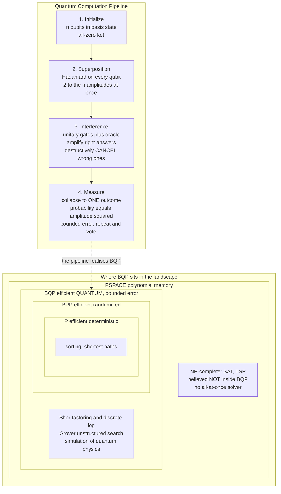

# ⚛️ Quantum Computation and BQP

> [!abstract] TL;DR
> A **quantum computer** stores information in **qubits** that hold a *superposition* of all `2ⁿ` bit-strings at once, and computes by applying **unitary gates** that let those `2ⁿ` complex **amplitudes interfere** — reinforcing the right answers and *cancelling* the wrong ones — before a final **measurement** collapses the state to a single output. The class it can solve efficiently is **BQP** (*bounded-error quantum polynomial time*), the quantum analogue of the randomized class **BPP**. BQP contains problems no classical machine is believed to solve efficiently — **Shor's algorithm** factors integers and computes discrete logs in polynomial time (breaking RSA and ECC, hence [[Post_Quantum_Cryptography]]), and quantum **simulation of physics and chemistry** is likely the first killer app — yet BQP is **not** known to contain the NP-complete problems. The crucial, widely-mangled truth: a quantum computer is *not* a magic "try every answer at once" box. It is a machine that reshapes probability *amplitudes* by interference, giving **exponential** speedups for a *few* structured problems (period-finding) and only a **quadratic** speedup (**Grover**) for unstructured search — and it changes what is efficiently computable without changing what is computable at all.

---

## Intuition

**Analogy — noise-cancelling headphones for wrong answers.** Picture a stadium where every possible answer to your problem is a person, and each person is humming a sound wave. A classical randomized computer walks up to *one* random person and listens. A quantum computer instead lets *all* of them hum **at the same time** — but here is the twist that makes it quantum rather than merely parallel: each hum carries a **phase**, so waves can either **add up** (constructive interference) or **flat-out cancel** (destructive interference), exactly like the anti-noise a pair of noise-cancelling headphones injects to silence a droning engine. A good quantum algorithm is a piece of *acoustic engineering*: you arrange the phases so the **wrong answers' waves destructively cancel to silence**, while the **right answer's wave constructively swells into a roar** you are overwhelmingly likely to hear when you finally listen (measure).

That single move — cancellation — is the entire difference from a classical [probabilistic] machine. **Probabilities are never negative, so they can only pile up; amplitudes are complex numbers, so they can subtract.** The popular picture of "a quantum computer tries all `2ⁿ` answers in parallel and reads off the best one" is *wrong* and dangerously so: yes, the amplitudes for all `2ⁿ` answers coexist, but a measurement hands you back only **one** of them, with probability equal to its amplitude *squared*. The magic is never the parallelism — it is orchestrating **interference** so that, by the time you measure, the amplitude has already been herded onto the answer you want. This works spectacularly for problems with hidden periodic structure (factoring) and only modestly for brute search (Grover), which is why quantum computers are a scalpel for a few special problems, not a sledgehammer for all of them.

---

## How It Works

### Core Mechanics

**1. The qubit: amplitudes, not bits.** A classical bit is `0` or `1`. A **qubit** is a unit vector `α|0⟩ + β|1⟩` where `α, β` are **complex amplitudes** with `|α|² + |β|² = 1`. `n` qubits live in a `2ⁿ`-dimensional complex space, so the full state is a vector of `2ⁿ` amplitudes — one per bit-string. This exponential state space is the *raw material* of quantum speedup, but you never get to read it out directly (see [[Quantum_Information_Theory]] and the **Holevo bound**: `n` qubits yield at most `n` classical bits on measurement).

**2. Gates are unitary — reversible rotations.** Computation proceeds by **unitary matrices** `U` (satisfying `U†U = I`) acting on the amplitude vector. Unitarity means every step is **reversible** and **norm-preserving** (total probability stays `1`). The workhorse is the **Hadamard** gate, which maps `|0⟩` to an equal superposition `(|0⟩ + |1⟩)/√2`; applied to all `n` qubits it creates a **uniform superposition over all `2ⁿ` strings** in one shot. Other gates (phase, CNOT, Toffoli) rotate and entangle. A small universal set (e.g. Hadamard + T + CNOT) can approximate *any* unitary to arbitrary precision — the **Solovay–Kitaev theorem**.

**3. Measurement collapses — the Born rule.** You cannot inspect amplitudes. **Measuring** the state returns bit-string `x` with probability `|amplitude of x|²` and **destroys** the superposition (collapse). So the *only* way to extract an answer is to have already engineered the amplitudes so the desired `x` carries most of the probability weight. This is why the last step of every quantum algorithm is an interference pattern, not a read-out of "all answers."

**4. Interference is the whole game — and it separates quantum from probabilistic.** In a *randomized* [probabilistic] computer, a state is a **probability distribution**: non-negative numbers that only ever add. In a quantum computer the state is an **amplitude vector**: complex numbers that can be *negative or out of phase*, so two computational paths leading to the same wrong answer can **cancel**. That cancellation — impossible for probabilities — is precisely the resource that Shor and Grover exploit.

**5. The quantum circuit model.** The standard model of quantum computation: initialize `n` qubits to `|0…0⟩`, apply a sequence of gates drawn from a fixed universal set (the **circuit**), then measure. A problem is efficiently solvable if a *uniform family* of polynomial-size circuits decides it. This is the quantum cousin of the classical circuit / Turing model behind [[Time_and_Space_Complexity]].

**6. The class BQP.** **BQP** = languages decidable by a polynomial-size uniform quantum circuit that answers **correctly with probability ≥ 2/3** on every input. The `2/3` (any constant `> 1/2`) is amplified to near-certainty by running the circuit many times and taking a majority vote — exactly the **bounded-error** trick that defines the classical randomized class **BPP**. So **BQP is the quantum analogue of BPP**: "what a quantum computer can solve efficiently, tolerating a small error." Since a quantum machine can trivially simulate a classical randomized one, `P ⊆ BPP ⊆ BQP`.

**7. Shor's algorithm — the exponential jackpot.** **Shor (1994)** factors an `n`-bit integer and solves **discrete logarithm** in *polynomial time* on a quantum computer — an **exponential** speedup over the best known classical algorithms. The engine is the **Quantum Fourier Transform (QFT)**, which reveals the **period** of a function `f(x) = aˣ mod N`. Factoring reduces to period-finding; the QFT makes the amplitudes of all non-period frequencies cancel and the period's multiples reinforce. Because RSA rests on factoring and ECC on discrete log, Shor **breaks essentially all deployed public-key cryptography** — the entire motivation for [[Post_Quantum_Cryptography]] and [[Asymmetric_Cryptography_and_PKI]] migration.

**8. Grover's algorithm — and the limit of quantum brute force.** **Grover (1996)** finds a marked item in an *unstructured* set of `N` in `O(√N)` queries instead of the classical `O(N)` — a **quadratic** (not exponential) speedup via **amplitude amplification**: an oracle flips the marked item's sign, then a "diffusion" step inverts all amplitudes about their mean, nudging weight onto the marked item; repeat `~ (π/4)√N` times. Crucially, `Ω(√N)` is **provably optimal** — no quantum algorithm can search an unstructured space faster. Grover is therefore the *ceiling* of generic quantum speedup and the reason it merely **halves effective symmetric key length** (AES-256 stays safe, AES-128 weakens).

**9. Quantum simulation — Feynman's original dream, the likely first killer app.** Simulating a quantum system of `k` particles costs *exponential* memory classically because the state has `~2ᵏ` amplitudes. **Feynman (1982)** observed the fix: use a *controllable* quantum system to simulate the target one, turning exponential cost into polynomial. Chemistry (molecular ground-state energies, catalysts, nitrogen fixation), materials (high-Tc superconductors), and nuclear/high-energy physics are the strongest candidates for *practical* quantum advantage — far more than codebreaking.

**10. Where BQP sits — and what it does NOT contain.** The believed landscape:
- `P ⊆ BPP ⊆ BQP ⊆ PSPACE`. The last containment is a real theorem: a classical machine can sum the `2ⁿ` **Feynman path amplitudes** using only polynomial *space* (reusing memory), so anything BQP solves, PSPACE solves — quantum computers give **no** super-polynomial *space* advantage and cannot solve the undecidable.
- **BQP is NOT known to contain the NP-complete problems** ([[The_Class_NP_and_Verification]]). Grover only quadratically speeds up SAT search — still exponential. Most complexity theorists believe **NP-complete ⊄ BQP**; a quantum computer is *not* a general NP-solver. This is the single most misunderstood point in the whole subject.
- **BQP and NP are believed incomparable.** Factoring is in BQP but is *not* thought to be NP-complete (it sits in `NP ∩ coNP`). Conversely there is oracle evidence (**Raz–Tal, 2018**) that BQP is *not* even contained in the **polynomial hierarchy** relative to an oracle — quantum computers can do things that look nothing like guess-and-verify.

**11. Quantum supremacy / advantage — the contrived demonstrations.** To *show* the hardware crosses the classical line, groups pick artificial sampling tasks. **Google (Sycamore, 2019)** sampled from random quantum circuits and claimed a task that would take a classical supercomputer millennia; classical teams have since narrowed the gap, keeping it a live debate. **Boson sampling** (USTC's *Jiuzhang*, photonic) is another route. These tasks are **useless by design** — they prove the machines are hard to simulate, not that they compute anything you want.

**12. Reality check — decoherence, error correction, NISQ vs fault-tolerant.** Real qubits **decohere**: they leak their fragile superposition to the environment in microseconds, corrupting the computation. The escape is **quantum error correction**: encode one *logical* qubit into many noisy *physical* qubits, and the **threshold theorem** guarantees that if per-gate error is below a threshold (`~1%`), arbitrarily long computations become possible — at a cost of *thousands* of physical qubits per logical one. Today's **NISQ** (Noisy Intermediate-Scale Quantum) devices have hundreds of noisy qubits and *cannot* yet run Shor at cryptographic sizes. The gap between the theory (BQP) and fault-tolerant hardware is enormous and is *the* central engineering challenge.

**13. Does quantum computing break the Church–Turing thesis?** No — and yes, depending on which thesis. It does **not** change *what* is computable: a quantum computer can be simulated by a classical Turing machine (exponentially slower), so it decides exactly the same languages and cannot touch the halting problem (see [[The_Limits_of_Computation]]). What it challenges is the **Extended (or physical) Church–Turing thesis** — the claim that any physically reasonable machine can be *efficiently* (polynomially) simulated classically. If BQP truly exceeds BPP, that stronger thesis is false: quantum mechanics changes what is efficiently computable, not what is computable at all.

### Flow / Architecture



*Left: the four-stage circuit pipeline — the interference stage is where the speedup is manufactured, not the superposition. Right: the containment `P ⊆ BPP ⊆ BQP ⊆ PSPACE`, with the **NP-complete** region drawn inside PSPACE but **outside BQP**, the whole point being that quantum computers are not known to crack NP-complete problems.*

---

## Key Concepts

**Secondary (intuitive, no CS background needed)**
- **Superposition** — a qubit can be "both 0 and 1 at once," so `n` qubits hold all `2ⁿ` combinations simultaneously.
- **Interference, not parallelism** — the speedup comes from wrong answers *cancelling* like anti-noise, leaving the right one loud. A quantum computer does **not** simply try every answer and pick the best.
- **Measurement gives you one answer** — you read out a single bit-string, chosen at random weighted by amplitude-squared; the rest of the superposition vanishes.
- **What it is good for** — factoring (breaking today's encryption), searching (a modest speedup), and simulating molecules and materials. It is **not** a universal fast-everything machine.

**Undergraduate (a first quantum / theory course)**
- **The quantum circuit model** — initialize `|0…0⟩`, apply unitary gates from a universal set (Hadamard, T, CNOT), measure. Solovay–Kitaev: any unitary is approximable.
- **Amplitudes vs probabilities** — complex amplitudes can be negative and interfere; probabilities cannot. This is the sharp line between BQP and BPP.
- **BQP ≙ quantum BPP** — polynomial-size quantum circuit, bounded error `≥ 2/3`, amplified by majority vote. `P ⊆ BPP ⊆ BQP`.
- **Grover's algorithm** — `O(√N)` unstructured search via amplitude amplification; `Ω(√N)` is optimal (a proven query lower bound).
- **Shor's algorithm** — QFT-based period-finding factors and solves discrete log in poly time; the death of RSA/ECC.
- **No-cloning theorem** — an unknown quantum state cannot be copied; foundational for both algorithms and quantum cryptography ([[Quantum_Information_Theory]]).

**Graduate (advanced quantum complexity)**
- **`BQP ⊆ PSPACE`** — proved by classically summing the exponentially many Feynman path amplitudes in polynomial space; hence BQP cannot solve undecidable or even PSPACE-hard-beyond problems.
- **BQP vs the polynomial hierarchy** — the **Raz–Tal (2018)** oracle separates BQP from PH; **Forrelation** is the separating problem. Quantum power is not captured by bounded quantifier alternation.
- **Quantum query / adversary lower bounds** — the polynomial and adversary methods prove `Ω(√N)` for search, `Ω(N^{1/3})` for element distinctness, etc.; they bound what interference can buy.
- **QMA — quantum NP** — the class with quantum *proofs* verified by a quantum machine; the **local Hamiltonian problem** is QMA-complete (a quantum Cook–Levin).
- **Hidden Subgroup Problem (HSP)** — Shor, Simon, and discrete-log are all instances of abelian HSP; the *non-abelian* HSP (graph isomorphism, lattice problems) resists quantum attack — which is *why* lattice-based [[Post_Quantum_Cryptography]] is believed quantum-safe.
- **Fault tolerance and the threshold theorem** — below a constant error threshold, concatenated or surface codes give arbitrarily reliable logical qubits with polylogarithmic overhead; the theoretical license for scalable quantum computing.

---

## Python Demo

```python
# Grover's search on n qubits, simulated with plain numpy state vectors.
# GOAL: find one MARKED item among N = 2^n using only ~ (pi/4)*sqrt(N) oracle
# calls, versus the ~N/2 an average classical scan needs -- a QUADRATIC speedup.
#
# The entire "quantum computer" here is a length-N complex amplitude vector:
#   - Hadamard start -> uniform superposition, every amplitude = 1/sqrt(N)
#   - Oracle         -> flips the SIGN (phase) of the marked amplitude
#   - Diffusion      -> "inversion about the mean", amplifying what the oracle marked
# Interference is the point: the sign flip lets diffusion ADD to the marked
# amplitude while CANCELLING the rest -- probabilities could never go negative.
# numpy / matplotlib only.

import numpy as np
import matplotlib.pyplot as plt


def grover_run(n_qubits, marked, steps):
    """Return the marked-state probability after each of `steps` Grover iterations."""
    N = 2 ** n_qubits
    # 1. Hadamard on all qubits -> uniform superposition (real amplitudes 1/sqrt(N)).
    state = np.full(N, 1.0 / np.sqrt(N), dtype=complex)
    probs = [abs(state[marked]) ** 2]
    for _ in range(steps):
        # 2. ORACLE: flip the sign of the marked amplitude (a phase, not a probability).
        state[marked] *= -1
        # 3. DIFFUSION: inversion about the mean == 2|s><s| - I, applied in O(N).
        mean = state.mean()
        state = 2 * mean - state
        probs.append(abs(state[marked]) ** 2)
    return np.array(probs)


# --- Panel 1: watch the marked probability grow (and over-rotate) for N = 256 ---
n = 8
N = 2 ** n
marked = 42                                   # the "needle": index we secretly seek
opt = int(round((np.pi / 4) * np.sqrt(N)))    # optimal iteration count ~ (pi/4)*sqrt(N)
steps = opt + 6                               # run PAST the optimum to expose over-rotation
probs = grover_run(n, marked, steps)
peak = int(np.argmax(probs))                  # empirical best iteration

# Closed-form amplitude: sin((2k+1)*theta)^2 with theta = arcsin(1/sqrt(N)).
theta = np.arcsin(1.0 / np.sqrt(N))
k = np.arange(len(probs))
theory = np.sin((2 * k + 1) * theta) ** 2

print(f"N = {N} states, searching for hidden index {marked}")
print(f"Classical scan: ~N/2 = {N // 2} queries on average.")
print(f"Grover optimum: ~(pi/4)*sqrt(N) = {(np.pi / 4) * np.sqrt(N):.1f}  "
      f"(empirical peak at k = {peak})")
print(f"Marked probability at the peak: {probs[peak]:.4f}")
print(f"Push to k = {steps}: probability falls back to {probs[steps]:.4f} (over-rotation)")

# --- Panel 2: optimal Grover queries vs N -- the sqrt(N) law beating N/2 ---
ns = np.arange(2, 15)
Ns = 2 ** ns
grover_queries = np.round((np.pi / 4) * np.sqrt(Ns))
classical_queries = Ns / 2

fig, (ax1, ax2) = plt.subplots(1, 2, figsize=(13, 5))

ax1.plot(k, probs, "o-", color="#dc2626", lw=2, ms=6, label="simulated |amplitude|^2")
ax1.plot(k, theory, "--", color="#2563eb", lw=1.5, label="theory sin^2((2k+1)*theta)")
ax1.axvline(peak, color="gray", ls=":", lw=1.2)
ax1.text(peak + 0.2, 0.15, f"optimum\nk = {peak}", fontsize=9, color="gray")
ax1.set_xlabel("Grover iteration k")
ax1.set_ylabel("probability of measuring the marked item")
ax1.set_title(f"Amplitude amplification (N = {N})")
ax1.set_ylim(0, 1.05)
ax1.grid(True, ls=":", alpha=0.4)
ax1.legend(loc="lower right", fontsize=9)

ax2.loglog(Ns, classical_queries, "s-", color="#6b7280", lw=2, label="classical ~ N/2")
ax2.loglog(Ns, grover_queries, "o-", color="#dc2626", lw=2, label="Grover ~ sqrt(N)")
ax2.set_xlabel("search space size N")
ax2.set_ylabel("queries to find the item")
ax2.set_title("Quadratic speedup: sqrt(N) vs N")
ax2.grid(True, which="both", ls=":", alpha=0.4)
ax2.legend(loc="upper left", fontsize=9)

plt.tight_layout()
plt.savefig("grover_speedup.png", dpi=130)
print("\nSaved amplitude-amplification and speedup plots to grover_speedup.png")

# Takeaways the run makes concrete:
#   * the marked probability climbs to ~1 after only ~12 oracle calls for N = 256,
#     versus ~128 for a classical average scan;
#   * push PAST the optimum and it FALLS again (over-rotation) -- Grover is a
#     precise rotation you must STOP on time, not "more iterations = better";
#   * the right panel shows sqrt(N) crushing N/2 -- but note it stays POLYNOMIAL:
#     a quadratic win, NOT the exponential leap Shor's period-finding delivers.
```

Running it prints that Grover drives the marked probability from `1/256 ≈ 0.004` to nearly `1.0` in about **12** oracle calls (against **128** for an average classical scan), then *decreases* again if you over-rotate, and saves `grover_speedup.png`. The left panel shows the simulated amplitude tracking the closed-form `sin²((2k+1)θ)` curve exactly — rising, peaking, and falling; the right panel is the headline on a log-log axis: the quantum `√N` curve pulls decisively below classical `N/2`, but stays a *polynomial* — a vivid reminder that Grover's win is **quadratic**, not the exponential jackpot that Shor's structured period-finding provides.

---

## Real-World Applications

> **Example — the cryptographic apocalypse clock and "harvest now, decrypt later."** Shor's algorithm is the reason security agencies are migrating *today*, years before a cryptographically-relevant quantum computer exists. Adversaries can **record encrypted traffic now** and decrypt it once a machine can run Shor at RSA-2048 scale — so any secret that must stay confidential for a decade is *already* at risk. NIST standardized lattice-based replacements in 2024 (CRYSTALS-Kyber, Dilithium, SPHINCS+); see [[Post_Quantum_Cryptography]] and [[Asymmetric_Cryptography_and_PKI]]. This is a live deployment consequence of a complexity-theoretic result about BQP.

- **Breaking and replacing public-key crypto.** Shor kills RSA, ECDH, ECDSA (factoring + discrete log). The industry response is crypto-agility and hybrid classical-plus-PQC handshakes (e.g. `X25519MLKEM768` in TLS), already shipping in browsers and messaging apps.
- **Symmetric-key impact via Grover.** Grover only halves the effective key length of block ciphers and hash preimages: **AES-256 stays safe** (128-bit quantum security), **AES-128 weakens** to 64-bit — so the practical mitigation is simply "double the key/hash size," a far milder threat than Shor.
- **Quantum simulation of chemistry and materials** — the strongest candidate for *useful* quantum advantage. Estimating molecular ground-state energies (catalysts for fertilizer/nitrogen fixation, battery electrolytes, high-Tc superconductors) is exponential classically but polynomial on a quantum simulator, exactly Feynman's 1982 motivation.
- **Optimization and sampling (with caution).** QAOA and quantum annealing target combinatorial optimization, but there is **no proven exponential speedup** for NP-hard optimization — a domain where hype most outruns theory, precisely because NP-complete ⊄ BQP is expected.
- **Quantum advantage benchmarks.** Google's Sycamore random-circuit sampling (2019) and USTC's Jiuzhang boson sampling are contrived tasks that stress-test the hardware and probe the Extended Church–Turing thesis — scientifically important, commercially useless by construction.

---

## Common Pitfalls

- **"A quantum computer tries all `2ⁿ` answers in parallel and returns the best."** The single most common myth. All amplitudes coexist, but measurement returns **one** string with probability amplitude-squared, and the *rest is lost*. Speedup comes only from **interference** that concentrates amplitude before you measure — not from parallel read-out.
- **"Quantum computers solve NP-complete problems efficiently."** They are **not** known to, and almost certainly do **not**. Grover gives only a quadratic speedup on SAT search (still exponential). BQP is believed to *not* contain NP-complete problems; conflating "quantum" with "solves NP" is a fundamental error.
- **"Grover gives an exponential speedup."** It is **quadratic** (`√N` vs `N`), and that bound is *provably optimal*. Only structured problems (period-finding via QFT) get exponential speedups — and there are very few of them.
- **"Amplitudes are just probabilities."** Amplitudes are **complex** and can be negative or out of phase, so they **interfere and cancel**. Probabilities are non-negative and only add. Erase this distinction and you erase the entire difference between BQP and BPP.
- **"Quantum computers can compute uncomputable things."** No. `BQP ⊆ PSPACE`, so a classical machine simulates any quantum one (exponentially slower); the halting problem stays undecidable ([[The_Limits_of_Computation]]). Quantum changes *efficiency*, not *computability*.
- **"Today's 1000-qubit chip can break RSA."** Those are **noisy physical** qubits. Running Shor at RSA-2048 needs *millions* of physical qubits after **error correction** encodes each fragile logical qubit into thousands. Physical-qubit counts are not logical-qubit counts.
- **"Quantum supremacy means quantum computers are now useful."** The supremacy tasks (random-circuit / boson sampling) are **deliberately useless** — they only demonstrate hardness of classical simulation, not any valuable computation.
- **Over-rotation in Grover.** More iterations is *not* better: past `~(π/4)√N` the amplitude rotates back down. You must **stop at the optimum** (or you may measure the wrong answer), as the demo's over-rotation dip shows.

---

## Related Concepts

- [[Time_and_Space_Complexity]] — the resource-based framework (time and space classes) into which BQP is slotted; `BQP ⊆ PSPACE` is a space-complexity theorem.
- [[The_Class_P_and_Efficient_Computation]] — classical "efficient" computation; `P ⊆ BPP ⊆ BQP`, so everything classically tractable is quantumly tractable.
- [[The_Class_NP_and_Verification]] — the class of efficiently-verifiable problems; the crucial point is that **NP-complete problems are believed to lie outside BQP**.
- [[P_versus_NP]] — the surrounding open landscape; BQP is conjectured incomparable to NP, sharpening why quantum is not a general NP-solver.
- [[Quantum_Information_Theory]] — the information-theoretic foundation: qubits, amplitudes, no-cloning, entanglement, and the Holevo bound that caps read-out.
- [[Post_Quantum_Cryptography]] — the direct fallout of Shor's algorithm: lattice-based schemes (Kyber, Dilithium) designed to survive BQP.
- [[Asymmetric_Cryptography_and_PKI]] — the RSA/ECC systems that Shor's polynomial-time factoring and discrete-log break.
- [[The_Limits_of_Computation]] — the computability ceiling quantum computers do **not** breach; Church–Turing survives, only the *Extended* thesis is challenged.
- [[Turing_Machines_and_the_Church_Turing_Thesis]] — the classical model of computation that a quantum machine can simulate (exponentially slower), fixing what is computable.
- [[Wave_Particle_Duality_and_Uncertainty]] — the quantum-mechanical superposition and interference that the qubit and quantum gates physically exploit.

---

## Review Questions

1. **(Conceptual)** Using the "noise-cancelling headphones" analogy, explain precisely why a quantum computer is **not** simply a machine that "tries all `2ⁿ` answers in parallel." What role do *negative/complex amplitudes* play that non-negative probabilities cannot, and why does the Born rule (measure one string with probability amplitude-squared) make interference — rather than parallelism — the source of speedup?
2. **(Scenario)** A startup pitch claims their forthcoming quantum computer will "solve the Traveling Salesman Problem and all NP-complete problems exponentially faster." Referencing the believed placement of BQP relative to NP, the *quadratic* (not exponential) nature of Grover's speedup, and the structured period-finding behind Shor, explain exactly what is wrong with the claim — and name a problem their machine genuinely *could* accelerate.
3. **(Trade-off / graduate)** Contrast three "hard" verdicts for an engineer: (a) a problem that is **NP-complete**, (b) a problem in **BQP but not known in BPP** (e.g. factoring), and (c) a problem that is **undecidable**. For each, state what a quantum computer does or does not buy you, and use `BQP ⊆ PSPACE` plus the Extended Church–Turing thesis to explain why quantum computing changes what is *efficiently* computable without changing what is computable at all.

---

## Sources

- Nielsen, M. A., Chuang, I. L. *Quantum Computation and Quantum Information*, 10th Anniversary ed. Cambridge University Press, 2010 — the standard text: qubits, circuit model, Shor, Grover, error correction.
- Shor, P. W. "Polynomial-Time Algorithms for Prime Factorization and Discrete Logarithms on a Quantum Computer." *SIAM J. Computing*, 26(5), 1997 — the factoring and discrete-log algorithms that define quantum's exponential edge.
- Grover, L. K. "A Fast Quantum Mechanical Algorithm for Database Search." *Proc. STOC*, 1996 — the `O(√N)` unstructured-search algorithm and amplitude amplification.
- Arora, S., Barak, B. *Computational Complexity: A Modern Approach*. Cambridge University Press, 2009 — Chapter 10 defines BQP and proves `BPP ⊆ BQP ⊆ PSPACE`.
- Arute, F. et al. "Quantum Supremacy Using a Programmable Superconducting Processor." *Nature*, 574, 2019 — Google's Sycamore random-circuit-sampling demonstration.
- Preskill, J. "Quantum Computing in the NISQ Era and Beyond." *Quantum*, 2, 2018 — the noisy-intermediate-scale reality and the gap to fault-tolerant machines.

---

#theory-of-computation #quantum-computing #bqp #shor #grover
