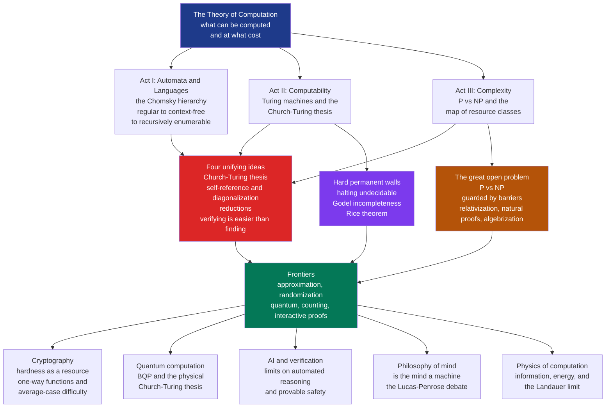

# 🧭 The Significance and Frontiers of Computation

> [!abstract] TL;DR
> This is the **capstone** of the Theory of Computation vault: the place where automata, computability, and complexity stop being three separate courses and reveal themselves as **one map of what is possible**. The field asks three questions of idealized machines — *what can be computed at all?*, *what can be computed efficiently?*, and *what cannot be computed by anything, ever?* — and the answers turn out to draw the outer boundaries of mathematics, cryptography, physics, artificial intelligence, and even the mind. Four ideas run through the whole subject and tie it together: the **Church–Turing thesis** fixes what "computable" means independently of any machine; **self-reference and diagonalization** are the single engine behind both undecidability and every complexity separation; **reductions** are the universal wire connecting one problem's difficulty to another's; and the recurring discovery that **verifying is easier than finding** is simultaneously the essence of NP and the foundation of cryptography. What the theory *gives* us is a precise, permanent map — of the solvable, the efficiently solvable, and the impossible — and a working engineer's guide: recognize an undecidable or NP-hard wall, and switch to approximation, heuristics, or restriction. What it *withholds* is proof of the very things we most believe: **P vs NP** and almost every class separation remain open. The most humbling fact about the theory of computation is how much it lets us believe and how little it lets us prove.

---

## Intuition

**Analogy — an atlas of the possible.** Old atlases did more than chart the coastlines explorers had already walked; they drew a boundary around the *known world* and marked the blank beyond it — sometimes with the warning "here be dragons." The theory of computation is exactly that kind of atlas, except the territory is not land but **everything any machine could ever do**. It charts three concentric regions. In the calm interior lie the problems we can solve *quickly*: sorting a list, finding a shortest route, testing a number for primality. Ringing that interior is a wider band of problems we can *solve in principle* but perhaps only after the sun burns out — the intractable ones, where checking an answer is easy but finding one may take longer than the age of the universe. And beyond a hard, permanent coastline lies the truly uncharted ocean: problems **no machine can ever solve**, no matter how fast, how clever, or how large — the halting problem, the truths of arithmetic that no proof reaches, functions too big for any program to compute.

What makes this atlas extraordinary is that its coastlines are not provisional. A better telescope will not push back the boundary of the uncomputable, and no future genius will discover that the halting problem was solvable all along. These are structural walls, proved once and standing forever. Yet the same atlas has a scandal at its very center: we can see the walls of the impossible with perfect clarity, but the border *inside* the possible — the line between "solvable" and "solvable **quickly**," the famous **[[P_versus_NP]]** question — is drawn in pencil, because after fifty years **nobody can prove where it actually runs**. To study the theory of computation is to learn to read this map: to know which shores are permanent, which are conjectured, and which are still marked "here be dragons."

---

## How It Works

### The grand arc, in one breath

The vault tells a single story in three acts, and this note is its epilogue.

**Act I — Automata and languages (what different machines can recognize).** We start with the weakest possible computers and climb. A **finite automaton** ([[Finite_Automata_DFA_and_NFA]]) has no memory beyond its current state and recognizes exactly the *regular* languages; the **[[Non_Regular_Languages_and_the_Pumping_Lemma|pumping lemma]]** proves it cannot even match balanced parentheses. Add a stack and you get a **pushdown automaton**, which recognizes the *context-free* languages ([[Context_Free_Grammars_and_Languages]]) — enough for the grammar of programming languages. Add unbounded read/write memory and you reach the **Turing machine**, the ceiling of the **Chomsky hierarchy**. The [[Theory_of_Computation_Overview|overview note]] lays out this ladder: each rung is a strictly more powerful *model of computation*, and the ladder ends because the Turing machine turns out to be the top.

**Act II — Computability (what *any* machine can compute, and the walls it hits).** The astonishing claim that the Turing machine is a *universal* ceiling is the **Church–Turing thesis** ([[Turing_Machines_and_the_Church_Turing_Thesis]]): every model anyone has ever proposed as a formalization of "algorithm" — lambda calculus, recursive functions, register machines, your laptop — computes *exactly* the same class of functions. This is why we can speak of "the computable" at all, machine-independently. And once we know what the machines can do, we discover what they *cannot*: the **[[The_Halting_Problem_and_Undecidability|halting problem is undecidable]]**, and by the same self-referential stroke, Gödel's incompleteness, Tarski's undefinability, and Rice's theorem all fall out as **one phenomenon wearing four masks** ([[The_Limits_of_Computation]]). Some problems have *no algorithm at any speed*.

**Act III — Complexity (what machines can compute *efficiently*).** Among the decidable problems, a finer and more practical question dominates: which are *tractable*? The class **P** ([[The_Class_P_and_Efficient_Computation]]) formalizes "efficiently solvable," **NP** ([[The_Class_NP_and_Verification]]) formalizes "efficiently *checkable*," and the **[[NP_Completeness_and_the_Cook_Levin_Theorem|Cook–Levin theorem]]** shows that thousands of problems — SAT, TSP, scheduling — are **NP-complete**, rising and falling together. Whether the checkable equals the solvable is the **[[P_versus_NP]]** question, the Millennium Prize problem at the field's heart. Above P and NP sit **PSPACE** ([[Space_Complexity_and_PSPACE]]) and EXPTIME, and the whole edifice of separations is attacked with **[[Complexity_Hierarchies_and_Diagonalization|diagonalization and hierarchy theorems]]** — the very same weapon that felled the halting problem.

### The four deep ideas that unify everything

Strip away the specific theorems and four ideas remain, each threading through all three acts:

1. **The Church–Turing thesis fixes the meaning of "computable."** Because every reasonable model computes the same functions, "computable" is an *absolute*, not an artifact of hardware. This is what lets a proof about a scratch-paper Turing machine constrain a datacenter — and what makes the limits *universal* rather than merely limits of *today's* technology.

2. **Self-reference and diagonalization are the single engine of impossibility.** Cantor's diagonal argument, Turing's "do the opposite of what you predict," Gödel's "this sentence is unprovable," and the **time/space hierarchy theorems** that separate complexity classes are all the *same move*: build an object that deliberately disagrees with every entry on a list. Undecidability and complexity separations are not two subjects — they are one technique applied at two scales.

3. **Reductions are the universal connective tissue.** A **reduction** transforms one problem into another so that solving the second solves the first. Reductions spread *undecidability* downward (halting reduces to a thousand other unsolvable problems) and *hardness* sideways (every NP problem reduces to SAT). Difficulty is not measured in isolation; it is *transported* through a web of reductions, which is why one algorithm for SAT would crack all of NP and one solution to halting would settle a thousand open questions at once.

4. **Verifying is easier than finding — the field's most consequential asymmetry.** That a *solution* can be checked fast while *finding* it seems astronomically hard is the definition of NP, the reason NP-completeness matters, and the entire foundation of cryptography. Public-key security is nothing but this asymmetry **weaponized**: multiplying primes (finding a product) is easy, factoring it back (inverting the search) is believed hard. The security of the internet is a bet on the direction of this arrow.

### What the theory hands the working engineer

This is not idle philosophy. The map has an operational payload. When you can *prove* your problem is **undecidable** (via a reduction from halting), you stop hunting for a general algorithm and build a **conservative approximation** instead — a linter that says "yes / no / maybe," a verifier that may loop. When you can *prove* your problem is **NP-hard** (via a reduction from an NP-complete problem), you stop hunting for an exact polynomial algorithm and reach for **approximation algorithms, heuristics, restriction to tractable special cases, parameterized algorithms, or exponential solvers on small inputs**. The theory converts "I'm stuck" into "I'm stuck *for a proven reason*, and here is the class of techniques that responds to that reason." That is the difference between an engineer flailing and an engineer who knows which wall they are facing.

### The frontiers — where the map is still being drawn

Beyond the classical three acts, the field radiates outward into open country. **Approximation and inapproximability** ask how *close* to optimal we can get in polynomial time, and the **PCP theorem** shows some problems are hard even to approximate. **Randomized computation** (BPP) asks whether coin-flips add power, with the surprising modern belief that **randomness can be removed** (derandomization) under plausible hardness assumptions. **Quantum computation** (BQP) asks whether the quantum nature of physics enlarges what is *efficiently* computable — Shor's factoring algorithm says "yes, for some problems," while SAT appears to resist even quantum machines. **Cryptography** rests the security of civilization on *average-case* hardness and one-way functions, strictly stronger assumptions than P ≠ NP. **Counting** (#P) and **interactive proofs** (IP = PSPACE) reveal entirely new dimensions of difficulty beyond simple yes/no decision. These frontiers all inherit the same four unifying ideas — and all remain riddled with open problems.

### The great open problems and the barriers that guard them

The defining feature of complexity theory is the chasm between what we *believe* and what we can *prove*. We believe P ≠ NP, NP ≠ coNP, PSPACE ≠ EXPTIME, and that one-way functions exist — and we can prove **almost none of it**. Worse, we understand *why* we cannot prove it. Three **barrier theorems** show that our entire existing toolkit is provably too weak: **relativization** (Baker–Gill–Solovay) rules out plain diagonalization, **natural proofs** (Razborov–Rudich) rule out most circuit-lower-bound techniques *if* strong cryptography exists, and **algebrization** (Aaronson–Wigderson) rules out the arithmetization tricks that escaped relativization. Resolving P vs NP demands genuinely new mathematics that dodges all three — which is exactly why a problem everyone "knows the answer to" has resisted for half a century. The [[Complexity_Hierarchies_and_Diagonalization]] note shows both the power of diagonalization *and* the precise point where it runs out of road.

### The physical and philosophical reach

The atlas does not stop at the edge of computer science. The **physical Church–Turing thesis** asks whether the universe itself can compute anything a Turing machine cannot — whether physics is, at bottom, *effectively computable*. Quantum computing sharpens rather than breaks this: BQP may change what is efficiently computable, but no physical proposal has ever exceeded what a Turing machine can compute *in principle*. The limits of computation double as limits on **AI, automated reasoning, verification, and provable safety** — no algorithm can certify that an arbitrary agent halts, meets its spec, or is safe (Rice's theorem in a new suit). And the limits reach the **mind** itself: the **Lucas–Penrose argument** claims that because humans can "see" a Gödel sentence is true, the mind must transcend any formal system — a claim the [[Computational_Theory_of_Mind]] and [[Functionalism_and_Machine_Minds]] debates continue to contest. Meanwhile, uncomputability and randomness meet **information** in [[Kolmogorov_Complexity_and_Algorithmic_Information]], and the **[[Landauer_Principle_and_Thermodynamics_of_Computation|physics of computation]]** ties the erasure of a bit to a minimum expenditure of energy — computation is *physical*. Computation has joined **matter, energy, and information** as a fourth fundamental lens through which we read reality.

### The grand map



*Read top-down: three acts feed four unifying ideas; computability yields permanent walls, complexity yields the great open problem, and both radiate into frontiers that reach cryptography, quantum physics, AI, philosophy of mind, and the physics of information.*

---

## Key Concepts

### Secondary (intuitive, no CS background needed)
- **Three questions.** The whole field asks: *What can be computed at all? What can be computed quickly? What can never be computed?* Everything else is detail.
- **Some walls are permanent.** "Impossible to compute" does not mean "we haven't figured it out yet." The halting problem has *no* solution, ever — that is proven, not pending.
- **Checking versus solving.** It is often easy to check a right answer but hard to find one. Whether that gap is real is the million-dollar P vs NP question.
- **We believe more than we can prove.** Experts are near-certain that hard problems are truly hard — and almost none of it has actually been proved. The field is defined by this humility.

### Undergraduate (a first theory or algorithms course)
- **The Chomsky hierarchy as a ladder of machines.** Finite automata (regular) ⊊ pushdown automata (context-free) ⊊ Turing machines (recognizable) — each rung a strictly stronger model.
- **The Church–Turing thesis.** "Computable" = "Turing-computable," a machine-independent absolute confirmed by every model coinciding; a *thesis*, not a theorem.
- **The four faces of impossibility.** Halting undecidability, Gödel incompleteness, Tarski undefinability, and Rice's theorem are one diagonal argument in four disguises.
- **The complexity map.** P ⊆ NP ⊆ PSPACE ⊆ EXPTIME, with P ⊊ EXPTIME *proven* but every intermediate separation open; NP-completeness makes P vs NP a single question.
- **Reductions as the master tool.** They transport undecidability downward and NP-hardness sideways; proving hardness is proving a reduction.
- **The engineer's decision tree.** Undecidable ⇒ conservative approximation; NP-hard ⇒ approximation, heuristics, restriction, or parameterization; tractable ⇒ find the polynomial algorithm.

### Graduate (advanced complexity and logic)
- **The barrier theorems.** Relativization (Baker–Gill–Solovay), natural proofs (Razborov–Rudich), and algebrization (Aaronson–Wigderson) rule out nearly the entire known toolkit for separating classes; a resolution needs new mathematics.
- **The unproven web of separations.** P vs NP, NP vs coNP, the collapse of the polynomial hierarchy, BPP vs P (derandomization), BQP's relation to NP and PH, and circuit lower bounds — a field where belief vastly outruns proof.
- **Turing degrees above the walls.** Undecidability is an infinite staircase: the halting jump 0′, 0″, and the arithmetical hierarchy Σₙ/Πₙ classify problems *harder* than halting.
- **Average-case vs worst-case hardness.** Cryptography needs one-way functions and average-case difficulty — strictly stronger than the worst-case separation P ≠ NP; P ≠ NP is necessary but not obviously sufficient for secure crypto.
- **Interactive and probabilistic proofs.** IP = PSPACE, MIP = NEXP, and the PCP theorem recast "proof" itself and yield hardness-of-approximation — verification generalized far beyond the NP certificate.
- **The physical Church–Turing–Deutsch thesis.** Whether physical law permits hypercomputation, whether BQP is physically realizable at scale, and whether the universe is efficiently simulable — the boundary between complexity theory and physics.
- **Lucas–Penrose and its rebuttals.** The claim that mathematical insight transcends formal systems, and the standard reply that humans cannot verify their own consistency either (Gödel's second theorem cuts both ways).

---

## Python Demo

```python
# A SINGLE unifying picture of the computational landscape.
#
# We draw the major language / complexity classes as NESTED regions, from the
# tiny interior of the REGULAR languages out to ALL languages. Each band is
# annotated with a representative problem, and each boundary is styled to show
# whether the separation to the next-larger class is PROVEN (green, solid) or
# still OPEN (red, dashed). The goal: make the "what we KNOW vs what's OPEN"
# structure of the entire field visible at a single glance.
#
# numpy + matplotlib only.

import numpy as np
import matplotlib.pyplot as plt
from matplotlib.patches import Rectangle
from matplotlib.lines import Line2D

# Layers inner -> outer.  (name, representative problem, separation-to-next status)
#   "known" = proper containment PROVEN     "open" = believed proper but UNPROVEN
#   "frame" = outermost, nothing beyond it
layers = [
    ("Regular",           "a*b*   (DFA / regex)",              "known"),
    ("Context-Free",      "balanced parens, a^n b^n  (PDA)",   "known"),
    ("P",                 "shortest path, primality (AKS)",    "open"),
    ("NP",                "SAT, TSP, 3-coloring",              "open"),
    ("PSPACE",            "TQBF, generalized geography",       "open"),
    ("EXPTIME",           "n x n chess, some games",           "known"),
    ("Decidable  (R)",    "Presburger arithmetic",             "known"),
    ("Recognizable (RE)", "Halting problem  A_TM",             "known"),
    ("ALL languages",     "complement of Halting; almost all", "frame"),
]
n = len(layers)

# concentric half-sizes; wider than tall so text fits inside each band
h = np.linspace(0.75, 8.0, n)          # half-heights, inner -> outer
w = h * 2.15                           # half-widths
fill = plt.cm.RdYlBu_r(np.linspace(0.06, 0.94, n))   # cool inner -> warm outer

fig, ax = plt.subplots(figsize=(13, 8))

# draw OUTER -> INNER so smaller boxes sit on top
for i in reversed(range(n)):
    status = layers[i][2]
    if status == "open":
        edge, ls, lw = "#b91c1c", (0, (6, 4)), 2.6    # red dashed  = OPEN
    elif status == "known":
        edge, ls, lw = "#15803d", "solid", 2.2         # green solid = PROVEN
    else:
        edge, ls, lw = "#334155", "solid", 2.0         # neutral outer frame
    ax.add_patch(Rectangle((-w[i], -h[i]), 2 * w[i], 2 * h[i],
                           facecolor=fill[i], edgecolor=edge,
                           linewidth=lw, linestyle=ls, alpha=0.92, zorder=i))

# label each class in the TOP band of its layer (clear of the inner boxes)
for i in range(n):
    name, prob, status = layers[i]
    y_inner_top = h[i - 1] if i > 0 else 0.0
    y_mid = 0.5 * (y_inner_top + h[i])
    ax.text(0, y_mid + 0.17, name, ha="center", va="center",
            fontsize=10.5, fontweight="bold", color="#0f172a", zorder=100)
    ax.text(0, y_mid - 0.19, prob, ha="center", va="center",
            fontsize=7.8, style="italic", color="#1e293b", zorder=100)

# tag the three OPEN separations on the right edge of P, NP, PSPACE
for i in (2, 3, 4):
    ax.text(w[i], 0, "  ? open", color="#b91c1c", fontsize=8, fontweight="bold",
            ha="left", va="center", zorder=200)

# the key fact: at least one open wall MUST be real
ax.text(0, -h[-1] - 1.25,
        "We KNOW  P is strictly inside EXPTIME  (Time Hierarchy Theorem),\n"
        "so at least ONE containment in  P <= NP <= PSPACE <= EXPTIME  is strict --\n"
        "yet after 50 years we cannot prove WHICH one.",
        ha="center", va="center", fontsize=9.5, color="#7f1d1d",
        bbox=dict(boxstyle="round,pad=0.5", fc="#fef2f2", ec="#b91c1c"))

legend = [
    Line2D([0], [0], color="#15803d", lw=2.4, ls="solid",
           label="separation PROVEN (known strict)"),
    Line2D([0], [0], color="#b91c1c", lw=2.4, ls=(0, (6, 4)),
           label="separation OPEN (believed strict, unproven)"),
]
ax.legend(handles=legend, loc="upper center", bbox_to_anchor=(0.5, 1.07),
          ncol=2, fontsize=9, frameon=False)

ax.set_xlim(-w[-1] - 3.5, w[-1] + 3.5)
ax.set_ylim(-h[-1] - 2.4, h[-1] + 1.5)
ax.set_aspect("equal")
ax.axis("off")
ax.set_title("The Computational Landscape: nested classes from the regular languages\n"
             "out to all languages -- green walls are proven, red walls are open",
             fontsize=12.5, fontweight="bold", pad=16)
plt.tight_layout()
plt.savefig("computational_landscape.png", dpi=140)
plt.show()

# ---- console summary of the same map ----
print("THE MAP OF COMPUTATION   (inner = easy, outer = impossible)\n")
print(f"{'class':<20}{'representative problem':<38}{'wall to next':<12}")
print("-" * 70)
for name, prob, status in layers:
    tag = {"known": "PROVEN", "open": "OPEN", "frame": "outermost"}[status]
    print(f"{name:<20}{prob:<38}{tag:<12}")
print("\nProven strict:  Regular ( CFL ( P ...... EXPTIME ( Decidable ( RE ( ALL")
print("Open (believed strict):   P ? NP ? PSPACE ? EXPTIME")
print("Everything from Regular through EXPTIME is DECIDABLE; the Halting problem")
print("is the first thing that leaks past the decidable wall into RE-but-not-R.")
```

**What the demo shows.** The picture is the whole field on one canvas. The interior is calm and cool — **Regular**, **Context-Free**, **P** — the classes we can *decide quickly*. Moving outward the colours warm into **NP**, **PSPACE**, **EXPTIME** (decidable but increasingly intractable), then cross the great **Decidable** coastline into **Recognizable (RE)** — where the **halting problem** lives, checkable but not solvable — and finally into **ALL languages**, most of which no machine can even recognize. The line styles carry the field's deepest tension: every **green** boundary is a wall we have *proven* (Regular ⊊ CFL by the pumping lemma; Decidable ⊊ RE by the halting problem; P ⊊ EXPTIME by the time hierarchy theorem), while every **red dashed** boundary — P vs NP, NP vs PSPACE, PSPACE vs EXPTIME — is a wall we *believe in but cannot prove*. The annotation box states the exquisite catch: because P ⊊ EXPTIME **is** proven, at least one of those three red walls must be genuine — yet fifty years of effort cannot tell us which. That single image is the honest self-portrait of the theory of computation: a map with permanent coastlines, a few pencilled borders we are morally certain about, and a scandal of ignorance sitting right at the center.

---

## Real-World Applications

> **Example — the entire secure internet is a wager placed on this map.** Every TLS handshake your browser performs bets that certain problems live on the *hard* side of the P vs NP border and that *finding* is genuinely harder than *verifying*. Factoring a large number is easy to verify and (conjecturally) hard to solve, so RSA multiplies primes one way and dares the world to invert it. This is the "verifying is easier than finding" asymmetry monetized into planetary infrastructure. If someone constructively proved P = NP, one-way functions in the strong sense could not exist, and public-key cryptography would need rebuilding on different foundations. Complexity theory is therefore not decoration — **civilization's digital trust rests on which computational world we live in.**

- **Compiler and tooling limits (computability in production).** Every optimizer, type checker, static analyzer, and antivirus engine collides with Rice's theorem: no tool can perfectly decide a nontrivial semantic property of arbitrary code. Real tools are *conservative approximations* by mathematical necessity, not by laziness.
- **The engineer's response to NP-hardness.** Proving a scheduling, routing, or layout problem NP-complete is a *licence* to stop seeking an exact fast algorithm and ship approximation algorithms, integer-programming solvers, metaheuristics, or parameterized methods — the theory tells you *which* toolbox to open.
- **SAT and SMT solvers.** Modern solvers crush industrial instances with millions of variables *despite* worst-case exponential bounds, a daily reminder that NP-completeness constrains the *worst* case, not every real instance — and that structure is exploitable.
- **Quantum computing's promise and its limits.** Shor's algorithm threatens RSA and ECC (driving the post-quantum cryptography migration), yet BQP is *not* believed to contain NP — quantum machines are not known to crack SAT or TSP, so the map is enlarged in specific places, not erased.
- **AI safety and formal verification.** No algorithm can certify that an arbitrary agent halts, satisfies its specification, or is "safe." This is a foundational, permanent limit on automated verification and a sobering constraint on claims about provably-safe AI.
- **Information and the physics of computation.** Kolmogorov complexity measures intrinsic information content via shortest programs (uncomputable, yet foundational for MDL inference), while the **Landauer limit** ties erasing a bit to a minimum energy cost — computation is bounded by both logic *and* thermodynamics.

---

## Common Pitfalls

- **Conflating undecidable with intractable.** NP-complete problems are perfectly *decidable* — an algorithm exists, it is just (probably) exponential. The halting problem is a *different, absolute* wall: no algorithm at any speed. Hunting for a fast NP algorithm is reasonable; hunting for *any* algorithm for halting is provably futile.
- **Reading class separations as settled.** P ≠ NP, NP ≠ coNP, and almost every other separation are **open**, not proven. Near-universal belief is not proof, and the barrier theorems explain precisely why proof is so elusive.
- **Thinking "NP" means "not polynomial."** NP is *Nondeterministic Polynomial* and *contains* P. It describes *verifiability*, not un-solvability; every P problem is also an NP problem.
- **Believing quantum computers make NP-complete problems easy.** They are not known to. Shor factors integers (an NP-*intermediate* candidate), but there is no known efficient quantum algorithm for SAT; BQP is not believed to contain NP.
- **Overselling Lucas–Penrose.** "Humans see the Gödel sentence is true, so minds beat machines" quietly assumes humans can verify their own consistency — which, by Gödel's second theorem, they cannot. The argument is contested, not settled.
- **Treating the Church–Turing thesis as a proven theorem.** It is a *thesis* about the informal notion of "algorithm," confirmed by every model coinciding but not deduced. The *physical* version — is the universe computable? — is an even more open empirical question.
- **Assuming P ≠ NP alone secures cryptography.** Crypto needs *average-case* hardness and one-way functions, strictly stronger than the worst-case separation P ≠ NP. Proving P ≠ NP would not by itself guarantee secure encryption exists.
- **Mistaking a non-constructive or galactic resolution for a practical one.** Even a proof of P = NP could yield an algorithm of complexity n¹⁰⁰ or a monstrous hidden constant, and the practical revolution might never arrive. Settling the *question* and changing the *world* are not the same event.

---

## Related Concepts

- [[Theory_of_Computation_Overview]] — the vault entry point and the map this note synthesizes; start there, end here.
- [[Turing_Machines_and_the_Church_Turing_Thesis]] — the universal model and the thesis that fixes what "computable" means machine-independently.
- [[The_Limits_of_Computation]] — the permanent walls: halting, Gödel, Tarski, and Rice as one self-referential phenomenon.
- [[The_Halting_Problem_and_Undecidability]] — the founding undecidability result and the diagonal argument behind every impossibility.
- [[Decidability_and_Recognizability]] — the Decidable ⊊ Recognizable ⊊ All coastline drawn in this note's landscape figure.
- [[P_versus_NP]] — the great open border between "solvable" and "solvable quickly"; the field's central mystery.
- [[NP_Completeness_and_the_Cook_Levin_Theorem]] — why one algorithm for SAT would collapse all of NP; the "all fall together" mechanism.
- [[Reductions_and_NP_Complete_Problems]] — reductions, the universal connective tissue transporting hardness across problems.
- [[Complexity_Hierarchies_and_Diagonalization]] — the same diagonal weapon that separates complexity classes, and the barriers where it runs out.
- [[Space_Complexity_and_PSPACE]] — the memory-bounded classes bracketing NP from above in the landscape.
- [[Kolmogorov_Complexity_and_Algorithmic_Information]] — where uncomputability meets information theory: intrinsic difficulty as shortest-program length.
- [[Landauer_Principle_and_Thermodynamics_of_Computation]] — the physics of computation; the minimum energy cost of erasing a bit.
- [[Mathematical_Logic_and_Set_Theory]] — the logic-side home of Gödel incompleteness, ZFC, and the Church–Turing thesis.
- [[Computational_Theory_of_Mind]] — is the mind a Turing machine? Where the limits of computation meet cognitive science.
- [[Functionalism_and_Machine_Minds]] — the philosophy-of-mind stance on machine thought and the incompleteness objections to it.

---

## Review Questions

1. **(Conceptual)** The note claims that undecidability (Turing) and complexity separations (the hierarchy theorems) are "one technique applied at two scales." Explain what that single technique is, show how it appears in both the halting-problem proof and a hierarchy theorem, and then explain why the *same* technique provably *cannot* settle P vs NP (name the relevant barrier).
2. **(Scenario)** Your team faces a large optimization problem. Walk through the *decision tree* the theory provides: what do you do differently if you can prove the problem is (a) in P, (b) NP-complete, or (c) undecidable? For each branch, name the concrete class of engineering techniques you would reach for and the theorem that justifies the switch.
3. **(Trade-off / deep)** The landscape figure shows P ⊊ EXPTIME as *proven* (green) but P vs NP, NP vs PSPACE, and PSPACE vs EXPTIME as *open* (red). Explain why this forces the conclusion that *at least one* of those three open walls must be a genuine strict separation, even though we cannot prove which. Then reflect on what it says about the maturity of a scientific field that it can prove *something* must be true while being unable to prove *any specific instance* of it — and connect this to the barrier theorems and to the broader theme that in complexity theory, belief vastly outruns proof.

---

## Sources

- Sipser, M. (2013). *Introduction to the Theory of Computation*, 3rd ed. Cengage. — The standard text spanning automata, computability, and complexity; the three-act arc synthesized here.
- Arora, S., & Barak, B. (2009). *Computational Complexity: A Modern Approach*. Cambridge University Press. — Definitive treatment of P, NP, PSPACE, the polynomial hierarchy, the barriers, and the frontier classes.
- Aaronson, S. (2013). *Quantum Computing Since Democritus*. Cambridge University Press. — A sweeping, philosophically rich tour tying computability, complexity, quantum computing, cryptography, and the physics and philosophy of computation together.
- Cook, S. (2000). "The P versus NP Problem." *Clay Mathematics Institute Millennium Problem Official Statement.* — The authoritative statement of the field's central open problem.
- Wigderson, A. (2019). *Mathematics and Computation: A Theory Revolutionizing Technology and Science*. Princeton University Press. — A grand synthesis of computation as a fundamental lens on mathematics, nature, and mind.
- Baker, T., Gill, J., & Solovay, R. (1975). "Relativizations of the P =? NP Question." *SIAM Journal on Computing*, 4(4), 431–442. — The relativization barrier that opens the modern study of *why* separations are so hard to prove.

---

#theory-of-computation #computability #complexity #church-turing #capstone
