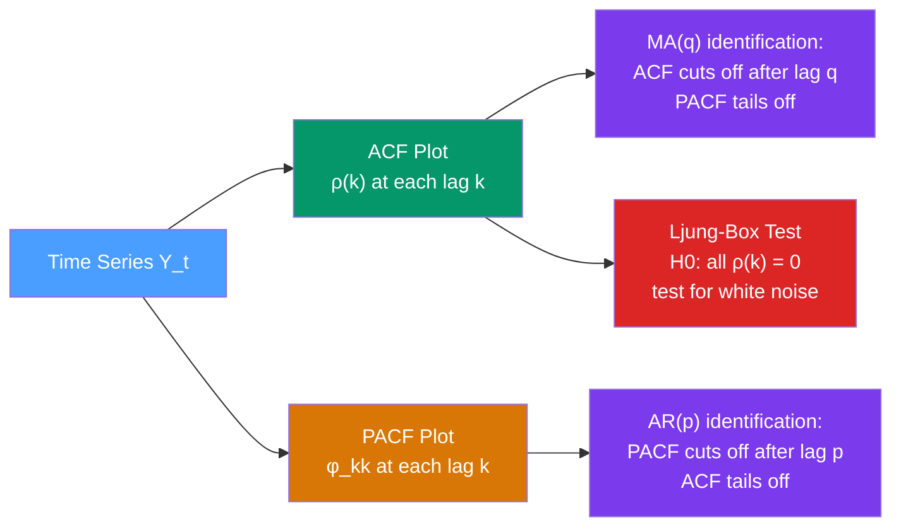

# 🔁 Autocorrelation, ACF, and PACF

> [!abstract] TL;DR
> **Autocorrelation** measures how correlated a time series is with its own past values. The **ACF** (Autocorrelation Function) at lag $k$ is $\rho(k) = \gamma(k)/\gamma(0)$ where $\gamma(k) = \text{Cov}(Y_t, Y_{t-k})$. The **PACF** (Partial Autocorrelation Function) measures correlation at lag $k$ *after removing* the effect of intermediate lags. Together, ACF and PACF patterns are the primary diagnostic tool for identifying AR and MA model orders — the "fingerprint" of a time series' memory structure.

## Intuition — analogy FIRST

You are checking whether today's temperature predicts next week's temperature. **Autocorrelation** simply asks: is tomorrow's temperature correlated with today's? Is next week's correlated with this week's? But wait — if today is hot and tomorrow is hot and next week is hot, is next week's heat *directly* caused by today's, or is it just because tomorrow is hot (which is directly caused by today)?

The **PACF** answers this more surgical question: "After I account for all the intermediate days, does today still tell me something *extra* about next week?" For temperature, the answer is probably no — today's weather has no direct link to next week's; the chain runs through the intermediate days. The PACF cuts through indirect correlations to show only the direct ones.

ACF fingerprints MA models. PACF fingerprints AR models. Together they are your first diagnostic tool for choosing model order.

---

## How It Works



---

## Key Concepts / Details

### Autocovariance and Autocorrelation

For a **stationary** series $\{Y_t\}$:

**Autocovariance at lag $k$:**
$$\gamma(k) = \text{Cov}(Y_t, Y_{t-k}) = \mathbb{E}[(Y_t - \mu)(Y_{t-k} - \mu)]$$

**Autocorrelation at lag $k$ (ACF):**
$$\rho(k) = \frac{\gamma(k)}{\gamma(0)} = \frac{\text{Cov}(Y_t, Y_{t-k})}{\text{Var}(Y_t)}$$

Properties: $\rho(0) = 1$, $\rho(k) = \rho(-k)$, $|\rho(k)| \leq 1$.

**Sample estimator** (given $T$ observations):
$$\hat{\rho}(k) = \frac{\sum_{t=k+1}^{T}(Y_t - \bar{Y})(Y_{t-k} - \bar{Y})}{\sum_{t=1}^{T}(Y_t - \bar{Y})^2}$$

### Partial Autocorrelation Function (PACF)

$\text{PACF}(k) = \phi_{kk}$ is the correlation between $Y_t$ and $Y_{t-k}$ **after removing the linear influence** of the intermediate lags $Y_{t-1}, \ldots, Y_{t-k+1}$.

Computed via the **Yule-Walker equations**:
$$\begin{pmatrix} \rho(1) \\ \rho(2) \\ \vdots \\ \rho(k) \end{pmatrix} = \begin{pmatrix} 1 & \rho(1) & \cdots & \rho(k-1) \\ \rho(1) & 1 & \cdots & \rho(k-2) \\ \vdots & & \ddots & \vdots \\ \rho(k-1) & \cdots & \rho(1) & 1 \end{pmatrix} \begin{pmatrix} \phi_{k1} \\ \phi_{k2} \\ \vdots \\ \phi_{kk} \end{pmatrix}$$

The last coefficient $\phi_{kk}$ is the PACF at lag $k$.

Alternatively: regress $Y_t$ on $Y_{t-1}, \ldots, Y_{t-k}$; the coefficient on $Y_{t-k}$ is $\hat{\phi}_{kk}$.

### The ACF/PACF Pattern Identification Table

This table is the core diagnostic tool for Box-Jenkins model identification:

| Process | ACF | PACF |
|---------|-----|------|
| **White noise** | All zero (within confidence bands) | All zero |
| **AR($p$)** | Tails off (exponential decay or damped sinusoid) | **Cuts off after lag $p$** |
| **MA($q$)** | **Cuts off after lag $q$** | Tails off |
| **ARMA($p$,$q$)** | Tails off after lag $q - p$ | Tails off after lag $p - q$ |
| **I(1) non-stationary** | Decays very slowly (near 1 at all lags) | Large spike at lag 1, then near 0 |
| **Seasonal AR** | Spikes at multiples of $m$ (e.g., 12, 24, 36) | Single spike at lag $m$ |

"Cuts off" means the function is zero (within $\pm 1.96/\sqrt{T}$ confidence band) beyond a given lag.
"Tails off" means the function decays gradually toward zero but never becomes exactly zero.

### Ljung-Box Test for White Noise

After fitting a model, the residuals should be white noise. The **Ljung-Box Q-test** tests the joint null hypothesis $H_0: \rho(1) = \rho(2) = \cdots = \rho(m) = 0$:

$$Q_{LB} = T(T+2) \sum_{k=1}^{m} \frac{\hat{\rho}(k)^2}{T - k} \sim \chi^2(m - p - q)$$

- Reject $H_0$ if $Q_{LB}$ exceeds $\chi^2$ critical value → residuals have remaining autocorrelation → model is misspecified
- Typically use $m = 10$ for non-seasonal, $m = 2s$ for seasonal data ($s$ = period)

### Python: Computing and Plotting ACF/PACF

```python
import pandas as pd
import numpy as np
import matplotlib.pyplot as plt
from statsmodels.graphics.tsaplots import plot_acf, plot_pacf
from statsmodels.stats.diagnostic import acorr_ljungbox
import statsmodels.api as sm

# Generate an AR(2) process: Y_t = 0.7*Y_{t-1} - 0.3*Y_{t-2} + eps_t
np.random.seed(42)
arparams = np.array([0.7, -0.3])
maparams = np.array([])
ar = np.r_[1, -arparams]  # statsmodels uses opposite sign convention
ma = np.r_[1, maparams]
ar2_process = sm.tsa.ArmaProcess(ar, ma)
y = ar2_process.generate_sample(nsample=300)

# Plot ACF and PACF
fig, axes = plt.subplots(1, 2, figsize=(12, 4))
plot_acf(y, lags=20, alpha=0.05, ax=axes[0], title="ACF — AR(2) process")
plot_pacf(y, lags=20, alpha=0.05, ax=axes[1], title="PACF — AR(2) process")
# Expected: ACF tails off (oscillating decay), PACF cuts off after lag 2
plt.tight_layout()
plt.show()

# Compute raw autocorrelations
from statsmodels.tsa.stattools import acf, pacf
acf_values = acf(y, nlags=10, alpha=0.05)
pacf_values = pacf(y, nlags=10, alpha=0.05)
print("ACF lags 0-5:", acf_values[0][:6].round(3))
print("PACF lags 0-5:", pacf_values[0][:6].round(3))

# Ljung-Box test
lb_result = acorr_ljungbox(y, lags=[10], return_df=True)
print(f"\nLjung-Box Q(10): {lb_result['lb_stat'].values[0]:.2f}")
print(f"p-value:          {lb_result['lb_pvalue'].values[0]:.4f}")
```

### Confidence Bands on ACF Plots

Under $H_0$ that the series is white noise, $\hat{\rho}(k) \sim N(0, 1/T)$ approximately for $k \geq 1$. The 95% confidence band is $\pm 1.96/\sqrt{T}$. Spikes outside this band suggest genuine autocorrelation.

**Bartlett's formula** gives more accurate standard errors for general autocorrelated series:
$$\text{Var}(\hat{\rho}(k)) \approx \frac{1}{T}\left(1 + 2\sum_{j=1}^{k-1}\rho(j)^2\right)$$

---

## Real-World Notes

- **Asset returns (daily)**: ACF and PACF are near zero at all lags — returns are approximately white noise (efficient market hypothesis). But **squared returns** show strong ACF → volatility clustering → motivates GARCH models (see [[GARCH_Models]]).
- **Electricity demand (hourly)**: strong spikes in ACF at lags 24, 48, 72 (daily cycle) and at 168 (weekly cycle). PACF shows spikes at lags 24 and 168.
- **Inflation (monthly)**: ACF decays slowly → non-stationary or long-memory. First-differenced series usually shows clean AR(1)/AR(2) PACF pattern.
- **Temperature (daily)**: ACF decays slowly with period ~365 oscillation — annual seasonality. After seasonal differencing, the ACF becomes manageable for ARIMA.

---

## Common Pitfalls

1. **Applying ACF/PACF to non-stationary series**: the ACF decays very slowly (near 1 at many lags) — this is a symptom of non-stationarity, not a structural pattern. Always test/ensure stationarity first.
2. **Counting "cuts off" too strictly**: sampling variability means a few spikes just outside the band may be coincidental. Look for a *clear* cutoff pattern rather than reacting to every marginally significant spike.
3. **Ignoring seasonal ACF**: if the series has seasonality of period $m$, check ACF at multiples of $m$ — seasonal ARIMA structure lives there.
4. **Over-parameterising from noisy plots**: with 50–100 observations, ACF/PACF plots are noisy. Use AIC/BIC to confirm model order selection.
5. **Forgetting the PACF method matters**: `statsmodels` offers OLS, Yule-Walker, and Burg methods for PACF — they can differ on short series. OLS and Burg are generally more reliable.

---

## Related Concepts

- [[_MOC_TS_Fundamentals|↑ Section MOC]]
- [[Stationarity]] — ACF of a non-stationary series decays very slowly; must achieve stationarity before interpreting ACF/PACF
- [[AR_Models]] — AR($p$): ACF tails off, PACF cuts off at lag $p$
- [[MA_Models]] — MA($q$): ACF cuts off at lag $q$, PACF tails off
- [[ARMA_Models]] — mixed: both ACF and PACF tail off
- [[SARIMA_Seasonal_ARIMA]] — seasonal spikes in ACF at multiples of the period $m$

---

## Review Questions

1. You observe that the ACF of a stationary series cuts off sharply after lag 3, while the PACF decays exponentially. What model order does this suggest, and why?
2. A colleague fits an ARIMA(1,1,1) model and checks the residuals. The Ljung-Box p-value is 0.02. What does this mean, and what should they do?
3. Explain in plain language why the PACF of an AR(2) process is zero at lag 3 and beyond, even though the ACF at lag 3 is non-zero.

---

## Sources

- Box, Jenkins, Reinsel & Ljung, *Time Series Analysis: Forecasting and Control* (5th ed.), Ch. 2–3
- Hamilton, *Time Series Analysis*, Ch. 3
- Ljung & Box (1978), *On a Measure of Lack of Fit in Time Series Models*, Biometrika
- statsmodels documentation: `tsa.stattools.acf`, `tsa.stattools.pacf`

#time-series #fundamentals #autocorrelation #ACF #PACF
