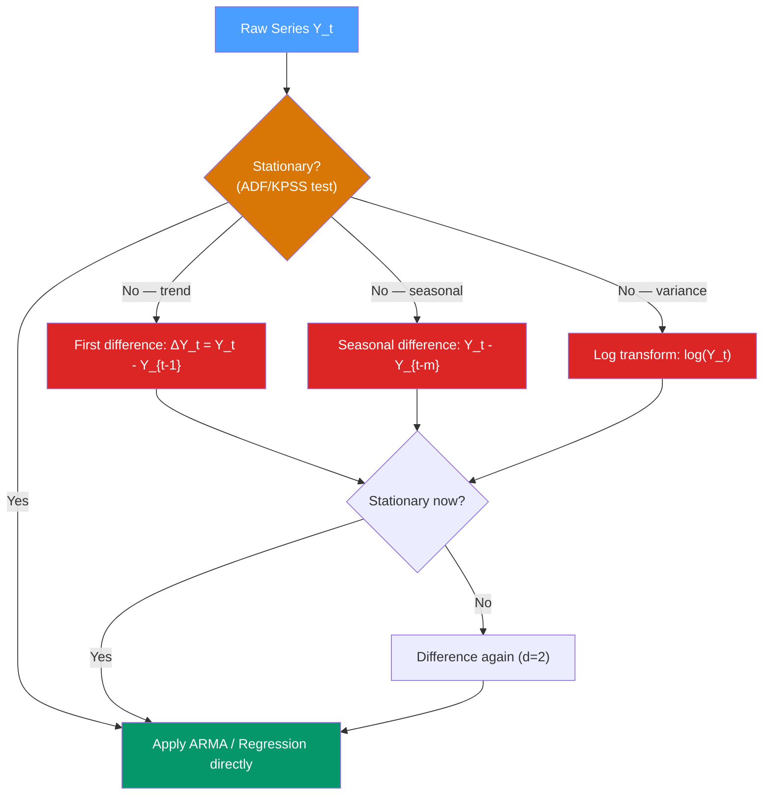

# 📐 Stationarity

> [!abstract] TL;DR
> A time series is **weakly (covariance) stationary** if its mean, variance, and autocovariance structure do not change over time: $\mathbb{E}[Y_t] = \mu$, $\text{Var}(Y_t) = \sigma^2 < \infty$, and $\text{Cov}(Y_t, Y_{t-k}) = \gamma(k)$ for all $t$. Most classical models (ARIMA, ARMA) assume stationarity. The **Augmented Dickey-Fuller (ADF) test** is the standard way to test for a unit root (non-stationarity). The cure is usually first differencing: $\nabla Y_t = Y_t - Y_{t-1}$.

## Intuition — analogy FIRST

Imagine recording daily temperature in a city. In **summer**, the average is 30°C and swings are mild. In **winter**, the average drops to 5°C and swings widen. If you build a model on summer data and apply it in winter, it will be systematically wrong — the series is **non-stationary** because its properties change over time.

Now imagine recording the **daily change** in temperature instead of the temperature itself. Changes are much more consistent year-round: some days go up 2°C, others drop 3°C, but the mean change is near zero and variance is roughly constant. This differenced series is much closer to stationary.

Stationarity is the assumption that the statistical "rules of the game" don't change as you slide through time. Most classical estimators need this guarantee to work — otherwise today's data says nothing reliable about tomorrow.

---

## How It Works



---

## Key Concepts / Details

### Strict vs Weak Stationarity

| Type | Definition | Used in practice? |
|------|-----------|-------------------|
| **Strict stationarity** | Joint distribution of $(Y_t, Y_{t+1}, \ldots, Y_{t+k})$ is the same for all $t$ — entire distribution is time-invariant | Rarely; too strong |
| **Weak (covariance) stationarity** | Only first two moments are time-invariant: constant mean, constant variance, autocovariance depends only on lag $k$ not $t$ | Yes — this is what ARMA assumes |

**Formal conditions for weak stationarity:**
$$\mathbb{E}[Y_t] = \mu \quad \forall t$$
$$\text{Var}(Y_t) = \sigma^2 < \infty \quad \forall t$$
$$\text{Cov}(Y_t, Y_{t-k}) = \gamma(k) \quad \forall t \text{ (function of lag } k \text{ only)}$$

### Why Stationarity Matters for Models

ARMA coefficient estimation via OLS or MLE relies on the ergodic theorem: sample averages converge to population averages as $T \to \infty$. If the mean changes over time, the time average is not the mean of any fixed distribution — estimates are meaningless. More dangerously, regressing two **non-stationary** series produces **spurious regression** with inflated $R^2$ and significant $t$-statistics even when the series are completely unrelated.

### Types of Non-Stationarity

| Type | Description | Fix |
|------|-------------|-----|
| **Stochastic trend (unit root)** | $Y_t = Y_{t-1} + \epsilon_t$ — random walk; variance grows with $t$ | First difference |
| **Deterministic trend** | $Y_t = \alpha + \beta t + \epsilon_t$ — mean grows linearly | Detrend (subtract $\hat{\beta}t$) or first difference |
| **Structural break** | Distribution shifts at a known or unknown date | Dummy variable or split sample |
| **Seasonal non-stationarity** | Seasonal means differ | Seasonal differencing $Y_t - Y_{t-m}$ |
| **Heteroskedasticity** | Variance changes over time | Log transform or Box-Cox |

### The Augmented Dickey-Fuller (ADF) Test

The ADF test tests for a **unit root** (stochastic trend). It estimates:

$$\Delta Y_t = \alpha + \beta t + \delta Y_{t-1} + \sum_{j=1}^{p} \phi_j \Delta Y_{t-j} + \epsilon_t$$

- **Null hypothesis $H_0$**: $\delta = 0$ — unit root exists (series is non-stationary)
- **Alternative $H_1$**: $\delta < 0$ — no unit root (series is stationary)
- Test statistic follows the **Dickey-Fuller distribution** (not standard normal — critical values are more negative)
- The lagged differences $\sum \phi_j \Delta Y_{t-j}$ are augmentation terms to soak up autocorrelation in residuals
- Choose lag $p$ by minimising AIC/BIC or using the Ng-Perron sequential procedure

**Interpretation table:**

| ADF statistic | p-value | Conclusion |
|---------------|---------|------------|
| More negative than critical value | < 0.05 | Reject $H_0$: stationary |
| Less negative than critical value | > 0.05 | Fail to reject $H_0$: unit root likely |

### The KPSS Test (Complementary)

KPSS reverses the null: **$H_0$: series is stationary** (no unit root). Using both ADF and KPSS together resolves ambiguity:

| ADF | KPSS | Conclusion |
|-----|------|------------|
| Reject (stationary) | Fail to reject (stationary) | **Stationary** |
| Fail to reject (unit root) | Reject (not stationary) | **Unit root** |
| Reject | Reject | **Trend-stationary** (deterministic trend but no unit root) |
| Fail to reject | Fail to reject | **Insufficient data** |

### Transformations to Achieve Stationarity

```python
import pandas as pd
import numpy as np
from statsmodels.tsa.stattools import adfuller, kpss

# Simulate a random walk (non-stationary)
np.random.seed(42)
T = 200
rw = pd.Series(np.cumsum(np.random.normal(0, 1, T)))

def run_adf(series, name):
    result = adfuller(series.dropna(), autolag='AIC')
    print(f"\n{name}:")
    print(f"  ADF statistic: {result[0]:.4f}")
    print(f"  p-value:       {result[1]:.4f}")
    print(f"  Critical 5%:   {result[4]['5%']:.4f}")
    print(f"  Stationary:    {result[1] < 0.05}")

run_adf(rw, "Random Walk")
run_adf(rw.diff(), "First Difference")

# Real example: airline passengers
import statsmodels.api as sm
passengers = sm.datasets.get_rdataset("AirPassengers", "datasets").data["value"]
passengers.index = range(len(passengers))
passengers = pd.Series(passengers.values)

run_adf(passengers, "Airline Passengers (raw)")
run_adf(np.log(passengers).diff(), "Log-differenced Passengers")
run_adf(np.log(passengers).diff().diff(12), "Log-diff-seasonal-diff")
```

### Box-Cox Transformation for Variance Stabilisation

When variance grows with level (multiplicative structure), use Box-Cox:
$$W_t = \begin{cases} \frac{Y_t^\lambda - 1}{\lambda} & \lambda \neq 0 \\ \log Y_t & \lambda = 0 \end{cases}$$

$\lambda = 0$ (log transform) is most common. $\lambda = 0.5$ is square root for count data. Estimate $\lambda$ by maximum likelihood via `scipy.stats.boxcox`.

### Integration Order

A series is said to be **integrated of order $d$**, written $I(d)$, if it requires $d$ rounds of differencing to become stationary. Most economic/financial series are $I(1)$.

- **$I(0)$**: already stationary — ARMA models apply directly
- **$I(1)$**: one difference needed — ARIMA$(p,1,q)$; e.g., stock prices, GDP levels
- **$I(2)$**: two differences — rare; e.g., some price indices before transformation

---

## Real-World Notes

- **GDP levels** are $I(1)$: the level drifts upward, but GDP *growth* (first difference / log-difference) is $I(0)$ and suitable for ARMA.
- **Stock prices** are $I(1)$ (random walk hypothesis): returns are approximately $I(0)$ white noise.
- **Interest rates**: debated — often $I(1)$ with structural breaks; use care with ADF near zero lower bound.
- **Temperature anomalies**: approximately stationary around a slowly rising mean (climate trend); the linear trend component needs to be removed.
- **Cointegration** (see [[Cointegration_and_ECM]]): two $I(1)$ series can be cointegrated — their linear combination is $I(0)$. Running OLS on them is valid; this is not spurious regression.

---

## Common Pitfalls

1. **Accepting non-rejection of ADF as proof of unit root**: ADF has low power in small samples. Supplement with KPSS and visual inspection.
2. **Over-differencing**: differencing more than necessary introduces negative autocorrelation at lag 1. If ACF of $\Delta Y_t$ has a spike near $-0.5$ at lag 1, you've over-differenced.
3. **Ignoring structural breaks**: ADF is biased toward non-rejection when there is a structural break. Use Zivot-Andrews test which allows an unknown break date.
4. **Mixing I(0) and I(1) variables in regression**: invalidates OLS standard errors. Test integration order of all variables first.
5. **Forgetting seasonal non-stationarity**: series can be $I(1)$ in both the non-seasonal and seasonal sense; need both $\nabla$ and $\nabla_{12}$ differencing.

---

## Related Concepts

- [[_MOC_TS_Fundamentals|↑ Section MOC]]
- [[Time_Series_Components]] — the trend and seasonal components that cause non-stationarity
- [[Autocorrelation_and_ACF_PACF]] — ACF of a non-stationary series decays slowly, ACF of stationary series cuts off or decays fast
- [[White_Noise_and_Random_Walk]] — the two extremes: perfect stationarity (WN) and pure unit root (RW)
- [[ARIMA_and_Differencing]] — how the $d$ in ARIMA(p,d,q) implements the differencing fix
- [[Cointegration_and_ECM]] — when $I(1)$ series share a stationary long-run equilibrium

---

## Review Questions

1. Write the three mathematical conditions for weak stationarity. Give a concrete example of a series that satisfies all three and one that violates each condition separately.
2. A colleague runs ADF on monthly inflation and gets p-value = 0.08. They conclude the series is stationary. What is wrong with this conclusion, and what additional steps would you take?
3. Explain the difference between a trend-stationary series and a difference-stationary (unit root) series. Why does the choice of detrending method matter?

---

## Sources

- Hamilton, *Time Series Analysis*, Ch. 15–17 (unit roots, cointegration)
- Dickey & Fuller (1979), *Distribution of the Estimators for Autoregressive Time Series with a Unit Root*, JASA
- Kwiatkowski et al. (1992), *Testing the Null Hypothesis of Stationarity Against the Alternative of a Unit Root*, Journal of Econometrics
- Hyndman & Athanasopoulos, *Forecasting: Principles and Practice* (3rd ed.), Ch. 9

#time-series #fundamentals #stationarity #unit-root #ADF
