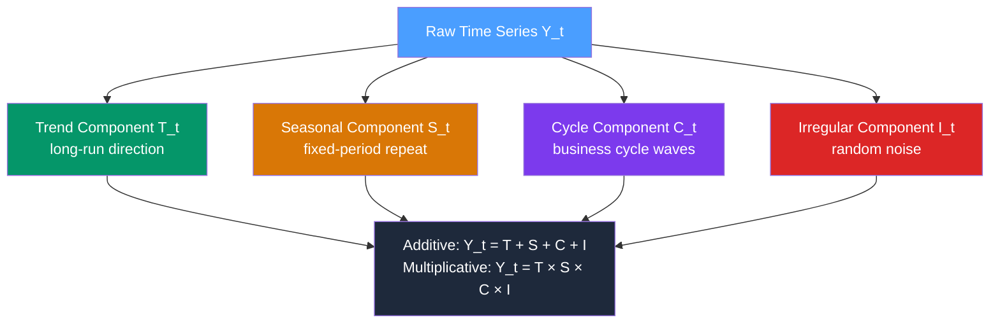

# 📊 Time Series Components

> [!abstract] TL;DR
> Every time series can be decomposed into four components: **Trend** (long-run direction), **Seasonality** (fixed-period repeating pattern), **Cycle** (irregular long-wave oscillation), and **Irregular/Noise** (unpredictable residual). Formally: $Y_t = T_t + S_t + C_t + I_t$ (additive) or $Y_t = T_t \times S_t \times C_t \times I_t$ (multiplicative). Identifying which components are present is the first step before any modelling.

## Intuition — analogy FIRST

Think of a city's electricity demand over years as a layered signal:

- **Trend**: demand grows every decade because the population grows — a slow upward drift.
- **Seasonality**: demand spikes every winter (heating) and summer (AC) — the same pattern *every* year on a fixed calendar schedule.
- **Cycle**: demand dips during a recession and surges during an economic boom — multi-year waves that don't follow a fixed clock.
- **Irregular**: a surprise heatwave, a grid failure, a holiday — one-off shocks that no component above captures.

Decomposition is the act of peeling these layers apart so you can model each on its own terms.

---

## How It Works



---

## Key Concepts / Details

### The Four Components

#### 1. Trend ($T_t$)
The **long-run smooth movement** in the series level — upward, downward, or flat. It captures structural changes driven by population growth, technological change, or long-run economic forces.

- **Linear trend**: $T_t = \alpha + \beta t$
- **Exponential trend**: $T_t = \alpha e^{\beta t}$, appears linear after log transformation
- **Polynomial trend**: $T_t = \alpha_0 + \alpha_1 t + \alpha_2 t^2 + \ldots$

#### 2. Seasonality ($S_t$)
**Regular, predictable fluctuations** tied to a fixed calendar period: daily (time-of-day), weekly (day-of-week), monthly, or annual. By definition, seasonal periods are **known and fixed** (e.g., period $m = 12$ for monthly data with annual seasonality).

Key property: $\sum_{i=1}^{m} S_{t+i} = 0$ (additive) or $\prod_{i=1}^{m} S_{t+i} = 1$ (multiplicative).

#### 3. Cycle ($C_t$)
**Irregular long-wave oscillations** not tied to a fixed calendar — business cycles lasting 2–10 years, real estate cycles, credit cycles. Unlike seasonality, cycle period and amplitude vary. In practice, many textbooks merge $C_t$ into the trend or treat it as part of the remainder.

#### 4. Irregular / Noise ($I_t$)
The **unpredictable residual** after removing trend, seasonality, and cycle. Ideally this is white noise — zero mean, constant variance, no autocorrelation. If it is not white noise, the decomposition is incomplete.

### Additive vs Multiplicative

| Model | Formula | When to use |
|-------|---------|-------------|
| **Additive** | $Y_t = T_t + S_t + C_t + I_t$ | Seasonal amplitude is constant regardless of level |
| **Multiplicative** | $Y_t = T_t \times S_t \times C_t \times I_t$ | Seasonal amplitude grows proportionally with the level |
| **Log-additive** | $\log Y_t = \log T_t + \log S_t + \ldots$ | Equivalent to multiplicative; enables additive methods |

**Diagnostic rule**: plot the series. If seasonal swings widen as the trend rises, choose multiplicative. If they stay constant, choose additive.

### Identifying Components Visually

1. **Time plot**: draw $Y_t$ vs $t$. Rising/falling baseline = trend. Regular spikes = seasonality.
2. **Seasonal subseries plot**: one subplot per season (month/quarter). Flat within each = stable seasonality.
3. **Box plots by season**: monthly box plots show whether seasonal pattern is stable.
4. **Lag plot**: $Y_t$ vs $Y_{t-k}$. If $k = m$ shows strong positive correlation, seasonality of period $m$ exists.

```python
import pandas as pd
import matplotlib.pyplot as plt
from statsmodels.tsa.seasonal import seasonal_decompose

# Load monthly airline passenger data
url = "https://raw.githubusercontent.com/jbrownlee/Datasets/master/airline-passengers.csv"
df = pd.read_csv(url, index_col=0, parse_dates=True)
df.columns = ["passengers"]

# Multiplicative decomposition (amplitude grows with level)
result = seasonal_decompose(df["passengers"], model="multiplicative", period=12)
result.plot()
plt.tight_layout()
plt.show()

# Access individual components
trend     = result.trend      # T_t
seasonal  = result.seasonal   # S_t
residual  = result.resid      # I_t (after removing T and S)
```

### Stationarity Connection

Raw series with trend and seasonality are almost always **non-stationary** — the mean changes over time. To use models like ARIMA you must remove these components first via:
- **Differencing** (removes stochastic trend): $\nabla Y_t = Y_t - Y_{t-1}$
- **Seasonal differencing** (removes seasonality): $\nabla_m Y_t = Y_t - Y_{t-m}$
- **Regression detrending** (removes deterministic trend): regress $Y_t$ on $t$, keep residuals

See [[Stationarity]] and [[ARIMA_and_Differencing]] for the full treatment.

---

## Real-World Notes

- **Retail sales** (monthly): strong upward trend + holiday/back-to-school seasonality + economic cycle + random promotions/weather.
- **Stock prices**: trend (bull/bear market) + very weak seasonality (January effect) + no strong cycle + large irregular noise. Most of the variation is irregular — see [[White_Noise_and_Random_Walk]].
- **Temperature**: clear annual seasonality (dominant), weak long-run trend (climate change), irregular (weather).
- **Electricity demand**: trend + dual annual peak seasonality (summer AC, winter heating) + weekly pattern (weekdays vs weekends) + hourly pattern.

---

## Common Pitfalls

1. **Confusing seasonality with cycle**: seasonality has a fixed known period (12 months); cycles have variable periods. Using seasonal dummies for a cycle will fail.
2. **Applying additive decomposition to multiplicative data**: underestimates seasonality at peaks, overestimates at troughs. Take logs first or use multiplicative model.
3. **Treating residuals as noise without testing**: check residual ACF — if autocorrelation remains, decomposition is incomplete.
4. **Short series and seasonality**: you need at least 2 full seasonal periods (e.g., 24 months) to estimate monthly seasonality reliably.
5. **Missing the trend-in-seasonality interaction**: seasonality can evolve over time (e.g., summer peaks intensifying due to climate change). Classical decomposition assumes stable seasonality; STL handles this — see [[STL_Decomposition]].

---

## Related Concepts

- [[_MOC_TS_Fundamentals|↑ Section MOC]]
- [[Stationarity]] — how trend and seasonality make a series non-stationary and what to do about it
- [[Trend_and_Seasonality]] — detailed methods for estimating and removing each component
- [[Additive_vs_Multiplicative_Decomposition]] — full treatment of choosing the decomposition model
- [[STL_Decomposition]] — robust, flexible seasonal-trend decomposition using LOESS
- [[Autocorrelation_and_ACF_PACF]] — how autocorrelation reveals the remaining memory structure

---

## Review Questions

1. A retail chain sees Christmas sales double each year while regular monthly sales also grow. Which decomposition model (additive or multiplicative) is appropriate, and why?
2. Describe how you would visually distinguish between a seasonal component and a cyclical component in a time plot.
3. You decompose a monthly series and check the ACF of the residuals. It shows significant spikes at lags 1, 2, and 3. What does this tell you about the decomposition quality?

---

## Sources

- Hyndman & Athanasopoulos, *Forecasting: Principles and Practice* (3rd ed.), Ch. 3 — https://otexts.com/fpp3/
- Hamilton, *Time Series Analysis*, Ch. 1
- Cleveland et al. (1990), *STL: A Seasonal-Trend Decomposition Procedure Based on LOESS*

#time-series #fundamentals #decomposition #components
