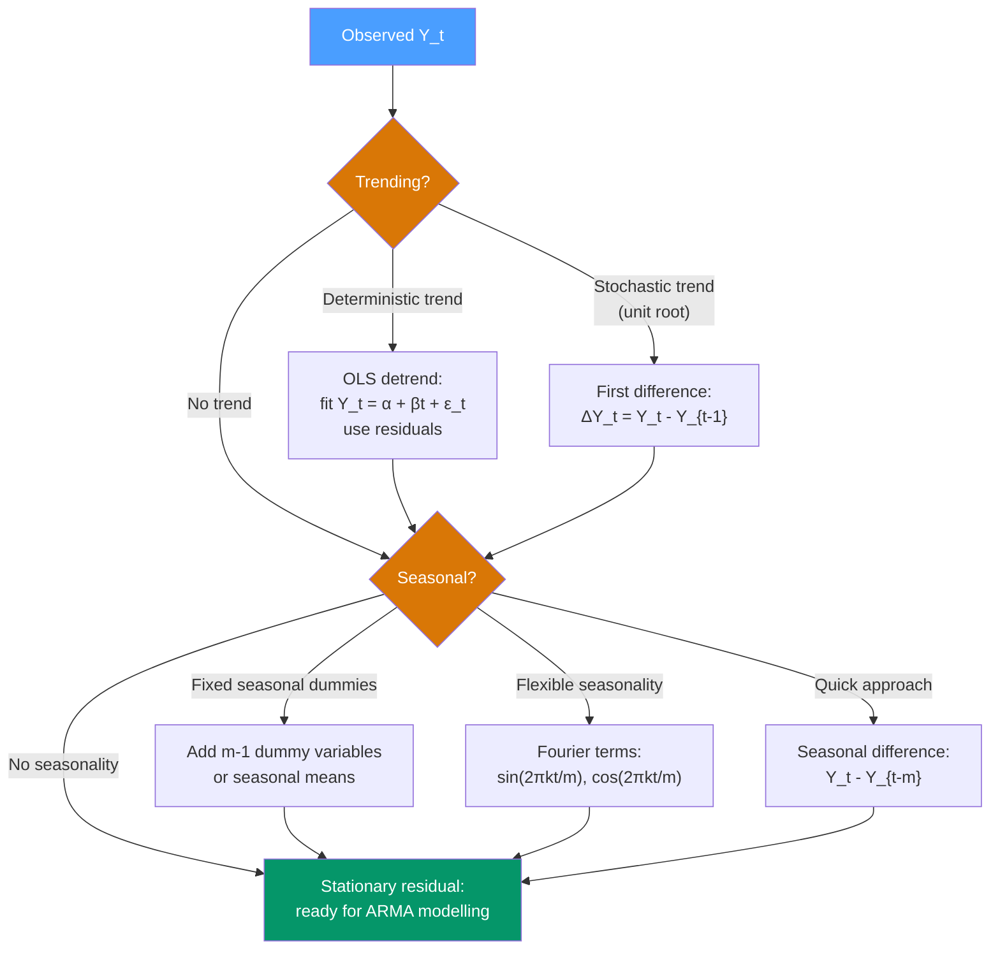

# 📅 Trend and Seasonality

> [!abstract] TL;DR
> **Trend** is the long-run direction of a series; **seasonality** is the recurring pattern tied to a fixed calendar period. Identifying and removing both is essential before fitting ARIMA-family models. Trend removal methods include linear regression detrending and first differencing ($\nabla Y_t = Y_t - Y_{t-1}$). Seasonality removal uses seasonal dummies, Fourier terms, or seasonal differencing ($\nabla_m Y_t = Y_t - Y_{t-m}$).

## Intuition — analogy FIRST

Think of a supermarket's weekly revenue as a river. The river has a current (trend — business grows every year), tidal rhythms (seasonality — more sales every weekend and every December), and random splashes (noise — a surprise promotion, a snowstorm).

Before you can model the random splashes, you need to drain the current and filter out the tides. That is detrending and seasonal adjustment: separating the predictable, structured components from the unpredictable residual that actually contains the interesting dynamics you want to model.

---

## How It Works



---

## Key Concepts / Details

### Trend: Deterministic vs Stochastic

The nature of the trend determines how to remove it:

| Type | Model | Test | Removal method |
|------|-------|------|----------------|
| **Deterministic** | $Y_t = \mu + \beta t + \epsilon_t$ where $\epsilon_t \sim I(0)$ | KPSS test rejects; ADF rejects with trend included | OLS detrend: subtract $\hat{\mu} + \hat{\beta}t$ |
| **Stochastic (unit root)** | $Y_t = Y_{t-1} + \epsilon_t$ (random walk with possible drift) | ADF fails to reject unit root | First difference: $\Delta Y_t = Y_t - Y_{t-1}$ |

**Critical distinction**: using OLS detrending on a stochastic trend does *not* make the series stationary — it creates a spurious trend-stationary process. Use ADF/KPSS to decide.

### Linear Trend Fitting

$$Y_t = \alpha + \beta t + \epsilon_t$$

```python
import pandas as pd
import numpy as np
from statsmodels.tsa.stattools import adfuller

# Simulate trend-stationary series
np.random.seed(42)
T = 100
t = np.arange(T)
epsilon = np.random.normal(0, 1, T)
Y = 2 + 0.5 * t + epsilon  # deterministic trend

# OLS detrend
from numpy.polynomial import polynomial as P
coeffs = np.polyfit(t, Y, 1)
trend_fitted = np.polyval(coeffs, t)
detrended = Y - trend_fitted

print(f"ADF on Y: {adfuller(Y)[1]:.4f}")
print(f"ADF on detrended: {adfuller(detrended)[1]:.4f}")
```

### Seasonal Dummies

For a series with period $m$, add $m-1$ binary indicator variables (drop one to avoid multicollinearity with the constant):

$$Y_t = \alpha + \beta t + \sum_{j=1}^{m-1} \delta_j D_{jt} + \epsilon_t$$

where $D_{jt} = 1$ if observation $t$ falls in season $j$.

```python
import pandas as pd
import statsmodels.formula.api as smf

# Monthly data: create seasonal dummies
df = pd.DataFrame({'Y': Y_monthly, 'time': range(len(Y_monthly))})
df['month'] = df.index % 12  # 0..11

# One-hot encode (drop first category = January baseline)
seasonal_dummies = pd.get_dummies(df['month'], prefix='m', drop_first=True)
df = pd.concat([df, seasonal_dummies], axis=1)

# Fit OLS with trend and seasonality
formula = 'Y ~ time + ' + ' + '.join([c for c in df.columns if c.startswith('m_')])
model = smf.ols(formula, data=df).fit()
seasonal_adjusted = model.resid
```

### Fourier Terms for Flexible Seasonality

When the seasonal pattern is smooth (sinusoidal), Fourier terms are more parsimonious than dummies — especially for high-frequency data (daily, hourly):

$$Y_t = \alpha + \beta t + \sum_{k=1}^{K} \left[a_k \sin\left(\frac{2\pi k t}{m}\right) + b_k \cos\left(\frac{2\pi k t}{m}\right)\right] + \epsilon_t$$

Choose $K$ by AIC/BIC. Maximum $K = m/2$.

```python
def fourier_terms(t, period, K):
    """Generate K pairs of sin/cos Fourier terms for given period."""
    terms = {}
    for k in range(1, K + 1):
        terms[f'sin_{k}'] = np.sin(2 * np.pi * k * t / period)
        terms[f'cos_{k}'] = np.cos(2 * np.pi * k * t / period)
    return pd.DataFrame(terms)

t_idx = np.arange(len(df))
fourier = fourier_terms(t_idx, period=52, K=3)  # weekly seasonality, 3 harmonics
```

### Seasonal Differencing

The simplest approach: subtract the value from the same season in the previous period:

$$\nabla_m Y_t = Y_t - Y_{t-m}$$

For monthly data: $\nabla_{12} Y_t = Y_t - Y_{t-12}$. This removes both deterministic and stochastic seasonal patterns in one step — the reason SARIMA uses seasonal differencing.

Combined with regular differencing for series that are both trended and seasonal:
$$\nabla \nabla_{12} Y_t = (Y_t - Y_{t-1}) - (Y_{t-12} - Y_{t-13})$$

```python
import pandas as pd

# Airline passengers example
passengers = pd.read_csv("airline_passengers.csv", index_col=0, parse_dates=True)["value"]

# Regular differencing (removes trend)
diff1 = passengers.diff(1).dropna()

# Seasonal differencing (removes annual seasonality)
diff12 = passengers.diff(12).dropna()

# Both (combined — used in SARIMA(p,1,q)(P,1,Q)[12])
diff_both = passengers.diff(1).diff(12).dropna()
```

### Identifying the Presence of Trend and Seasonality

**Visual tools:**
- Time plot with rolling mean overlay: rising/falling 12-month rolling mean → trend
- Monthly/quarterly box plots: systematic differences in medians → seasonality
- Spectral analysis: `scipy.signal.periodogram` — peaks at frequency $1/m$ confirm seasonality of period $m$

**Formal tests:**
- **Canova-Hansen test**: null is stable seasonality vs. unit root in seasonal component
- **Seasonal ADF**: extends ADF to seasonal unit roots
- **STL residuals**: after STL decomposition, check if seasonal component is non-trivially large

---

## Real-World Notes

- **Retail sales**: strong Christmas seasonality + steady growth trend. Use multiplicative decomposition (seasonal effect is proportional to level). Log-transform first, then subtract log-seasonal + log-trend.
- **Economic series (GDP, employment)**: government statistical agencies publish **seasonally adjusted** versions using X-13ARIMA-SEATS or TRAMO-SEATS — these are the standard for macro analysis.
- **Energy consumption**: multiple seasonal periods (daily, weekly, annual) require multiple Fourier terms or TBATS model. Single-period approaches fail.
- **Web traffic**: strong weekly cycle (weekday vs weekend), possible annual cycle, strong growth trend from organic search. Fourier + linear trend works well.

---

## Common Pitfalls

1. **Applying seasonal differencing to non-seasonal data**: unnecessary differencing adds noise and complicates the model.
2. **Using seasonal dummies when seasonality is evolving**: classical dummies assume constant seasonal effect. Use STL or dynamic harmonic regression for changing seasonality.
3. **Ignoring the interaction between trend and seasonality**: multiplicative series needs log transform before additive methods.
4. **Not saving the seasonal component**: if you seasonally adjust for modelling, you must add back the seasonal forecast for the final prediction.
5. **Confusing seasonality period with data frequency**: monthly data can have annual seasonality ($m=12$), but also quarterly seasonality ($m=3$) or weekly patterns in some sectors.

---

## Related Concepts

- [[_MOC_TS_Fundamentals|↑ Section MOC]]
- [[Time_Series_Components]] — the full decomposition framework including cycle and irregular
- [[Stationarity]] — how trend and seasonality violate stationarity and what to do about it
- [[Additive_vs_Multiplicative_Decomposition]] — choosing the right model structure
- [[STL_Decomposition]] — robust, flexible detrending and seasonal adjustment
- [[Holt_Winters_Method]] — exponential smoothing that directly models trend + seasonality
- [[SARIMA_Seasonal_ARIMA]] — ARIMA with built-in seasonal differencing and seasonal AR/MA terms

---

## Review Questions

1. You have monthly retail sales data. The ACF of the raw series shows a very slow decay, and box plots by month show that December sales are roughly 3× the baseline but that the multiple has grown each year. What type of trend and seasonality is present, and what transformations would you apply before fitting an ARIMA model?
2. Explain the difference between deterministic seasonality (addressed by seasonal dummies) and stochastic seasonality (addressed by seasonal differencing). What test would you use to distinguish them?
3. A forecasting model fitted on seasonally-adjusted data produces a prediction for next quarter. What step is required before reporting the final forecast?

---

## Sources

- Hyndman & Athanasopoulos, *Forecasting: Principles and Practice* (3rd ed.), Ch. 3, 9
- Box, Jenkins, Reinsel & Ljung, *Time Series Analysis* (5th ed.), Ch. 9
- US Census Bureau, X-13ARIMA-SEATS Reference Manual — https://www.census.gov/srd/www/x13as/
- Hamilton, *Time Series Analysis*, Ch. 1, 15

#time-series #fundamentals #trend #seasonality #detrending
