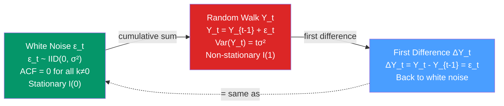

# ⚪ White Noise and Random Walk

> [!abstract] TL;DR
> **White noise** $\{\epsilon_t\}$ is a sequence with zero mean, constant variance $\sigma^2$, and zero autocorrelation at all non-zero lags — perfect stationarity with no memory. A **random walk** $Y_t = Y_{t-1} + \epsilon_t$ is the opposite extreme: an $I(1)$ process with a unit root, infinite variance as $T \to \infty$, and no mean-reversion. White noise is the ideal residual; random walk is the primary null model for asset prices and the nemesis of naive forecasting.

## Intuition — analogy FIRST

**White noise**: imagine a completely fair coin toss game. Each flip is $+1$ (heads) or $-1$ (tails), with equal probability, and each flip is completely independent of every past flip. Yesterday's result tells you nothing about today's. This is white noise — pure unpredictability, zero memory.

**Random walk**: now imagine a drunk person leaving a bar. Each step is random — sometimes left, sometimes right — but their position is the *accumulation* of all past steps. Their current position has memory of where they started, because every step added to the previous position. The variance of their location grows without bound over time: after $T$ steps they could be $\sqrt{T}$ steps from the start. This is a random walk — each increment is white noise, but the *level* has infinite variance.

The difference matters enormously for forecasting. Forecasting white noise: predict zero (the mean). Forecasting a random walk: predict the last observed value (the best you can do).

---

## How It Works



---

## Key Concepts / Details

### White Noise

A process $\{\epsilon_t\}$ is **white noise** if:

$$\mathbb{E}[\epsilon_t] = 0 \quad \forall t$$
$$\text{Var}(\epsilon_t) = \sigma^2 < \infty \quad \forall t$$
$$\text{Cov}(\epsilon_t, \epsilon_s) = 0 \quad \forall t \neq s$$

**Hierarchy of white noise types:**

| Type | Additional condition | Notes |
|------|---------------------|-------|
| **Weak white noise** | Zero mean, constant variance, zero autocorrelation | Weakest; allows non-linear dependence |
| **Strong white noise** | IID (independent and identically distributed) | Independence, not just uncorrelatedness |
| **Gaussian white noise** | $\epsilon_t \sim N(0, \sigma^2)$ i.i.d. | Strongest; needed for exact distributional results |

For ARMA modelling, the assumption is typically Gaussian white noise innovations, but consistency of parameter estimates holds under weaker conditions.

### ACF of White Noise

For white noise, the true ACF is:
$$\rho(k) = \begin{cases} 1 & k = 0 \\ 0 & k \neq 0 \end{cases}$$

Sample ACF $\hat{\rho}(k) \sim N(0, 1/T)$ approximately. The 95% confidence band $\pm 1.96/\sqrt{T}$ is the standard visual guide on ACF plots — a well-specified model's residuals should have nearly all sample ACF within this band.

### Random Walk

The simplest unit root process:

$$Y_t = Y_{t-1} + \epsilon_t, \quad \epsilon_t \sim WN(0, \sigma^2)$$

Equivalently by telescoping back from $Y_0$:
$$Y_t = Y_0 + \sum_{s=1}^{t} \epsilon_s$$

**Key properties:**
- $\mathbb{E}[Y_t | Y_0] = Y_0$ (no drift; driftless random walk)
- $\text{Var}(Y_t) = t \sigma^2$ — variance grows linearly with time
- $\text{Corr}(Y_t, Y_{t+k}) = \sqrt{t/(t+k)} \to 1$ as $t \to \infty$ — consecutive values are nearly perfectly correlated
- ACF at lag $k$: $\hat{\rho}(k) \approx 1 - k/(2T)$ — decays extremely slowly

**Random walk with drift:**
$$Y_t = \mu + Y_{t-1} + \epsilon_t \implies Y_t = Y_0 + \mu t + \sum_{s=1}^{t} \epsilon_s$$

Now $\mathbb{E}[Y_t] = Y_0 + \mu t$ — the expected path is a straight line, but the actual path wanders randomly around it.

### Martingale Property

A random walk is a **martingale**: $\mathbb{E}[Y_{t+1} | Y_t, Y_{t-1}, \ldots] = Y_t$. The best forecast is always the current value — no information beyond the current level improves the prediction.

This is the foundation of the **Efficient Market Hypothesis (EMH)**: stock prices follow a martingale because any predictable component would be traded away immediately.

### The Dickey-Fuller Distribution

Testing $H_0$: unit root in $Y_t = \phi Y_{t-1} + \epsilon_t$ (i.e., $\phi = 1$) cannot use the standard $t$-distribution. Under $H_0$, the $t$-statistic for $\hat{\phi}$ follows the **Dickey-Fuller distribution** — a non-standard distribution with fatter left tail than normal:

| Significance | Standard normal | Dickey-Fuller critical value |
|-------------|-----------------|------------------------------|
| 1% | -2.33 | -3.43 (with constant) |
| 5% | -1.64 | -2.86 (with constant) |
| 10% | -1.28 | -2.57 (with constant) |

The DF critical values are more negative — harder to reject the null. Using normal critical values leads to over-rejection (spuriously declaring stationarity).

### Python: Simulating and Testing

```python
import numpy as np
import pandas as pd
import matplotlib.pyplot as plt
from statsmodels.tsa.stattools import adfuller
from statsmodels.graphics.tsaplots import plot_acf

np.random.seed(42)
T = 500
eps = np.random.normal(0, 1, T)

# White noise
wn = eps.copy()

# Random walk
rw = np.cumsum(eps)

# Driftless random walk: variance grows with t
print(f"WN variance:                {np.var(wn):.2f}")
print(f"RW variance (whole series): {np.var(rw):.2f}")
print(f"RW variance (first half):   {np.var(rw[:T//2]):.2f}")
print(f"RW variance (second half):  {np.var(rw[T//2:]):.2f}")

# ADF tests
adf_wn = adfuller(wn, autolag='AIC')
adf_rw = adfuller(rw, autolag='AIC')
print(f"\nADF white noise  p-value: {adf_wn[1]:.4f}")   # << 0.05
print(f"ADF random walk  p-value: {adf_rw[1]:.4f}")    # >> 0.05

# First-differencing restores stationarity
adf_diff = adfuller(np.diff(rw), autolag='AIC')
print(f"ADF diff(random walk) p-value: {adf_diff[1]:.4f}")  # << 0.05

# Forecasting: best forecast for random walk is last value
forecast_rw = rw[-1]  # point forecast for all horizons
print(f"\nRW last value (h-step forecast): {forecast_rw:.2f}")
```

### Spurious Regression

Regressing two independent random walks on each other yields significant-looking regression results purely by chance:

```python
np.random.seed(1)
T = 200
Y = np.cumsum(np.random.normal(0, 1, T))
X = np.cumsum(np.random.normal(0, 1, T))  # independent of Y

import statsmodels.api as sm
res = sm.OLS(Y, sm.add_constant(X)).fit()
print(f"R²: {res.rsquared:.3f}, t-stat: {res.tvalues[1]:.2f}, p: {res.pvalues[1]:.4f}")
# Often shows high R² and significant t despite zero true relationship
# This is spurious regression — Granger & Newbold (1974)
```

The cure: first-difference both series before regression, or test for cointegration first (see [[Cointegration_and_ECM]]).

---

## Real-World Notes

- **Stock prices** follow an approximately driftless random walk with drift (the equity risk premium provides the drift). Returns are approximately white noise — but not exactly, due to volatility clustering (fat tails, autocorrelation in squared returns) → see [[GARCH_Models]].
- **Foreign exchange rates**: random walk hypothesis is hard to reject empirically; forward rates are poor predictors of future spot rates.
- **Interest rates**: near-random-walk behavior but with mean-reversion pulling toward long-run equilibrium (Ornstein-Uhlenbeck process in continuous time).
- **Model residuals**: good model residuals should be white noise. Remaining autocorrelation in residuals means the model missed structure.

---

## Common Pitfalls

1. **Forecasting a random walk with a more complex model**: if a random walk test cannot be rejected, a complex model will overfit noise. The random walk forecast (last observation) is a strong baseline.
2. **Differencing a white noise series**: unnecessary differencing ($d$ too large) introduces negative autocorrelation at lag 1 in $\Delta Y_t$ even though the original was already stationary.
3. **Spurious regression**: regressing $I(1)$ variables on each other without cointegration test. Always test integration order first.
4. **Ignoring drift**: a random walk with drift has a deterministic trend component; forecasts grow linearly without bound over long horizons.
5. **Assuming returns are exactly white noise**: in practice, financial returns have fat tails, volatility clustering, and slight negative first-lag autocorrelation. White noise is an approximation, not a law.

---

## Related Concepts

- [[_MOC_TS_Fundamentals|↑ Section MOC]]
- [[Stationarity]] — random walk is the canonical $I(1)$ non-stationary process; ADF tests for it
- [[Autocorrelation_and_ACF_PACF]] — white noise has zero ACF; random walk has near-unit ACF at all lags
- [[AR_Models]] — AR(1) with $\phi = 1$ is a random walk; $|\phi| < 1$ is stationary AR
- [[ARIMA_and_Differencing]] — $d=1$ in ARIMA converts a random walk to white noise
- [[Cointegration_and_ECM]] — two random walks can share a stationary long-run relationship

---

## Review Questions

1. Prove that the variance of a random walk $Y_t = \sum_{s=1}^{t} \epsilon_s$ (with $Y_0 = 0$) grows as $t\sigma^2$. Why does this mean the random walk is non-stationary?
2. Two independent random walks are regressed on each other. The regression shows $R^2 = 0.78$ and $p < 0.001$. What phenomenon is this, and how would you test whether the relationship is spurious or genuine?
3. Explain why the best forecast for a driftless random walk at any horizon $h$ is simply the current observation $Y_t$, while for white noise the best forecast is always zero.

---

## Sources

- Hamilton, *Time Series Analysis*, Ch. 15 (unit root econometrics)
- Granger & Newbold (1974), *Spurious Regressions in Econometrics*, Journal of Econometrics
- Malkiel, *A Random Walk Down Wall Street*
- Fama (1970), *Efficient Capital Markets: A Review of Theory and Empirical Evidence*, Journal of Finance

#time-series #fundamentals #white-noise #random-walk #unit-root
