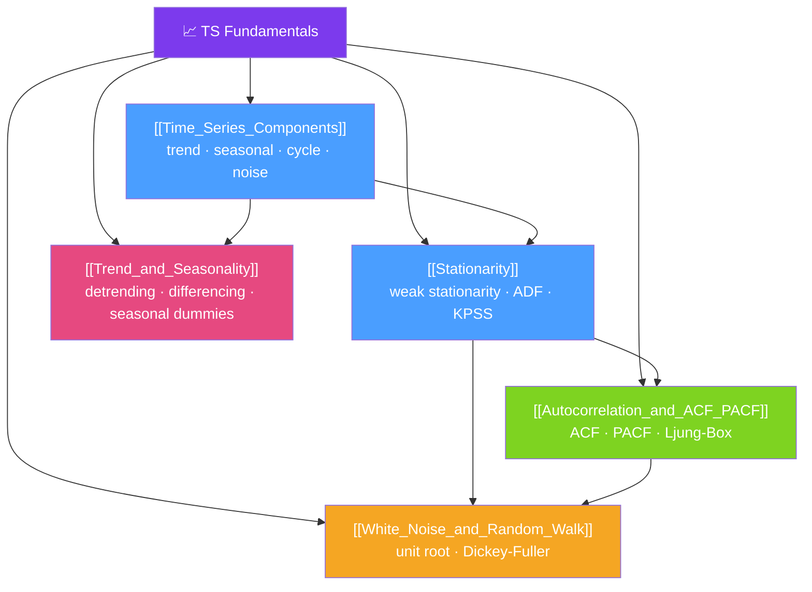

# 🗺️ Time Series Fundamentals — Map of Content

> [!abstract] What This Section Covers
> The bedrock of all time series work. Before you fit any model, you must understand what a time series *is*: a sequence of observations indexed in time. This section covers the four **components** (trend, seasonality, cyclicality, irregular noise), the critical notion of **stationarity** (the assumption that the joint distribution does not change over time), the **autocorrelation function (ACF)** and partial autocorrelation function (PACF) that fingerprint a series' memory structure, a deep look at **trend and seasonality** decomposition, and two limiting concepts — **white noise** (zero memory) and the **random walk** (unit root, the nemesis of stationarity) — that anchor both sides of the modelling spectrum.

## Concept Map

## Learning Path

1. [[Time_Series_Components]] — Decompose any series into trend, seasonality, cycle, and irregular components.
2. [[Stationarity]] — Understand mean-stationarity, covariance-stationarity, the ADF test, and why models need it.
3. [[Autocorrelation_and_ACF_PACF]] — Read ACF/PACF plots to identify model order; run the Ljung-Box test.
4. [[Trend_and_Seasonality]] — Identify and remove deterministic trend and seasonal patterns before modelling.
5. [[White_Noise_and_Random_Walk]] — Understand both extremes: zero memory (white noise) and pure unit root (random walk).

## All Notes at a Glance

| Note | Difficulty | What You'll Learn |
|------|------------|-------------------|
| [[Time_Series_Components]] | Beginner | Trend, seasonality, cycle, irregular; additive vs multiplicative structure |
| [[Stationarity]] | Beginner → Intermediate | Strict vs weak stationarity, ADF test, KPSS test, transformations to achieve stationarity |
| [[Autocorrelation_and_ACF_PACF]] | Intermediate | ACF formula, PACF via partial regression, Ljung-Box Q-test, reading the plots |
| [[Trend_and_Seasonality]] | Beginner → Intermediate | Linear/polynomial trend fitting, first differencing, seasonal dummies, Fourier terms |
| [[White_Noise_and_Random_Walk]] | Intermediate | IID noise, Gaussian white noise, unit root, Dickey-Fuller distribution, martingale property |

## Key Questions This Section Answers

- What are the four components of a time series and how do you identify each visually?
- What does "stationarity" mean mathematically, and why do ARIMA models require it?
- How do you read an ACF plot to determine the order of an MA model?
- How do you read a PACF plot to determine the order of an AR model?
- Why is a random walk non-stationary, and what transformation makes it stationary?
- What is the ADF test and what are the null and alternative hypotheses?

## Related Sections

- [[_MOC_TimeSeries_Master|↑ Master MOC]]
- [[_MOC_Classical_Decomposition|→ Classical Decomposition]]
- [[_MOC_ARIMA|→ ARIMA Models]]

#MOC #time-series #fundamentals
