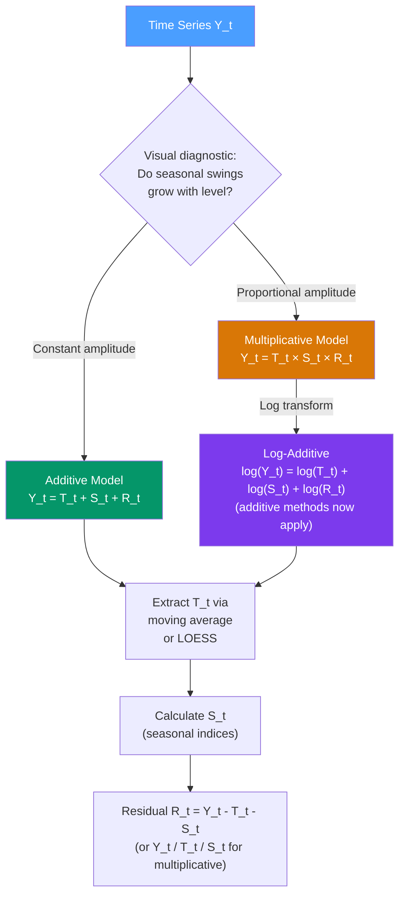

# ➕✖️ Additive vs Multiplicative Decomposition

> [!abstract] TL;DR
> **Additive decomposition** $Y_t = T_t + S_t + R_t$ is appropriate when seasonal fluctuations are constant regardless of the trend level. **Multiplicative decomposition** $Y_t = T_t \times S_t \times R_t$ is appropriate when seasonal swings grow proportionally with the level. The multiplicative form is equivalent to additive after a log transform: $\log Y_t = \log T_t + \log S_t + \log R_t$. The diagnostic: plot the series — widening seasonal swings → multiplicative.

## Intuition — analogy FIRST

Consider two different businesses' monthly sales:

**Bookstore**: sells roughly 1,000 extra books in December every year, regardless of whether annual sales are 5,000 or 10,000. The Christmas spike is **constant** in absolute terms → **additive**.

**E-commerce platform**: December sales are consistently 3× the monthly average, whether the baseline is $10M or $50M/month. The holiday spike is **proportional** to the level → **multiplicative**.

The choice matters because it determines whether the seasonal component has constant variance or growing variance, and that affects which methods are applicable.

---

## How It Works



---

## Key Concepts / Details

### The Two Models

**Additive:**
$$Y_t = T_t + S_t + R_t$$

- $T_t$: trend-cycle component
- $S_t$: seasonal component (constrained: $\sum_{j=1}^{m} S_{t+j-1} = 0$)
- $R_t$: remainder/irregular (ideally white noise)

**Multiplicative:**
$$Y_t = T_t \times S_t \times R_t$$

- Seasonal component constrained: $\sum_{j=1}^{m} S_{t+j-1} = m$ (average seasonal index = 1)
- Remainder: $\mathbb{E}[R_t] = 1$

### The Log-Transform Equivalence

Taking natural logarithm of the multiplicative model:
$$\log Y_t = \log T_t + \log S_t + \log R_t$$

This is an additive model on the log-transformed series. All additive decomposition methods (moving average, STL, Holt-Winters additive) can then be applied to $\log Y_t$, and results transformed back via $\exp(\cdot)$.

**Box-Cox generalisation:**
$$W_t = \begin{cases} (Y_t^\lambda - 1)/\lambda & \lambda \neq 0 \\ \log Y_t & \lambda = 0 \end{cases}$$

$\lambda = 1$: no transformation (additive). $\lambda = 0$: log (multiplicative). $\lambda = 0.5$: square root (intermediate). Estimate $\lambda$ by maximum likelihood.

### Classical Decomposition Procedure (Additive)

**Step 1**: Estimate trend $\hat{T}_t$ using a **centred moving average** of order $m$ (see [[Moving_Averages]]):
$$\hat{T}_t = \frac{1}{m} \sum_{j=-(m-1)/2}^{(m-1)/2} Y_{t+j} \quad \text{(odd } m\text{)}$$

**Step 2**: Calculate de-trended series: $Y_t - \hat{T}_t$

**Step 3**: Estimate seasonal indices: average de-trended values for each season $j$:
$$\hat{S}_j = \frac{1}{N_j} \sum_{t: \text{season}(t)=j} (Y_t - \hat{T}_t)$$
then centre: subtract mean so indices sum to zero.

**Step 4**: Calculate residual: $\hat{R}_t = Y_t - \hat{T}_t - \hat{S}_t$

**Step 5**: Check $\hat{R}_t$ for remaining structure (ACF test, run Ljung-Box).

```python
import pandas as pd
from statsmodels.tsa.seasonal import seasonal_decompose
import matplotlib.pyplot as plt

# Load airline passengers (classic multiplicative example)
import statsmodels.api as sm
data = sm.datasets.get_rdataset("AirPassengers", "datasets").data
y = pd.Series(data["value"].values,
              index=pd.date_range("1949-01", periods=len(data), freq="MS"))

# Additive decomposition (on log-transformed data)
import numpy as np
log_y = np.log(y)

result_add = seasonal_decompose(log_y, model="additive", period=12)
result_mul = seasonal_decompose(y,     model="multiplicative", period=12)

# Compare residual variance
print(f"Additive on log-Y — residual std:        {result_add.resid.dropna().std():.4f}")
print(f"Multiplicative on raw Y — residual std:  {result_mul.resid.dropna().std():.4f}")

# Plot multiplicative
fig = result_mul.plot()
fig.set_size_inches(10, 8)
plt.suptitle("Multiplicative Decomposition — Airline Passengers")
plt.tight_layout()
plt.show()
```

### Seasonal Indices

For the multiplicative model, the seasonal index $S_j$ for season $j$ (e.g., month $j$) represents the *ratio* of typical activity in that season to the annual average:

- $S_j = 1.2$ means season $j$ is typically 20% above average
- $S_j = 0.8$ means season $j$ is typically 20% below average
- $\sum_{j=1}^{m} S_j = m$ (or the average is 1)

For the additive model, seasonal indices are in the same units as $Y_t$ and sum to zero.

### Choosing the Model: Decision Criteria

| Criterion | Additive | Multiplicative |
|-----------|---------|----------------|
| **Visual** | Seasonal swings constant in width | Seasonal swings widen with level |
| **Statistical** | $\text{Std}(\hat{R}_t)$ lower for additive | $\text{Std}(\hat{R}_t)$ lower for multiplicative |
| **Domain knowledge** | Absolute effects (e.g., 1000 extra units) | Percentage effects (e.g., +30% holiday) |
| **Data constraint** | No constraint | Series must be strictly positive |

---

## Real-World Notes

- **Air travel passengers** (monthly): multiplicative — more travellers in summer, and that *multiple* holds as baseline grows. The canonical example used in almost every textbook.
- **Supermarket weekly units**: additive for stable-price commodities (milk), multiplicative for seasonal fresh produce (strawberries — huge proportional spike in summer).
- **Industrial production index**: additive after log-transformation; government agencies typically use multiplicative seasonal adjustment.
- **Temperature**: additive — the seasonal swing (say 20°C winter-to-summer) does not grow as the global average warms by 0.02°C/year.

---

## Common Pitfalls

1. **Applying multiplicative to near-zero or negative series**: if $Y_t \approx 0$ or $Y_t < 0$, ratios blow up. Use additive or apply a shift first.
2. **Defaulting to additive without visual inspection**: most economic/business series are better modelled multiplicatively. Always plot first.
3. **Ignoring residual diagnostics**: if residuals from decomposition are not white noise, the model choice or method is wrong.
4. **Treating classical decomposition as robust**: classical decomposition uses symmetric moving averages, which are sensitive to outliers. Use STL for robustness.
5. **Not re-seasonalising forecasts**: after modelling de-seasonalised data, multiply back by the seasonal factors for the forecast period.

---

## Related Concepts

- [[_MOC_Classical_Decomposition|↑ Section MOC]]
- [[Time_Series_Components]] — the four-component framework this implements
- [[Moving_Averages]] — the tool used to extract $T_t$ in classical decomposition
- [[STL_Decomposition]] — the modern robust replacement for classical decomposition
- [[Holt_Winters_Method]] — forecasting method with built-in additive or multiplicative seasonal component
- [[Exponential_Smoothing]] — the ETS framework generalises these decomposition models

---

## Review Questions

1. A retailer's monthly revenue grows from $1M to $5M over five years, and December revenue is consistently 3× that month's baseline. Which decomposition model is appropriate, and why? What transformation would you apply before using an additive method?
2. Describe the four steps of classical additive decomposition. What constraint must the seasonal indices satisfy, and why?
3. After decomposing a series, the residuals show clear cyclical pattern with ACF spikes at lags 1–3. What does this indicate about the decomposition, and what would you do differently?

---

## Sources

- Hyndman & Athanasopoulos, *Forecasting: Principles and Practice* (3rd ed.), Ch. 3
- Box-Cox (1964), *An Analysis of Transformations*, Journal of the Royal Statistical Society B
- statsmodels: `seasonal_decompose` documentation

#time-series #decomposition #additive #multiplicative #seasonal-adjustment
