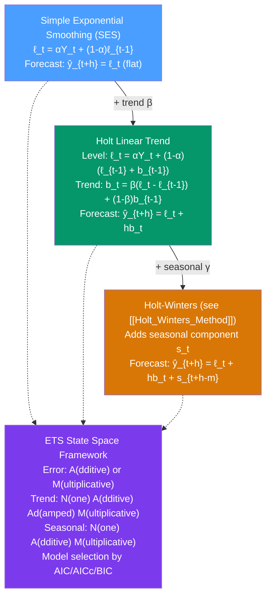

# 📈 Exponential Smoothing

> [!abstract] TL;DR
> **Exponential smoothing** is a class of forecasting methods that weight past observations exponentially: recent observations get more weight, older observations get geometrically decaying weight. **Simple Exponential Smoothing (SES)** handles series with no trend or seasonality: $\hat{Y}_{t+1} = \alpha Y_t + (1-\alpha)\hat{Y}_t$. **Holt's linear method** adds a trend component. All exponential smoothing methods have a corresponding **ETS (Error, Trend, Seasonal)** state-space model, enabling formal statistical inference and automatic parameter selection via MLE.

## Intuition — analogy FIRST

Imagine forecasting tomorrow's temperature using all past temperatures. A simple average gives every day equal weight — what happened 10 years ago counts the same as yesterday. But recent weather is far more informative about tomorrow's weather than ancient history.

**Exponential smoothing** is like a forgetful but wise forecaster: it gives yesterday's temperature the most weight $\alpha$, the day before $(1-\alpha)\alpha$, then $(1-\alpha)^2\alpha$, and so on — each day's weight is a fixed fraction of the previous day's. With $\alpha = 0.3$, yesterday has weight 0.3, two days ago 0.21, three days ago 0.147 — exponential decay.

Bigger $\alpha$ = more responsive (trusts recent data). Smaller $\alpha$ = smoother (trusts the historical average). The optimal $\alpha$ is found by minimising forecast error on the training data.

---

## How It Works



---

## Key Concepts / Details

### Simple Exponential Smoothing (SES)

Best for series with **no trend and no seasonality**.

**Smoothing equation:**
$$\ell_t = \alpha Y_t + (1 - \alpha) \ell_{t-1}, \quad 0 < \alpha \leq 1$$

**Component form:**
$$\ell_t = \ell_{t-1} + \alpha(Y_t - \ell_{t-1}) = \ell_{t-1} + \alpha e_t$$

where $e_t = Y_t - \ell_{t-1}$ is the one-step forecast error. The level is updated by adding a fraction $\alpha$ of the forecast error.

**Forecast:** $\hat{Y}_{t+h|t} = \ell_t$ for all horizons $h$ — a flat forecast at the current level.

**Infinite weighted average form** (expanding the recursion):
$$\ell_t = \sum_{j=0}^{\infty} \alpha(1-\alpha)^j Y_{t-j}$$

This shows the exponentially decreasing weights. Because all weights sum to 1, SES is a proper weighted average.

**Effect of $\alpha$:**
| $\alpha$ | Behaviour |
|---------|-----------|
| $\alpha \to 1$ | Trust only the most recent observation; tracks noise |
| $\alpha \to 0$ | Trust only the historical mean; very slow adaptation |
| $\alpha = 0.2$–$0.4$ | Typical range for stable, mean-reverting series |

### Holt's Linear Trend Method

For series with **trend but no seasonality**.

**Level equation:**
$$\ell_t = \alpha Y_t + (1-\alpha)(\ell_{t-1} + b_{t-1})$$

**Trend equation:**
$$b_t = \beta^*(\ell_t - \ell_{t-1}) + (1-\beta^*)b_{t-1}$$

**Forecast:**
$$\hat{Y}_{t+h|t} = \ell_t + h b_t$$

The forecast grows linearly into the future at rate $b_t$. Two smoothing parameters: $\alpha$ (level) and $\beta^*$ (trend).

### Damped Trend (Gardner & McKenzie 1985)

Holt's linear trend extrapolates indefinitely — problematic for long horizons. The **damped trend** multiplies the growth by a damping factor $0 < \phi < 1$:

$$\hat{Y}_{t+h|t} = \ell_t + (\phi + \phi^2 + \cdots + \phi^h) b_t$$

As $h \to \infty$, the forecast converges to $\ell_t + b_t\phi/(1-\phi)$ — a finite ceiling. With $\phi = 0.98$, the trend damps slowly; $\phi = 0.8$ damps quickly.

**In practice**: damped trend (ETS(A,Ad,N)) often outperforms undamped Holt's method, especially for h > 6 steps ahead.

### The ETS State-Space Framework

Every exponential smoothing method has a probabilistic state-space representation:

**Additive error, additive trend, additive seasonal: ETS(A,A,A)**
$$Y_t = \ell_{t-1} + b_{t-1} + s_{t-m} + \epsilon_t$$
$$\ell_t = \ell_{t-1} + b_{t-1} + \alpha \epsilon_t$$
$$b_t = b_{t-1} + \beta \epsilon_t$$
$$s_t = s_{t-m} + \gamma \epsilon_t$$

where $\epsilon_t \sim NID(0, \sigma^2)$.

**ETS taxonomy** (15 possible models):

| Error | Trend | Seasonal | Model Name |
|-------|-------|---------|------------|
| A | N | N | ETS(A,N,N) = SES |
| A | A | N | ETS(A,A,N) = Holt's linear |
| A | Ad | N | ETS(A,Ad,N) = damped Holt |
| A | A | A | ETS(A,A,A) = additive Holt-Winters |
| A | A | M | ETS(A,A,M) = multiplicative Holt-Winters |
| M | N | N | ETS(M,N,N) = multiplicative error SES |
| ... | ... | ... | 15 total combinations |

Parameters ($\alpha, \beta, \gamma, \phi$) estimated by **maximum likelihood** — no need for grid search.

### Python: Exponential Smoothing with statsmodels

```python
import pandas as pd
import numpy as np
from statsmodels.tsa.holtwinters import SimpleExpSmoothing, ExponentialSmoothing
from statsmodels.tsa.exponential_smoothing.ets import ETSModel
import matplotlib.pyplot as plt

# Simulated non-seasonal trend series
np.random.seed(42)
T = 60
t = np.arange(T)
y = pd.Series(10 + 0.3 * t + np.random.normal(0, 1.5, T))

# --- Simple Exponential Smoothing ---
ses_model = SimpleExpSmoothing(y, initialization_method="estimated")
ses_fit   = ses_model.fit(optimized=True)
print(f"SES alpha = {ses_fit.params['smoothing_level']:.4f}")
ses_forecast = ses_fit.forecast(10)

# --- Holt's Linear Trend ---
holt_model = ExponentialSmoothing(y, trend="add", damped_trend=False,
                                   initialization_method="estimated")
holt_fit = holt_model.fit(optimized=True)
print(f"Holt alpha={holt_fit.params['smoothing_level']:.4f}, "
      f"beta={holt_fit.params['smoothing_trend']:.4f}")
holt_forecast = holt_fit.forecast(10)

# --- Damped Holt ---
holt_damped = ExponentialSmoothing(y, trend="add", damped_trend=True,
                                    initialization_method="estimated")
holt_damped_fit = holt_damped.fit(optimized=True)
print(f"Damped Holt phi={holt_damped_fit.params['damping_trend']:.4f}")

# --- ETS auto-selection ---
ets_model = ETSModel(y, trend="add", damped_trend=True)
ets_fit   = ets_model.fit(disp=False)
print(f"\nETS AIC: {ets_fit.aic:.2f}")
print(ets_fit.summary())

# Plot comparison
fig, ax = plt.subplots(figsize=(12, 5))
ax.plot(y, label="Data", alpha=0.7)
ax.plot(range(T, T+10), ses_forecast,    label="SES forecast",   linestyle="--")
ax.plot(range(T, T+10), holt_forecast,   label="Holt forecast",  linestyle="-.")
ax.legend()
plt.title("SES vs Holt's Method — 10-step Forecast")
plt.show()
```

### Information Criteria for Model Selection

Use AIC (corrected for small samples: AICc) to select among ETS models:

$$\text{AIC} = -2\log(\hat{L}) + 2k$$
$$\text{AICc} = \text{AIC} + \frac{2k(k+1)}{T - k - 1}$$

where $k$ = number of parameters. Lower is better. `statsmodels.tsa.exponential_smoothing.ets.ETSModel` with `auto` mode tries all 15 combinations and picks the best AICc.

---

## Real-World Notes

- **Demand forecasting (retail)**: SES or ETS(A,N,N) for slow-moving items with no trend; ETS(A,A,N) for growing product lines. Many commercial systems (SAP IBP, Oracle Demantra) use exponential smoothing variants.
- **Financial series (daily prices)**: EMA (exponential moving average) in technical analysis is equivalent to SES with a fixed $\alpha$ — not optimised by MLE.
- **Weather forecasting (NWP post-processing)**: Kalman-filter-based methods are mathematically equivalent to adaptive exponential smoothing.
- **Inventory control**: the "naive" method in safety stock calculations uses SES to forecast demand.

---

## Common Pitfalls

1. **Forgetting that SES gives flat forecasts**: the point forecast is the same for all horizons — completely useless for trending series. Use Holt's method if trend exists.
2. **Setting $\alpha$ by intuition**: always optimise by MLE or minimising SSE. Intuitive choices (e.g., $\alpha = 0.1$) may be far from optimal.
3. **Using Holt's linear trend without damping for long horizons**: the linear trend extrapolates to absurd values. Enable damping (`damped_trend=True`) for $h > 8$ steps.
4. **Ignoring ETS in favour of manual smoothing**: the ETS state-space framework gives prediction intervals, likelihood, AIC — superior to pure smoothing for forecasting.
5. **Applying SES to seasonal data**: if the series has seasonality, SES will have large seasonal errors. Use Holt-Winters or ETS with seasonal component.

---

## Related Concepts

- [[_MOC_Classical_Decomposition|↑ Section MOC]]
- [[Moving_Averages]] — MA is a special case of exponential smoothing with uniform weights
- [[Holt_Winters_Method]] — the triple exponential smoothing extension adding seasonal component
- [[STL_Decomposition]] — an alternative decomposition using LOESS rather than exponential smoothing
- [[Prophet_Forecasting]] — Prophet uses additive decomposition similar to ETS but with piecewise linear trend

---

## Review Questions

1. Write out the SES update equation and show algebraically that it is equivalent to an infinite weighted average of past observations with exponentially decaying weights.
2. You fit SES to a series with $\hat{\alpha} = 0.95$. What does this high value of $\alpha$ imply about the series' dynamics, and is this a good or bad outcome?
3. Compare Holt's linear method and the damped trend variant for a 24-step-ahead forecast. Under what circumstances would the damped version produce dramatically different results?

---

## Sources

- Hyndman & Athanasopoulos, *Forecasting: Principles and Practice* (3rd ed.), Ch. 8
- Hyndman et al. (2008), *Forecasting with Exponential Smoothing: The State Space Approach*, Springer
- Gardner & McKenzie (1985), *Forecasting Trends in Time Series*, Management Science

#time-series #decomposition #exponential-smoothing #ETS #SES
