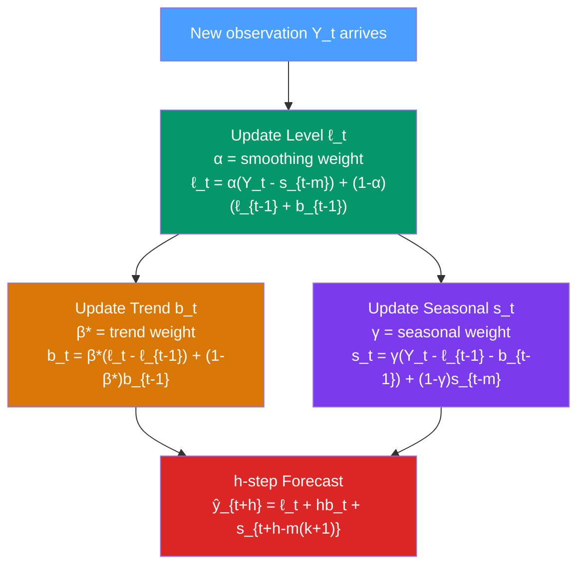

# ❄️ Holt-Winters Method

> [!abstract] TL;DR
> The **Holt-Winters method** (triple exponential smoothing) extends Holt's linear method by adding a seasonal component. Three smoothing equations update **level** ($\ell_t$), **trend** ($b_t$), and **seasonal** ($s_t$) using parameters $\alpha$, $\beta^*$, and $\gamma$ respectively. The **additive** version handles constant seasonal swings; the **multiplicative** version handles growing swings. Forecast: $\hat{Y}_{t+h|t} = \ell_t + hb_t + s_{t+h-m(k+1)}$ (additive) or $(\ell_t + hb_t) \times s_{t+h-m(k+1)}$ (multiplicative).

## Intuition — analogy FIRST

Imagine forecasting monthly hotel bookings. Three things drive them:

1. **Level** ($\ell_t$): the current underlying average — are we in a high-demand period overall?
2. **Trend** ($b_t$): is the hotel becoming more popular over time? (Growing trend → bookings rise year over year.)
3. **Seasonal** ($s_t$): July is always busier than January — the seasonal factor.

Holt-Winters maintains a live running estimate of all three. Each new observation updates each estimate, weighted by its smoothing parameter. The seasonal factor for July gets updated every July it arrives — the model adapts if summers gradually get busier over the years.

---

## How It Works



---

## Key Concepts / Details

### Additive Holt-Winters

For series where seasonal amplitude is **constant** regardless of trend level.

**Level:**
$$\ell_t = \alpha (Y_t - s_{t-m}) + (1-\alpha)(\ell_{t-1} + b_{t-1})$$

**Trend:**
$$b_t = \beta^*(\ell_t - \ell_{t-1}) + (1-\beta^*)b_{t-1}$$

**Seasonal:**
$$s_t = \gamma(Y_t - \ell_{t-1} - b_{t-1}) + (1-\gamma)s_{t-m}$$

**$h$-step forecast:**
$$\hat{Y}_{t+h|t} = \ell_t + h b_t + s_{t+h-m(k+1)}$$

where $k = \lfloor(h-1)/m\rfloor$ ensures the right seasonal index is used.

**Constraints on parameters:** $0 \leq \alpha, \beta^*, \gamma \leq 1$; $\beta^* \leq \alpha$; $\gamma \leq 1 - \alpha$.

### Multiplicative Holt-Winters

For series where seasonal amplitude **grows proportionally** with the level (e.g., airline passengers).

**Level:**
$$\ell_t = \alpha \frac{Y_t}{s_{t-m}} + (1-\alpha)(\ell_{t-1} + b_{t-1})$$

**Trend:**
$$b_t = \beta^*(\ell_t - \ell_{t-1}) + (1-\beta^*)b_{t-1}$$

**Seasonal:**
$$s_t = \gamma \frac{Y_t}{\ell_{t-1} + b_{t-1}} + (1-\gamma)s_{t-m}$$

**$h$-step forecast:**
$$\hat{Y}_{t+h|t} = (\ell_t + h b_t) \cdot s_{t+h-m(k+1)}$$

### Initialisation

Before the recursion starts, we need $\ell_0$, $b_0$, and $s_{1-m}, \ldots, s_0$:

- $\ell_0$: set to the mean of the first seasonal cycle
- $b_0$: average first-cycle slope — $(Y_{m+1} - Y_1)/m$
- $s_j$ for $j = 1, \ldots, m$: $Y_j / \bar{Y}_{\text{first cycle}}$ (multiplicative) or $Y_j - \bar{Y}_{\text{first cycle}}$ (additive)

`statsmodels` automates this with `initialization_method="estimated"` (use MLE to find optimal initial values).

### Smoothing Parameter Interpretation

| Parameter | Controls | High value | Low value |
|-----------|---------|-----------|-----------|
| $\alpha$ (0–1) | Level adaptation | Very responsive to new observations | Slow to update; relies on historical level |
| $\beta^*$ (0–1) | Trend adaptation | Trend changes rapidly | Trend is very stable |
| $\gamma$ (0–1) | Seasonal adaptation | Seasonal pattern changes quickly | Seasonal pattern is very stable |

For most stable business series: $\alpha \approx 0.2$–$0.4$, $\beta^* \approx 0.1$–$0.2$, $\gamma \approx 0.1$–$0.3$.

### Prediction Intervals

Under the ETS(A,A,A) state-space model, prediction intervals are:
$$\hat{Y}_{t+h|t} \pm z_{\alpha/2} \cdot \sigma_h$$

where $\sigma_h^2$ depends on $\alpha, \beta^*, \gamma$ and grows with $h$. Closed-form expressions exist for all 15 ETS models — see Hyndman et al. (2008).

### Python: Holt-Winters

```python
import pandas as pd
import numpy as np
from statsmodels.tsa.holtwinters import ExponentialSmoothing
import matplotlib.pyplot as plt

# Load airline passengers
import statsmodels.api as sm
data = sm.datasets.get_rdataset("AirPassengers", "datasets").data
y = pd.Series(data["value"].values,
              index=pd.date_range("1949-01", periods=144, freq="MS"))

# Split train/test
train = y[:"1959-12"]  # 132 observations
test  = y["1960-01":]  # 12 observations for evaluation

# Additive Holt-Winters (on log data: equivalent to multiplicative)
hw_add = ExponentialSmoothing(
    np.log(train),
    trend="add",
    seasonal="add",
    seasonal_periods=12,
    initialization_method="estimated"
).fit(optimized=True)

# Multiplicative Holt-Winters
hw_mul = ExponentialSmoothing(
    train,
    trend="add",
    seasonal="mul",
    seasonal_periods=12,
    initialization_method="estimated"
).fit(optimized=True)

# Forecasts
fc_add = np.exp(hw_add.forecast(12))  # back-transform log
fc_mul = hw_mul.forecast(12)

# Evaluate
from sklearn.metrics import mean_absolute_percentage_error as mape
print(f"Additive HW MAPE: {mape(test, fc_add):.4f}")
print(f"Multiplicative HW MAPE: {mape(test, fc_mul):.4f}")

# Fitted parameters
print(f"\nMultiplicative HW params:")
print(f"  alpha: {hw_mul.params['smoothing_level']:.4f}")
print(f"  beta:  {hw_mul.params['smoothing_trend']:.4f}")
print(f"  gamma: {hw_mul.params['smoothing_seasonal']:.4f}")

# Plot with prediction intervals
hw_mul_full = ExponentialSmoothing(
    y,
    trend="add",
    seasonal="mul",
    seasonal_periods=12,
    initialization_method="estimated"
).fit(optimized=True)

forecast_obj = hw_mul_full.get_prediction(start=len(y), end=len(y)+23)
fc_df = forecast_obj.summary_frame(alpha=0.05)

fig, ax = plt.subplots(figsize=(12, 5))
y.plot(ax=ax, label="Historical")
fc_df["mean"].plot(ax=ax, label="Forecast")
ax.fill_between(fc_df.index,
                fc_df["pi_lower"], fc_df["pi_upper"],
                alpha=0.3, label="95% PI")
ax.set_title("Holt-Winters Multiplicative — 2-Year Forecast")
ax.legend()
plt.show()
```

### Damped Holt-Winters

Add damping to the trend component for more cautious long-horizon forecasts:

```python
hw_damped = ExponentialSmoothing(
    train,
    trend="add",
    damped_trend=True,
    seasonal="mul",
    seasonal_periods=12,
    initialization_method="estimated"
).fit(optimized=True)
print(f"Damping phi: {hw_damped.params['damping_trend']:.4f}")
```

---

## Real-World Notes

- **Airline passengers** (Box-Jenkins 1976): the canonical multiplicative Holt-Winters case — both trend and seasonal amplitude grow together.
- **Retail demand forecasting**: multiplicative Holt-Winters is a standard baseline in competitions (M-Competition, M4). It consistently outperforms naive benchmarks.
- **Supply chain (SAP, Oracle)**: embedded Holt-Winters variants are the default forecasting engine in many ERP systems.
- **Electricity consumption**: multiple seasonalities (daily, weekly, annual) cannot be handled by standard Holt-Winters with a single seasonal period. Use TBATS or Prophet for multiple seasonal periods (see [[Prophet_Forecasting]]).
- **M4 Competition (2018)**: Holt-Winters was among the most competitive traditional methods, especially at annual and quarterly frequency.

---

## Common Pitfalls

1. **Using multiplicative seasonal with near-zero data**: division by near-zero seasonal indices causes numerical instability. Use additive or shift the series.
2. **Not damping the trend for long horizons**: undamped Holt-Winters grows linearly forever. For $h > 8$ steps, enable damping.
3. **Ignoring residual diagnostics**: check that residuals are white noise (Ljung-Box test). Systematic residual patterns indicate model misspecification.
4. **Providing insufficient initialisation data**: you need at least 2–3 complete seasonal cycles to initialise properly. With only 12 monthly observations, seasonal indices are unreliable.
5. **Using additive seasonal for multiplicative data**: the model will produce poor forecasts at high-level periods. Always check with a time plot whether seasonal amplitude grows with level.

---

## Related Concepts

- [[_MOC_Classical_Decomposition|↑ Section MOC]]
- [[Exponential_Smoothing]] — the ETS framework that Holt-Winters is a special case of (ETS(A,A,A) or ETS(A,A,M))
- [[Additive_vs_Multiplicative_Decomposition]] — the seasonal model choice mirrors the additive/multiplicative decision
- [[STL_Decomposition]] — a more flexible decomposition, often combined with ETS for STL+ETS forecasting
- [[SARIMA_Seasonal_ARIMA]] — an alternative seasonal forecasting approach using autoregressive models

---

## Review Questions

1. Write out the three update equations for multiplicative Holt-Winters. Explain what each smoothing parameter ($\alpha$, $\beta^*$, $\gamma$) controls and what a value close to 1 means for each.
2. You have monthly sales data for 5 years with a strong upward trend and seasonal peaks in Q4. Walk through the steps to fit a multiplicative Holt-Winters model and generate a 12-month forecast with 95% prediction intervals.
3. After fitting a Holt-Winters model, you notice the residuals have ACF spikes at lags 1, 2, and 12. What does this indicate, and what model might capture the remaining structure?

---

## Sources

- Holt (1957), *Forecasting Seasonals and Trends by Exponentially Weighted Moving Averages*, ONR Research Memorandum 52
- Winters (1960), *Forecasting Sales by Exponentially Weighted Moving Averages*, Management Science
- Hyndman & Athanasopoulos, *Forecasting: Principles and Practice* (3rd ed.), Ch. 8

#time-series #decomposition #holt-winters #triple-exponential-smoothing #seasonal-forecasting
