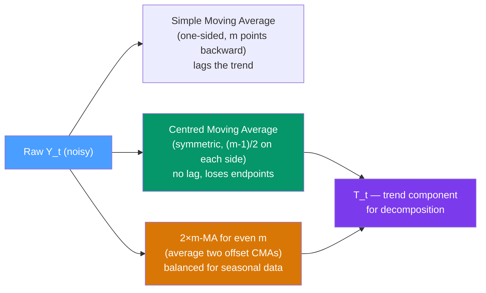

# 📉 Moving Averages

> [!abstract] TL;DR
> A **moving average** of order $m$ replaces each observation with the average of its $m$ nearest neighbours, smoothing out short-term fluctuations to reveal the underlying trend. The **centred moving average** (CMA) is symmetric around the current point. For seasonal data with even period $m$, a **2×m-MA** (a CMA of a CMA) ensures the smoother is balanced. Moving averages are the workhorse of trend extraction in classical decomposition.

## Intuition — analogy FIRST

Imagine a noisy stock chart. Every tiny daily wiggle obscures the long-run direction. A **moving average** is like sliding a ruler along the chart: at each point, you read off the average of the last $m$ days' prices. The daily noise cancels out in the average, and what remains is the smooth trend.

The **centred** version is fairer: instead of only looking backward (which introduces lag), it averages the $k$ points *before* and $k$ points *after* each observation, centering the smoother on the current point. You lose $k$ points at each end, but the trend estimate has no lag.

---

## How It Works



---

## Key Concepts / Details

### Simple Moving Average (Trailing)

$$\hat{T}_t = \frac{1}{m} \sum_{j=0}^{m-1} Y_{t-j} = \frac{Y_t + Y_{t-1} + \cdots + Y_{t-m+1}}{m}$$

- Only uses past values → introduces a lag of $(m-1)/2$ periods
- Increases $m$ → smoother but more lag and fewer data points covered
- Uses in finance: 50-day MA, 200-day MA for technical analysis (lagging indicators)

### Centred Moving Average (Symmetric)

For odd $m = 2k+1$:
$$\hat{T}_t = \frac{1}{m} \sum_{j=-k}^{k} Y_{t+j}$$

No lag; the estimate at $t$ uses $k$ points before and $k$ points after. You lose $k$ observations at each end of the series.

**Example (m=5):**
$$\hat{T}_3 = \frac{Y_1 + Y_2 + Y_3 + Y_4 + Y_5}{5}$$

### 2×m-MA for Even Periods

For even $m$ (e.g., $m=12$ for monthly data with annual seasonality), a single CMA would average an unequal number of terms on each side. The solution is a **2×m-MA**: average two adjacent $m$-period trailing MAs:

$$\hat{T}_t = \frac{1}{2}\left[\frac{1}{m}\sum_{j=0}^{m-1}Y_{t-j} + \frac{1}{m}\sum_{j=1}^{m}Y_{t-j}\right] = \frac{Y_{t-m/2} + 2Y_{t-m/2+1} + \cdots + 2Y_{t+m/2-1} + Y_{t+m/2}}{2m}$$

This gives a weighted MA where the endpoints get weight $1/(2m)$ and interior points get weight $1/m$ — it is symmetric and balanced.

**Why does this matter?** For seasonal data with period $m$, the $m$-period average eliminates the seasonal component, leaving only trend. The 2×m-MA does this without lag.

### Weighted Moving Average

A weighted MA assigns different weights to different lags:
$$\hat{T}_t = \sum_{j=-k}^{k} w_j Y_{t+j}, \quad \sum_j w_j = 1$$

The simple MA uses equal weights $w_j = 1/m$. The **Henderson filter** uses a specific set of weights designed to pass polynomial trends while filtering out seasonality and noise — used in X-11/X-13 seasonal adjustment.

### Property: Trend Extraction for Seasonal Data

A centred MA of order $m$ applied to a series with seasonality of period $m$ **exactly cancels** a fixed seasonal component. This is why classical decomposition uses a CMA to extract trend — the seasonal component in $Y_t = T_t + S_t + R_t$ averages to zero over a full seasonal period in the MA window.

### Python: Moving Averages

```python
import pandas as pd
import numpy as np
import matplotlib.pyplot as plt

# Generate data with trend + seasonality
np.random.seed(42)
T_len = 96  # 8 years monthly
t = np.arange(T_len)
trend = 50 + 0.5 * t
seasonal = 10 * np.sin(2 * np.pi * t / 12)
noise = np.random.normal(0, 2, T_len)
y = pd.Series(trend + seasonal + noise,
              index=pd.date_range("2017-01", periods=T_len, freq="MS"))

# Trailing MA (biased, lagged)
trailing_ma_12 = y.rolling(window=12).mean()

# Centred MA for odd order (m=7)
centred_ma_7 = y.rolling(window=7, center=True).mean()

# 2×12-MA (for monthly data — standard in classical decomposition)
ma12 = y.rolling(window=12, min_periods=12).mean()
# Shift and average two adjacent 12-MAs
ma12_shifted = ma12.shift(-1)
centred_2x12 = (ma12 + ma12_shifted) / 2

# Alternative: directly compute 2×12-MA via convolution
weights = np.concatenate([[0.5], np.ones(11), [0.5]]) / 12
centred_2x12_direct = y.rolling(window=13, center=True).apply(
    lambda x: np.dot(x, weights), raw=True
)

fig, (ax1, ax2) = plt.subplots(2, 1, figsize=(12, 8))
ax1.plot(y, alpha=0.5, label="Original")
ax1.plot(trailing_ma_12, label="Trailing MA(12)", linestyle="--")
ax1.plot(centred_2x12_direct, label="2×12-MA (centred)", linewidth=2)
ax1.set_title("Moving Average Comparison")
ax1.legend()

# Residual after removing 2×12-MA trend
detrended = y - centred_2x12_direct
ax2.plot(detrended, label="Detrended (Y - 2×12-MA)")
ax2.axhline(0, linestyle="--", color="gray")
ax2.set_title("Detrended Series (Seasonal + Irregular)")
ax2.legend()
plt.tight_layout()
plt.show()

# Verify seasonal component is isolated
print("Mean of detrended:", detrended.dropna().mean().round(4))  # ≈ 0
print("Seasonal pattern visible in detrended ACF")
```

### Bandwidth and Smoothing Trade-off

| Order $m$ | Smoothness | Lag (trailing) | Points lost (centred) | Seasonal cancellation |
|-----------|-----------|----------------|----------------------|----------------------|
| 3 | Low | 1 | 1 each end | No |
| 7 | Medium | 3 | 3 each end | Weekly ($m=7$) |
| 12 | High | 5.5 | 6 each end | Annual monthly ($m=12$) |
| 24 | Very high | 11.5 | 12 each end | Biannual |

---

## Real-World Notes

- **Technical analysis (finance)**: 50-day and 200-day trailing MAs are the most-watched technical indicators. A "golden cross" (50-day crosses above 200-day) signals a potential uptrend. These are pure trailing MAs and lag significantly.
- **Economic indicators**: the US Conference Board's leading economic indicators are composite indices smoothed with Henderson filters.
- **Seasonal adjustment**: the US Census Bureau's X-13ARIMA-SEATS uses Henderson filters within an ARIMA framework to extract trend.
- **COVID data**: moving averages of 7 days were universally used during the pandemic to remove the weekly reporting cycle (fewer tests on weekends) from case counts.
- **Signal processing**: moving averages are the simplest low-pass filter — they pass slow (trend) frequencies and reject fast (noise) frequencies.

---

## Common Pitfalls

1. **Using trailing MA for decomposition**: introduces lag — the trend estimate for time $t$ represents the trend half an order ago. Use centred MA for decomposition.
2. **Using odd-order MA on even-period data**: for $m=12$ monthly data, a 12-MA is unbalanced. Always use the 2×12-MA (2×m-MA).
3. **Losing edge data**: centred MA loses $(m-1)/2$ points at each end. For forecasting, you have no trend estimate for the most recent periods — a significant disadvantage vs STL.
4. **Confusing MA smoother with MA model**: the MA (moving average) decomposition smoother averages the *data*; an [[MA_Models|MA(q) model]] is a linear combination of past *innovations*. Completely different concepts with the same name.
5. **Expecting MA to remove non-seasonal structure**: a 12-period CMA removes annual seasonality but not other cyclical patterns.

---

## Related Concepts

- [[_MOC_Classical_Decomposition|↑ Section MOC]]
- [[Additive_vs_Multiplicative_Decomposition]] — MA is the trend extraction step in both decomposition types
- [[Exponential_Smoothing]] — an alternative to MA that weights recent observations more heavily
- [[STL_Decomposition]] — uses LOESS (locally weighted regression) instead of simple MAs — more flexible
- [[MA_Models]] — the MA *model* (completely different: linear filter of innovations, not data)

---

## Review Questions

1. Explain why a centred 12-period moving average of monthly data removes the seasonal component. What mathematical property of the seasonal component ensures this works?
2. You have quarterly data ($m = 4$) with annual seasonality. Describe how to compute a 2×4-MA by hand for observation $t = 3$. Why is this preferred over a simple 4-period CMA?
3. A colleague uses a 50-day trailing MA to detrend a daily financial series before decomposition. What bias does this introduce, and what would you use instead?

---

## Sources

- Hyndman & Athanasopoulos, *Forecasting: Principles and Practice* (3rd ed.), Ch. 3
- Makridakis, Wheelwright & Hyndman, *Forecasting: Methods and Applications* (3rd ed.)
- US Census Bureau, X-13ARIMA-SEATS documentation

#time-series #decomposition #moving-averages #trend-extraction
