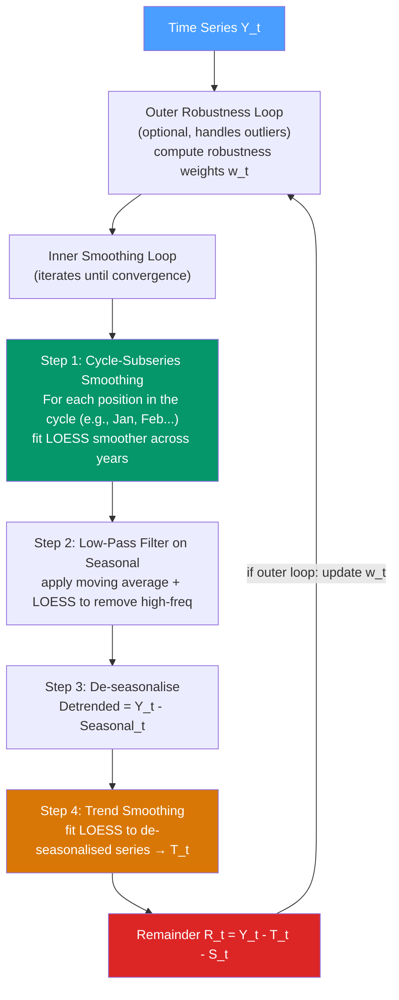

# 🔬 STL Decomposition

> [!abstract] TL;DR
> **STL** (Seasonal and Trend decomposition using **L**OESS) is a robust, flexible method that decomposes a time series into trend, seasonal, and remainder components using locally-weighted regression (LOESS). Unlike classical decomposition, STL handles **any seasonal period**, allows the **seasonal component to change over time**, and is **robust to outliers** via iterative reweighting. Developed by Cleveland et al. (1990), it is the modern standard for exploratory decomposition.

## Intuition — analogy FIRST

Classical decomposition is like using a straight ruler: it draws a clean smooth trend, but if there is a kink (structural break) or a bump (outlier), the ruler averages right through it and distorts nearby estimates.

**LOESS** (the tool inside STL) is like a flexible curve that fits each local neighbourhood of the data using weighted regression — points far away get less weight, nearby points more. STL uses this flexible curve repeatedly in two loops:

- **Inner loop**: alternates between fitting a seasonal smoother (for the repeating pattern) and a trend smoother (for the long-run direction), passing residuals back and forth until they converge.
- **Outer loop**: identifies outliers in the remainder and downweights them so they don't distort the decomposition.

The result: a decomposition that can track a gradually shifting seasonal pattern (like how August gets hotter each decade) and still give clean components even when there are outliers.

---

## How It Works



---

## Key Concepts / Details

### LOESS (Locally Weighted Scatterplot Smoothing)

LOESS fits a low-degree polynomial (usually degree 1 or 2) at each point $x_0$, using only nearby data points weighted by distance:

$$\hat{f}(x_0) = \arg\min_{\beta} \sum_{i} K\left(\frac{x_i - x_0}{h}\right) \left(y_i - \beta_0 - \beta_1(x_i - x_0)\right)^2$$

where $K(\cdot)$ is the tricube weight function:
$$K(u) = \begin{cases} (1-|u|^3)^3 & |u| \leq 1 \\ 0 & |u| > 1 \end{cases}$$

The bandwidth $h$ controls smoothness: larger $h$ → smoother. In STL, two separate LOESS smoothers are used:
- $n_p$ (seasonal window): controls how quickly the seasonal component can change
- $n_t$ (trend window): controls trend smoothness

### STL Parameters

| Parameter | Description | Recommended defaults |
|-----------|-------------|---------------------|
| `period` | Length of seasonal cycle (e.g., 12 for monthly annual) | Determined by data |
| `seasonal` (`s.window`) | LOESS bandwidth for seasonal smoother; `"periodic"` = fixed seasonal | Start with `"periodic"`, relax if seasonality evolves |
| `trend` (`t.window`) | LOESS bandwidth for trend smoother; larger = smoother trend | `ceil(1.5 * period / (1 - 1.5/s.window))` |
| `low_pass` | Low-pass filter window | Smallest odd $\geq$ period |
| `robust` | Use outer loop robustness weights? | `True` when outliers suspected |
| `seasonal_deg` | Degree of seasonal LOESS polynomial | 1 (default) |
| `trend_deg` | Degree of trend LOESS polynomial | 1 (default) |

**Key insight on `seasonal`**: setting `s.window=7` allows the January component to drift over 7 years; `s.window="periodic"` assumes a perfectly stable seasonal shape forever.

### Python: STL Decomposition

```python
import pandas as pd
import numpy as np
from statsmodels.tsa.seasonal import STL
import matplotlib.pyplot as plt

# Airline passengers (multiplicative → log-transform first)
import statsmodels.api as sm
data = sm.datasets.get_rdataset("AirPassengers", "datasets").data
y_raw = pd.Series(data["value"].values,
                  index=pd.date_range("1949-01", periods=144, freq="MS"))
y = np.log(y_raw)  # Log-transform for multiplicative series

# Basic STL
stl = STL(y, period=12, seasonal=7, robust=True)
result = stl.fit()

# Access components
trend    = result.trend
seasonal = result.seasonal
residual = result.resid

# Plot
result.plot()
plt.suptitle("STL Decomposition — Log(Airline Passengers)")
plt.tight_layout()
plt.show()

# Evaluate residual quality
from statsmodels.stats.diagnostic import acorr_ljungbox
lb = acorr_ljungbox(residual.dropna(), lags=12, return_df=True)
print("Ljung-Box test on STL residuals:")
print(lb)

# Seasonal strength measure
Var_R = np.var(residual.dropna())
Var_ST = np.var((seasonal + residual).dropna())
seasonal_strength = max(0, 1 - Var_R / Var_ST)
print(f"\nSeasonal strength: {seasonal_strength:.4f}")  # 0 = no seasonality, 1 = pure seasonality

# STL + ETS for forecasting
from statsmodels.tsa.forecasting.stl import STLForecast
from statsmodels.tsa.statespace.exponential_smoothing import ExponentialSmoothing

stlf = STLForecast(y, ExponentialSmoothing, model_kwargs={
    "trend": True, "damped_trend": True
}, period=12, seasonal=7, robust=True)
stlf_res = stlf.fit()
fc_log = stlf_res.forecast(24)
fc = np.exp(fc_log)  # back-transform
```

### Robustness to Outliers

The outer loop computes **robustness weights** $\rho_t$ based on the magnitude of the remainder:
$$\rho_t = B\left(\frac{|R_t|}{6 \cdot \text{MAD}(R)}\right)$$

where $B(\cdot)$ is the bisquare weight function (0 for large outliers). These weights downweight anomalous observations in subsequent LOESS fits. With `robust=True`, the seasonal and trend smoothers become resistant to:
- Single extreme outliers (COVID lockdown dip)
- Multiple consecutive outliers (strike, data error)

### Seasonal Strength and Trend Strength

Useful diagnostics for understanding what drives a series:

$$F_S = \max\left(0, 1 - \frac{\text{Var}(R_t)}{\text{Var}(S_t + R_t)}\right)$$

$$F_T = \max\left(0, 1 - \frac{\text{Var}(R_t)}{\text{Var}(T_t + R_t)}\right)$$

- $F_S \approx 1$: series is dominated by seasonality
- $F_T \approx 1$: series is dominated by trend
- $F_S \approx 0$: no seasonality
- Used in automatic forecasting (Hyndman & Khandakar 2008) to select whether to include seasonal terms

### STL vs Classical Decomposition

| Feature | Classical (MA-based) | STL (LOESS-based) |
|---------|---------------------|-------------------|
| Seasonal period | Integer divisor only | Any period, including non-integer |
| Seasonality | Fixed (constant) | Can vary slowly over time |
| Robustness | Sensitive to outliers | Robust outer loop available |
| Edge handling | Loses $(m-1)/2$ observations | Handles edges via LOESS |
| Computational cost | Very fast | Moderate (iterative) |
| Multiple seasonality | No | No (use MSTL for multiple) |
| Model | Non-parametric | Non-parametric |

### MSTL for Multiple Seasonal Periods

For data with multiple seasonal periods (e.g., hourly data with daily + weekly patterns), use `MSTL`:

```python
from statsmodels.tsa.seasonal import MSTL

# Hourly electricity data with daily (24) and weekly (24*7=168) seasonality
mstl = MSTL(hourly_series, periods=[24, 168])
result = mstl.fit()
```

---

## Real-World Notes

- **Economic time series**: most major statistical agencies (BLS, Eurostat) use STL variants (via X-13ARIMA-SEATS) for official seasonal adjustment of employment, CPI, and GDP.
- **COVID-19 impact**: STL with `robust=True` was widely used to decompose time series containing the COVID shock without the outlier distorting the seasonal estimate.
- **Climate science**: STL is used to separate climate warming trend from seasonal variation in temperature, CO2, and sea level data.
- **Automated forecasting**: the `fpp3` R package and `statsforecast` Python package use STL as a preprocessing step before ETS or ARIMA — the STL+ETS and STL+ARIMA combinations consistently outperform standalone methods.

---

## Common Pitfalls

1. **Using `seasonal="periodic"` for evolving seasonality**: if the seasonal pattern changes over time (e.g., retail patterns shifted by e-commerce), use a finite bandwidth like `seasonal=13`.
2. **Applying STL to multiplicative series without log-transform**: STL is an additive method. For multiplicative series, log-transform first.
3. **Not validating residuals**: even after STL, residuals may have remaining structure. Always run Ljung-Box on the remainder.
4. **Using STL for forecasting without an additional model**: STL decomposes but does not forecast. Pair with ETS or ARIMA using `STLForecast`.
5. **Ignoring the trend window parameter**: the default trend window may be too short (jagged trend) or too long (misses structural change). Visualise the trend component to assess.

---

## Related Concepts

- [[_MOC_Classical_Decomposition|↑ Section MOC]]
- [[Additive_vs_Multiplicative_Decomposition]] — STL is additive; log-transform for multiplicative data
- [[Moving_Averages]] — classical decomposition uses MA for trend; STL uses LOESS
- [[Holt_Winters_Method]] — an alternative seasonal forecasting method; STL+ETS often outperforms standalone HW
- [[Exponential_Smoothing]] — STL+ETS combines STL decomposition with ETS for the remainder

---

## Review Questions

1. Explain the difference between the inner loop and outer loop of the STL algorithm. What problem does each loop solve?
2. You are decomposing 10 years of monthly retail sales. Summer sales have been growing relative to winter sales over the past decade. Should you use `seasonal="periodic"` or a finite bandwidth? Why?
3. After STL decomposition, the seasonal component shows a gradual decrease in amplitude over 5 years, while the remainder shows no autocorrelation. Interpret this finding.

---

## Sources

- Cleveland et al. (1990), *STL: A Seasonal-Trend Decomposition Procedure Based on LOESS*, Journal of Official Statistics
- Hyndman & Athanasopoulos, *Forecasting: Principles and Practice* (3rd ed.), Ch. 3
- statsmodels `STL` documentation: https://www.statsmodels.org/stable/generated/statsmodels.tsa.seasonal.STL.html

#time-series #decomposition #STL #LOESS #robust-decomposition
