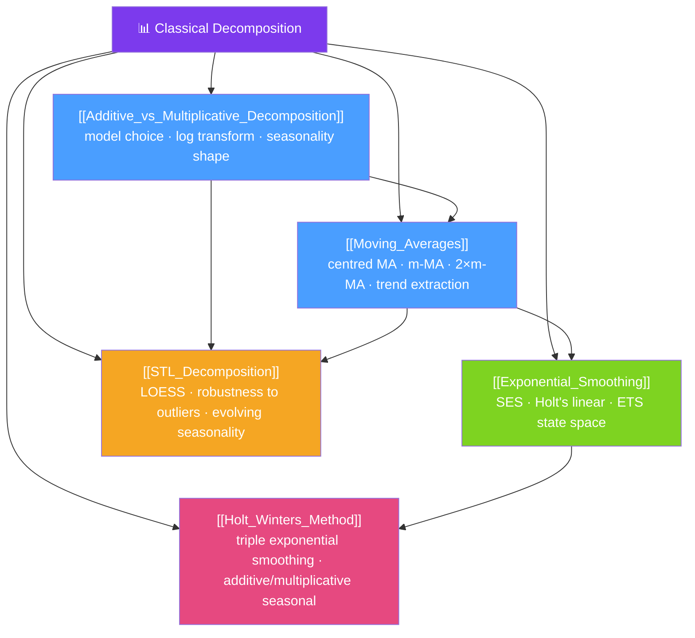

# 🗺️ Classical Decomposition — Map of Content

> [!abstract] What This Section Covers
> Classical decomposition methods separate a time series into its structural components without assuming any parametric model for the dynamics. This section starts with the fundamental choice between **additive and multiplicative** decomposition, covers the **moving average** smoother that underpins most trend estimation, develops the **exponential smoothing** family (ETS) from simple to double to triple, culminates in the full **Holt-Winters** method for trended, seasonal series, and ends with **STL decomposition** — the robust, flexible, and practically indispensable modern standard. Decomposition is both an end in itself (seasonal adjustment, outlier detection) and the first step before ARIMA modelling.

## Concept Map

## Learning Path

1. [[Additive_vs_Multiplicative_Decomposition]] — Choose the decomposition model; understand when to log-transform.
2. [[Moving_Averages]] — The centred moving average as a trend filter; understand 2×m-MA for even periods.
3. [[Exponential_Smoothing]] — Level smoothing (SES) and linear trend (Holt's); the ETS state-space framework.
4. [[Holt_Winters_Method]] — Add seasonal smoothing to get triple exponential smoothing for full decomposition.
5. [[STL_Decomposition]] — The modern, robust decomposition using LOESS; handles evolving seasonality and outliers.

## All Notes at a Glance

| Note | Difficulty | What You'll Learn |
|------|------------|-------------------|
| [[Additive_vs_Multiplicative_Decomposition]] | Beginner | When seasonal amplitude is constant vs proportional; log transform equivalence; Box-Cox |
| [[Moving_Averages]] | Beginner | Simple MA, weighted MA, centred MA, 2×m-MA for even periods, Henderson filter |
| [[Exponential_Smoothing]] | Intermediate | SES alpha parameter, Holt's linear trend, ETS error-trend-seasonal taxonomy |
| [[Holt_Winters_Method]] | Intermediate | Level + trend + seasonal smoothing equations; additive vs multiplicative Holt-Winters |
| [[STL_Decomposition]] | Intermediate → Advanced | LOESS fitting, inner/outer loops, robustness weights, choosing s.window and t.window |

## Key Questions This Section Answers

- When should you use additive decomposition vs multiplicative, and how does a log transform help?
- How does a moving average smooth out noise while preserving trend?
- What is the difference between simple exponential smoothing and Holt's method?
- What three components does Holt-Winters smooth, and what are the three smoothing parameters?
- Why is STL preferred over classical decomposition for modern data analysis?

## Related Sections

- [[_MOC_TimeSeries_Master|↑ Master MOC]]
- [[_MOC_TS_Fundamentals|← Fundamentals]]
- [[_MOC_ARIMA|→ ARIMA Models]]

#MOC #time-series #decomposition
