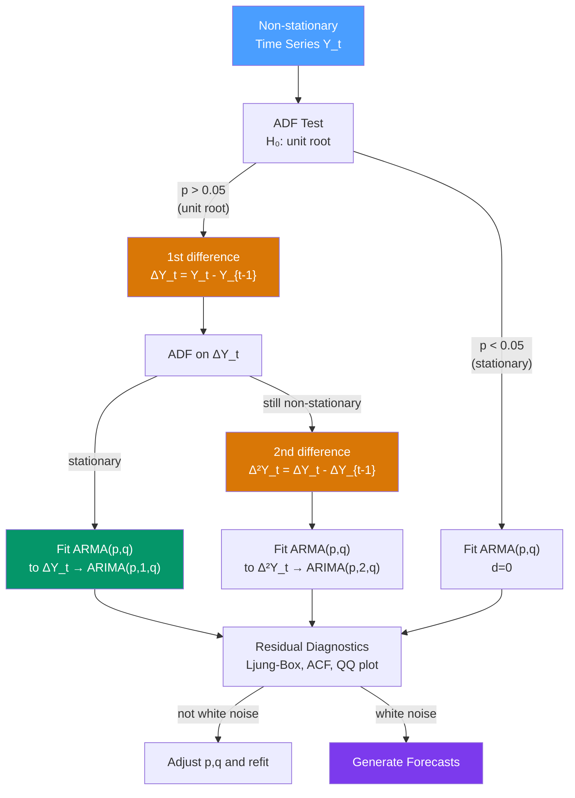

# 📊 ARIMA and Differencing

> [!abstract] TL;DR
> **ARIMA(p,d,q)** extends ARMA to non-stationary series by applying $d$ rounds of differencing: $\nabla^d Y_t$ is modelled as ARMA(p,q). The "I" stands for **Integrated**: the series is $I(d)$ — it must be differenced $d$ times to achieve stationarity. The **Box-Jenkins workflow** (Identify → Estimate → Diagnose → Forecast) is the systematic procedure for selecting $(p,d,q)$. Information criteria (AIC/BIC) and residual diagnostics confirm the model.

## Intuition — analogy FIRST

Imagine a speedometer and odometer. The odometer reading (position) is a random walk — it only ever goes up and is non-stationary. The speedometer (velocity = the change in position) fluctuates around some average speed — it is stationary.

ARIMA(p,**1**,q) is exactly this: instead of modelling the odometer (the level, which wanders), model the speedometer (the first difference, which is stationary). Then apply an ARMA(p,q) model to the stationary "speedometer" readings.

First differencing is the most common ($d=1$). Economic levels (GDP, stock prices, housing prices) almost always need $d=1$. Second differencing ($d=2$) is rarely needed and over-differencing can introduce problems.

---

## How It Works



---

## Key Concepts / Details

### The ARIMA(p,d,q) Model

**Definition**: A time series $\{Y_t\}$ is ARIMA(p,d,q) if $\nabla^d Y_t = (1-B)^d Y_t$ follows an ARMA(p,q) process.

**For $d=1$**: let $W_t = Y_t - Y_{t-1} = \nabla Y_t$. Then:
$$\Phi(B)W_t = c + \Theta(B)\epsilon_t$$

**For $d=2$**: $W_t = \nabla^2 Y_t = Y_t - 2Y_{t-1} + Y_{t-2}$

**Full ARIMA notation:**
$$\Phi(B)(1-B)^d Y_t = c + \Theta(B)\epsilon_t$$

where:
- $\Phi(B) = 1 - \phi_1 B - \cdots - \phi_p B^p$ — AR characteristic polynomial
- $\Theta(B) = 1 + \theta_1 B + \cdots + \theta_q B^q$ — MA characteristic polynomial
- $(1-B)^d$ — the $d$-th differencing operator

**Integration order**: $Y_t \sim I(d)$ means $d$ differences are required for stationarity.

### Differencing Operators

| Operator | Formula | Removes |
|----------|---------|---------|
| $(1-B)$ | $\nabla Y_t = Y_t - Y_{t-1}$ | Stochastic trend (unit root), linear deterministic trend |
| $(1-B)^2$ | $\nabla^2 Y_t = Y_t - 2Y_{t-1} + Y_{t-2}$ | Second-order polynomial trend |
| $(1-B^m)$ | $\nabla_m Y_t = Y_t - Y_{t-m}$ | Seasonal unit root (period $m$) |
| $(1-B)(1-B^m)$ | $\nabla \nabla_m Y_t$ | Both trend and seasonal unit root |

### The Box-Jenkins Workflow

**Step 1 — Identify** ($d$, $p$, $q$):
1. Plot the series; note obvious trend, seasonality, outliers
2. Test for unit root: ADF, KPSS, PP tests
3. Apply differencing if needed (determine $d$)
4. After differencing, inspect ACF/PACF of $\nabla^d Y_t$
5. Use ACF cutoff → suggest MA order $q$; PACF cutoff → suggest AR order $p$
6. Start with parsimonious models (low $p$ and $q$)

**Step 2 — Estimate** ($\phi$, $\theta$, $c$, $\sigma^2$):
1. Fit by MLE (conditional or exact)
2. Compute AIC, AICc, BIC for candidate models
3. Check standard errors of parameters; t-stats should be significant

**Step 3 — Diagnose**:
1. Ljung-Box test on residuals (should not reject, p > 0.05)
2. Residual ACF/PACF (all within confidence bands)
3. Normality of residuals (QQ plot, Jarque-Bera test)
4. Constant residual variance (no ARCH effects — see [[ARCH_Models]])

**Step 4 — Forecast**:
1. Generate point forecasts recursively
2. Compute prediction intervals
3. Evaluate on held-out test set using MAE, RMSE, MAPE

### Information Criteria for ARIMA Selection

$$\text{AIC} = -2\hat{\ell} + 2k$$
$$\text{AICc} = \text{AIC} + \frac{2k(k+1)}{T-k-1}$$
$$\text{BIC} = -2\hat{\ell} + k\ln(T)$$

where $k = p + q + (\text{constant included?}) + 1$ (for $\sigma^2$).

**Rule of thumb**: maximise model fit while penalising complexity. For $T < 200$, use AICc over AIC.

### Python: ARIMA Box-Jenkins Workflow

```python
import pandas as pd
import numpy as np
from statsmodels.tsa.arima.model import ARIMA
from statsmodels.tsa.stattools import adfuller
from statsmodels.graphics.tsaplots import plot_acf, plot_pacf
from statsmodels.stats.diagnostic import acorr_ljungbox
import matplotlib.pyplot as plt
import statsmodels.api as sm
import warnings
warnings.filterwarnings('ignore')

# Load airline passengers (I(1) with log-transform)
data = sm.datasets.get_rdataset("AirPassengers", "datasets").data
y_raw = pd.Series(data["value"].values,
                  index=pd.date_range("1949-01", periods=144, freq="MS"))
y = np.log(y_raw)  # log-transform for multiplicative series

# --- Step 1: Identify ---
# ADF test on raw series
print("=== Step 1: Identify ===")
adf_raw = adfuller(y, autolag='AIC')
print(f"ADF on log(passengers): p={adf_raw[1]:.4f}")  # > 0.05 → unit root

# First difference (seasonal handled later in SARIMA)
dy = y.diff().dropna()
adf_diff = adfuller(dy, autolag='AIC')
print(f"ADF on diff(log):       p={adf_diff[1]:.4f}")  # should be < 0.05

# ACF/PACF of first-differenced series
fig, axes = plt.subplots(1, 2, figsize=(12, 4))
plot_acf(dy, lags=20, ax=axes[0], title="ACF of Δlog(passengers)")
plot_pacf(dy, lags=20, ax=axes[1], title="PACF of Δlog(passengers)")
plt.tight_layout()
plt.show()
# Note: seasonal spikes at 12, 24 → need SARIMA (see SARIMA_Seasonal_ARIMA)
# For now: ignoring seasonality for ARIMA(p,1,q) illustration

# --- Step 2: Estimate ---
print("\n=== Step 2: Estimate ===")
best_aic, best_order = np.inf, None
for p in range(4):
    for q in range(4):
        try:
            m = ARIMA(y, order=(p, 1, q)).fit()
            if m.aic < best_aic:
                best_aic, best_order = m.aic, (p, 1, q)
            print(f"ARIMA{(p,1,q)}: AIC={m.aic:.2f}, BIC={m.bic:.2f}")
        except Exception as e:
            pass
print(f"\nBest ARIMA: {best_order} (AIC={best_aic:.2f})")

# Fit best model
model = ARIMA(y, order=best_order).fit()
print(model.summary())

# --- Step 3: Diagnose ---
print("\n=== Step 3: Diagnose ===")
resid = model.resid
lb = acorr_ljungbox(resid, lags=[10, 20], return_df=True)
print(lb)

fig, axes = plt.subplots(2, 2, figsize=(12, 8))
model.plot_diagnostics(fig=fig)
plt.suptitle(f"ARIMA{best_order} Diagnostics")
plt.tight_layout()
plt.show()

# --- Step 4: Forecast ---
print("\n=== Step 4: Forecast ===")
fc = model.get_forecast(steps=24)
fc_log = fc.predicted_mean
fc_ci_log = fc.conf_int(alpha=0.05)
fc_level = np.exp(fc_log)          # back-transform
fc_ci_level = np.exp(fc_ci_log)

print("24-month forecast (first 6):")
print(fc_level.head(6).round(0))

# Auto ARIMA with pmdarima
try:
    import pmdarima as pm
    auto_result = pm.auto_arima(y, d=None, max_p=5, max_q=5,
                                 information_criterion='aic',
                                 stepwise=True, seasonal=False,
                                 trace=True)
    print(f"\nauto_arima selected: {auto_result.order}")
except ImportError:
    print("\nInstall pmdarima for auto_arima: pip install pmdarima")
```

### Prediction Intervals for ARIMA

For ARIMA forecasts, the $h$-step prediction interval is:
$$\hat{Y}_{T+h|T} \pm z_{\alpha/2} \sigma_h$$

where $\sigma_h^2 = \sigma^2 \sum_{j=0}^{h-1} \psi_j^2$ and $\psi_j$ are the MA($\infty$) coefficients of the model.

The prediction interval **widens with $h$** and for $I(1)$ series it grows as $\sqrt{h}$ — reflecting the random-walk-like uncertainty that accumulates over time.

### Forecasting Back in the Original Scale

When you fit ARIMA on $\log Y_t$, the forecast $\hat{W}_{t+h}$ is for the log scale. To forecast the original scale:
$$\hat{Y}_{t+h} = \exp\left(\hat{W}_{t+h} + \frac{\hat{\sigma}_h^2}{2}\right)$$

The $\hat{\sigma}_h^2/2$ correction is the **log-normal bias correction** — omitting it gives a median forecast, not a mean forecast.

---

## Real-World Notes

- **GDP growth (quarterly)**: log(GDP) is $I(1)$; log-differenced GDP (= growth rate) is stationary. ARIMA(1,1,0) or ARIMA(0,1,1) typically fits well.
- **Consumer Price Index**: $I(1)$ in log-levels; log-differenced (= inflation) is $I(0)$ with possible AR(1) or ARMA(1,1) structure.
- **Stock prices**: log(price) is $I(1)$ (random walk hypothesis holds approximately); returns are approximately $I(0)$ white noise — ARIMA(0,1,0) is the null model.
- **pmdarima.auto_arima**: in practice, always start with `auto_arima` and treat the result as a baseline, then refine manually.

---

## Common Pitfalls

1. **Choosing $d$ by differencing until the series "looks stationary"**: always use formal ADF/KPSS tests. Over-differencing introduces MA unit roots.
2. **Including a constant with $d \geq 2$**: for $d=2$, a constant implies a quadratic trend in the original series — usually undesirable. Use `trend='n'` with `ARIMA(..., order=(p,2,q))`.
3. **Forgetting to back-transform forecasts**: ARIMA on $\log Y$ gives forecasts in log scale. Apply `exp()` with the log-normal correction for the original scale.
4. **Not checking for ARCH effects in residuals**: ARIMA residuals may be uncorrelated but heteroskedastic (variance clustering). Test with `arch_model` from `arch` package.
5. **Ignoring seasonality in monthly/quarterly data**: a plain ARIMA(p,1,q) on monthly data often has large residual spikes at lags 12, 24 — use SARIMA instead (see [[SARIMA_Seasonal_ARIMA]]).

---

## Related Concepts

- [[_MOC_ARIMA|↑ Section MOC]]
- [[ARMA_Models]] — the stationary sub-model that ARIMA wraps with differencing
- [[Stationarity]] — why differencing is needed; the ADF test that guides the choice of $d$
- [[White_Noise_and_Random_Walk]] — ARIMA(0,1,0) is the random walk; first differencing recovers white noise
- [[SARIMA_Seasonal_ARIMA]] — the seasonal extension for monthly/quarterly data

---

## Review Questions

1. Explain what ARIMA(1,1,0) means in plain language. Write out the equation for $Y_t$ in terms of past values and innovations. What is the long-run forecast (as $h \to \infty$)?
2. You run ADF on a series and get p = 0.32. You then first-difference and run ADF again, getting p = 0.001. What does this tell you about the integration order, and what value of $d$ should you use in your ARIMA model?
3. After fitting ARIMA(2,1,1) to monthly sales data, the residual ACF shows significant spikes at lags 12 and 24 but not at other lags. What does this indicate, and what model class would address it?

---

## Sources

- Box, Jenkins, Reinsel & Ljung, *Time Series Analysis* (5th ed.), Ch. 4–6
- Hamilton, *Time Series Analysis*, Ch. 3–4
- Hyndman & Athanasopoulos, *Forecasting: Principles and Practice* (3rd ed.), Ch. 9

#time-series #ARIMA #differencing #Box-Jenkins #integrated-process
