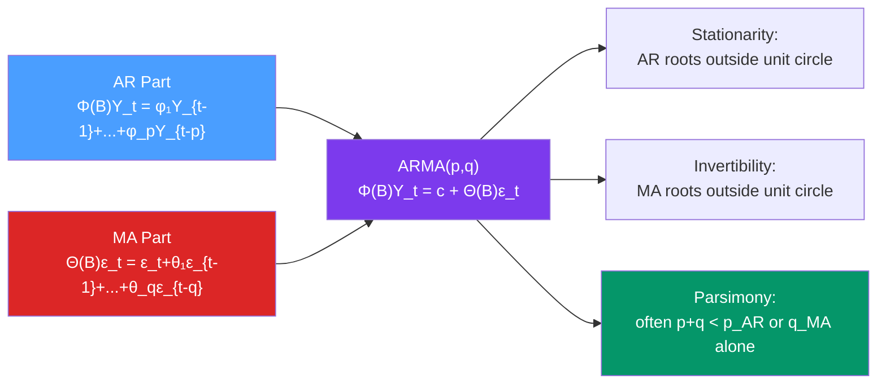

# 🔀 ARMA Models

> [!abstract] TL;DR
> An **ARMA(p,q)** model combines AR and MA components: $\Phi(B)Y_t = c + \Theta(B)\epsilon_t$, where $\Phi(B) = 1 - \phi_1 B - \cdots - \phi_p B^p$ and $\Theta(B) = 1 + \theta_1 B + \cdots + \theta_q B^q$. The process is **stationary** if AR roots lie outside the unit circle; **invertible** if MA roots do. When both components are present, **both ACF and PACF tail off** — making model identification harder. Use **AIC/BIC** to select $(p,q)$ from a grid search.

## Intuition — analogy FIRST

An AR model says "my current value depends on my past values." An MA model says "my current value depends on past shocks." Real systems often have both: the economy's output depends on its recent history (AR) *and* responds to recent news/shocks (MA). An ARMA model captures this mixed dynamics parsimoniously — sometimes an ARMA(1,1) with just 2 parameters fits data that would otherwise require an AR(5) or MA(5) with 5 parameters.

Think of ARMA as two lenses looking at the same data:
- The AR lens: I see patterns in lagged values
- The MA lens: I see patterns from propagating shocks

ARMA uses both lenses simultaneously.

---

## How It Works



---

## Key Concepts / Details

### ARMA(1,1): The Core Case

$$Y_t = c + \phi Y_{t-1} + \epsilon_t + \theta \epsilon_{t-1}$$

**Stationarity**: $|\phi| < 1$
**Invertibility**: $|\theta| < 1$

**Autocorrelation function:**
$$\rho(1) = \frac{(1+\phi\theta)(\phi+\theta)}{1+2\phi\theta+\theta^2}$$
$$\rho(k) = \phi \rho(k-1) \quad \text{for } k \geq 2$$

So the ACF decays geometrically for $k \geq 2$ — like an AR(1) — but the initial value $\rho(1)$ is modified by the MA component.

**PACF**: tails off (neither cuts off sharply like pure AR nor decays in MA fashion — it's a mix).

### General ARMA(p,q)

$$\Phi(B)Y_t = c + \Theta(B)\epsilon_t$$

Expanding:
$$Y_t - \phi_1 Y_{t-1} - \cdots - \phi_p Y_{t-p} = c + \epsilon_t + \theta_1 \epsilon_{t-1} + \cdots + \theta_q \epsilon_{t-q}$$

**Conditions:**
- **Stationarity**: roots of $\Phi(z) = 0$ outside unit circle (same as pure AR)
- **Invertibility**: roots of $\Theta(z) = 0$ outside unit circle (same as pure MA)
- **Identifiability**: $\Phi(z)$ and $\Theta(z)$ share no common roots (no parameter redundancy)

**ACF and PACF for ARMA(p,q):**
- Both ACF and PACF **tail off** (neither cuts off)
- ACF tails off after $\max(0, q-p)$ lags
- PACF tails off after $\max(0, p-q)$ lags
- This makes ARMA harder to identify visually than pure AR or MA

### Parameter Redundancy (Common Roots)

If $\Phi(z)$ and $\Theta(z)$ share a common root $z_0$, the ARMA(p,q) model is **observationally equivalent** to ARMA(p-1, q-1) — meaning you've overparameterised.

**Example**: ARMA(1,1) with $\phi = 0.5$ and $\theta = -0.5$ can be simplified:
$$\frac{1+0.5z}{1-0.5z} = \text{... with common factor?}$$

No common root here, but if we had $\phi = \theta$ (same value in $\Phi$ and $\Theta$), the ARMA(1,1) collapses to white noise. Always check: does the fitted model have near-common roots?

### Model Identification via Information Criteria

Since both ACF and PACF tail off in ARMA models, visual identification is unreliable. Use a **grid search over AIC/BIC**:

```python
import numpy as np
import pandas as pd
from statsmodels.tsa.arima.model import ARIMA
import itertools
import warnings
warnings.filterwarnings('ignore')

# Generate ARMA(1,1) data
import statsmodels.api as sm
np.random.seed(42)
ar = np.array([1, -0.7])
ma = np.array([1, 0.3])
arma11 = sm.tsa.ArmaProcess(ar, ma)
y = arma11.generate_sample(nsample=300)

# Grid search
results = []
for p, q in itertools.product(range(4), range(4)):
    try:
        model = ARIMA(y, order=(p, 0, q)).fit()
        results.append({'p': p, 'q': q, 'AIC': model.aic, 'BIC': model.bic})
    except Exception:
        pass

df = pd.DataFrame(results).sort_values('AIC')
print("Best models by AIC:")
print(df.head(6).to_string(index=False))
```

**AIC vs BIC tradeoff:**
- AIC: minimises prediction error; tends to select larger models
- BIC: applies stronger penalty for parameters; consistent for model selection; tends to select smaller models
- Recommendation: use BIC in explanatory/causal analysis; AIC in pure forecasting

### Maximum Likelihood Estimation

Unlike AR models, ARMA parameters cannot be estimated by OLS (because $\epsilon_{t-1}$ is unobserved). MLE maximises:

$$\ell(\phi, \theta, \sigma^2) = -\frac{T}{2}\log(2\pi\sigma^2) - \frac{1}{2\sigma^2} \sum_{t=1}^{T} \epsilon_t^2$$

where $\epsilon_t$ is computed recursively using the **innovations algorithm** (Kalman filter in state-space form). Initial innovations set to zero (conditional MLE) or integrated out (exact MLE).

### Python: Full ARMA Workflow

```python
import numpy as np
import pandas as pd
from statsmodels.tsa.arima.model import ARIMA
from statsmodels.graphics.tsaplots import plot_acf, plot_pacf
from statsmodels.stats.diagnostic import acorr_ljungbox
import matplotlib.pyplot as plt
import statsmodels.api as sm

# Load real data: monthly US retail sales (example)
# Using simulated ARMA(1,1) for demonstration
np.random.seed(0)
ar = np.array([1, -0.6])
ma = np.array([1, 0.4])
y = sm.tsa.ArmaProcess(ar, ma).generate_sample(nsample=200)

# Step 1: Check stationarity
from statsmodels.tsa.stattools import adfuller
adf = adfuller(y, autolag='AIC')
print(f"ADF p-value: {adf[1]:.4f}")  # Should be < 0.05 for ARMA

# Step 2: Inspect ACF/PACF
fig, axes = plt.subplots(1, 2, figsize=(12, 4))
plot_acf(y, lags=20, ax=axes[0], title="ACF — ARMA(1,1)")
plot_pacf(y, lags=20, ax=axes[1], title="PACF — ARMA(1,1)")
plt.tight_layout()
plt.show()
# Both tail off → ARMA needed

# Step 3: Fit candidate models
for p, q in [(1,0), (0,1), (1,1), (2,0), (0,2), (2,1), (1,2)]:
    m = ARIMA(y, order=(p, 0, q)).fit()
    print(f"ARMA({p},{q}): AIC={m.aic:.2f}, BIC={m.bic:.2f}")

# Step 4: Fit the selected model
model = ARIMA(y, order=(1, 0, 1)).fit()
print("\nARMA(1,1) summary:")
print(model.summary())

# Step 5: Residual diagnostics
residuals = model.resid
lb = acorr_ljungbox(residuals, lags=[10, 20], return_df=True)
print(f"\nLjung-Box Q(10): p={lb['lb_pvalue'].iloc[0]:.4f}")
print(f"Ljung-Box Q(20): p={lb['lb_pvalue'].iloc[1]:.4f}")

# Plot residual diagnostics
fig, axes = plt.subplots(2, 2, figsize=(12, 8))
model.plot_diagnostics(fig=fig)
plt.tight_layout()
plt.show()

# Step 6: Forecast
fc = model.get_forecast(steps=20)
fc_mean = fc.predicted_mean
fc_ci   = fc.conf_int(alpha=0.05)
```

### The Box-Jenkins Workflow Summary

```
1. IDENTIFY: achieve stationarity (ADF test, differencing)
             inspect ACF/PACF to suggest p, q candidates

2. ESTIMATE: fit candidate ARMA(p,q) models by MLE
             compare AIC/BIC across the model grid

3. DIAGNOSE: check residuals are white noise
             (Ljung-Box test, residual ACF, QQ plot)
             if not: return to step 1 with higher p or q

4. FORECAST: generate point forecasts + prediction intervals
             evaluate on held-out test set (MAE, MAPE, RMSE)
```

---

## Real-World Notes

- **ARMA(1,1) ubiquity**: many real economic and financial series are well-described by ARMA(1,1) — it is a remarkably flexible model despite having only 2 free parameters.
- **US unemployment rate**: AR(1) or ARMA(1,1) after seasonal adjustment — current unemployment is highly predictive of next month's.
- **Commodity prices**: AR(1) for trend-free series; ARMA(1,1) when shocks take time to be absorbed through the supply chain.
- **pmdarima auto_arima**: the Python equivalent of R's `auto.arima` — performs the grid search and Box-Jenkins workflow automatically with stepwise AIC minimisation.

---

## Common Pitfalls

1. **Visual identification of ARMA order from ACF/PACF**: both tail off in ARMA — you cannot determine $p$ and $q$ from plots alone. Use AIC/BIC grid search.
2. **Fitting too many parameters**: ARMA(3,3) on 100 observations is over-parameterised. Use BIC to enforce parsimony.
3. **Near-common roots (parameter redundancy)**: if $\hat{\phi}_1 \approx -\hat{\theta}_1$, you likely have a redundant parameter. Check for near-cancellation and simplify.
4. **Ignoring MA component when it improves fit**: many analysts only consider AR models because they are OLS-estimable. Always evaluate ARMA models — the MA component often captures short-run shock propagation missed by AR alone.
5. **Not using `auto_arima` for operational models**: manual grid search is error-prone. Use `pmdarima.auto_arima` for production pipelines.

---

## Related Concepts

- [[_MOC_ARIMA|↑ Section MOC]]
- [[AR_Models]] — pure autoregressive process; PACF cuts off
- [[MA_Models]] — pure moving average process; ACF cuts off
- [[ARIMA_and_Differencing]] — ARMA applied to differenced series for non-stationary data
- [[Autocorrelation_and_ACF_PACF]] — the identification tools for model order selection

---

## Review Questions

1. Explain why the ARMA(1,1) model with $\phi = \theta$ is problematic. What happens to the model specification?
2. You observe a time series where the ACF shows a spike at lag 1 followed by slow decay, and the PACF also shows slow decay. Why does this suggest ARMA rather than pure AR or MA, and how would you select the order?
3. Compare AIC and BIC selection criteria. For a sample size of $T = 50$, which would you expect to select a higher-order model, and why?

---

## Sources

- Box, Jenkins, Reinsel & Ljung, *Time Series Analysis* (5th ed.), Ch. 6–7
- Akaike (1974), *A New Look at the Statistical Model Identification*, IEEE Transactions on Automatic Control
- Schwarz (1978), *Estimating the Dimension of a Model*, Annals of Statistics

#time-series #ARIMA #ARMA #Box-Jenkins #model-selection
