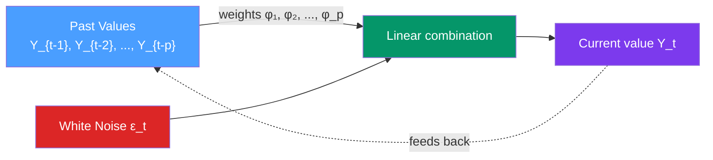

# 🔄 AR Models — Autoregressive Processes

> [!abstract] TL;DR
> An **AR(p)** (autoregressive of order $p$) model expresses $Y_t$ as a linear combination of its past $p$ values plus white noise: $Y_t = \phi_1 Y_{t-1} + \phi_2 Y_{t-2} + \cdots + \phi_p Y_{t-p} + \epsilon_t$. The process is **stationary** if and only if all roots of the characteristic polynomial $\Phi(z) = 1 - \phi_1 z - \cdots - \phi_p z^p$ lie **outside the unit circle**. The **PACF cuts off after lag $p$**; the **ACF tails off** exponentially or as damped sinusoids.

## Intuition — analogy FIRST

Imagine forecasting tomorrow's temperature by looking at the past few days: "Today is hot, yesterday was hot, so tomorrow will probably be hot too." This is an autoregressive model — the variable literally *regresses on itself*.

The **order** $p$ tells you how many past values matter. Weather: $p=2$ (last two days matter). US GDP quarterly growth: $p=1$ or $p=4$ (one quarter and one year ago). Stock returns: $p\approx 0$ (efficient markets — no lag helps).

The **stationarity condition** ensures the past influence dies out: each term's contribution must shrink the further back you go, so old history doesn't dominate forever.

---

## How It Works



---

## Key Concepts / Details

### AR(1): The Simplest Case

$$Y_t = \phi Y_{t-1} + \epsilon_t, \quad \epsilon_t \sim WN(0, \sigma^2)$$

**Stationarity condition**: $|\phi| < 1$

**Properties when stationary:**
- $\mathbb{E}[Y_t] = 0$ (assuming zero mean; add constant for nonzero mean)
- $\text{Var}(Y_t) = \sigma^2 / (1 - \phi^2)$
- $\text{ACF: } \rho(k) = \phi^k$ — exponential decay
- $\text{PACF: } \phi_{11} = \phi$, $\phi_{kk} = 0$ for $k \geq 2$ — cuts off at lag 1

**Boundary cases:**
- $\phi = 1$: random walk (unit root, non-stationary)
- $\phi = -1$: alternating random walk (non-stationary)
- $|\phi| > 1$: explosive (variance → ∞)

### AR(p): General Form

$$Y_t = c + \phi_1 Y_{t-1} + \phi_2 Y_{t-2} + \cdots + \phi_p Y_{t-p} + \epsilon_t$$

**Using the backshift operator** $B$ (where $BY_t = Y_{t-1}$):
$$\Phi(B) Y_t = c + \epsilon_t$$

where the **AR characteristic polynomial** is:
$$\Phi(z) = 1 - \phi_1 z - \phi_2 z^2 - \cdots - \phi_p z^p$$

**Stationarity condition**: all roots of $\Phi(z) = 0$ must lie **outside the unit circle** (i.e., $|z_i| > 1$ for all roots $z_i$).

Equivalently, all **inverse roots** $1/z_i$ must be inside the unit circle.

### Yule-Walker Equations

For AR(p), the autocorrelation at lag $k$ satisfies the Yule-Walker equations:
$$\rho(k) = \phi_1 \rho(k-1) + \phi_2 \rho(k-2) + \cdots + \phi_p \rho(k-p)$$

In matrix form (for $k = 1, \ldots, p$):
$$\begin{pmatrix} \rho(1) \\ \rho(2) \\ \vdots \\ \rho(p) \end{pmatrix} = \begin{pmatrix} 1 & \rho(1) & \cdots & \rho(p-1) \\ \rho(1) & 1 & \cdots & \rho(p-2) \\ \vdots & & \ddots & \vdots \\ \rho(p-1) & \cdots & \rho(1) & 1 \end{pmatrix} \begin{pmatrix} \phi_1 \\ \phi_2 \\ \vdots \\ \phi_p \end{pmatrix}$$

Solving this system gives the Yule-Walker estimator of $\phi$. Given sample ACF $\hat{\rho}$, estimate $\hat{\phi} = \Gamma^{-1}\hat{\gamma}$.

### ACF/PACF Patterns for AR(p)

| Process | ACF | PACF |
|---------|-----|------|
| AR(1), $\phi > 0$ | Exponential decay from positive values | Spike at lag 1, zero after |
| AR(1), $\phi < 0$ | Alternating exponential decay | Negative spike at lag 1, zero after |
| AR(2) | Damped sinusoidal decay | Spikes at lags 1 and 2, zero after |
| AR(p) | Tails off (exponential/sinusoidal) | **Cuts off after lag p** |

This is the fundamental diagnostic: **PACF cuts off after lag $p$ for an AR(p) process**.

### Estimation

**OLS estimation**: regress $Y_t$ on $(Y_{t-1}, \ldots, Y_{t-p})$. Consistent and asymptotically efficient when $\epsilon_t$ is IID.

**MLE estimation**: maximise the Gaussian log-likelihood:
$$\ell(\phi, \sigma^2) = -\frac{T}{2}\log(2\pi\sigma^2) - \frac{1}{2\sigma^2}\sum_{t=p+1}^{T}(Y_t - \phi_1 Y_{t-1} - \cdots - \phi_p Y_{t-p})^2$$

For AR models, OLS ≈ MLE.

**Information criteria for order selection:**
$$\text{AIC}(p) = T \ln(\hat{\sigma}^2_p) + 2p$$
$$\text{BIC}(p) = T \ln(\hat{\sigma}^2_p) + p\ln(T)$$

BIC is consistent (selects the true order asymptotically); AIC tends to overfit.

### Python: AR Models

```python
import numpy as np
import pandas as pd
from statsmodels.tsa.ar_model import AutoReg
from statsmodels.tsa.stattools import acf, pacf, arma_order_select_ic
from statsmodels.graphics.tsaplots import plot_acf, plot_pacf
import matplotlib.pyplot as plt
import statsmodels.api as sm

# Simulate AR(2): Y_t = 0.7*Y_{t-1} - 0.3*Y_{t-2} + eps
np.random.seed(42)
ar = np.array([1, -0.7, 0.3])   # Phi polynomial (statsmodels sign convention)
ma = np.array([1])
ar2 = sm.tsa.ArmaProcess(ar, ma)
print(f"AR(2) stationary: {ar2.isstationary}")
print(f"Roots: {ar2.arroots}")  # Should all be outside unit circle (|root|>1)

y = ar2.generate_sample(nsample=500, scale=1.0)

# ACF and PACF plots
fig, axes = plt.subplots(1, 2, figsize=(12, 4))
plot_acf(y, lags=20, ax=axes[0], title="ACF — AR(2)")
plot_pacf(y, lags=20, ax=axes[1], title="PACF — AR(2)")
# Expect: ACF tails off, PACF has 2 significant spikes then zero
plt.tight_layout()
plt.show()

# Fit AR(2) using AutoReg
model = AutoReg(y, lags=2, old_names=False)
result = model.fit()
print(result.summary())
print(f"\nEstimated AR coefficients: {result.params[1:]}")  # True: [0.7, -0.3]
print(f"AIC: {result.aic:.2f}, BIC: {result.bic:.2f}")

# Order selection via AIC/BIC
from statsmodels.tsa.ar_model import ar_select_order
sel = ar_select_order(y, maxlag=10, ic='aic')
print(f"\nAIC-selected AR order: {sel.ar_lags}")

# Forecast
forecast = result.forecast(steps=12)
print(f"\n12-step forecast: {forecast.round(3)}")

# Using ARIMA interface (equivalent, more flexible)
from statsmodels.tsa.arima.model import ARIMA
arima_ar2 = ARIMA(y, order=(2, 0, 0)).fit()
print(f"\nARIMA(2,0,0) AR params: {arima_ar2.arparams.round(4)}")
```

### AR Model Forecasting

For an AR(p) model, the $h$-step-ahead forecast is computed recursively:
$$\hat{Y}_{t+1|t} = \hat{\phi}_1 Y_t + \hat{\phi}_2 Y_{t-1} + \cdots + \hat{\phi}_p Y_{t-p+1}$$
$$\hat{Y}_{t+2|t} = \hat{\phi}_1 \hat{Y}_{t+1|t} + \hat{\phi}_2 Y_t + \cdots$$

For a stationary AR(p), forecasts **converge to the series mean** as $h \to \infty$ — mean-reverting behaviour.

---

## Real-World Notes

- **Inflation (quarterly)**: typically AR(1) or AR(2) — current inflation predicts next quarter's.
- **Interest rates**: AR(1) with near-unit root; the Fed funds rate changes slowly.
- **Weather**: temperature AR(1) within a season; autoregressive models are the backbone of numerical weather prediction.
- **Demand forecasting**: AR models on weekly store sales after seasonal adjustment.
- **Computational note**: for very long series ($T > 10^4$), use `pmdarima.arima.ARIMA` or `statsforecast.models.AutoARIMA` which are optimised for speed.

---

## Common Pitfalls

1. **Fitting AR without checking stationarity**: OLS fitting will succeed on non-stationary data but the estimates are meaningless (spurious). Always run ADF test first.
2. **Using AIC for order selection when BIC is better**: AIC tends to overfit (select too many lags). Use BIC for parsimony, especially with $T < 200$.
3. **Ignoring Yule-Walker constraints**: parameter combinations that appear to fit the data can produce non-stationary AR(p) models. Check that estimated roots are outside the unit circle.
4. **Forgetting the mean**: if the series has nonzero mean, include a constant or demean the series first. AR without constant assumes $\mathbb{E}[Y_t] = 0$.
5. **Interpreting PACF spike as definitive**: sampling variability at small sample sizes means a single marginally significant PACF spike at lag 4 may not justify an AR(4). Use information criteria to confirm.

---

## Related Concepts

- [[_MOC_ARIMA|↑ Section MOC]]
- [[MA_Models]] — the dual process: ACF cuts off, PACF tails off
- [[ARMA_Models]] — combination of AR and MA components
- [[Autocorrelation_and_ACF_PACF]] — the ACF/PACF identification toolkit
- [[Stationarity]] — the stationarity condition for AR and how ADF tests it
- [[White_Noise_and_Random_Walk]] — AR(1) with $\phi=1$ is a random walk (unit root)

---

## Review Questions

1. Show that the variance of a stationary AR(1) process is $\sigma^2/(1-\phi^2)$. What happens to this variance as $\phi \to 1$?
2. You observe a time series with an ACF that decays alternately positive/negative (like $\rho(1)>0$, $\rho(2)<0$, $\rho(3)>0$, ...) and a PACF with a significant negative spike at lag 1 and zero elsewhere. What model does this suggest?
3. Write out the Yule-Walker system for AR(2) and explain how to use it to estimate $\phi_1$ and $\phi_2$ from the sample autocorrelations.

---

## Sources

- Box, Jenkins, Reinsel & Ljung, *Time Series Analysis* (5th ed.), Ch. 3
- Hamilton, *Time Series Analysis*, Ch. 3
- Brockwell & Davis, *Time Series: Theory and Methods*, Ch. 3

#time-series #ARIMA #AR #autoregressive #Yule-Walker
