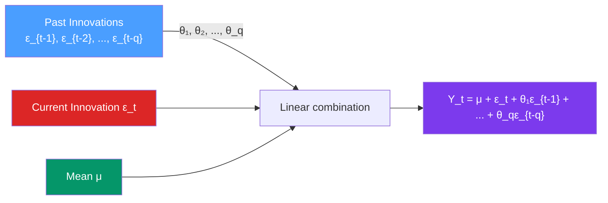

# 〰️ MA Models — Moving Average Processes

> [!abstract] TL;DR
> An **MA(q)** (moving average of order $q$) expresses $Y_t$ as a linear combination of the current and past $q$ white noise innovations: $Y_t = \mu + \epsilon_t + \theta_1\epsilon_{t-1} + \cdots + \theta_q\epsilon_{t-q}$. MA processes are **always stationary**. The **invertibility condition** (roots of the MA polynomial outside the unit circle) ensures a unique correspondence between $\theta$ and the autocorrelation structure. The **ACF cuts off sharply after lag $q$**; the **PACF tails off**.

## Intuition — analogy FIRST

Imagine a news-driven stock: each day, a random news shock $\epsilon_t$ hits the price. The MA(1) model says today's price movement is partly today's shock *plus* a fraction $\theta_1$ of yesterday's shock — perhaps because yesterday's news takes a day to fully digest.

After $q$ days, the shock is fully absorbed and has no more direct effect. This **finite memory** is the defining property of MA processes — shocks die out completely after $q$ periods. Contrast with AR processes where shocks decay geometrically (never fully disappear).

The *moving average* name is confusing — these are NOT the same as the moving average smoother. They are moving averages of **innovations** (shocks), not of the data.

---

## How It Works



---

## Key Concepts / Details

### MA(1): The Simplest Case

$$Y_t = \mu + \epsilon_t + \theta_1 \epsilon_{t-1}, \quad \epsilon_t \sim WN(0, \sigma^2)$$

**Properties:**
- Always stationary (MA processes are always finite-variance and stationary)
- $\mathbb{E}[Y_t] = \mu$
- $\text{Var}(Y_t) = \sigma^2(1 + \theta_1^2)$
- ACF: $\rho(1) = \theta_1/(1+\theta_1^2)$, $\rho(k) = 0$ for $k \geq 2$ — **cuts off at lag 1**
- PACF: tails off as $(-\theta_1)^k / (1 - \theta_1^{2k+2}) \cdot (1-\theta_1^2)$ — decays geometrically

**Invertibility**: for MA(1), the invertibility condition is $|\theta_1| < 1$.

**Duality (invertible MA ↔ AR)**: an MA(1) with $|\theta_1| < 1$ can be written as an infinite AR:
$$Y_t = \mu + \sum_{j=1}^{\infty} (-\theta_1)^j (Y_{t-j} - \mu) + \epsilon_t$$

### MA(q): General Form

$$Y_t = \mu + \epsilon_t + \theta_1 \epsilon_{t-1} + \theta_2 \epsilon_{t-2} + \cdots + \theta_q \epsilon_{t-q}$$

**Backshift operator form:**
$$Y_t = \mu + \Theta(B)\epsilon_t$$

where $\Theta(z) = 1 + \theta_1 z + \theta_2 z^2 + \cdots + \theta_q z^q$ is the **MA characteristic polynomial**.

**Invertibility condition**: all roots of $\Theta(z) = 0$ lie **outside the unit circle** ($|z_i| > 1$).

**Autocorrelation function:**
$$\rho(k) = \begin{cases} \frac{\sum_{j=0}^{q-k} \theta_j \theta_{j+k}}{\sum_{j=0}^{q} \theta_j^2} & k = 1, 2, \ldots, q \\ 0 & k > q \end{cases}$$

where $\theta_0 = 1$. This is the defining signature: **ACF is exactly zero for lags beyond $q$**.

### Why Invertibility Matters

For each set of autocorrelations $\{\rho(1), \ldots, \rho(q)\}$, there are typically **two** sets of MA parameters $\theta$ that produce the same autocorrelations — one invertible and one not. We impose invertibility to uniquely identify the model.

**Example for MA(1)**: both $\theta_1 = 0.5$ and $\theta_1 = 1/0.5 = 2$ give $\rho(1) = 0.5/(1+0.25) = 0.4$ and $\rho(1) = 2/(1+4) = 0.4$. We always choose $|\theta_1| < 1$ (the invertible one).

**Why the invertible representation?** Because in the invertible form, the MA process can be written as an infinite AR — meaning we can express $\epsilon_t$ in terms of observable past values. This is needed for forecasting and interpretation.

### Duality: AR(∞) ↔ MA(∞)

Any invertible MA(q) can be written as an AR($\infty$):
$$\epsilon_t = \Theta(B)^{-1}(Y_t - \mu)$$

Any stationary AR(p) can be written as an MA($\infty$):
$$Y_t - \mu = \Phi(B)^{-1}\epsilon_t = \sum_{j=0}^{\infty} \psi_j \epsilon_{t-j}$$

The $\psi_j$ are the **impulse response coefficients** — the effect of an innovation at time $t$ on future values $Y_{t+j}$.

### ACF/PACF Patterns for MA(q)

| Process | ACF | PACF |
|---------|-----|------|
| MA(1), $\theta > 0$ | Single positive spike at lag 1, zero after | Alternating decay |
| MA(1), $\theta < 0$ | Single negative spike at lag 1, zero after | Geometric decay (positive) |
| MA(2) | Spikes at lags 1 and 2, zero after | Tails off (damped sinusoid or exponential) |
| MA(q) | **Cuts off after lag q** | Tails off |

### Python: MA Models

```python
import numpy as np
import pandas as pd
from statsmodels.tsa.arima.model import ARIMA
from statsmodels.graphics.tsaplots import plot_acf, plot_pacf
import statsmodels.api as sm
import matplotlib.pyplot as plt

# Simulate MA(2): Y_t = eps_t + 0.6*eps_{t-1} - 0.3*eps_{t-2}
np.random.seed(42)
ar = np.array([1])
ma = np.array([1, 0.6, -0.3])  # MA polynomial (1 + 0.6z - 0.3z^2)
ma2_process = sm.tsa.ArmaProcess(ar, ma)

print(f"MA(2) invertible: {ma2_process.isinvertible}")
print(f"MA(2) roots: {ma2_process.maroots}")  # Should be > 1 in absolute value

y = ma2_process.generate_sample(nsample=300, scale=1.0)

# Plot ACF/PACF — expect ACF to cut off after lag 2
fig, axes = plt.subplots(1, 2, figsize=(12, 4))
plot_acf(y, lags=20, ax=axes[0], title="ACF — MA(2)")
plot_pacf(y, lags=20, ax=axes[1], title="PACF — MA(2)")
plt.tight_layout()
plt.show()

# Theoretical ACF for MA(2) with theta = [0.6, -0.3]
theta = np.array([0.6, -0.3])
denom = 1 + np.sum(theta**2)
rho1 = (theta[0] + theta[0]*theta[1]) / denom
rho2 = theta[1] / denom
print(f"\nTheoretical ACF: ρ(1)={rho1:.4f}, ρ(2)={rho2:.4f}")

# Fit MA(2)
model = ARIMA(y, order=(0, 0, 2))
result = model.fit()
print(result.summary())
print(f"\nEstimated MA params: {result.maparams.round(4)}")  # True: [0.6, -0.3]

# Information criteria
print(f"\nAIC: {result.aic:.2f}, BIC: {result.bic:.2f}")

# Fitted values and residuals
fitted = result.fittedvalues
residuals = result.resid

# Check residuals (should be white noise)
from statsmodels.stats.diagnostic import acorr_ljungbox
lb = acorr_ljungbox(residuals, lags=[10], return_df=True)
print(f"\nLjung-Box Q(10): {lb['lb_stat'].values[0]:.2f}, p={lb['lb_pvalue'].values[0]:.4f}")

# Forecast with prediction intervals
forecast = result.get_forecast(steps=10)
fc_mean = forecast.predicted_mean
fc_ci   = forecast.conf_int(alpha=0.05)
print(f"\n10-step forecasts:\n{fc_mean.round(3)}")
# MA forecasts converge to the mean after q steps — point forecasts are exactly μ for h > q
```

### MA vs AR: The Key Distinction

| Feature | MA(q) | AR(p) |
|---------|-------|-------|
| Memory duration | Finite: exactly $q$ periods | Infinite: exponential decay |
| ACF | Cuts off at $q$ | Tails off |
| PACF | Tails off | Cuts off at $p$ |
| Always stationary? | Yes | Only if $|\phi_i|$ small |
| Forecasts converge to mean | After $q$ steps | Gradually |
| Estimation difficulty | MLE required (non-linear) | OLS sufficient |

---

## Real-World Notes

- **Economic shocks**: MA models naturally represent "one-time shock" effects. An MA(1) error in GDP growth means a policy shock today affects next quarter but not beyond.
- **Bid-ask bounce in finance**: stock prices have a negative MA(1) component from bid-ask spread bounce — buying at the ask and selling at the bid creates negative first-lag autocorrelation in returns.
- **Aggregate data**: when higher-frequency data is aggregated (e.g., daily to weekly), the resulting series often has MA components due to the aggregation process.
- **The "airline model"** ARIMA(0,1,1)(0,1,1)[12]: both the non-seasonal and seasonal components are MA(1). This single model with just 2 parameters fits monthly airline data and many other seasonal economic series remarkably well.

---

## Common Pitfalls

1. **Confusing MA models with MA smoothers**: the names are identical but the concepts are completely different. MA(q) models use past *innovations*; MA smoothers average past *data*. Always clarify context.
2. **Estimating MA parameters by OLS**: unlike AR models, MA parameters cannot be estimated by ordinary linear regression because the innovations $\epsilon_{t-j}$ are unobserved. MLE or the innovations algorithm is required.
3. **Fitting non-invertible MA models**: if MLE converges to $|\theta| > 1$, the model is non-invertible. Reparametrise or use conditional MLE with invertibility constraint.
4. **Over-interpreting short ACF cutoff**: with only $T = 50$ observations, ACF bands are wide ($\approx \pm 0.28$). A "cutoff at lag 2" may be noise. Confirm with AIC/BIC across multiple orders.
5. **Forgetting MA forecasts are just the mean beyond lag $q$**: for $h > q$ steps ahead, the MA(q) point forecast is exactly $\mu$ (the series mean). If you need trending forecasts, add an ARIMA component.

---

## Related Concepts

- [[_MOC_ARIMA|↑ Section MOC]]
- [[AR_Models]] — the dual process; ACF tails off, PACF cuts off; infinite MA representation
- [[ARMA_Models]] — combining AR and MA for richer dynamics
- [[Autocorrelation_and_ACF_PACF]] — how ACF cutoff at lag $q$ identifies MA order
- [[White_Noise_and_Random_Walk]] — MA(0) = white noise; the residuals of a well-fitted MA should be white noise

---

## Review Questions

1. Show that the ACF of MA(1) is zero for all lags $k \geq 2$. Why does this mean an MA(1) has "1-period memory"?
2. Prove that $\theta_1 = 0.5$ and $\theta_1 = 2$ give the same autocorrelation function for MA(1). Which is invertible, and how would you determine this from a fitted model?
3. A financial analyst observes that daily stock returns have a significant negative ACF at lag 1 only, with all other ACF values within the confidence band. What MA model would explain this, and what financial mechanism might cause it?

---

## Sources

- Box, Jenkins, Reinsel & Ljung, *Time Series Analysis* (5th ed.), Ch. 3
- Hamilton, *Time Series Analysis*, Ch. 3
- Tsay, *Analysis of Financial Time Series* (3rd ed.), Ch. 2

#time-series #ARIMA #MA #moving-average #invertibility
