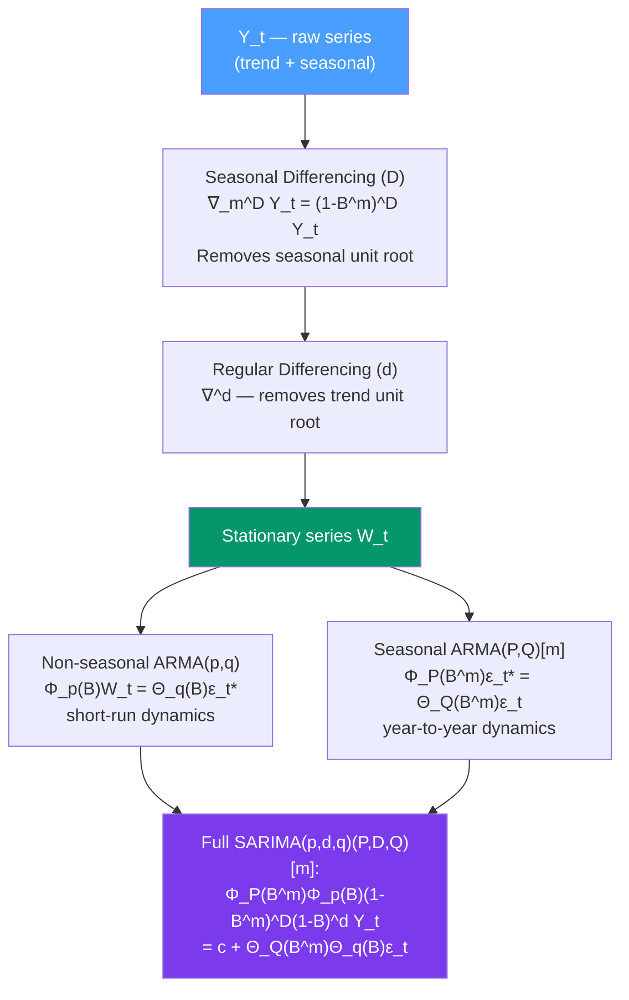

# 📅 SARIMA — Seasonal ARIMA

> [!abstract] TL;DR
> **SARIMA(p,d,q)(P,D,Q)[m]** extends ARIMA to handle seasonality of period $m$ by adding seasonal AR ($P$) and MA ($Q$) components and seasonal differencing ($D$). The full model: $\Phi_P(B^m)\Phi_p(B)(1-B^m)^D(1-B)^d Y_t = c + \Theta_Q(B^m)\Theta_q(B)\epsilon_t$. The famous **airline model** ARIMA(0,1,1)(0,1,1)[12] — with just 2 parameters — fits monthly airline passenger data and many other seasonal economic series.

## Intuition — analogy FIRST

ARIMA handles trend non-stationarity via differencing. But many series have *two* non-stationarities: a trend and a seasonal cycle. Monthly ice cream sales trend upward AND peak every July.

SARIMA handles both: the non-seasonal part $(p,d,q)$ models the "regular" dynamics between consecutive observations; the seasonal part $(P,D,Q)[m]$ models the dynamics between corresponding seasons in different years (i.e., this July vs last July, this August vs last August).

Think of SARIMA as two ARIMA models operating at different time scales — one at the "month-to-month" scale, one at the "year-to-year" scale — and their effects multiply together.

---

## How It Works



---

## Key Concepts / Details

### SARIMA Notation

$$\text{ARIMA}(p,d,q)(P,D,Q)[m]$$

| Component | Symbol | Meaning |
|-----------|--------|---------|
| Non-seasonal AR | $p$ | Lags in AR polynomial $\Phi_p(B)$ |
| Non-seasonal differencing | $d$ | Regular differences $(1-B)^d$ |
| Non-seasonal MA | $q$ | Lags in MA polynomial $\Theta_q(B)$ |
| Seasonal AR | $P$ | Seasonal AR polynomial $\Phi_P(B^m)$ |
| Seasonal differencing | $D$ | Seasonal differences $(1-B^m)^D$ |
| Seasonal MA | $Q$ | Seasonal MA polynomial $\Theta_Q(B^m)$ |
| Period | $m$ | Length of seasonal cycle |

**Full model equation:**
$$\underbrace{\Phi_P(B^m)}_{\text{seasonal AR}} \underbrace{\Phi_p(B)}_{\text{non-seasonal AR}} \underbrace{(1-B^m)^D}_{\text{seasonal diff}} \underbrace{(1-B)^d}_{\text{regular diff}} Y_t = c + \underbrace{\Theta_Q(B^m)}_{\text{seasonal MA}} \underbrace{\Theta_q(B)}_{\text{non-seasonal MA}} \epsilon_t$$

### The Airline Model: ARIMA(0,1,1)(0,1,1)[12]

The most famous SARIMA model. Applied to $\log(\text{airline passengers})$:
$$(1-B)(1-B^{12})Y_t = (1+\theta B)(1+\Theta B^{12})\epsilon_t$$

Expanding the differencing:
$$Y_t - Y_{t-1} - Y_{t-12} + Y_{t-13} = \epsilon_t + \theta\epsilon_{t-1} + \Theta\epsilon_{t-12} + \theta\Theta\epsilon_{t-13}$$

Just **2 free parameters** ($\theta$ and $\Theta$) but captures both the non-seasonal MA(1) dynamics and the seasonal MA(1) dynamics. This model (Box & Jenkins 1976) has been shown to work well for many monthly economic series.

Typical fitted values: $\hat{\theta} \approx -0.4$, $\hat{\Theta} \approx -0.6$.

### Identifying Seasonal Order from ACF/PACF

After seasonal differencing, inspect the ACF at seasonal lags ($m, 2m, 3m$):

| Pattern at seasonal lags | Suggestion |
|--------------------------|------------|
| ACF spikes at $m, 2m, \ldots$ cut off after lag $Qm$ | Seasonal MA($Q$) |
| PACF spikes at $m, 2m, \ldots$ cut off after lag $Pm$ | Seasonal AR($P$) |
| Both ACF and PACF spike at $m$ only | ARIMA(0,1,1)(0,1,1)[m] (airline) |
| ACF decays slowly at seasonal lags | Seasonal unit root → increase $D$ |

### Seasonal Differencing Decision

**Test for seasonal unit root**: Canova-Hansen test (null: stable seasonality). If null is rejected, use $D=1$.

**Practical guidance**:
- For annual seasonality in monthly data: typically $D=1$
- For quarterly data with annual seasonality: typically $D=1$ with $m=4$
- $D=2$: very rarely needed; avoid

After seasonal differencing $(1-B^{12})$, the series may still need regular differencing $(1-B)$ if the de-seasonalised series has a unit root.

### Python: SARIMA

```python
import pandas as pd
import numpy as np
from statsmodels.tsa.statespace.sarimax import SARIMAX
from statsmodels.graphics.tsaplots import plot_acf, plot_pacf
from statsmodels.stats.diagnostic import acorr_ljungbox
import statsmodels.api as sm
import matplotlib.pyplot as plt
import warnings
warnings.filterwarnings('ignore')

# Load airline passengers
data = sm.datasets.get_rdataset("AirPassengers", "datasets").data
y_raw = pd.Series(data["value"].values,
                  index=pd.date_range("1949-01", periods=144, freq="MS"))
y = np.log(y_raw)

# Split train/test
train = y[:"1959-12"]  # 11 years training
test  = y["1960-01":]  # 1 year test

# Step 1: Inspect ACF/PACF after both differencings
diff_log = y.diff(1).diff(12).dropna()
fig, axes = plt.subplots(1, 2, figsize=(12, 4))
plot_acf(diff_log, lags=36, ax=axes[0], title="ACF of Δ¹Δ₁₂ log(passengers)")
plot_pacf(diff_log, lags=36, ax=axes[1], title="PACF of Δ¹Δ₁₂ log(passengers)")
plt.tight_layout()
plt.show()
# Spikes at lag 1 and lag 12 → suggest MA(1) and seasonal MA(1)
# → Airline model: SARIMA(0,1,1)(0,1,1)[12]

# Step 2: Fit the airline model
airline = SARIMAX(train,
                  order=(0, 1, 1),
                  seasonal_order=(0, 1, 1, 12),
                  trend='n').fit(disp=False)
print(airline.summary())

# Step 3: Diagnostics
resid = airline.resid
lb = acorr_ljungbox(resid, lags=[12, 24], return_df=True)
print(f"\nLjung-Box Q(12): p={lb['lb_pvalue'].iloc[0]:.4f}")
print(f"Ljung-Box Q(24): p={lb['lb_pvalue'].iloc[1]:.4f}")

# Step 4: Forecast
fc = airline.get_forecast(steps=12)
fc_log = fc.predicted_mean
fc_ci  = fc.conf_int(alpha=0.05)
fc_level = np.exp(fc_log)

# Compare to test
from sklearn.metrics import mean_absolute_percentage_error
mape = mean_absolute_percentage_error(np.exp(test), fc_level)
print(f"\nAirline model MAPE: {mape:.4f}")  # Typically ~3-5% on airline data

# Step 5: Auto SARIMA with pmdarima
try:
    import pmdarima as pm
    auto = pm.auto_arima(train, start_p=0, max_p=3, start_q=0, max_q=3,
                          d=1, D=1, seasonal=True, m=12,
                          information_criterion='aic', stepwise=True,
                          trace=True, error_action='ignore')
    print(f"\nauto_arima result: {auto.order} x {auto.seasonal_order}")
except ImportError:
    print("\nInstall pmdarima: pip install pmdarima")

# Plot forecast
fig, ax = plt.subplots(figsize=(12, 5))
np.exp(train).plot(ax=ax, label="Training data")
np.exp(test).plot(ax=ax, label="Actual test")
fc_level.plot(ax=ax, label="SARIMA forecast", color='red')
ax.fill_between(fc_level.index,
                np.exp(fc_ci.iloc[:, 0]),
                np.exp(fc_ci.iloc[:, 1]),
                alpha=0.3, color='red', label="95% CI")
ax.set_title("Airline Passengers — SARIMA(0,1,1)(0,1,1)[12] Forecast")
ax.legend()
plt.show()
```

### Common SARIMA Model Structures

| Model | Application |
|-------|-------------|
| ARIMA(0,1,1)(0,1,1)[12] | Monthly data with trend + seasonality (airline model) |
| ARIMA(1,1,0)(1,1,0)[12] | Monthly series with AR structure at both time scales |
| ARIMA(1,1,1)(1,1,1)[12] | More complex monthly series |
| ARIMA(0,1,1)(0,1,1)[4] | Quarterly data with annual seasonality |
| ARIMA(2,1,0)(0,1,1)[52] | Weekly data with annual seasonality |

### Relationship to SARIMAX

**SARIMAX** adds **exogenous regressors** ($\mathbf{X}$):
$$\Phi_P(B^m)\Phi_p(B)(1-B^m)^D(1-B)^d Y_t = c + \beta \mathbf{X}_t + \Theta_Q(B^m)\Theta_q(B)\epsilon_t$$

Use SARIMAX when you have external predictors (holiday indicators, temperature, promotional events) that explain part of the variation.

---

## Real-World Notes

- **Monthly airline passengers** (Box-Jenkins 1976): the dataset that made SARIMA famous. ARIMA(0,1,1)(0,1,1)[12] with $\hat{\theta}\approx-0.40$, $\hat{\Theta}\approx-0.56$.
- **Monthly retail sales**: SARIMA(1,1,1)(0,1,1)[12] often fits well; seasonal MA captures the year-over-year persistence.
- **Quarterly GDP**: SARIMA(1,0,0)(1,0,0)[4] after log-differencing; seasonal AR captures the seasonal growth pattern.
- **Weekly utility demand**: SARIMA with $m=52$; common in energy forecasting. For sub-weekly patterns, use TBATS or LSTM.
- **Government statistical agencies**: Statistics Canada, BLS, and Eurostat use X-13ARIMA-SEATS (SARIMA-based) for official seasonal adjustment of all national statistics.

---

## Common Pitfalls

1. **Applying seasonal differencing when seasonality is deterministic**: seasonal differencing removes stochastic seasonal unit roots — if the seasonal pattern is stable (deterministic), seasonal dummies are more appropriate.
2. **Overdifferencing (D=2 when D=1 suffices)**: creates near-unit roots in the MA polynomial, numerical instability, and overly wide prediction intervals.
3. **Selecting SARIMA order with too small a grid**: auto_arima with default settings may miss the best model; always allow up to $P=2$, $Q=2$ in the search.
4. **Not using the log transform for multiplicative data**: SARIMA is an additive model — apply log first for airline-type (multiplicative) series.
5. **Ignoring long-range seasonal structure**: for hourly data, SARIMA with $m=8760$ (annual) is infeasible. Use LSTM ([[LSTM_for_Time_Series]]) or Prophet ([[Prophet_Forecasting]]) for high-frequency multiple seasonality.

---

## Related Concepts

- [[_MOC_ARIMA|↑ Section MOC]]
- [[ARIMA_and_Differencing]] — the non-seasonal parent model
- [[Trend_and_Seasonality]] — identifying seasonal unit roots and the need for $D>0$
- [[Autocorrelation_and_ACF_PACF]] — reading seasonal ACF patterns at multiples of $m$
- [[Prophet_Forecasting]] — an alternative model that handles multiple seasonalities more flexibly

---

## Review Questions

1. Write out the full equation for SARIMA(1,1,1)(0,1,1)[12] in terms of $Y_t$, $B$, and $\epsilon_t$. Identify which terms handle (a) the regular trend, (b) the seasonal trend, (c) the short-run AR dynamics, and (d) the MA dynamics.
2. After taking first and seasonal differences of monthly data, the ACF shows a single negative spike at lag 12 and a single negative spike at lag 1. What SARIMA order does this suggest, and why?
3. Explain why the airline model has only 2 parameters yet captures the full structure of the airline passenger series. What does each parameter control?

---

## Sources

- Box & Jenkins (1976), *Time Series Analysis: Forecasting and Control* (1st ed.) — the original airline model
- Box, Jenkins, Reinsel & Ljung, *Time Series Analysis* (5th ed.), Ch. 9
- Hyndman & Athanasopoulos, *Forecasting: Principles and Practice* (3rd ed.), Ch. 9

#time-series #ARIMA #SARIMA #seasonal #airline-model
