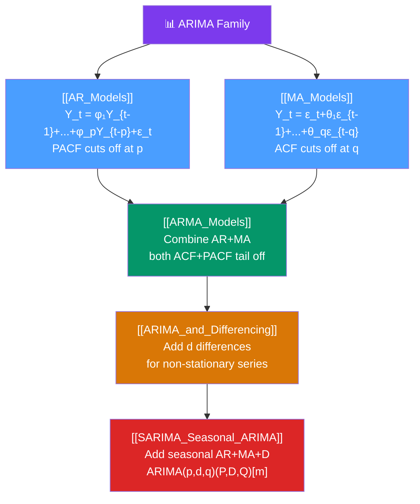

# 🗺️ ARIMA Models — Map of Content

> [!abstract] What This Section Covers
> The **Box-Jenkins ARIMA family** is the classical workhorse of univariate time series forecasting. This section builds from the ground up: **AR models** (the series regresses on its own past), **MA models** (the series is a linear function of past innovations), **ARMA** (combining both), **ARIMA** (adding differencing for non-stationary series), and **SARIMA** (extending to seasonal patterns). Every note covers the mathematical specification, stationarity/invertibility conditions, ACF/PACF identification signatures, maximum likelihood estimation, model diagnostics, and Python implementation with `statsmodels` and `pmdarima`.

## Concept Map

## Learning Path

1. [[AR_Models]] — Autoregressive processes: stationarity condition, ACF/PACF patterns, Yule-Walker equations.
2. [[MA_Models]] — Moving average processes: invertibility, ACF/PACF patterns, duality with AR.
3. [[ARMA_Models]] — Combined ARMA: identification when both components are present, information criteria.
4. [[ARIMA_and_Differencing]] — Adding the $d$ integration order; the Box-Jenkins workflow; ADF testing.
5. [[SARIMA_Seasonal_ARIMA]] — Seasonal extension: the $(p,d,q)(P,D,Q)[m]$ notation, seasonal ACF/PACF, airline model.

## All Notes at a Glance

| Note | Difficulty | What You'll Learn |
|------|------------|-------------------|
| [[AR_Models]] | Intermediate | AR(p) specification, characteristic roots, stationarity, ACF/PACF, Yule-Walker, OLS/MLE estimation |
| [[MA_Models]] | Intermediate | MA(q) specification, invertibility, ACF/PACF, duality with infinite AR, innovations algorithm |
| [[ARMA_Models]] | Intermediate | ARMA(p,q) identification, AIC/BIC model selection, parameter redundancy (common roots) |
| [[ARIMA_and_Differencing]] | Intermediate | Unit root → first difference, Box-Jenkins workflow, order selection, forecast uncertainty |
| [[SARIMA_Seasonal_ARIMA]] | Intermediate → Advanced | $(p,d,q)(P,D,Q)[m]$ notation, airline model, auto.arima, seasonal ACF patterns |

## Key Questions This Section Answers

- What makes an AR(p) process stationary? What condition on the roots of the characteristic polynomial is required?
- How do you read ACF and PACF plots to determine the order of AR and MA components?
- What is the difference between an ARIMA model and a regression model for time series?
- How do you implement the Box-Jenkins model selection workflow in Python?
- How do the seasonal AR and MA terms in SARIMA differ from the non-seasonal terms?
- What is the "airline model" (ARIMA(0,1,1)(0,1,1)[12]) and why is it so widely used?

## Related Sections

- [[_MOC_TimeSeries_Master|↑ Master MOC]]
- [[_MOC_TS_Fundamentals|← Fundamentals]]
- [[_MOC_Classical_Decomposition|← Classical Decomposition]]
- [[_MOC_Volatility_Models|→ Volatility Models]]
- [[_MOC_Multivariate_TS|→ Multivariate Time Series]]

#MOC #time-series #ARIMA #Box-Jenkins
