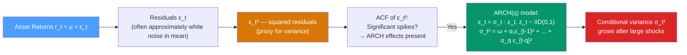

# 📉 ARCH Models

> [!abstract] TL;DR
> **ARCH(q)** (Autoregressive Conditional Heteroskedasticity) models time-varying variance: $\sigma_t^2 = \omega + \alpha_1\epsilon_{t-1}^2 + \cdots + \alpha_q\epsilon_{t-q}^2$. A large shock at $t-1$ increases the conditional variance at $t$ — capturing **volatility clustering**. Proposed by Robert Engle (1982), who won the Nobel Prize in Economics in 2003 for this work. The **ARCH-LM test** detects whether ARCH effects are present in a series' residuals.

## Intuition — analogy FIRST

Imagine ocean waves. On a calm day, waves are small and regular. But when a storm hits, waves become large and choppy — and large waves tend to follow large waves, small waves follow small waves. Tomorrow's wave height depends on today's wave height. This is **volatility clustering**.

Financial markets behave the same way. After a market crash (a large return shock), the next few days are also volatile — the market's "storm" continues. After calm months, volatility stays calm. The ARCH model formalises this: the variance of tomorrow's return shock depends on the magnitude of recent return shocks. It doesn't try to predict the *direction* of tomorrow's return — only how *large* it might be.

---

## How It Works



---

## Key Concepts / Details

### The ARCH(q) Model

Assume a return series: $r_t = \mu + \epsilon_t$

The innovation $\epsilon_t$ is modelled as:
$$\epsilon_t = \sigma_t z_t, \quad z_t \sim IID(0,1)$$

The **conditional variance**:
$$\sigma_t^2 = \omega + \alpha_1 \epsilon_{t-1}^2 + \alpha_2 \epsilon_{t-2}^2 + \cdots + \alpha_q \epsilon_{t-q}^2$$

**Parameter constraints for non-negative variance and stationarity:**
- $\omega > 0$
- $\alpha_i \geq 0$ for all $i = 1, \ldots, q$
- $\sum_{i=1}^{q} \alpha_i < 1$ (stationarity: $\alpha_1 + \cdots + \alpha_q < 1$)

**Unconditional variance:**
$$\text{Var}(\epsilon_t) = \sigma^2 = \frac{\omega}{1 - \sum_{i=1}^{q}\alpha_i}$$

### Why Squared Returns?

$\epsilon_t^2$ is a proxy for variance at time $t$ (since $\mathbb{E}[\epsilon_t^2] = \sigma_t^2$). An ACF plot of $\epsilon_t^2$ (or $r_t^2$ after demeaning) reveals whether there is autocorrelation in variance — the signature of ARCH effects.

Key insight: **$r_t$ may be uncorrelated (ACF ≈ 0) but $r_t^2$ is highly autocorrelated** — volatility has memory even when returns don't.

### The ARCH-LM Test

Engle's **LM test** for ARCH effects:

1. Fit a mean model (e.g., ARMA) and extract residuals $\hat{\epsilon}_t$
2. Regress $\hat{\epsilon}_t^2$ on $\hat{\epsilon}_{t-1}^2, \ldots, \hat{\epsilon}_{t-q}^2$:
   $$\hat{\epsilon}_t^2 = \hat{\gamma}_0 + \hat{\gamma}_1 \hat{\epsilon}_{t-1}^2 + \cdots + \hat{\gamma}_q \hat{\epsilon}_{t-q}^2 + \nu_t$$
3. Compute $LM = T \cdot R^2$ where $R^2$ is from the auxiliary regression
4. Under $H_0$ (no ARCH): $LM \sim \chi^2(q)$
5. Reject $H_0$ if $LM > \chi^2_q(\alpha)$ — ARCH effects present

**$H_0$**: no ARCH effects ($\gamma_1 = \cdots = \gamma_q = 0$)
**$H_1$**: ARCH effects of order up to $q$

### Properties of ARCH Residuals

An ARCH(q) process produces residuals with:
- **Zero autocorrelation** in $\epsilon_t$ (mean is zero)
- **Positive autocorrelation** in $\epsilon_t^2$ (variance clustering)
- **Fat tails** (leptokurtosis): $\text{Kurt}(\epsilon_t) > 3$ even if $z_t \sim N(0,1)$
- **Volatility clustering**: large values of $|\epsilon_t|$ cluster together

### Python: ARCH Models

```python
import numpy as np
import pandas as pd
import matplotlib.pyplot as plt
from arch import arch_model
from statsmodels.stats.diagnostic import het_arch
from statsmodels.graphics.tsaplots import plot_acf
import yfinance as yf
import warnings
warnings.filterwarnings('ignore')

# Download S&P 500 data
# spy = yf.download("SPY", start="2000-01-01", end="2023-12-31")
# returns = spy["Adj Close"].pct_change().dropna() * 100  # percent returns

# Simulate ARCH(1) returns for demonstration
np.random.seed(42)
T = 1000
omega, alpha1 = 0.1, 0.4
eps = np.zeros(T)
sigma2 = np.zeros(T)
sigma2[0] = omega / (1 - alpha1)
for t in range(1, T):
    sigma2[t] = omega + alpha1 * eps[t-1]**2
    eps[t] = np.sqrt(sigma2[t]) * np.random.standard_normal()

returns = pd.Series(eps, name="Returns")

# Visualise: returns and squared returns
fig, axes = plt.subplots(3, 1, figsize=(12, 9))
axes[0].plot(returns)
axes[0].set_title("ARCH(1) Simulated Returns")
axes[1].plot(returns**2)
axes[1].set_title("Squared Returns (variance proxy)")
plot_acf(returns**2, lags=20, ax=axes[2], title="ACF of Squared Returns")
plt.tight_layout()
plt.show()

# ARCH-LM test
lm_stat, lm_pval, _, _ = het_arch(returns, nlags=5)
print(f"ARCH-LM test: LM={lm_stat:.2f}, p-value={lm_pval:.4f}")
# p < 0.05 → reject H0 → ARCH effects present

# Fit ARCH(1) model using arch package
arch1 = arch_model(returns, vol='ARCH', p=1, mean='Constant', dist='Normal')
arch1_result = arch1.fit(disp='off')
print(arch1_result.summary())

# Conditional variance
cond_var = arch1_result.conditional_volatility**2
fig, ax = plt.subplots(figsize=(12, 4))
ax.plot(cond_var, label="Estimated σ_t²")
ax.plot(sigma2, label="True σ_t²", linestyle="--", alpha=0.7)
ax.set_title("ARCH(1): True vs Estimated Conditional Variance")
ax.legend()
plt.show()

# Residual diagnostics
std_resid = arch1_result.std_resid
_, lm_pval_resid, _, _ = het_arch(std_resid, nlags=5)
print(f"\nARCH-LM on standardised residuals: p={lm_pval_resid:.4f}")
# Should be > 0.05 if ARCH(1) is adequate
```

### Limitations of ARCH

| Limitation | Description | Solution |
|-----------|-------------|---------|
| Many parameters for long lag | ARCH(q) needs large $q$ to capture persistence | GARCH(1,1) captures the same with 3 parameters |
| Symmetric response | Positive and negative shocks have equal effect on variance | EGARCH or GJR-GARCH |
| Normal distribution | Financial returns have fat tails beyond ARCH kurtosis | Student-t or GED error distribution |
| Strict non-negativity | $\alpha_i \geq 0$ constraint is tight; estimation can hit boundary | EGARCH uses log-variance (no constraint) |

---

## Real-World Notes

- **S&P 500 daily returns (2000-2023)**: clear volatility clustering — the 2008 crisis, COVID crash of 2020, and 2022 rate-shock show multi-week periods of extreme volatility. ARCH-LM test on daily returns strongly rejects the null.
- **Foreign exchange rates**: EUR/USD shows ARCH effects in daily returns; ARCH(1) often captures most of the effect.
- **Nobel Prize 2003**: Robert Engle won the Nobel Prize in Economic Sciences for ARCH. Clive Granger won the same year for cointegration — a remarkable duo.
- **VIX (volatility index)**: the CBOE VIX is not a GARCH-based measure but conceptually related — it implies future volatility from option prices. GARCH forecasts compete with VIX for short-horizon variance prediction.

---

## Common Pitfalls

1. **Testing for ARCH on the raw returns instead of residuals**: always fit a mean model first (e.g., constant or AR), then test ARCH on the *residuals*.
2. **Using ARCH(q) with large $q$ instead of GARCH**: ARCH(5) has 5 parameters; GARCH(1,1) achieves the same flexibility with 3. Always prefer GARCH for persistence.
3. **Ignoring fat tails**: assuming Gaussian $z_t$ when returns have fat tails produces poor VaR estimates. Use Student-t distribution for the innovation distribution.
4. **Misinterpreting the ARCH-LM test rejection**: rejection means ARCH effects are present in the residuals — it doesn't prescribe the ARCH order. Use ACF of squared residuals to select $q$.
5. **Confusing conditional and unconditional variance**: $\sigma_t^2$ is the time-varying conditional variance; the unconditional variance $\sigma^2 = \omega/(1-\sum\alpha_i)$ is constant for stationary ARCH.

---

## Related Concepts

- [[_MOC_Volatility_Models|↑ Section MOC]]
- [[GARCH_Models]] — the practical replacement for high-order ARCH; adds autoregressive variance
- [[White_Noise_and_Random_Walk]] — ARCH residuals are uncorrelated (white noise in mean) but have structured variance
- [[ARIMA_and_Differencing]] — the mean model whose residuals are tested for ARCH effects

---

## Review Questions

1. Explain why financial returns can be approximately white noise in the mean (zero ACF) but strongly autocorrelated in variance (positive ACF of squared returns). How does ARCH capture this duality?
2. Derive the unconditional variance of an ARCH(1) process. Under what condition is the process weakly stationary?
3. You run the ARCH-LM test on the residuals of an AR(1) model fitted to stock returns. The test gives $p = 0.003$. What do you conclude, and what model would you fit next?

---

## Sources

- Engle (1982), *Autoregressive Conditional Heteroskedasticity with Estimates of the Variance of United Kingdom Inflation*, Econometrica
- Bollerslev, Chou & Kroner (1992), *ARCH Modelling in Finance: A Review of the Theory and Empirical Evidence*, Journal of Econometrics
- Tsay, *Analysis of Financial Time Series* (3rd ed.), Ch. 3

#time-series #volatility #ARCH #conditional-heteroskedasticity #finance
