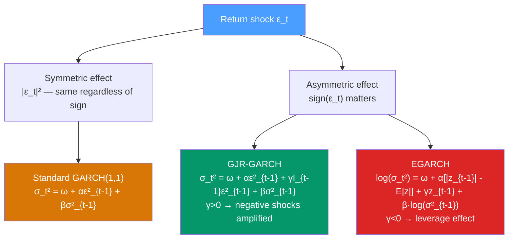

# ⚡ EGARCH and GJR-GARCH

> [!abstract] TL;DR
> Standard GARCH responds **symmetrically** to positive and negative shocks — a 5% gain and a 5% loss both increase tomorrow's variance equally. In reality, **bad news increases volatility more than good news** — the **leverage effect**. **EGARCH** (Nelson 1991) models log-variance so shocks can have asymmetric effects and no non-negativity constraints are needed. **GJR-GARCH** (Glosten-Jagannathan-Runkle 1993) adds a simple indicator term $I_{t-1}\epsilon_{t-1}^2$ to standard GARCH to capture the leverage effect.

## Intuition — analogy FIRST

Imagine a company's stock. When good news arrives (earnings beat), the price rises modestly and uncertainty settles. When bad news arrives (accounting fraud exposed), the price drops sharply *and* uncertainty explodes — investors don't know how bad it is, short-sellers pile in, margin calls cascade.

This asymmetry is the **leverage effect**: negative shocks (price declines) increase financial leverage (debt/equity ratio rises as equity falls), which mechanically increases volatility. It was first documented by Fischer Black (1976).

GARCH(1,1) treats $+5\%$ and $-5\%$ return shocks identically — both contribute $\alpha \times (0.05)^2 = \alpha \times 0.0025$ to tomorrow's variance. EGARCH and GJR-GARCH allow the $-5\%$ shock to contribute *more* than the $+5\%$ shock, capturing the empirical asymmetry.

---

## How It Works



---

## Key Concepts / Details

### The Leverage Effect

Empirically documented for most equity indices and individual stocks:
- **Negative** return shocks → large increase in subsequent volatility
- **Positive** return shocks → smaller increase in subsequent volatility
- News impact curve is asymmetric around zero

Test for asymmetry: regress $\hat{\sigma}_{t+1}^2$ on $\epsilon_t^2$ and $\epsilon_t^2 \cdot \mathbf{1}(\epsilon_t < 0)$. If the interaction term is significant and positive → leverage effect.

### GJR-GARCH (Threshold GARCH)

$$\sigma_t^2 = \omega + \alpha \epsilon_{t-1}^2 + \gamma I_{t-1} \epsilon_{t-1}^2 + \beta \sigma_{t-1}^2$$

where:
$$I_{t-1} = \begin{cases} 1 & \text{if } \epsilon_{t-1} < 0 \\ 0 & \text{if } \epsilon_{t-1} \geq 0 \end{cases}$$

**Interpretation:**
- **Positive shock** ($\epsilon_{t-1} > 0$): contributes $\alpha\epsilon_{t-1}^2$ to next variance
- **Negative shock** ($\epsilon_{t-1} < 0$): contributes $(\alpha + \gamma)\epsilon_{t-1}^2$ to next variance
- Leverage effect present if $\gamma > 0$ (negative shocks contribute more)

**Stationarity condition**: $\alpha + \gamma/2 + \beta < 1$

**News impact curve** for GJR-GARCH:
$$NIC(\epsilon) = \begin{cases} \omega + \beta\bar{\sigma}^2 + \alpha\epsilon^2 & \epsilon \geq 0 \\ \omega + \beta\bar{\sigma}^2 + (\alpha+\gamma)\epsilon^2 & \epsilon < 0 \end{cases}$$

This is a piecewise quadratic — symmetric for pure GARCH ($\gamma=0$), asymmetric for GJR.

### EGARCH (Exponential GARCH, Nelson 1991)

$$\log(\sigma_t^2) = \omega + \alpha \left[\frac{|\epsilon_{t-1}|}{\sigma_{t-1}} - \sqrt{2/\pi}\right] + \gamma \frac{\epsilon_{t-1}}{\sigma_{t-1}} + \beta \log(\sigma_{t-1}^2)$$

or equivalently with standardised innovations $z_{t-1} = \epsilon_{t-1}/\sigma_{t-1}$:
$$\log(\sigma_t^2) = \omega + \alpha[|z_{t-1}| - \mathbb{E}|z|] + \gamma z_{t-1} + \beta \log(\sigma_{t-1}^2)$$

**Advantages over GARCH:**
1. **No non-negativity constraints needed**: models log-variance; $\sigma_t^2 = \exp(\cdot) > 0$ always
2. **Natural asymmetry**: the $\gamma z_{t-1}$ term captures leverage ($\gamma < 0$ → negative shock increases log-variance)
3. **Persistence**: $|\beta| < 1$ for stationarity

**Interpreting $\gamma$:**
- $\gamma < 0$: leverage effect (negative shock → higher variance than positive shock of same magnitude)
- $\gamma = 0$: no leverage (collapses to ARCH-type symmetric effect)
- $\gamma > 0$: reverse leverage (positive shocks increase variance more — rare in equities, possible in commodities)

**News impact curve for EGARCH:**
$$\log\sigma_t^2 = \begin{cases} \omega + \beta\log\bar{\sigma}^2 + (\alpha+\gamma)z_{t-1} + \text{const} & z_{t-1} > 0 \\ \omega + \beta\log\bar{\sigma}^2 - (\alpha-\gamma)z_{t-1} + \text{const} & z_{t-1} < 0 \end{cases}$$

The slopes differ by $2\gamma$.

### Python: EGARCH and GJR-GARCH

```python
import numpy as np
import pandas as pd
from arch import arch_model
import matplotlib.pyplot as plt
import warnings
warnings.filterwarnings('ignore')

# Use real-world style simulation with leverage effect
np.random.seed(42)
T = 2000
# Simulate GJR-GARCH(1,1) with leverage
omega, alpha, gamma, beta = 0.05, 0.05, 0.10, 0.88
sigma2 = np.zeros(T)
eps    = np.zeros(T)
sigma2[0] = omega / (1 - alpha - gamma/2 - beta)
for t in range(1, T):
    indicator = 1.0 if eps[t-1] < 0 else 0.0
    sigma2[t] = omega + alpha*eps[t-1]**2 + gamma*indicator*eps[t-1]**2 + beta*sigma2[t-1]
    eps[t] = np.sqrt(sigma2[t]) * np.random.standard_normal()

returns = pd.Series(eps * 100)

# Fit GARCH(1,1) — no leverage
garch_res = arch_model(returns, vol='Garch', p=1, q=1,
                        mean='Constant', dist='StudentsT').fit(disp='off')

# Fit GJR-GARCH(1,1) — with leverage
gjr_res = arch_model(returns, vol='GARCH', p=1, o=1, q=1,
                      mean='Constant', dist='StudentsT').fit(disp='off')

# Fit EGARCH(1,1) — log-variance
egarch_res = arch_model(returns, vol='EGARCH', p=1, q=1,
                         mean='Constant', dist='StudentsT').fit(disp='off')

# Compare models by AIC
print(f"GARCH(1,1)     AIC: {garch_res.aic:.2f}")
print(f"GJR-GARCH(1,1) AIC: {gjr_res.aic:.2f}")
print(f"EGARCH(1,1)    AIC: {egarch_res.aic:.2f}")

# GJR-GARCH parameters
print(f"\nGJR-GARCH params:")
print(gjr_res.params)
# gamma > 0 indicates leverage effect

# EGARCH parameters
print(f"\nEGARCH params:")
print(egarch_res.params)
# gamma < 0 (arch[1] in EGARCH notation) → leverage

# News Impact Curve comparison
sigma_bar = np.sqrt(garch_res.params['omega'] / (1 - garch_res.params['alpha[1]'] - garch_res.params['beta[1]']))
eps_range = np.linspace(-4 * sigma_bar, 4 * sigma_bar, 200)

# GARCH NIC
alpha_g = garch_res.params['alpha[1]']
beta_g  = garch_res.params['beta[1]']
omega_g = garch_res.params['omega']
nic_garch = omega_g + beta_g * sigma_bar**2 + alpha_g * eps_range**2

# GJR NIC
alpha_gjr = gjr_res.params['alpha[1]']
gamma_gjr = gjr_res.params['gamma[1]']
beta_gjr  = gjr_res.params['beta[1]']
omega_gjr = gjr_res.params['omega']
nic_gjr = omega_gjr + beta_gjr * sigma_bar**2 + alpha_gjr * eps_range**2 + gamma_gjr * np.where(eps_range < 0, eps_range**2, 0)

fig, ax = plt.subplots(figsize=(10, 5))
ax.plot(eps_range, np.sqrt(nic_garch), label='GARCH (symmetric)', color='blue')
ax.plot(eps_range, np.sqrt(nic_gjr), label='GJR-GARCH (asymmetric)', color='red')
ax.axvline(0, linestyle='--', color='gray', alpha=0.5)
ax.set_xlabel("Innovation ε_{t-1}")
ax.set_ylabel("Conditional std dev σ_t")
ax.set_title("News Impact Curve: GARCH vs GJR-GARCH")
ax.legend()
plt.show()
```

### Model Comparison

| Feature | GARCH(1,1) | GJR-GARCH(1,1) | EGARCH(1,1) |
|---------|-----------|---------------|-------------|
| Leverage effect | No | Yes (indicator) | Yes (sign term) |
| Non-negativity constraints | Yes ($\omega,\alpha,\beta \geq 0$) | Yes | No (log-variance) |
| Parameters | 3 | 4 | 4 |
| Interpretation | Simple | Intuitive | Less direct |
| Stationarity condition | $\alpha+\beta<1$ | $\alpha+\gamma/2+\beta<1$ | $|\beta|<1$ |
| News impact curve | Symmetric quadratic | Asymmetric quadratic | Asymmetric exponential |

---

## Real-World Notes

- **Equity indices (S&P 500, Nikkei)**: strong leverage effect — typical $\hat{\gamma} \approx 0.08$–$0.15$ in GJR-GARCH. Bad days increase volatility significantly more than equivalent good days.
- **Individual stocks**: leverage effect varies by sector; more pronounced for highly leveraged companies (financials, utilities).
- **Commodities**: oil shows a *reverse* leverage effect — supply shocks (positive price spikes) increase uncertainty more than demand drops. EGARCH with $\gamma > 0$ fits oil.
- **Cryptocurrencies**: mixed evidence; Bitcoin shows moderate leverage effect but the asymmetry is weaker than equity indices.
- **Risk management**: VaR models using GJR-GARCH better capture the larger downside risks, important for Basel III/IV capital adequacy.

---

## Common Pitfalls

1. **Using symmetric GARCH when the leverage test is significant**: always test for asymmetry (sign bias test) before settling on GARCH(1,1).
2. **Interpreting EGARCH $\beta$ as persistence**: EGARCH stationarity requires $|\beta|<1$, but $\beta$ close to 1 is also high persistence — same qualitative interpretation as GARCH $\alpha+\beta$.
3. **Mixing sign conventions for EGARCH**: different packages use different sign conventions for the $\gamma$ (leverage) parameter. In `arch`, check whether $\gamma < 0$ or $\gamma > 0$ means leverage in your version.
4. **Forecasting conditional variance from EGARCH**: EGARCH forecasts $\mathbb{E}[\log\sigma_{t+h}^2]$, not $\mathbb{E}[\sigma_{t+h}^2]$ — the Jensen's inequality correction matters: $\mathbb{E}[\sigma_{t+h}^2] > \exp(\mathbb{E}[\log\sigma_{t+h}^2])$.
5. **Selecting between GJR and EGARCH by AIC alone**: they capture leverage differently. Inspect news impact curves and parameter significance jointly with AIC.

---

## Related Concepts

- [[_MOC_Volatility_Models|↑ Section MOC]]
- [[GARCH_Models]] — the symmetric parent; EGARCH/GJR extend it with asymmetry
- [[ARCH_Models]] — the original model; no autoregressive variance term
- [[Realized_Volatility]] — a non-parametric alternative that also reveals asymmetric volatility patterns
- [[Stochastic_Volatility]] — an alternative framework where volatility is a latent state

---

## Review Questions

1. Explain the leverage effect in financial markets. What is the economic mechanism, and how does GJR-GARCH capture it mathematically?
2. Compare the news impact curves of GARCH(1,1), GJR-GARCH(1,1), and EGARCH(1,1). How would you use these curves to decide which model is appropriate for a given asset?
3. You fit EGARCH(1,1) to daily stock returns and find $\hat{\gamma} = -0.15$ with a t-statistic of $-4.8$. Interpret this finding in plain language.

---

## Sources

- Nelson (1991), *Conditional Heteroskedasticity in Asset Returns: A New Approach*, Econometrica
- Glosten, Jagannathan & Runkle (1993), *On the Relation Between the Expected Value and the Volatility of the Nominal Excess Return on Stocks*, Journal of Finance
- Engle & Ng (1993), *Measuring and Testing the Impact of News on Volatility*, Journal of Finance

#time-series #volatility #EGARCH #GJR-GARCH #leverage-effect
