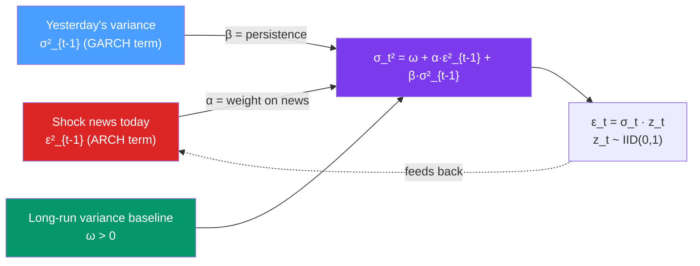

# 📊 GARCH Models

> [!abstract] TL;DR
> **GARCH(p,q)** (Generalized ARCH) adds autoregressive variance terms to ARCH: $\sigma_t^2 = \omega + \sum_{i=1}^{q}\alpha_i\epsilon_{t-i}^2 + \sum_{j=1}^{p}\beta_j\sigma_{t-j}^2$. **GARCH(1,1)** with 3 parameters ($\omega, \alpha, \beta$) is the workhorse — it parsimoniously captures long-memory volatility through the autoregressive term. Stationarity requires $\alpha_1 + \beta_1 < 1$. The **persistence** $\alpha+\beta$ near 1 implies slow volatility mean-reversion — a key empirical finding for financial assets.

## Intuition — analogy FIRST

ARCH(q) says today's variance depends on the last $q$ squared shocks. But financial volatility is *persistent* — a crisis doesn't just last a few days; it can persist for weeks or months. An ARCH(20) would need 20 parameters to capture 20-day persistence.

**GARCH(1,1)** solves this elegantly: today's variance depends on yesterday's squared shock $\epsilon_{t-1}^2$ *and* yesterday's variance $\sigma_{t-1}^2$. The variance term $\beta\sigma_{t-1}^2$ acts like a rolling memory — it summarises all of history through a single number. With $\beta \approx 0.9$, today's variance "remembers" 90% of yesterday's, 81% of two days ago, and so on — capturing long persistence with just one parameter.

GARCH(1,1) is to volatility modelling what AR(1) is to mean modelling: the simplest model that captures the core dynamics.

---

## How It Works



---

## Key Concepts / Details

### GARCH(1,1): The Standard Model

$$r_t = \mu + \epsilon_t, \quad \epsilon_t = \sigma_t z_t, \quad z_t \sim IID(0,1)$$

**Variance equation:**
$$\sigma_t^2 = \omega + \alpha \epsilon_{t-1}^2 + \beta \sigma_{t-1}^2$$

**Parameter constraints:**
- $\omega > 0$
- $\alpha \geq 0, \beta \geq 0$
- **Stationarity**: $\alpha + \beta < 1$

**Unconditional variance:**
$$\bar{\sigma}^2 = \frac{\omega}{1 - \alpha - \beta}$$

**Persistence**: $\alpha + \beta$ — the closer to 1, the slower volatility reverts to $\bar{\sigma}^2$.

**Half-life of volatility shock** (time for variance to revert halfway to long-run mean):
$$h_{1/2} = \frac{\log(0.5)}{\log(\alpha + \beta)}$$

For $\alpha + \beta = 0.97$: $h_{1/2} = 22.7$ days — shocks persist about 3 weeks.

### GARCH(1,1) as ARMA Representation

Let $\nu_t = \epsilon_t^2 - \sigma_t^2$ (variance innovation). Then:
$$\epsilon_t^2 = \omega + (\alpha + \beta)\epsilon_{t-1}^2 - \beta\nu_{t-1} + \nu_t$$

This is an **ARMA(1,1)** model for $\epsilon_t^2$:
- AR coefficient: $\alpha + \beta$ (persistence)
- MA coefficient: $-\beta$
- The ARMA connection enables intuition: high $\alpha+\beta$ → slow ACF decay → long memory in squared returns

### General GARCH(p,q)

$$\sigma_t^2 = \omega + \sum_{i=1}^{q}\alpha_i \epsilon_{t-i}^2 + \sum_{j=1}^{p}\beta_j \sigma_{t-j}^2$$

Stationarity: $\sum_i \alpha_i + \sum_j \beta_j < 1$

In practice, GARCH(1,1) is almost always sufficient. GARCH(1,2) or GARCH(2,1) rarely offer material improvement.

### Estimation by MLE

Maximise the Gaussian log-likelihood:
$$\ell(\theta) = -\frac{1}{2}\sum_{t=1}^{T}\left[\log(2\pi\sigma_t^2) + \frac{\epsilon_t^2}{\sigma_t^2}\right]$$

where $\sigma_t^2$ is computed recursively from the parameter vector $\theta = (\mu, \omega, \alpha, \beta)$.

**Quasi-MLE (QMLE)**: even if $z_t$ is not Gaussian (fat tails), maximising the Gaussian likelihood still gives consistent (though not fully efficient) estimates. Robust standard errors (Bollerslev-Wooldridge sandwich) are recommended.

**Student-t GARCH**: for better finite-sample properties with fat-tailed returns, specify $z_t \sim t_\nu$ and estimate the degrees of freedom $\nu$:
$$\ell_t(\theta) = \log\Gamma\left(\frac{\nu+1}{2}\right) - \log\Gamma\left(\frac{\nu}{2}\right) - \frac{1}{2}\log(\pi(\nu-2)\sigma_t^2) - \frac{\nu+1}{2}\log\left(1 + \frac{\epsilon_t^2}{(\nu-2)\sigma_t^2}\right)$$

### GARCH-M (GARCH-in-Mean)

Extends GARCH by including the conditional variance in the mean equation — a risk premium:
$$r_t = \mu + \delta\sigma_t^2 + \epsilon_t$$

If $\hat{\delta} > 0$, higher expected volatility → higher expected return (risk-return tradeoff).

### Python: GARCH Models with `arch` package

```python
import numpy as np
import pandas as pd
from arch import arch_model
import matplotlib.pyplot as plt
import warnings
warnings.filterwarnings('ignore')

# Simulate GARCH(1,1): ω=0.05, α=0.1, β=0.85
np.random.seed(42)
T = 2000
omega, alpha, beta = 0.05, 0.10, 0.85
sigma2 = np.zeros(T)
eps    = np.zeros(T)
sigma2[0] = omega / (1 - alpha - beta)
for t in range(1, T):
    sigma2[t] = omega + alpha * eps[t-1]**2 + beta * sigma2[t-1]
    eps[t] = np.sqrt(sigma2[t]) * np.random.standard_normal()

returns = pd.Series(eps * 100, name="Returns (%)")  # scale to percent

print(f"Persistence α+β = {alpha+beta:.2f}")
print(f"Unconditional std = {np.sqrt(omega/(1-alpha-beta)):.4f}")
half_life = np.log(0.5) / np.log(alpha + beta)
print(f"Volatility half-life = {half_life:.1f} periods")

# Fit GARCH(1,1) with Normal distribution
garch11_n = arch_model(returns, vol='Garch', p=1, q=1,
                        mean='Constant', dist='Normal')
res_n = garch11_n.fit(disp='off')
print("\n--- GARCH(1,1) Normal ---")
print(res_n.summary())

# Fit GARCH(1,1) with Student-t distribution
garch11_t = arch_model(returns, vol='Garch', p=1, q=1,
                        mean='Constant', dist='StudentsT')
res_t = garch11_t.fit(disp='off')
print("\n--- GARCH(1,1) Student-t ---")
print(f"AIC Normal:    {res_n.aic:.2f}")
print(f"AIC Student-t: {res_t.aic:.2f}")  # Student-t usually wins

# Conditional volatility
cond_vol_t = res_t.conditional_volatility
fig, axes = plt.subplots(2, 1, figsize=(12, 8))
axes[0].plot(returns, alpha=0.5, label="Returns", color='gray')
axes[0].set_title("Simulated GARCH(1,1) Returns")
axes[1].plot(cond_vol_t, label="Estimated σ_t (Student-t)", color='blue')
axes[1].plot(np.sqrt(sigma2) * 100, label="True σ_t", color='red', linestyle='--', alpha=0.7)
axes[1].set_title("Conditional Volatility: True vs Estimated")
axes[1].legend()
plt.tight_layout()
plt.show()

# Forecasting volatility
forecast = res_t.forecast(horizon=22)  # 22-day-ahead variance forecast
fc_var = forecast.variance.iloc[-1]  # Last row: T+1, T+2, ..., T+22
fc_vol = np.sqrt(fc_var)
print(f"\n22-day ahead volatility forecast (daily %): {fc_vol.values.round(4)}")
print(f"Annualised: {fc_vol.values[-1] * np.sqrt(252):.2f}%")

# Residual diagnostics: standardised residuals should be WN with no ARCH
std_resid = res_t.std_resid
from statsmodels.stats.diagnostic import het_arch
lm, lm_p, _, _ = het_arch(std_resid.dropna(), nlags=10)
print(f"\nARCH-LM on std resid: LM={lm:.2f}, p={lm_p:.4f}")
# p > 0.05 → no remaining ARCH effects
```

### Typical Empirical GARCH(1,1) Estimates for Financial Assets

| Asset | $\hat{\omega}$ | $\hat{\alpha}$ | $\hat{\beta}$ | $\hat{\alpha}+\hat{\beta}$ | Half-life |
|-------|---------------|---------------|---------------|---------------------------|-----------|
| S&P 500 (daily) | Small | ~0.08 | ~0.91 | ~0.99 | ~70 days |
| EUR/USD (daily) | Small | ~0.05 | ~0.94 | ~0.99 | ~100 days |
| Bitcoin (daily) | Larger | ~0.12 | ~0.85 | ~0.97 | ~23 days |
| 10Y Treasury yield | Small | ~0.07 | ~0.90 | ~0.97 | ~23 days |

The near-unit-root persistence ($\alpha+\beta \approx 0.99$) is common in financial data — this motivated IGARCH (Integrated GARCH) models where $\alpha+\beta = 1$ exactly.

---

## Real-World Notes

- **VaR (Value at Risk)**: banks use GARCH(1,1) to forecast tomorrow's return variance, then VaR = $\mu - z_{\alpha} \sigma_{t+1}$. The Basel Accords require VaR-based capital requirements, making GARCH ubiquitous in risk management.
- **Options pricing**: the Black-Scholes model assumes constant volatility. GARCH-based volatility forecasts allow more realistic options pricing (Duan 1995 GARCH option pricing model).
- **Portfolio optimisation**: time-varying covariances from multivariate GARCH (DCC-GARCH) allow dynamic portfolio allocation that responds to changing correlations during crises.
- **Algorithmic trading**: mean-reversion strategies often normalise signals by GARCH volatility to position-size correctly regardless of the current volatility regime.

---

## Common Pitfalls

1. **Not trying Student-t distribution**: daily financial returns have fat tails. Normal GARCH underestimates tail risk. Always compare AIC between Normal and t-GARCH.
2. **Ignoring the mean model**: fitting GARCH to raw returns without removing the mean (or including a simple AR mean model) can bias ARCH parameter estimates.
3. **Interpreting GARCH variance as point estimate**: GARCH gives the conditional variance *expectation*, not a precise observation. For risk management, compute prediction intervals.
4. **Applying GARCH to non-financial low-frequency data**: GARCH is designed for high-frequency financial returns. Monthly inflation or annual GDP don't exhibit volatility clustering — use simpler models.
5. **IGARCH misinterpretation**: $\alpha + \beta = 1$ (IGARCH) means shocks to variance are permanent — the unconditional variance is infinite. Often a sign of structural breaks in the data rather than true IGARCH structure.

---

## Related Concepts

- [[_MOC_Volatility_Models|↑ Section MOC]]
- [[ARCH_Models]] — the simpler parent; GARCH extends with autoregressive variance
- [[EGARCH_and_GJR_GARCH]] — asymmetric extensions capturing the leverage effect
- [[Realized_Volatility]] — high-frequency model-free volatility as an alternative to GARCH

---

## Review Questions

1. Show that GARCH(1,1) can be written as an ARMA(1,1) model for $\epsilon_t^2$. What does the AR coefficient equal, and what is its relationship to persistence?
2. Fit GARCH(1,1) to a series with $\hat{\alpha}=0.08$ and $\hat{\beta}=0.91$. Compute: (a) the unconditional variance if $\hat{\omega}=0.02$; (b) the volatility half-life; (c) the 5-day ahead conditional variance if today's variance is $\sigma_T^2 = 2.5$.
3. Why do financial data consistently show $\alpha + \beta$ close to 1? What are two explanations for this empirical finding?

---

## Sources

- Bollerslev (1986), *Generalized Autoregressive Conditional Heteroskedasticity*, Journal of Econometrics
- Engle & Bollerslev (1986), *Modelling the Persistence of Conditional Variances*, Econometric Reviews
- Tsay, *Analysis of Financial Time Series* (3rd ed.), Ch. 3–4
- `arch` package documentation: https://arch.readthedocs.io/

#time-series #volatility #GARCH #conditional-variance #finance
