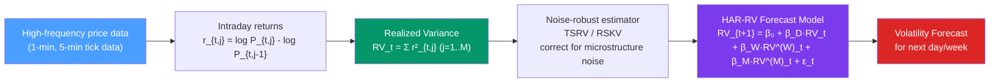

# 📡 Realized Volatility

> [!abstract] TL;DR
> **Realized Volatility (RV)** is a non-parametric, model-free volatility estimator constructed from high-frequency intraday returns: $RV_t = \sum_{j=1}^{M} r_{t,j}^2$ where $r_{t,j}$ are $M$ intraday returns. As $M \to \infty$, $RV_t \to \int_0^1 \sigma_t^2(s)\,ds$ (integrated variance). The **HAR-RV model** forecasts future RV as a linear combination of daily, weekly, and monthly RV — capturing the multi-scale heterogeneous behaviour of market participants.

## Intuition — analogy FIRST

Imagine measuring a day's wind speed variability. You could:
1. **GARCH approach**: use a model parametrically fitted to daily wind speed observations, inferring today's volatility from the model's conditional variance — an estimate based on model assumptions.
2. **Realized Volatility approach**: install weather sensors that record every 5 minutes. Sum up all the squared fluctuations throughout the day. This is a *direct measurement* — no model needed.

RV is the financial equivalent of the 5-minute sensors. Instead of modelling volatility parametrically, we *measure* it directly from all the tiny price moves within a trading day. The more frequent the data, the more precise the measurement — up to the limit imposed by **microstructure noise** (bid-ask bounce, stale quotes).

---

## How It Works



---

## Key Concepts / Details

### Realized Variance

For day $t$ with $M$ intraday intervals:
$$RV_t = \sum_{j=1}^{M} r_{t,j}^2$$

where $r_{t,j} = \log P_{t,j} - \log P_{t,j-1}$ are log returns over the $j$-th intraday interval.

**Theoretical foundation** (quadratic variation theory):
$$\text{plim}_{M\to\infty} RV_t = \int_0^1 \sigma_t^2(s)\,ds \equiv IV_t$$

where $IV_t$ is the **integrated variance** — the true cumulative variance over the day. This convergence holds under mild conditions on the underlying continuous-time process.

**Sampling frequency choice**: 5-minute intervals are standard for equity markets (Andersen et al. 2001). Too frequent (e.g., 1 minute) → microstructure noise dominates. Too infrequent (e.g., 30 minutes) → efficiency loss.

**Realized volatility**: $RVol_t = \sqrt{RV_t}$

### Microstructure Noise

**Problem**: at very high frequency, observed prices contain measurement error (bid-ask bounce, price discreteness, reporting delays):
$$\log P^{\text{obs}}_{t,j} = \log P^{\text{true}}_{t,j} + u_{t,j}$$

This noise adds a positive bias to RV as $M \to \infty$: $\mathbb{E}[RV_t] = IV_t + 2Mn\sigma_u^2 \to \infty$.

**Solution — Two-Scale Realized Variance (TSRV)** (Zhang, Mykland, Aït-Sahalia 2005):
$$TSRV = \frac{1}{1 - \bar{n}/n^{(slow)}} \left[RV^{(slow)} - \frac{\bar{n}}{n^{(slow)}} \cdot \frac{1}{K}\sum_{k=1}^{K} RV^{(fast,k)}\right]$$

Uses two sampling scales — slow (e.g., 5-min) and fast (e.g., tick-by-tick) — to cancel the noise bias.

**Kernel estimators (Barndorff-Nielsen et al.)**: flat-top kernel realized covariance is the asymptotically efficient estimator under microstructure noise.

### Bipower Variation

**Problem**: RV is inflated by jumps in the price process (discontinuous moves — earnings announcements, flash crashes).

**Bipower Variation (BPV)** (Barndorff-Nielsen & Shephard 2004) is robust to jumps:
$$BPV_t = \frac{\pi}{2} \sum_{j=2}^{M} |r_{t,j}| \cdot |r_{t,j-1}|$$

**Separating jumps from diffusive variance:**
$$J_t = \max(RV_t - BPV_t, 0) \quad \text{(jump component)}$$
$$C_t = BPV_t \quad \text{(continuous diffusion component)}$$

This jump-diffusion decomposition is important for options pricing and tail risk measurement.

### HAR-RV Model (Corsi 2009)

The **Heterogeneous AutoRegressive model for Realized Volatility** exploits the observation that different market participants (short-term traders, portfolio managers, pension funds) operate at different time scales:

$$RV_{t+1} = \beta_0 + \beta_D \cdot RV_t + \beta_W \cdot RV_t^{(W)} + \beta_M \cdot RV_t^{(M)} + \epsilon_{t+1}$$

where:
- $RV_t^{(W)} = \frac{1}{5}\sum_{k=0}^{4} RV_{t-k}$ — 5-day (weekly) average RV
- $RV_t^{(M)} = \frac{1}{22}\sum_{k=0}^{21} RV_{t-k}$ — 22-day (monthly) average RV

**Properties:**
- Simple OLS estimation (unlike GARCH MLE)
- Captures long-memory-like behaviour via multi-scale structure
- $R^2$ typically 40–60% for S&P 500 1-day ahead forecasts
- Outperforms GARCH(1,1) at most horizons for equity indices

### Python: Realized Volatility and HAR-RV

```python
import numpy as np
import pandas as pd
import matplotlib.pyplot as plt
from statsmodels.regression.linear_model import OLS
from statsmodels.tools.tools import add_constant

# Simulate intraday returns for 500 trading days (288 five-minute intervals per day)
np.random.seed(42)
T_days = 500
M = 78  # 5-minute intervals in 6.5-hour trading day (NYSE)

# Simulate stochastic volatility (true IV follows log-AR(1))
log_iv = np.zeros(T_days)
log_iv[0] = -1.0
for t in range(1, T_days):
    log_iv[t] = 0.95 * log_iv[t-1] + 0.1 * np.random.normal()
iv = np.exp(log_iv)

# Generate intraday returns and compute RV
rv = np.zeros(T_days)
for t in range(T_days):
    sigma_intra = np.sqrt(iv[t] / M)  # per-interval vol
    r = np.random.normal(0, sigma_intra, M)
    rv[t] = np.sum(r**2)

rv_series = pd.Series(rv, name="RV")
rvol_series = np.sqrt(rv_series) * 100  # annualised ≈ * sqrt(252) * 100

# Build HAR-RV features
def make_har_features(rv, max_lag=22):
    df = pd.DataFrame({'RV': rv})
    df['RV_D'] = df['RV'].shift(1)        # daily lag
    df['RV_W'] = df['RV'].shift(1).rolling(5).mean()   # weekly avg
    df['RV_M'] = df['RV'].shift(1).rolling(22).mean()  # monthly avg
    df = df.dropna()
    return df

har_df = make_har_features(rv_series)
y = har_df['RV']
X = add_constant(har_df[['RV_D', 'RV_W', 'RV_M']])

# OLS estimation
har_model = OLS(y, X).fit(cov_type='HAC', cov_kwds={'maxlags': 5})
print(har_model.summary())

# Forecast evaluation
n_test = 50
train_df = har_df.iloc[:-n_test]
test_df  = har_df.iloc[-n_test:]

X_train = add_constant(train_df[['RV_D', 'RV_W', 'RV_M']])
y_train = train_df['RV']
X_test  = add_constant(test_df[['RV_D', 'RV_W', 'RV_M']])
y_test  = test_df['RV']

har_fit = OLS(y_train, X_train).fit()
y_pred = har_fit.predict(X_test)

r2_oos = 1 - np.sum((y_test - y_pred)**2) / np.sum((y_test - y_test.mean())**2)
print(f"\nOut-of-sample R²: {r2_oos:.4f}")

# Plot
fig, (ax1, ax2) = plt.subplots(2, 1, figsize=(12, 8))
ax1.plot(rv_series, alpha=0.7, label="RV")
ax1.set_title("Daily Realized Variance")
ax1.legend()
ax2.plot(y_test.values, label="Actual RV", color='blue')
ax2.plot(y_pred.values, label="HAR-RV Forecast", color='red', linestyle='--')
ax2.set_title("HAR-RV: Actual vs Forecast (Test Set)")
ax2.legend()
plt.tight_layout()
plt.show()
```

### GARCH vs Realized Volatility

| Aspect | GARCH | Realized Volatility |
|--------|-------|---------------------|
| Data required | Daily returns only | High-frequency (5-min) intraday returns |
| Estimation | MLE (non-linear) | OLS for HAR-RV |
| Noise robustness | Not applicable | TSRV/kernel estimators needed |
| Forecast accuracy | Good, lower R² | Higher R², especially 1-day ahead |
| Jump handling | Treats jumps as large ARCH | BPV separates jump from diffusion |
| Interpretability | Conditional variance model | Direct measurement; very intuitive |
| Data availability | Widely available | Requires tick data (costly) |

---

## Real-World Notes

- **Oxford-Man Realized Volatility Library**: provides daily RV estimates for equity indices, FX, commodities going back to 2000 — free download for research.
- **Variance risk premium**: $VRP_t = \text{VIX}_t^2 - RV_t$ — the difference between implied variance (from options) and realised variance. A significant positive VRP means investors pay a premium for variance insurance.
- **High-frequency trading**: HFT firms use RV-based measures (often at 1-second frequency) for intraday risk management and market-making.
- **Rough volatility**: Gatheral et al. (2018) show that RV has Hurst exponent $H \approx 0.1$ (rougher than Brownian motion) — motivating fractional Brownian motion volatility models.

---

## Common Pitfalls

1. **Using raw tick-by-tick data without noise correction**: microstructure noise at tick frequency severely biases RV upward. Always use TSRV or sub-sampling.
2. **Ignoring overnight returns**: standard RV uses only within-day returns, missing the overnight return. Include it or use a correction factor.
3. **Using HAR-RV for long-horizon forecasts**: HAR-RV is designed for 1-day to 1-month ahead. For quarterly/annual volatility, GARCH-based long-run variance may be more reliable.
4. **Treating jumps as diffusion**: including jumps in RV inflates variance estimates. Use BPV for continuous variance if jump-robust estimates are needed (e.g., for options delta hedging).
5. **Forgetting log-transform**: log(RV) or log(RVol) is more normally distributed and often improves HAR-RV regression residuals. Fit log-HAR and back-transform.

---

## Related Concepts

- [[_MOC_Volatility_Models|↑ Section MOC]]
- [[GARCH_Models]] — the parametric alternative; compare AIC and out-of-sample R²
- [[EGARCH_and_GJR_GARCH]] — GARCH extensions for asymmetry
- [[Stochastic_Volatility]] — the latent volatility framework; RV can be used as an observable proxy

---

## Review Questions

1. Explain theoretically why $RV_t \to \int_0^1 \sigma_t^2(s)\,ds$ as $M \to \infty$. What assumption on the price process is required?
2. Why is the 5-minute sampling frequency commonly used for realized volatility estimation? What happens at higher and lower frequencies?
3. Describe the HAR-RV model. What does each of the three regressors capture, and what is the economic rationale for including multiple time scales?

---

## Sources

- Andersen et al. (2001), *The Distribution of Realized Exchange Rate Volatility*, JASA
- Barndorff-Nielsen & Shephard (2004), *Power and Bipower Variation*, Journal of Financial Econometrics
- Corsi (2009), *A Simple Approximate Long-Memory Model of Realized Volatility*, Journal of Financial Econometrics
- Zhang, Mykland & Aït-Sahalia (2005), *A Tale of Two Time Scales*, JASA

#time-series #volatility #realized-volatility #high-frequency #HAR-RV
