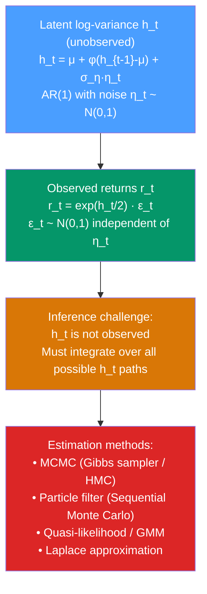

# 🎲 Stochastic Volatility

> [!abstract] TL;DR
> **Stochastic Volatility (SV)** models treat log-variance as a **latent (hidden) state** driven by its own noise process, unlike GARCH where variance is a deterministic function of past shocks. The basic SV model: $r_t = \exp(h_t/2)\epsilon_t$ with $h_t = \mu + \phi(h_{t-1} - \mu) + \sigma_\eta \eta_t$. Because the state $h_t$ is unobserved, estimation requires MCMC, particle filters, or the moments method — making SV more flexible but much harder to estimate than GARCH.

## Intuition — analogy FIRST

In GARCH, the volatility $\sigma_t^2$ is completely determined by the data up to time $t-1$ — if you know all the past returns, you know exactly what today's volatility is. It is like a thermostat: the temperature (variance) is a deterministic function of recent energy inputs (shocks).

**Stochastic volatility** says: no, the volatility itself is random and partly unobservable. Think of the weather rather than a thermostat — the "true" atmospheric volatility has its own dynamic that we can only observe imperfectly through what actually happens. On a given day, the market might be intrinsically more or less uncertain for reasons (information asymmetries, risk appetite changes) that are not fully captured by past returns alone.

This extra randomness in the variance process means SV models have richer distributional properties (heavier tails, more realistic) but require sophisticated inference methods to estimate.

---

## How It Works



---

## Key Concepts / Details

### The Basic SV Model (Taylor 1982)

**Observation equation:**
$$r_t = \exp(h_t/2) \cdot \epsilon_t, \quad \epsilon_t \sim NID(0,1)$$

**State equation (log-variance AR(1)):**
$$h_t = \mu + \phi(h_{t-1} - \mu) + \sigma_\eta \eta_t, \quad \eta_t \sim NID(0,1)$$

**Independence**: $\epsilon_t \perp \eta_s$ for all $t, s$ (no leverage in basic SV).

**Parameters:**
- $\mu = \log(\bar{\sigma}^2)$: long-run log-variance level
- $\phi \in (-1, 1)$: persistence of log-variance (typical value: $\approx 0.97$)
- $\sigma_\eta > 0$: volatility of volatility (vol-of-vol)

**Unconditional moments:**
$$\mathbb{E}[r_t^2] = \exp\left(\mu + \frac{\sigma_\eta^2}{2(1-\phi^2)}\right)$$
$$\text{Kurt}(r_t) = 3\exp\left(\frac{\sigma_\eta^2}{1-\phi^2}\right) > 3$$

SV produces fat tails even with Gaussian innovations — the variance randomness creates leptokurtosis.

### SV with Leverage (Leverage Effect)

Introduce correlation between return shocks and variance shocks:
$$\begin{pmatrix}\epsilon_t \\ \eta_t\end{pmatrix} \sim NID\left(\mathbf{0}, \begin{pmatrix}1 & \rho \\ \rho & 1\end{pmatrix}\right)$$

With $\rho < 0$ (typical for equities): negative return shocks are correlated with increases in log-variance → leverage effect. This is more natural than the threshold indicator in GJR-GARCH.

### SV vs GARCH: Key Differences

| Feature | GARCH | Stochastic Volatility |
|---------|-------|----------------------|
| Variance status | Deterministic given past | Latent random variable |
| Log-normal variance? | No (requires constraints) | Yes (natural log-normal) |
| Leverage | Manual threshold (GJR) | Correlation parameter $\rho$ |
| Fat tails | Only via distribution choice | Natural from vol randomness |
| Estimation | MLE (easy) | MCMC/particle filter (hard) |
| Prediction intervals | Narrower | Wider (extra uncertainty) |
| Fit to stylised facts | Good | Better |
| Practical use | Ubiquitous | Research, derivatives pricing |

### Estimation: Why It's Hard

The likelihood of the SV model requires integrating over all possible paths of $h_t$:
$$L(r_1, \ldots, r_T; \mu, \phi, \sigma_\eta) = \int \prod_{t=1}^{T} p(r_t | h_t) \cdot p(h_1, \ldots, h_T; \mu, \phi, \sigma_\eta) \, dh_1 \cdots dh_T$$

This $T$-dimensional integral has no closed form. Solutions:

1. **MCMC (Markov Chain Monte Carlo)**: simulate from the posterior $p(h_1,\ldots,h_T | r_1,\ldots,r_T)$ using Gibbs sampling or Hamiltonian Monte Carlo. Gold standard but slow.

2. **Particle filter (Sequential Monte Carlo)**: sequential approximation of the filtering distribution $p(h_t | r_1,\ldots,r_t)$ using weighted particles. Allows online estimation.

3. **Quasi-likelihood**: approximate the log-squared-returns as $y_t = \log(r_t^2) = h_t + \log(\epsilon_t^2)$, then treat as a Gaussian state-space model and apply the Kalman filter. Computationally cheap but inefficient.

4. **Laplace approximation / INLA**: approximate the marginal likelihood and posterior — used in `stochvol` R package.

### Python: Stochastic Volatility with PyMC

```python
import numpy as np
import pandas as pd
import matplotlib.pyplot as plt
import warnings
warnings.filterwarnings('ignore')

# --- Simulate SV data ---
np.random.seed(42)
T = 500
mu = -1.0    # long-run log-var (≈ annual vol 60%)
phi = 0.97   # persistence
sigma_eta = 0.1  # vol-of-vol

h = np.zeros(T)
r = np.zeros(T)
h[0] = mu
for t in range(1, T):
    h[t] = mu + phi * (h[t-1] - mu) + sigma_eta * np.random.normal()
r = np.exp(h/2) * np.random.normal(0, 1, T)

returns = pd.Series(r * 100, name="Returns (%)")

# --- Quasi-likelihood estimation (fast approximation) ---
# Transform: y_t = log(r_t^2) ≈ h_t + log(chi2(1))
# This is a linear state space model
y = np.log(r**2 + 1e-8)  # avoid log(0)

# Kalman filter for AR(1) state space
# (simple demonstration using numpy)
from numpy.linalg import inv

def kalman_sv(y, mu0=np.mean(y), phi_init=0.95, sigma_eta2=0.01, sigma_eps2=np.pi**2/2):
    """Simple Kalman filter for quasi-likelihood SV estimation."""
    T_len = len(y)
    h_filt = np.zeros(T_len)
    P_filt = np.zeros(T_len)
    h_pred = np.zeros(T_len)
    P_pred = np.zeros(T_len)

    # Initialise
    h_pred[0] = mu0
    P_pred[0] = sigma_eta2 / (1 - phi_init**2)

    for t in range(T_len):
        # Update (Kalman gain)
        K = P_pred[t] / (P_pred[t] + sigma_eps2)
        h_filt[t] = h_pred[t] + K * (y[t] - h_pred[t])
        P_filt[t] = (1 - K) * P_pred[t]

        # Predict
        if t < T_len - 1:
            h_pred[t+1] = mu0 + phi_init * (h_filt[t] - mu0)
            P_pred[t+1] = phi_init**2 * P_filt[t] + sigma_eta2

    return h_filt, P_filt

h_filt, P_filt = kalman_sv(y, mu0=mu, phi_init=phi, sigma_eta2=sigma_eta**2)

fig, axes = plt.subplots(3, 1, figsize=(12, 10))
axes[0].plot(returns, alpha=0.6, color='gray', label="Returns")
axes[0].set_title("Returns with SV")
axes[1].plot(np.exp(h/2) * 100, color='blue', label="True σ_t", alpha=0.8)
axes[1].plot(np.exp(h_filt/2) * 100, color='red', linestyle='--', label="Filtered σ_t")
axes[1].set_title("True vs Filtered Volatility")
axes[1].legend()
axes[2].plot(h, label="True log-variance h_t")
axes[2].plot(h_filt, label="Filtered h_t (Kalman)", linestyle='--')
axes[2].set_title("Log-variance: True vs Filtered")
axes[2].legend()
plt.tight_layout()
plt.show()

# --- MCMC with PyMC (if available) ---
try:
    import pymc as pm
    import pytensor.tensor as pt

    with pm.Model() as sv_model:
        # Priors
        phi_rv    = pm.Beta("phi", alpha=20, beta=1.5)  # high persistence
        sigma_eta_rv = pm.HalfNormal("sigma_eta", sigma=0.5)
        mu_rv     = pm.Normal("mu", mu=-1, sigma=1)

        # Latent log-variance AR(1) via scan
        h_init = pm.Normal("h_init", mu=mu_rv, sigma=sigma_eta_rv / pt.sqrt(1 - phi_rv**2))
        
        # Simplified: use observed y = log(r^2) as quasi-Gaussian
        sigma_obs = np.pi / np.sqrt(2)  # std of log(chi2(1))
        
        obs = pm.Normal("obs", mu=mu_rv, sigma=sigma_obs + sigma_eta_rv,
                        observed=y[:100])  # use subset for speed

        # Sample
        trace = pm.sample(500, tune=500, cores=1, progressbar=True,
                          target_accept=0.9)

    import arviz as az
    print(az.summary(trace, var_names=["phi", "sigma_eta", "mu"]))
except ImportError:
    print("Install PyMC for Bayesian SV: pip install pymc")
```

### The `stochvol` Package (R)

In practice, the `stochvol` package in R is the gold standard for SV estimation — it implements efficient MCMC with correction for the bias in the quasi-likelihood approach:

```r
# R code (reference)
library(stochvol)
svsample(returns, draws = 10000, burnin = 2000) -> sv_result
plot(sv_result)
```

---

## Real-World Notes

- **Options pricing (Heston model)**: the Heston (1993) stochastic volatility model is the continuous-time analogue of the discrete SV model — widely used for options pricing because it has an analytical formula for European option prices.
- **VIX and term structure**: the VIX measures expected volatility over the next 30 days. SV models with mean-reverting log-variance naturally produce the upward-sloping VIX term structure observed in calm markets.
- **Fat tails**: SV naturally generates fatter tails than Gaussian returns, matching the empirical distribution of equity returns better than GARCH(1,1) with normal errors.
- **Research applications**: SV is preferred in academic finance for theoretical tractability. GARCH dominates in practice for volatility forecasting due to ease of estimation.

---

## Common Pitfalls

1. **Treating SV as a drop-in replacement for GARCH**: SV requires specialised software and 100× more computation than GARCH. Use GARCH for operational forecasting; SV for research.
2. **Using quasi-likelihood without acknowledging the approximation error**: the log-squared-returns transformation introduces severe skewness (the $\log\chi^2(1)$ distribution). Use Jacquier et al. (1994) MCMC for proper inference.
3. **Not checking MCMC convergence**: Gelman-Rubin $\hat{R} > 1.05$ or effective sample size < 100 per parameter means the chain has not mixed — extend the run or tune the sampler.
4. **Ignoring the leverage correlation parameter**: the basic SV without leverage often fits equity return volatility poorly. Always allow $\rho \neq 0$.
5. **Confusing latent $h_t$ with observed squared returns**: $h_t$ is estimated, not observed. The uncertainty in $h_t$ propagates to all quantities derived from it.

---

## Related Concepts

- [[_MOC_Volatility_Models|↑ Section MOC]]
- [[GARCH_Models]] — the deterministic-variance alternative; easier to estimate but less flexible
- [[EGARCH_and_GJR_GARCH]] — GARCH extensions for leverage; SV with $\rho<0$ is the latent-variable equivalent
- [[Realized_Volatility]] — can be used as an observable proxy for $\exp(h_t)$ in an SV-RV joint model
- [[Kalman_Filter]] — the quasi-likelihood SV estimation uses a Kalman filter on the linearised model
- [[State_Space_Models]] — SV is a non-linear, non-Gaussian state-space model

---

## Review Questions

1. Write the observation and state equations of the basic SV model. Explain what each parameter ($\mu, \phi, \sigma_\eta$) controls about the volatility dynamics.
2. Why can't the SV likelihood be computed with a standard Kalman filter, unlike linear Gaussian state-space models?
3. Compare SV and GARCH(1,1) in terms of (a) how they capture fat-tailed return distributions, (b) how they handle the leverage effect, and (c) their computational requirements.

---

## Sources

- Taylor (1982), *Financial Returns Modelled by the Product of Two Stochastic Processes*, *Time Series Analysis* (ed. Anderson)
- Jacquier, Polson & Rossi (1994), *Bayesian Analysis of Stochastic Volatility Models*, Journal of Business & Economic Statistics
- Heston (1993), *A Closed-Form Solution for Options with Stochastic Volatility*, Review of Financial Studies
- Kastner (2016), `stochvol` R package vignette

#time-series #volatility #stochastic-volatility #latent-state #MCMC
