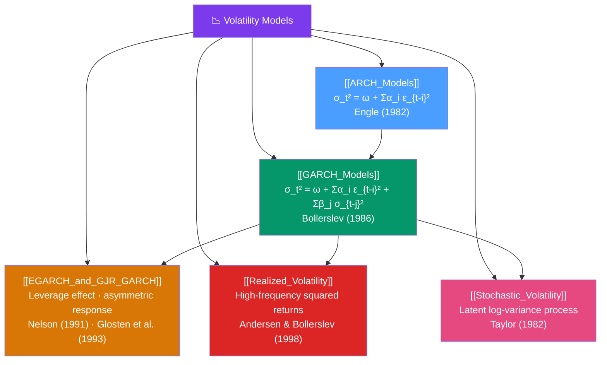

# 🗺️ Volatility Models — Map of Content

> [!abstract] What This Section Covers
> Classical ARIMA models assume constant error variance — but financial and economic series exhibit **volatility clustering**: calm periods followed by turbulent periods. This section covers the family of **conditional heteroskedasticity** models. Starting with **ARCH** (Engle 1982, Nobel Prize 2003), which models variance as a function of past squared errors, then **GARCH** (Bollerslev 1986), which adds autoregressive variance, then the **asymmetric extensions** (EGARCH, GJR-GARCH) that capture the leverage effect (bad news increases volatility more than good news). Also covers **realized volatility** (high-frequency data approaches) and **stochastic volatility** models (latent variance).

## Concept Map

## Learning Path

1. [[ARCH_Models]] — The motivation: volatility clustering in financial returns; ARCH(q) specification; ARCH-LM test.
2. [[GARCH_Models]] — The standard model: GARCH(1,1); stationarity/persistence; MLE; GARCH-ARMA combinations.
3. [[EGARCH_and_GJR_GARCH]] — Leverage effect: why bad news increases volatility more; EGARCH and GJR-GARCH specifications.
4. [[Realized_Volatility]] — High-frequency approach: sum of squared intraday returns as model-free volatility measure.
5. [[Stochastic_Volatility]] — Latent variance: volatility as a hidden state; SV model estimation via MCMC/particle filter.

## All Notes at a Glance

| Note | Difficulty | What You'll Learn |
|------|------------|-------------------|
| [[ARCH_Models]] | Intermediate | Volatility clustering, ARCH(q), ARCH-LM test, Engle's Nobel |
| [[GARCH_Models]] | Intermediate | GARCH(1,1) equations, stationarity condition, half-life of shocks, GARCH-M, `arch` package |
| [[EGARCH_and_GJR_GARCH]] | Intermediate → Advanced | Log-GARCH, leverage effect, asymmetric news impact curve, comparison table |
| [[Realized_Volatility]] | Advanced | TSRV, HAR-RV model, microstructure noise, Bipower variation |
| [[Stochastic_Volatility]] | Advanced | SV model, particle filter, comparison to GARCH, `pymc` estimation |

## Key Questions This Section Answers

- What is volatility clustering and why do classical time series models fail to capture it?
- How does GARCH(1,1) model conditional variance? What is the stationarity condition?
- What is the leverage effect and which GARCH variants capture it?
- How do you test for ARCH effects in a series?
- What is realized volatility and how does it differ from GARCH-based volatility?

## Related Sections

- [[_MOC_TimeSeries_Master|↑ Master MOC]]
- [[_MOC_ARIMA|← ARIMA Models]]
- [[_MOC_Multivariate_TS|→ Multivariate Time Series]]

#MOC #time-series #volatility #GARCH #finance
