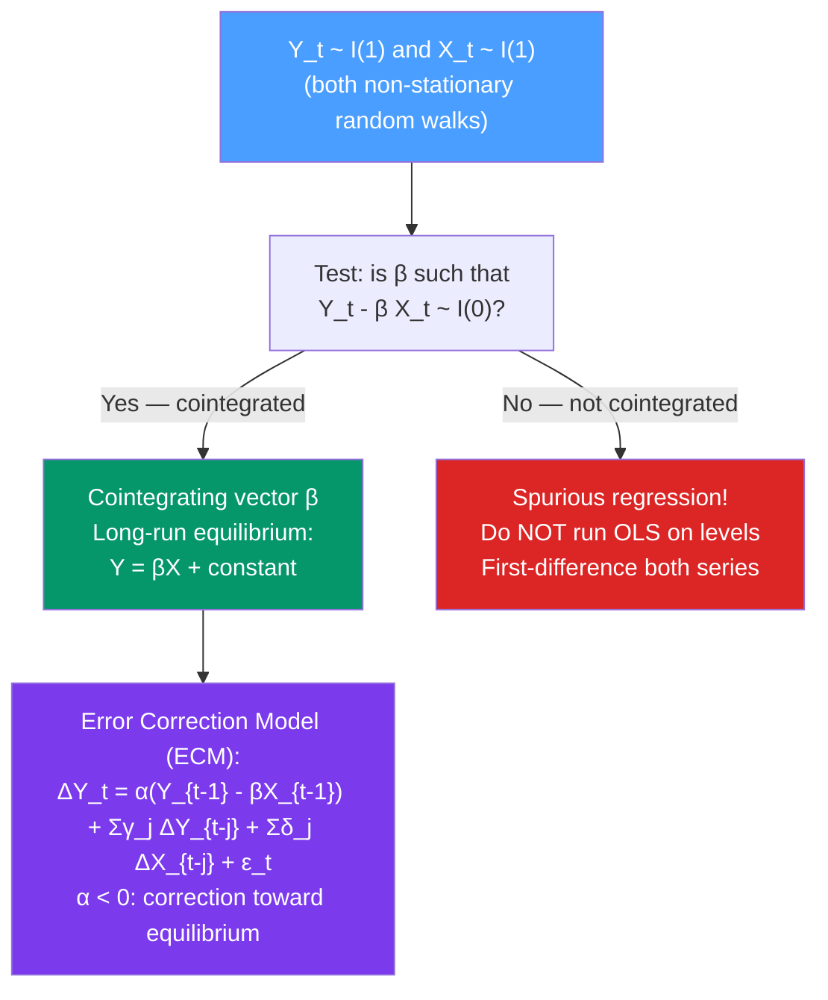

# 🔗 Cointegration and Error Correction Models

> [!abstract] TL;DR
> Two or more $I(1)$ series are **cointegrated** if a linear combination of them is $I(0)$ (stationary) — they share a common stochastic trend and cannot drift apart indefinitely. The **Error Correction Model (ECM/VECM)** incorporates both short-run dynamics and a correction term that pulls the system back toward long-run equilibrium. Tested with **Engle-Granger two-step** (bivariate) or **Johansen trace/maximum eigenvalue test** (multivariate). Classic example: stock price and dividends, long-run bond yields and short rates.

## Intuition — analogy FIRST

Think of two dogs walking together — an owner and their dog. Both are random walks: the owner wanders left and right, the dog wanders too. But they are connected by a leash. The **leash is the error correction term**: however far apart they drift, the leash pulls them back toward each other. The equilibrium distance is the long-run cointegrating relationship.

If you looked only at each path individually, each would appear to be a random walk ($I(1)$). But their *difference* (the distance between them) is mean-reverting ($I(0)$) — it cannot grow without bound because of the leash. This is cointegration.

Regression of one on the other is not spurious — it captures a real long-run equilibrium. But you also need an ECM to model the short-run dynamics of how they adjust toward equilibrium.

---

## How It Works



---

## Key Concepts / Details

### Formal Definition of Cointegration

**Definition (Engle & Granger 1987)**: A set of $I(1)$ variables $\mathbf{Y}_t = (Y_{1t}, \ldots, Y_{kt})^\prime$ is cointegrated of order (1,1) — denoted CI(1,1) — if there exists a non-zero vector $\boldsymbol{\beta}$ such that:
$$\boldsymbol{\beta}^\prime \mathbf{Y}_t \sim I(0)$$

The vector $\boldsymbol{\beta}$ is the **cointegrating vector**; $\boldsymbol{\beta}^\prime \mathbf{Y}_t$ is the **error correction term** (deviation from long-run equilibrium).

**Number of cointegrating relationships** (rank): for $k$ variables, there can be at most $k-1$ linearly independent cointegrating vectors. The cointegration rank $r$ satisfies $0 \leq r \leq k-1$.

### Engle-Granger Two-Step Procedure (Bivariate)

**Step 1** — Estimate the cointegrating regression:
$$Y_t = \alpha + \beta X_t + u_t$$

The OLS estimator $\hat{\beta}$ is **superconsistent**: it converges at rate $T$ rather than $\sqrt{T}$.

**Step 2** — Test for cointegration by testing if $\hat{u}_t = Y_t - \hat{\alpha} - \hat{\beta}X_t$ is $I(0)$:

Apply the ADF test to $\hat{u}_t$ using **special critical values** (because $\hat{u}_t$ are estimated residuals, the distribution is non-standard):

| Significance | Engle-Granger critical value (T=100) |
|-------------|--------------------------------------|
| 1% | -3.96 |
| 5% | -3.37 |
| 10% | -3.07 |

If ADF statistic < critical value: reject no-cointegration → cointegrated.

### Engle-Granger ECM

After finding $\hat{u}_t = Y_t - \hat{\alpha} - \hat{\beta}X_t$ stationary, estimate the **ECM**:

$$\Delta Y_t = c_Y + \alpha_Y \hat{u}_{t-1} + \sum_{j=1}^{p}\gamma_j \Delta Y_{t-j} + \sum_{j=1}^{p}\delta_j \Delta X_{t-j} + \epsilon_t$$

$$\Delta X_t = c_X + \alpha_X \hat{u}_{t-1} + \sum_{j=1}^{p}\phi_j \Delta Y_{t-j} + \sum_{j=1}^{p}\psi_j \Delta X_{t-j} + \eta_t$$

- $\alpha_Y < 0$: $Y$ adjusts toward equilibrium (error correction). A negative value is required for stable convergence.
- $\alpha_X > 0$ or $= 0$: if $X$ is the "long-run driver," it may not need to adjust ($\alpha_X = 0$ → $X$ is weakly exogenous).
- **Speed of adjustment**: $|\alpha_Y|$ measures how fast $Y$ corrects per period. $\alpha_Y = -0.2$ means 20% of the disequilibrium is corrected per period.

### Johansen Cointegration Test (Multivariate)

For $k > 2$ variables, the Johansen (1988) procedure is preferred. It estimates a **VECM** by maximum likelihood and tests the cointegration rank $r$.

**VECM representation:**
$$\Delta \mathbf{Y}_t = \mathbf{c} + \boldsymbol{\Pi}\mathbf{Y}_{t-1} + \sum_{j=1}^{p-1}\boldsymbol{\Gamma}_j \Delta\mathbf{Y}_{t-j} + \boldsymbol{\epsilon}_t$$

where $\boldsymbol{\Pi} = \boldsymbol{\alpha}\boldsymbol{\beta}^\prime$ with:
- $\boldsymbol{\beta}$ ($k \times r$): cointegrating vectors (the long-run equilibrium relationships)
- $\boldsymbol{\alpha}$ ($k \times r$): adjustment coefficients (speed of reversion)

**Johansen tests for rank $r$:**

**Trace test**: $H_0$: rank $\leq r$ vs $H_1$: rank $> r$
$$\lambda_{trace}(r) = -T\sum_{i=r+1}^{k}\log(1-\hat{\lambda}_i) \sim \text{non-standard}$$

**Maximum eigenvalue test**: $H_0$: rank $= r$ vs $H_1$: rank $= r+1$
$$\lambda_{max}(r) = -T\log(1-\hat{\lambda}_{r+1})$$

$\hat{\lambda}_i$ are the $k$ eigenvalues of the matrix product in the reduced-rank regression.

### Python: Cointegration and VECM

```python
import pandas as pd
import numpy as np
from statsmodels.tsa.stattools import coint, adfuller
from statsmodels.tsa.vector_ar.vecm import VECM, coint_johansen
import matplotlib.pyplot as plt
import warnings
warnings.filterwarnings('ignore')

# Simulate cointegrated pair: Y_t = 2*X_t + stationary residual
np.random.seed(42)
T = 400
X = np.cumsum(np.random.normal(0, 1, T))  # I(1)
beta_true = 2.0
spread = np.zeros(T)
for t in range(1, T):
    spread[t] = 0.8 * spread[t-1] + np.random.normal(0, 0.5)  # AR(1) equilibrium error
Y = beta_true * X + spread  # Y is I(1) but Y - 2X is I(0)

df = pd.DataFrame({'Y': Y, 'X': X})

# 1. Verify both are I(1)
print(f"ADF Y: p={adfuller(Y)[1]:.4f}")  # > 0.05 → I(1)
print(f"ADF X: p={adfuller(X)[1]:.4f}")  # > 0.05 → I(1)

# 2. Engle-Granger cointegration test (statsmodels)
coint_t, pval, crit = coint(Y, X, autolag='AIC')
print(f"\nEngle-Granger cointegration test:")
print(f"  t-stat={coint_t:.4f}, p-value={pval:.4f}")
print(f"  Critical values: 1%={crit[0]:.4f}, 5%={crit[1]:.4f}")

# 3. Estimate cointegrating vector
from statsmodels.regression.linear_model import OLS
from statsmodels.tools.tools import add_constant
reg = OLS(Y, add_constant(X)).fit()
beta_hat = reg.params[1]
resid = reg.resid
print(f"\nEstimated cointegrating vector (beta): {beta_hat:.4f} (true: {beta_true})")
print(f"ADF on residuals: p={adfuller(resid)[1]:.4f}")  # Should be << 0.05

# 4. ECM estimation
ecm_df = pd.DataFrame({
    'dY': np.diff(Y),
    'dX': np.diff(X),
    'ec': resid[:-1]  # lagged error correction term
})
# Adding lagged differences
for lag in [1, 2]:
    ecm_df[f'dY_lag{lag}'] = ecm_df['dY'].shift(lag)
    ecm_df[f'dX_lag{lag}'] = ecm_df['dX'].shift(lag)
ecm_df = ecm_df.dropna()

X_ecm = add_constant(ecm_df.drop('dY', axis=1))
ecm_model = OLS(ecm_df['dY'], X_ecm).fit()
alpha_Y = ecm_model.params['ec']
print(f"\nECM adjustment coefficient α_Y: {alpha_Y:.4f}")
print(f"Half-life of reversion: {np.log(0.5)/np.log(1+alpha_Y):.1f} periods")

# 5. Johansen test for multivariate case
# Add a third variable (independent)
Z = np.cumsum(np.random.normal(0, 1, T))
df3 = pd.DataFrame({'Y': Y, 'X': X, 'Z': Z})
joh_result = coint_johansen(df3, det_order=0, k_ar_diff=2)
print(f"\nJohansen Trace Test:")
print(f"  Trace statistics: {joh_result.lr1.round(3)}")
print(f"  5% critical values: {joh_result.cvt[:, 1].round(3)}")
print(f"  Cointegration rank: {np.sum(joh_result.lr1 > joh_result.cvt[:, 1])}")
# Expect rank = 1 (Y and X cointegrated, Z independent)

# 6. VECM estimation
vecm_model = VECM(df3[['Y', 'X', 'Z']], k_ar_diff=2, coint_rank=1,
                   deterministic="ci")
vecm_result = vecm_model.fit()
print(f"\nVECM cointegrating vector (normalised on Y):")
print(vecm_result.beta)
print(f"\nAdjustment coefficients (alpha):")
print(vecm_result.alpha)
```

### Speed of Adjustment and Half-Life

The ECM adjustment coefficient $\alpha_Y$ determines how quickly the system mean-reverts:

| $\alpha_Y$ | Behaviour | Half-life |
|-----------|-----------|-----------|
| $-0.5$ | Fast reversion | 1 period |
| $-0.2$ | Medium reversion | ~3 periods |
| $-0.05$ | Slow reversion | ~14 periods |
| $0$ | No reversion ($X$ is weakly exogenous) | Infinite |
| $> 0$ | Explosive — diverges | N/A (invalid) |

Half-life: $h = \log(0.5)/\log(1+\alpha_Y)$

---

## Real-World Notes

- **Purchasing Power Parity (PPP)**: exchange rate and price ratio are cointegrated in the long run — deviations from PPP are mean-reverting, but slowly ($\alpha \approx -0.05$ per month → 14-month half-life).
- **Stock prices and dividends**: if dividends are $I(1)$, prices are $I(1)$, and they should be cointegrated (present value relation). Violations predict future returns.
- **Term structure of interest rates**: yields at different maturities are cointegrated — the spread between long and short rates is stationary (the expectations hypothesis).
- **Statistical arbitrage**: pairs trading identifies two cointegrated stocks and trades the spread when it deviates from equilibrium — the ECM adjustment provides the mean-reversion that makes the strategy profitable.

---

## Common Pitfalls

1. **Running OLS on levels of two $I(1)$ series without testing for cointegration**: if not cointegrated, the regression is spurious. Always test first.
2. **Using standard ADF critical values for Engle-Granger residuals**: the critical values are more negative because the residuals are estimated (not true), and cointegration is a joint hypothesis. Use Engle-Granger-specific tables.
3. **Ignoring the direction of normalisation in the cointegrating vector**: the Johansen method normalises on one variable by convention. The economic interpretation depends on which variable is normalised.
4. **Large adjustment coefficients**: $|\alpha_Y| > 1$ implies overshooting — the system oscillates rather than converging smoothly. Check if the cointegrating relationship is correctly specified.
5. **Applying VECM to stationary series**: if the series are $I(0)$, a VAR in levels (not VECM) is appropriate. Mixing $I(0)$ and $I(1)$ variables in a VECM leads to invalid inference.

---

## Related Concepts

- [[_MOC_Multivariate_TS|↑ Section MOC]]
- [[VAR_Models]] — the VAR in differences; VECM adds the cointegrating long-run term
- [[Stationarity]] — cointegration extends the stationarity concept to multivariate linear combinations
- [[White_Noise_and_Random_Walk]] — the $I(1)$ building blocks that cointegration links
- [[Granger_Causality]] — cointegration implies Granger causality in at least one direction

---

## Review Questions

1. Explain in plain language what it means for two $I(1)$ series to be cointegrated. Give one economic example where you would expect cointegration to hold.
2. Walk through the Engle-Granger two-step procedure. At step 2, why do you need special critical values rather than standard ADF tables?
3. You estimate a VECM and find $\hat{\alpha}_Y = -0.15$ and $\hat{\alpha}_X = 0.01$ (not significantly different from zero). Interpret: which variable adjusts toward equilibrium, which is weakly exogenous, and what is the half-life of reversion?

---

## Sources

- Engle & Granger (1987), *Co-Integration and Error Correction: Representation, Estimation, and Testing*, Econometrica
- Johansen (1988), *Statistical Analysis of Cointegration Vectors*, Journal of Economic Dynamics and Control
- Hamilton, *Time Series Analysis*, Ch. 19–20

#time-series #multivariate #cointegration #ECM #Johansen #VECM
