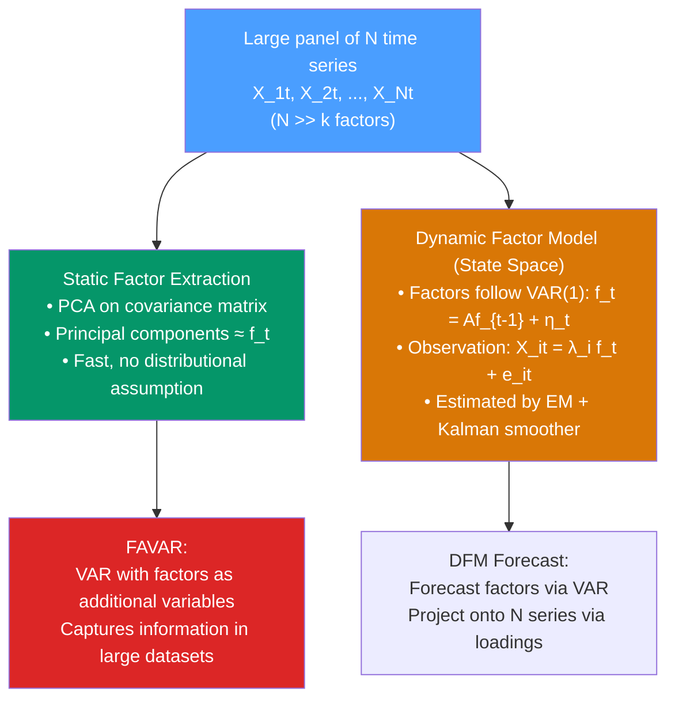

# 🧩 Factor Models for Time Series

> [!abstract] TL;DR
> **Dynamic Factor Models (DFM)** extract a small number of unobserved common factors $f_t$ from a large panel of $N$ time series: $X_{it} = \lambda_i f_t + e_{it}$. The factors capture the co-movement across series (common variation); the idiosyncratic component $e_{it}$ is series-specific. Estimated by PCA (static) or the Kalman smoother (dynamic/state-space form). **FAVAR** (Factor-Augmented VAR) adds factors to a VAR to handle large information sets without the curse of dimensionality.

## Intuition — analogy FIRST

Imagine 200 monthly economic time series: employment across all sectors, manufacturing surveys, consumer confidence, prices, interest rates. They are all correlated — when the economy is doing well, most of them move together. Rather than modelling all 200 series individually (with 200 equations and thousands of parameters), factor models say:

"Most of what's happening in these 200 series is driven by a handful of common forces — say, a business cycle factor, a financial conditions factor, and a sectoral factor. Once you extract these 3 factors, the remaining idiosyncratic part of each series is relatively independent."

This is exactly what PCA does: it finds the linear combinations of the 200 series that capture the most variance (the principal components = factors).

---

## How It Works



---

## Key Concepts / Details

### Static Factor Model

$$X_{it} = \boldsymbol{\lambda}_i^\prime \mathbf{f}_t + e_{it}, \quad i = 1, \ldots, N; \quad t = 1, \ldots, T$$

In matrix form: $\mathbf{X}_t = \boldsymbol{\Lambda}\mathbf{f}_t + \mathbf{e}_t$

- $\mathbf{f}_t = (f_{1t}, \ldots, f_{kt})^\prime$ — $k$ common factors ($k \ll N$)
- $\boldsymbol{\Lambda}$ — $N \times k$ loading matrix (how each series loads on each factor)
- $\mathbf{e}_t$ — $N$-dimensional idiosyncratic error (uncorrelated across $i$ in the strict factor model)

**PCA estimation** (consistent as $N, T \to \infty$, Bai & Ng 2002):
1. Compute $\hat{\boldsymbol{\Sigma}} = T^{-1}\mathbf{X}^\prime\mathbf{X}$ (or standardise first)
2. Extract the $k$ largest eigenvectors $\hat{\boldsymbol{V}}_k$
3. Factor estimates: $\hat{\mathbf{F}} = \mathbf{X}\hat{\boldsymbol{V}}_k / \sqrt{T}$
4. Loading estimates: $\hat{\boldsymbol{\Lambda}} = \mathbf{X}^\prime\hat{\mathbf{F}} / T$

**Number of factors selection** (Bai-Ng Information Criteria):
$$IC(k) = \log\left(\hat{\sigma}^2_k\right) + k \cdot g(N,T)$$

where $\hat{\sigma}^2_k$ is the average idiosyncratic variance and $g(N,T)$ is a penalty that depends on $\min(N,T)$.

### Dynamic Factor Model (DFM)

Extends static factors by specifying dynamics for $\mathbf{f}_t$:

**State equation**: $\mathbf{f}_t = \mathbf{A}\mathbf{f}_{t-1} + \mathbf{H}\boldsymbol{\eta}_t, \quad \boldsymbol{\eta}_t \sim N(\mathbf{0}, \mathbf{Q})$

**Observation equation**: $\mathbf{X}_t = \boldsymbol{\Lambda}\mathbf{f}_t + \mathbf{e}_t, \quad \mathbf{e}_t \sim N(\mathbf{0}, \mathbf{R})$

This is a **linear Gaussian state-space model** — estimated by the **Kalman filter + EM algorithm**:
1. **E-step**: given parameters, run Kalman smoother to compute $\mathbb{E}[\mathbf{f}_t|\mathbf{X}_{1:T}]$
2. **M-step**: given smoothed factors, update $\boldsymbol{\Lambda}$, $\mathbf{A}$, $\mathbf{Q}$, $\mathbf{R}$ by MLE
3. Iterate until convergence

### FAVAR: Factor-Augmented VAR

**Bernanke, Boivin & Eliasz (2005)** augment a small VAR with principal components from a large dataset:

$$\begin{pmatrix}\mathbf{F}_t \\ \mathbf{Y}_t\end{pmatrix} = \mathbf{B}(L)\begin{pmatrix}\mathbf{F}_{t-1} \\ \mathbf{Y}_{t-1}\end{pmatrix} + \boldsymbol{\epsilon}_t$$

- $\mathbf{F}_t$ — $k$ factors from a 120-series macroeconomic dataset
- $\mathbf{Y}_t$ — small set of observable policy variables (fed funds rate)
- $\mathbf{B}(L)$ — matrix polynomial in the lag operator

**Key advantage**: the factors summarise hundreds of economic indicators in a few variables, allowing the VAR to respond to a much richer information set without parameter explosion.

### Nowcasting with DFM

DFMs are widely used for **nowcasting** — estimating current-quarter GDP before the official release:

**Challenge**: different series are released at different times (weekly unemployment claims, monthly employment, quarterly GDP). DFM handles **mixed-frequency data** via the state-space form, treating missing observations as missing states filled in by the Kalman filter.

The Kalman filter provides the conditional expectation:
$$\hat{GDP}_t = \mathbb{E}[GDP_t | X_{1:t}^{\text{obs}}]$$

updated each time new monthly or weekly data arrives.

### Python: Factor Models

```python
import numpy as np
import pandas as pd
from sklearn.decomposition import PCA
from sklearn.preprocessing import StandardScaler
import matplotlib.pyplot as plt
import warnings
warnings.filterwarnings('ignore')

# Simulate DFM: 2 factors driving 20 series
np.random.seed(42)
T, N, k = 200, 20, 2

# True factors (AR(1) processes)
F = np.zeros((T, k))
for t in range(1, T):
    F[t, 0] = 0.8 * F[t-1, 0] + np.random.normal(0, 1)  # Business cycle factor
    F[t, 1] = 0.6 * F[t-1, 1] + np.random.normal(0, 1)  # Financial factor

# Factor loadings
Lambda = np.random.uniform(-1, 1, (N, k))

# Idiosyncratic noise
E = np.random.normal(0, 1, (T, N))

# Observed panel
X = F @ Lambda.T + E

# Standardise
scaler = StandardScaler()
X_std = scaler.fit_transform(X)

# PCA estimation
pca = PCA(n_components=k)
F_hat = pca.fit_transform(X_std)
Lambda_hat = pca.components_.T  # N × k

print(f"Explained variance ratio: {pca.explained_variance_ratio_}")
print(f"Cumulative: {pca.explained_variance_ratio_.cumsum()}")

# Compare estimated and true factors (up to rotation)
# Note: PCA factors are identified up to sign and rotation
corr_f1 = np.corrcoef(F[:, 0], F_hat[:, 0])[0, 1]
corr_f2 = np.corrcoef(F[:, 1], F_hat[:, 1])[0, 1]
print(f"\nCorrelation true vs estimated factors:")
print(f"  Factor 1: {corr_f1:.4f}")
print(f"  Factor 2: {corr_f2:.4f}")

# Plot factors
fig, axes = plt.subplots(2, 1, figsize=(12, 8))
axes[0].plot(F[:, 0], label="True factor 1")
axes[0].plot(F_hat[:, 0] * np.sign(corr_f1), label="PCA factor 1 (sign-adjusted)", linestyle='--')
axes[0].set_title("Factor 1: True vs PCA")
axes[0].legend()
axes[1].plot(F[:, 1], label="True factor 2")
axes[1].plot(F_hat[:, 1] * np.sign(corr_f2), label="PCA factor 2 (sign-adjusted)", linestyle='--')
axes[1].set_title("Factor 2: True vs PCA")
axes[1].legend()
plt.tight_layout()
plt.show()

# Number of factors: Bai-Ng scree plot
pca_full = PCA()
pca_full.fit(X_std)
plt.figure(figsize=(8, 4))
plt.plot(range(1, 11), pca_full.explained_variance_ratio_[:10], 'bo-')
plt.axvline(k, linestyle='--', color='red', label=f'True k={k}')
plt.xlabel('Number of factors')
plt.ylabel('Explained variance ratio')
plt.title('Scree Plot for Factor Number Selection')
plt.legend()
plt.show()

# FAVAR: use PCA factors in a VAR
from statsmodels.tsa.api import VAR

# Add an "observable" policy variable
policy = 0.3 * F[:, 0] + np.random.normal(0, 0.5, T)
favar_df = pd.DataFrame(
    np.column_stack([F_hat[:, :2], policy]),
    columns=['Factor1', 'Factor2', 'Policy']
)
favar = VAR(favar_df)
favar_result = favar.fit(maxlags=4, ic='aic')
print(f"\nFAVAR selected lag order: {favar_result.k_ar}")

# Forecasting with factor model
# Forecast factors via VAR, then project onto original series
fc_factors = favar_result.forecast(favar_df.values[-favar_result.k_ar:], steps=12)
fc_factor_df = pd.DataFrame(fc_factors[:, :2], columns=['F1', 'F2'])

# Project forecasted factors to series (X_hat = F_hat * Lambda_hat')
fc_X = fc_factor_df.values @ Lambda_hat[:, :2].T
print(f"\nForecasted panel (first 3 series, 5 horizons):")
print(fc_X[:5, :3].round(3))
```

### How Many Factors? Bai-Ng Criteria

Bai & Ng (2002) provide consistent information criteria for determining $k$:

$$IC_p(k) = \log\left(V(k, \hat{F}^k)\right) + k \cdot g(N,T)$$

where $V(k, \hat{F}^k) = (NT)^{-1}\sum_{i=1}^{N}\|\mathbf{X}_i - \hat{\boldsymbol{\Lambda}}_i\hat{\mathbf{F}}^k\|^2$ and common penalty functions are $g(N,T) = \frac{N+T}{NT}\ln\left(\frac{NT}{N+T}\right)$ (IC1), etc.

The **scree plot** is a simpler visual tool: plot explained variance ratio vs number of factors, look for an "elbow."

---

## Real-World Notes

- **Chicago Fed National Activity Index (CFNAI)**: a weighted average of 85 monthly indicators reduced to a single factor representing broad economic activity.
- **Nowcasting GDP (ECB, Fed)**: DFMs with mixed-frequency data track current quarter GDP in real-time; updated weekly as new data arrives.
- **Global factor models**: international business cycles show strong global factors; Kose, Otrok & Whiteman (2003) decompose country, regional, and global factors from 60 country panel.
- **Risk factor models (Finance)**: Fama-French 3-factor model is a static factor model for cross-sectional stock returns; the Arbitrage Pricing Theory (APT) motivates factor pricing of time series.

---

## Common Pitfalls

1. **Not standardising the panel before PCA**: series in different units (% vs levels) produce PCA dominated by high-variance series. Always standardise to mean zero, unit variance.
2. **Interpreting PCA factors directly**: PCA factors are not uniquely identified (rotation-invariant). Economic interpretation requires additional rotation (varimax, quartimax) or economic theory.
3. **Ignoring idiosyncratic autocorrelation**: if $e_{it}$ is autocorrelated, the static factor model is misspecified. Use the dynamic form or allow for autocorrelated idiosyncratic terms.
4. **Using too many factors**: overfitting — factors start absorbing idiosyncratic noise. Always validate out-of-sample forecasting performance as a function of $k$.
5. **Not handling missing data**: mixed-frequency panels have many missing observations. Standard PCA requires complete data; use the EM-Kalman approach for DFM with missing observations.

---

## Related Concepts

- [[_MOC_Multivariate_TS|↑ Section MOC]]
- [[VAR_Models]] — FAVAR adds factors to VAR to handle large information sets
- [[State_Space_Models]] — DFM is a state-space model with latent factor state
- [[Kalman_Filter]] — the filtering algorithm for estimating latent factors in the DFM
- [[Structural_VAR]] — SVAR and FAVAR are complementary approaches to large-scale macro modelling

---

## Review Questions

1. Explain the difference between a static factor model and a dynamic factor model. In what sense is the DFM more general?
2. You have a panel of 100 monthly economic indicators. Describe how you would use PCA to construct a small number of factors, and how you would determine the appropriate number of factors.
3. What is a FAVAR, and why is it preferred over a standard VAR when the relevant information set is large?

---

## Sources

- Bai & Ng (2002), *Determining the Number of Factors in Approximate Factor Models*, Econometrica
- Bernanke, Boivin & Eliasz (2005), *Measuring the Effects of Monetary Policy: A FAVAR Approach*, Quarterly Journal of Economics
- Stock & Watson (2002), *Macroeconomic Forecasting Using Diffusion Indexes*, JBES

#time-series #multivariate #factor-models #DFM #FAVAR #dimensionality-reduction
