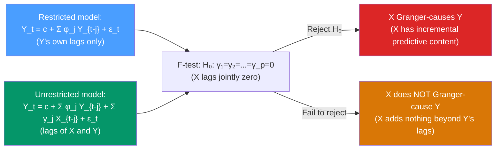

# ➡️ Granger Causality

> [!abstract] TL;DR
> **$X$ Granger-causes $Y$** if past values of $X$ improve the prediction of $Y$ beyond what past values of $Y$ alone can predict. Formally: $\mathbb{E}[Y_{t+1}|\mathcal{F}_t] \neq \mathbb{E}[Y_{t+1}|\mathcal{F}_t^{-X}]$. Tested with an **F-test** comparing an unrestricted VAR (with $X$ lags) to a restricted model (without $X$ lags). **Critical caveat**: Granger causality is about predictive content, NOT about true economic causality or direction of influence.

## Intuition — analogy FIRST

A rooster crows every morning just before the sun rises. Does the rooster *cause* the sun to rise? By Granger causality's definition: yes — past crowing times help predict sunrise better than just looking at past sunrise times. But obviously the rooster doesn't cause the sun. The sun's imminent rising causes the rooster to crow.

Granger causality detects **predictive relationships**, not mechanisms. It answers "does knowing $X$'s history help predict $Y$?" — a useful operational definition for time series analysis, but profoundly different from "does $X$ structurally cause $Y$?"

In practice, Granger causality is a screening tool: if $X$ doesn't even Granger-cause $Y$, it's hard to argue for any causal connection. But if it does, that's just evidence worth investigating — not proof.

---

## How It Works



---

## Key Concepts / Details

### Formal Definition

**$X$ Granger-causes $Y$** (Granger 1969) if for all horizons $h \geq 1$:
$$\text{MSE}[\hat{Y}_{t+h}|\mathcal{F}_t] < \text{MSE}[\hat{Y}_{t+h}|\mathcal{F}_t^{-X}]$$

where $\mathcal{F}_t$ is the full information set at time $t$ and $\mathcal{F}_t^{-X}$ excludes all history of $X$.

**Bivariate test** (in a VAR(p) framework):

**Unrestricted** model:
$$Y_t = c + \sum_{j=1}^{p}\phi_j Y_{t-j} + \sum_{j=1}^{p}\gamma_j X_{t-j} + \epsilon_t$$

**Restricted** model:
$$Y_t = c + \sum_{j=1}^{p}\phi_j Y_{t-j} + \epsilon_t$$

**Test statistic:**
$$F = \frac{(RSS_R - RSS_U)/p}{RSS_U/(T - 2p - 1)} \sim F(p, T - 2p - 1) \text{ under } H_0$$

**$H_0$**: $\gamma_1 = \gamma_2 = \cdots = \gamma_p = 0$ (X does not Granger-cause Y)

### Properties and Limitations

| Property | Description |
|---------|-------------|
| **Lag-order dependent** | Results can change with the number of lags $p$ — use AIC/BIC to select $p$ |
| **Linear only** | Standard Granger causality tests only linear predictability — nonlinear relationships are missed |
| **Not structural causality** | Granger-causality ≠ intervention causality (Pearl's do-calculus) |
| **Omitted variable bias** | If a third variable $Z$ causes both $X$ and $Y$, $X$ may appear to Granger-cause $Y$ spuriously |
| **Non-stationary series** | ADF test first; Granger causality in levels with $I(1)$ series can be spurious |
| **Sample size sensitive** | Low power in small samples; high power can detect trivial predictability in large samples |

### Instantaneous Causality

**Instantaneous causality**: $X$ instantaneously causes $Y$ if $Y_t$ and $X_t$ have conditional correlation given past information — i.e., contemporaneous correlation in residuals.

**Block exogeneity test**: in a VAR with $k > 2$ variables, test whether all lags of a block of variables $X$ (say, foreign variables) can be excluded from equations for domestic variables — the multivariate Granger causality test.

### Python: Granger Causality Tests

```python
import pandas as pd
import numpy as np
from statsmodels.tsa.stattools import grangercausalitytests
from statsmodels.tsa.api import VAR
from statsmodels.tsa.stattools import adfuller
import warnings
warnings.filterwarnings('ignore')

# Simulate: X Granger-causes Y but Y does not Granger-cause X
np.random.seed(42)
T = 300
X = np.zeros(T)
Y = np.zeros(T)
for t in range(2, T):
    X[t] = 0.6 * X[t-1] + np.random.normal(0, 1)
    Y[t] = 0.5 * Y[t-1] + 0.4 * X[t-1] + np.random.normal(0, 1)  # X→Y

df = pd.DataFrame({'Y': Y, 'X': X})

# Check stationarity
for col in df.columns:
    p = adfuller(df[col])[1]
    print(f"ADF {col}: p={p:.4f}")

# Granger causality tests (statsmodels)
print("\n=== Does X Granger-cause Y? ===")
gc_results = grangercausalitytests(df[['Y', 'X']], maxlag=4, verbose=True)
# Column order: [Y, X] tests whether X (2nd col) Granger-causes Y (1st col)

print("\n=== Does Y Granger-cause X? ===")
gc_results_rev = grangercausalitytests(df[['X', 'Y']], maxlag=4, verbose=True)

# Summary table
print("\n=== Summary: Granger Causality p-values ===")
for lag in [1, 2, 3, 4]:
    pval_xy = gc_results[lag][0]['ssr_ftest'][1]
    pval_yx = gc_results_rev[lag][0]['ssr_ftest'][1]
    print(f"Lag {lag}: X→Y p={pval_xy:.4f}  Y→X p={pval_yx:.4f}")

# VAR-based block exogeneity (for 3+ variable systems)
np.random.seed(42)
T = 300
Z = np.random.normal(0, 1, T)  # independent control
df3 = pd.DataFrame({'Y': Y, 'X': X, 'Z': Z})

var_model = VAR(df3)
var_result = var_model.fit(maxlags=4, ic='aic')
# Granger causality test for each variable block
gc_test = var_result.test_causality('Y', ['X'], kind='f')
print(f"\nVAR Granger test (X→Y): F={gc_test.test_statistic:.3f}, p={gc_test.pvalue:.4f}")

gc_test2 = var_result.test_causality('Y', ['Z'], kind='f')
print(f"VAR Granger test (Z→Y): F={gc_test2.test_statistic:.3f}, p={gc_test2.pvalue:.4f}")
```

### The Granger Causality vs Correlation Matrix

A simple cross-correlation analysis:

| Relationship | Correlation | Granger X→Y | Granger Y→X | Interpretation |
|-------------|-------------|-------------|-------------|----------------|
| X leads Y | High | Yes | No | X is a leading indicator for Y |
| Bidirectional | High | Yes | Yes | Feedback loop between X and Y |
| Contemporaneous | High | No | No | Contemporaneous common factor, not lagged relationship |
| Spurious (both I(1)) | High | Yes | Yes | Spurious — need to test for cointegration |

---

## Real-World Notes

- **Commodity prices → headline inflation**: oil and food prices Granger-cause CPI in most countries — a key finding for central bank forecasting models.
- **Financial conditions → real activity**: credit spreads and stock returns Granger-cause GDP growth by 1-2 quarters, making them useful leading indicators.
- **Money and output (monetarism debate)**: Sims (1980) showed that money stock Granger-causes output, but once interest rates are included, money loses Granger-causality — suggesting interest rates are the true transmission channel.
- **Social media sentiment → stock returns**: studies find Twitter sentiment about stocks Granger-causes next-day returns for some stocks — though effect sizes are small and dissipate quickly.

---

## Common Pitfalls

1. **Testing with non-stationary series**: Granger tests on $I(1)$ levels produce non-standard distributions. Always test for unit roots first; use first differences or test within a VECM if cointegrated.
2. **Using too few or too many lags**: too few lags → omitted variable bias; too many → low power. Use AIC/BIC to select $p$.
3. **Concluding "no causality" from one test**: Granger causality is a linear test. Nonlinear Granger causality (e.g., Diks-Panchenko test) might find predictability that the F-test misses.
4. **Omitted variable bias**: if $Z$ drives both $X$ and $Y$, $X$ will appear to Granger-cause $Y$ even though the true driver is $Z$. Test in a trivariate VAR including $Z$.
5. **Treating Granger causality as sufficient for intervention**: Granger causality is not structural causality. Intervening on $X$ (policy action) does not guarantee the same effect as the historical correlation implied — see SVAR and [[Structural_VAR]].

---

## Related Concepts

- [[_MOC_Multivariate_TS|↑ Section MOC]]
- [[VAR_Models]] — the VAR framework where Granger causality is tested
- [[Structural_VAR]] — moving from Granger causality (predictive) to structural causality (interventional)
- [[Cointegration_and_ECM]] — when Granger causality tests can be misleading for $I(1)$ series
- [[Autocorrelation_and_ACF_PACF]] — the univariate equivalent of asking "does the past predict the future?"

---

## Review Questions

1. State the precise definition of Granger causality. Why is it called "causality" if it only measures predictability?
2. You test whether credit spreads Granger-cause GDP growth in a bivariate VAR(4). The F-test gives $F = 3.8$ with $p = 0.006$. What do you conclude? What additional evidence would strengthen a causal interpretation?
3. Two I(1) series both Granger-cause each other. What concern does this raise, and what additional test would you run before interpreting this result?

---

## Sources

- Granger (1969), *Investigating Causal Relations by Econometric Models and Cross-Spectral Methods*, Econometrica
- Sims (1980), *Macroeconomics and Reality*, Econometrica
- Hamilton, *Time Series Analysis*, Ch. 11

#time-series #multivariate #Granger-causality #VAR #predictive-causality
