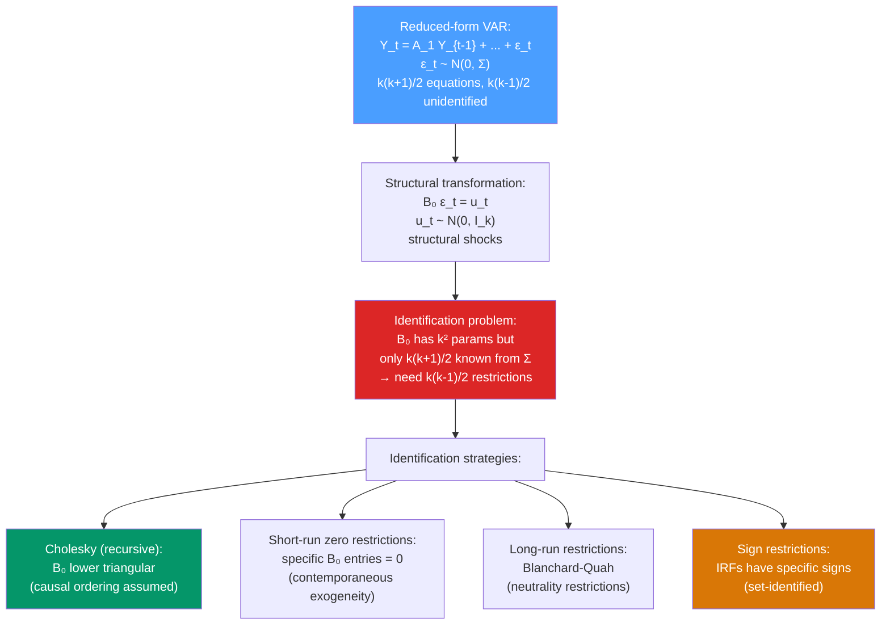

# 🏗️ Structural VAR (SVAR)

> [!abstract] TL;DR
> A **Structural VAR (SVAR)** imposes economic theory restrictions on the reduced-form VAR to identify **orthogonal structural shocks** with a direct economic interpretation. The fundamental challenge: a VAR(p) has $k(k-1)/2$ free parameters in the error covariance that are not identified from data alone — additional restrictions are needed. Common approaches: **Cholesky decomposition** (recursive ordering), **short-run zero restrictions**, **long-run restrictions** (Blanchard-Quah), and **sign restrictions**.

## Intuition — analogy FIRST

A reduced-form VAR gives you $k$ correlated shocks at each time step — but *which* shock caused what? When the economy is hit simultaneously by a demand shock and a supply shock, the reduced-form VAR cannot separate them. It sees the combined effect.

SVAR is like turning on the lights in the VAR to illuminate which structural shock caused what. But to turn on the right lights, you need a theory about how the economy works. For example: "monetary policy shocks don't affect output contemporaneously" is a restriction. This theory-based restriction identifies the monetary policy shock separately from the demand and supply shocks.

The identification problem in SVAR is exactly the identification problem in statistics generally: data alone cannot tell us the causal structure; we need to bring in assumptions.

---

## How It Works



---

## Key Concepts / Details

### From Reduced Form to Structural Form

**Reduced-form VAR**: $\mathbf{Y}_t = \mathbf{c} + \mathbf{A}_1\mathbf{Y}_{t-1} + \cdots + \mathbf{A}_p\mathbf{Y}_{t-p} + \boldsymbol{\epsilon}_t$

where $\boldsymbol{\epsilon}_t \sim N(\mathbf{0}, \boldsymbol{\Sigma})$ (correlated shocks).

**Structural form**: define $\mathbf{B}_0\boldsymbol{\epsilon}_t = \mathbf{u}_t$ where $\mathbf{u}_t \sim N(\mathbf{0}, \mathbf{I}_k)$ (uncorrelated unit-variance structural shocks).

The relationship: $\boldsymbol{\Sigma} = \mathbf{B}_0^{-1}(\mathbf{B}_0^{-1})^\prime$

**The identification problem**: $\boldsymbol{\Sigma}$ has $k(k+1)/2$ distinct elements. $\mathbf{B}_0$ has $k^2$ parameters. The data constrains only the symmetric $\boldsymbol{\Sigma}$, so $k^2 - k(k+1)/2 = k(k-1)/2$ additional restrictions are needed to uniquely identify $\mathbf{B}_0$.

### Identification Strategy 1: Cholesky Decomposition (Recursive)

Impose that $\mathbf{B}_0^{-1}$ is lower triangular — the Cholesky factor of $\boldsymbol{\Sigma}$.

**Interpretation**: variable 1 can affect all others contemporaneously; variable 2 can affect variables 3, ..., k contemporaneously but is not affected by 1 contemporaneously; ...; variable $k$ is affected by all others but has no contemporaneous effect on them.

**Example** (monetary policy VAR with ordering: GDP → CPI → Fed Funds Rate):
- GDP does not respond contemporaneously to CPI or interest rate shocks
- CPI does not respond contemporaneously to interest rate shocks
- Interest rate responds to contemporaneous GDP and CPI (the Taylor rule)

**Caveat**: the ordering matters. Changing the ordering changes the IRFs. This is not a statistical result — it is an identification assumption that should be motivated by economic theory.

### Identification Strategy 2: Long-Run Restrictions (Blanchard-Quah 1989)

**Assumption**: certain shocks have no long-run effect on certain variables.

Classic example: supply shocks (technology) can have permanent effects on output; demand shocks cannot (money neutrality in the long run).

The long-run impact matrix is:
$$\mathbf{C}(1) = (\mathbf{I} - \mathbf{A}_1 - \cdots - \mathbf{A}_p)^{-1}$$

Impose zero restrictions on $\mathbf{C}(1)\mathbf{B}_0^{-1}$ to identify supply vs demand shocks.

### Identification Strategy 3: Sign Restrictions (Uhlig 2005)

Instead of exact zero restrictions, impose restrictions on the **signs** of the impulse responses:

**Example** (monetary policy shock):
- A contractionary monetary policy shock (rate hike) should:
  - Increase the interest rate (positive IRF)
  - Decrease output (negative IRF)
  - Decrease prices (negative IRF)

Sign restrictions do not uniquely identify the model — they identify a **set** of admissible structural matrices $\mathbf{B}_0$ consistent with the restrictions. IRF bands reflect this set identification.

### Python: Structural VAR with Cholesky

```python
import pandas as pd
import numpy as np
from statsmodels.tsa.api import VAR
import matplotlib.pyplot as plt
import warnings
warnings.filterwarnings('ignore')

# Simulate a 3-variable VAR: GDP growth, inflation, interest rate
np.random.seed(42)
T = 300

# Structural shocks: supply, demand, monetary policy
np.random.seed(1)
u_supply = np.random.normal(0, 1, T)
u_demand = np.random.normal(0, 1, T)
u_mp     = np.random.normal(0, 1, T)

# Structural impact matrix (B0 inverse)
# Cholesky ordering: supply → demand → monetary
B0_inv = np.array([[1.0, 0.0, 0.0],
                   [0.5, 1.0, 0.0],
                   [0.3, 0.2, 1.0]])

eps = np.column_stack([u_supply, u_demand, u_mp]) @ B0_inv.T

# Generate VAR(2) dynamics
A1 = np.array([[0.5, 0.1, -0.1],
               [0.1, 0.4,  0.0],
               [0.0, 0.1,  0.6]])

Y = np.zeros((T, 3))
for t in range(2, T):
    Y[t] = A1 @ Y[t-1] + eps[t]

df = pd.DataFrame(Y, columns=['GDP_growth', 'Inflation', 'IntRate'])

# Fit reduced-form VAR
var_model = VAR(df)
var_result = var_model.fit(maxlags=4, ic='aic')

# Orthogonalised IRF (Cholesky)
irf = var_result.irf(periods=20)

# Plot impulse of IntRate (monetary policy shock) on all variables
fig, axes = plt.subplots(1, 3, figsize=(15, 4))
irf_df = irf.irfs  # shape: (periods, k, k)
periods = range(20)
for i, var_name in enumerate(['GDP_growth', 'Inflation', 'IntRate']):
    # Response of var_name (i) to shock in IntRate (2) — Cholesky ordering
    response = irf_df[:, i, 2]
    axes[i].plot(periods, response, color='blue', linewidth=2)
    axes[i].axhline(0, linestyle='--', color='gray', alpha=0.5)
    axes[i].set_title(f"IRF: IntRate shock → {var_name}")
    axes[i].set_xlabel("Periods")
plt.suptitle("Structural IRF (Cholesky Ordering: GDP → Inflation → IntRate)")
plt.tight_layout()
plt.show()

# Orthogonalised vs non-orthogonalised
print("Cholesky factor (B0_inv estimated):")
import numpy.linalg as la
Sigma_hat = var_result.sigma_u
P = la.cholesky(Sigma_hat)
print(P.round(4))

# Historical decomposition (contribution of each shock to each variable)
# Available via irf.cum_effects and fevd
fevd = var_result.fevd(periods=20)
print("\nFEVD at horizon 10 for GDP growth:")
print(fevd.decomp[10, 0, :].round(4))  # fraction from each shock
```

### Historical Decomposition

The **historical decomposition** shows the contribution of each structural shock to the historical path of each variable. For monetary policy analysis, it answers: "How much of the GDP slowdown in 2022 was due to monetary policy shocks vs supply chain disruptions?"

$$Y_{it} = \bar{Y}_{it} + \sum_{j=1}^{k}\sum_{s=0}^{t}(\boldsymbol{\Phi}_s \mathbf{B}_0^{-1})_{ij} u_{j,t-s}$$

---

## Real-World Notes

- **Monetary policy VARs (Christiano-Eichenbaum-Evans 1999)**: the standard identification for US monetary policy VARs uses a Cholesky ordering with the federal funds rate last (contemporaneously responsive to all other variables but other variables don't respond to the rate contemporaneously).
- **Oil price shocks (Kilian 2009)**: decomposes crude oil price movements into supply shocks, aggregate demand shocks, and oil-specific demand shocks — three structural shocks with different macroeconomic effects.
- **Financial crisis SVARs**: sign restrictions identify credit supply shocks (simultaneous tightening of lending standards and increase in spreads) without imposing strong zero restrictions.
- **Central bank DSGEs**: large-scale DSGE models at the Fed, ECB, and Bank of England are (implicitly) structural VARs with many more restrictions derived from economic microfoundations.

---

## Common Pitfalls

1. **Using Cholesky ordering without economic justification**: the ordering should reflect a theoretically grounded causal timing assumption, not be chosen to produce desired results.
2. **Reporting only the modal IRF under sign restrictions**: sign restrictions are set-identified. Always report the full range of admissible IRFs, not just the median.
3. **Ignoring unit root / cointegration pre-testing**: SVAR on $I(1)$ levels without cointegration adjustment produces misspecified models. Use SVECM for cointegrated systems.
4. **Over-restricting**: imposing too many restrictions makes the model over-identified. Test over-identification restrictions formally.
5. **Confusing short-run and long-run restrictions**: Blanchard-Quah long-run neutrality restrictions are applied to the *cumulative* IRF, not the impact. Computing this incorrectly is a common coding error.

---

## Related Concepts

- [[_MOC_Multivariate_TS|↑ Section MOC]]
- [[VAR_Models]] — the reduced-form parent; SVAR adds identification restrictions
- [[Granger_Causality]] — predictive causality; SVAR attempts structural (interventional) causality
- [[Cointegration_and_ECM]] — cointegrated systems require SVECM for long-run analysis

---

## Review Questions

1. Explain the identification problem in structural VAR. Why are $k(k-1)/2$ restrictions needed to identify the structural shocks from a reduced-form VAR?
2. Describe the Cholesky identification scheme for a 3-variable VAR (GDP, CPI, Fed Funds Rate). What does the ordering assumption imply economically, and what are its limitations?
3. Compare short-run zero restrictions and sign restrictions as identification strategies. When would you prefer sign restrictions over Cholesky?

---

## Sources

- Sims (1980), *Macroeconomics and Reality*, Econometrica
- Blanchard & Quah (1989), *The Dynamic Effects of Aggregate Demand and Supply Disturbances*, AER
- Uhlig (2005), *What are the Effects of Monetary Policy? Results from an Agnostic Identification Procedure*, Journal of Monetary Economics

#time-series #multivariate #SVAR #structural-identification #impulse-response
