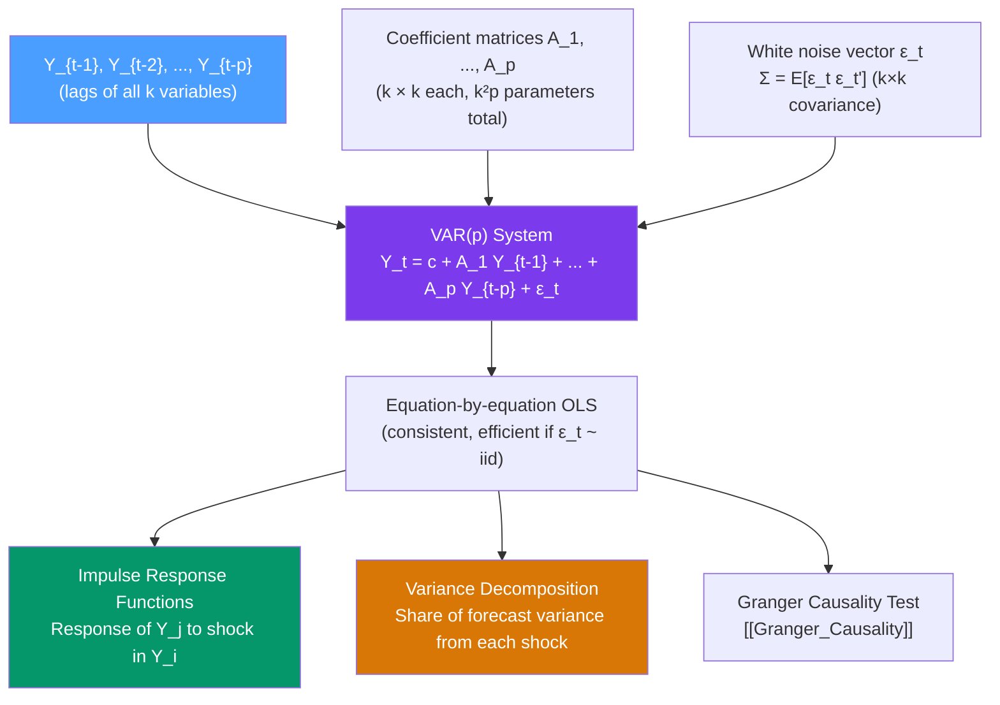

# 🔗 VAR Models — Vector Autoregression

> [!abstract] TL;DR
> A **VAR(p)** model is a multivariate generalisation of AR(p): each variable depends on $p$ lags of *all* variables in the system. With $k$ variables: $\mathbf{Y}_t = \mathbf{c} + \mathbf{A}_1\mathbf{Y}_{t-1} + \cdots + \mathbf{A}_p\mathbf{Y}_{t-p} + \boldsymbol{\epsilon}_t$. Each equation is estimated by OLS. Key tools: **impulse response functions (IRF)** show the dynamic response to a one-unit shock, and **forecast error variance decomposition (FEVD)** shows what fraction of variance in each variable is attributable to each shock.

## Intuition — analogy FIRST

Single-variable AR says "my past predicts my future." But GDP, inflation, and interest rates don't live in isolation — they form an ecosystem: when interest rates rise, GDP growth slows after a few quarters, which reduces inflation, which feeds back into rate policy. A single-equation approach misses all these cross-variable feedbacks.

**VAR** is a system of AR equations where *every* variable gets its own equation, and every equation includes lags of *all* variables. It's an atheoretical ("let the data speak") multivariate time series model — no a priori restrictions on which variables affect which. The VAR discovers the data's own dynamic structure, then tools like IRF and Granger causality help interpret it.

---

## How It Works



---

## Key Concepts / Details

### VAR(p) Specification

For a $k$-dimensional system with $p$ lags:
$$\mathbf{Y}_t = \mathbf{c} + \mathbf{A}_1\mathbf{Y}_{t-1} + \mathbf{A}_2\mathbf{Y}_{t-2} + \cdots + \mathbf{A}_p\mathbf{Y}_{t-p} + \boldsymbol{\epsilon}_t$$

- $\mathbf{Y}_t = (Y_{1t}, \ldots, Y_{kt})^\prime$ — $k \times 1$ vector of endogenous variables
- $\mathbf{A}_j$ — $k \times k$ coefficient matrices (need to estimate $k^2 p + k$ parameters for constants)
- $\boldsymbol{\epsilon}_t \sim WN(\mathbf{0}, \boldsymbol{\Sigma})$ — $k$-variate white noise with positive definite covariance $\boldsymbol{\Sigma}$

**Stationarity condition**: all eigenvalues of the companion matrix lie inside the unit circle.

**Parameter count**: VAR(p) with $k=3$ variables and $p=4$ lags has $3 \times 3 \times 4 + 3 = 39$ free parameters. As $k$ grows, the parameter count grows as $k^2 p$ — the **curse of dimensionality**.

### Estimation: Equation-by-Equation OLS

Because each equation has the same RHS regressors (all lags of all variables), **OLS applied equation by equation is equivalent to GLS** — it is consistent and asymptotically efficient under standard conditions.

For the $i$-th equation:
$$Y_{it} = c_i + \sum_{j=1}^{p}\sum_{l=1}^{k} a_{ij,l} Y_{jt-l} + \epsilon_{it}$$

Estimate by OLS; stack all $k$ equations for the full system.

### Lag Order Selection

Choose $p$ by information criteria over a grid $p = 0, 1, \ldots, p_{\max}$:

$$\text{AIC}(p) = \log|\hat{\boldsymbol{\Sigma}}_p| + \frac{2k^2 p}{T}$$
$$\text{BIC}(p) = \log|\hat{\boldsymbol{\Sigma}}_p| + \frac{k^2 p \log T}{T}$$

where $|\hat{\boldsymbol{\Sigma}}_p|$ is the determinant of the residual covariance matrix.

Also use the **LR test**: $LR = T(\log|\hat{\boldsymbol{\Sigma}}_{p-1}| - \log|\hat{\boldsymbol{\Sigma}}_p|) \sim \chi^2(k^2)$ under $H_0: \mathbf{A}_p = \mathbf{0}$.

### Wold Decomposition and Moving Average Representation

Any covariance-stationary VAR has an MA($\infty$) representation:
$$\mathbf{Y}_t = \boldsymbol{\mu} + \sum_{j=0}^{\infty} \boldsymbol{\Phi}_j \boldsymbol{\epsilon}_{t-j}$$

where $\boldsymbol{\Phi}_0 = \mathbf{I}_k$ and $\boldsymbol{\Phi}_j$ are the impulse response matrices — the $ij$-th element of $\boldsymbol{\Phi}_s$ is the response of variable $i$ at time $t+s$ to a unit shock in variable $j$ at time $t$.

### Impulse Response Functions (IRF)

Trace the dynamic response of each variable to a one-unit shock in one variable. For **reduced-form shocks** (from $\boldsymbol{\epsilon}_t$), the responses from different equations are correlated — the $k$ shocks are contemporaneously correlated with covariance $\boldsymbol{\Sigma}$.

**Cholesky orthogonalisation**: decompose $\boldsymbol{\Sigma} = \mathbf{P}\mathbf{P}^\prime$ (Cholesky), define **orthogonal structural shocks** $\mathbf{u}_t = \mathbf{P}^{-1}\boldsymbol{\epsilon}_t$ where $\text{Cov}(\mathbf{u}_t) = \mathbf{I}_k$. Then orthogonalised IRF = $\boldsymbol{\Phi}_s \mathbf{P}$.

**Caveat**: Cholesky IRFs depend on the variable ordering — the first variable in the ordering is assumed to affect all others contemporaneously, while the last is assumed to have no contemporaneous effects. This is an identification restriction, not a statistical result.

### Forecast Error Variance Decomposition (FEVD)

After $h$ steps, the forecast error variance of variable $i$ is:
$$MSE_i(h) = \sum_{j=1}^{k}\sum_{s=0}^{h-1}(\boldsymbol{\Phi}_s \mathbf{P})_{ij}^2$$

The fraction attributable to shock $j$:
$$\theta_{ij}(h) = \frac{\sum_{s=0}^{h-1}(\boldsymbol{\Phi}_s \mathbf{P})_{ij}^2}{MSE_i(h)}$$

FEVD shows whether a variable is mostly self-driven ($\theta_{ii}$ dominant) or driven by other variables.

### Python: VAR Model

```python
import pandas as pd
import numpy as np
from statsmodels.tsa.api import VAR
from statsmodels.tsa.stattools import adfuller, grangercausalitytests
import matplotlib.pyplot as plt
import warnings
warnings.filterwarnings('ignore')

# Macroeconomic VAR: GDP growth, inflation, interest rate
# Using simulated stationary data for demonstration
np.random.seed(42)
T = 200
k = 3

# Simulate VAR(2) data
A1 = np.array([[0.5, 0.1, -0.2],
               [0.0, 0.6,  0.1],
               [0.1, 0.0,  0.7]])
A2 = np.array([[-0.1, 0.0, 0.1],
               [ 0.0,-0.1, 0.0],
               [ 0.0, 0.0,-0.1]])
Sigma = np.eye(3) * 0.5

Y = np.zeros((T, k))
eps = np.random.multivariate_normal([0,0,0], Sigma, T)
for t in range(2, T):
    Y[t] = A1 @ Y[t-1] + A2 @ Y[t-2] + eps[t]

df = pd.DataFrame(Y, columns=['GDP_growth', 'Inflation', 'IntRate'])

# Step 1: Check stationarity
for col in df.columns:
    p = adfuller(df[col])[1]
    print(f"ADF {col}: p={p:.4f} → {'stationary' if p < 0.05 else 'non-stationary'}")

# Step 2: Fit VAR
model = VAR(df)

# Step 3: Select lag order
lag_order = model.select_order(maxlags=8)
print(f"\nAIC selects p={lag_order.aic}")
print(f"BIC selects p={lag_order.bic}")

# Step 4: Fit selected order
results = model.fit(maxlags=4, ic='aic')
print(results.summary())

# Step 5: Residual diagnostics
print("\nPortmanteau test (multivariate Ljung-Box):")
print(results.test_whiteness(nlags=10))

# Step 6: Impulse Response Functions
irf = results.irf(periods=20)
fig = irf.plot(orth=True, impulse='GDP_growth', response='Inflation')
plt.suptitle("Orthogonalised IRF: GDP Growth shock → Inflation")
plt.tight_layout()
plt.show()

# Step 7: FEVD
fevd = results.fevd(periods=20)
fevd.plot()
plt.suptitle("Forecast Error Variance Decomposition")
plt.tight_layout()
plt.show()

# Step 8: Forecast
forecast = results.forecast(df.values[-results.k_ar:], steps=12)
fc_df = pd.DataFrame(forecast, columns=df.columns)
print(f"\n12-step forecast:\n{fc_df.round(3)}")
```

### Common VAR Applications

| Application | Variables | Use case |
|-------------|-----------|---------|
| **Monetary policy analysis** | GDP, CPI, fed funds rate | How does a rate hike affect output and prices? |
| **Fiscal multipliers** | GDP, government spending, taxes | What is the impact of a spending shock? |
| **Asset pricing** | Stock returns, bond yields, VIX | How do financial variables interact? |
| **Supply chain** | Production, inventory, sales | Lead-lag relationships in the supply chain |
| **Epidemic modeling** | Cases, hospitalisations, deaths | Cross-variable disease dynamics |

---

## Real-World Notes

- **Sims (1980) "Macroeconomics and Reality"**: the paper that launched VAR — argued that structural macro models were too restrictive and advocated VAR as an atheoretical alternative. Nobel Prize-worthy contribution.
- **Federal Reserve models**: the Fed uses large-scale VARs (FRB/US) and smaller structural VARs for policy analysis. The Laubach-Williams natural rate model is a state-space extension of VAR.
- **Bayesian VAR (BVAR)**: with many variables, the curse of dimensionality makes classical VAR unstable. Minnesota prior shrinkage (Doan, Litterman & Sims 1984) is the standard solution — shrinks coefficients toward univariate random walks.
- **Structural VAR identification**: the main challenge is turning correlated reduced-form shocks into economically interpretable structural shocks. See [[Structural_VAR]].

---

## Common Pitfalls

1. **Using levels of I(1) variables in VAR without testing**: non-stationary variables in a VAR produce spurious results. Either first-difference all variables or use a VECM if cointegrated (see [[Cointegration_and_ECM]]).
2. **Over-parameterising with large $k$ and $p$**: VAR(4) with $k=5$ variables has 100+ parameters. Use Bayesian VAR or factor models for large systems.
3. **Interpreting Cholesky IRFs as causal**: the ordering-dependent Cholesky orthogonalisation is an identification assumption. Use sign restrictions or external instruments for more credible identification.
4. **Confusing Granger causality with economic causality**: Granger causality is about incremental predictability, not true causal mechanisms. See [[Granger_Causality]].
5. **Not bootstrapping confidence bands for IRF**: asymptotic standard errors for IRF are unreliable in finite samples. Always bootstrap the confidence intervals.

---

## Related Concepts

- [[_MOC_Multivariate_TS|↑ Section MOC]]
- [[AR_Models]] — the univariate special case ($k=1$); VAR generalises AR to systems
- [[Granger_Causality]] — F-test within the VAR system for incremental predictability
- [[Structural_VAR]] — adding identification restrictions to interpret reduced-form VAR shocks
- [[Cointegration_and_ECM]] — when $I(1)$ variables in the VAR share a long-run equilibrium

---

## Review Questions

1. Explain how the number of parameters in a VAR(p) model scales with the number of variables $k$ and lag order $p$. For $k=5$ and $p=4$, how many free parameters must be estimated?
2. What is the difference between an impulse response function computed from reduced-form shocks versus orthogonalised (Cholesky) shocks? Why does the Cholesky ordering matter?
3. You fit a VAR(2) to GDP growth and inflation. The FEVD at horizon $h=8$ shows that 45% of GDP growth forecast error variance is attributable to inflation shocks. Interpret this finding.

---

## Sources

- Sims (1980), *Macroeconomics and Reality*, Econometrica
- Hamilton, *Time Series Analysis*, Ch. 11
- Lütkepohl, *New Introduction to Multiple Time Series Analysis*, Ch. 2–3

#time-series #multivariate #VAR #impulse-response #variance-decomposition
