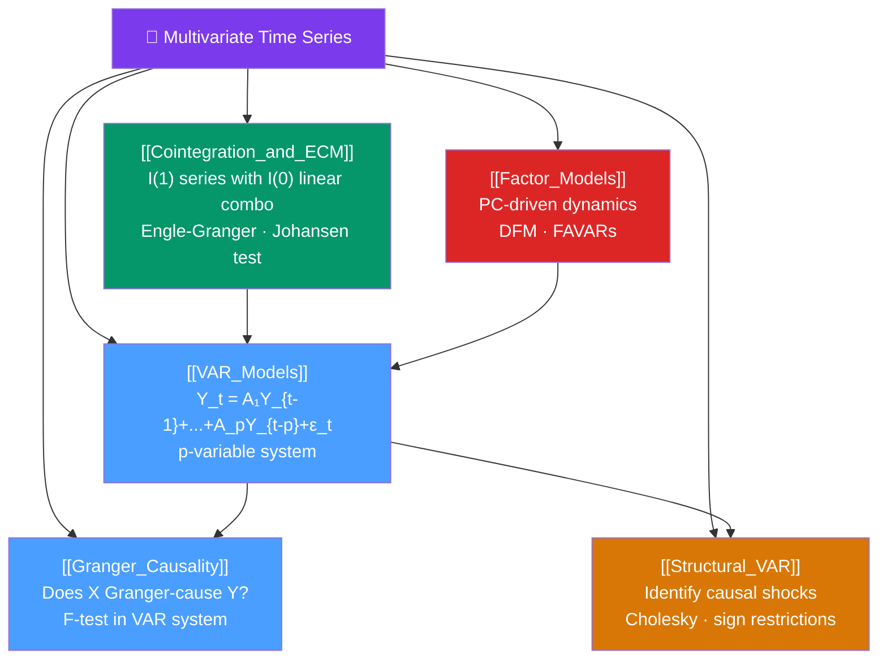

# 🗺️ Multivariate Time Series — Map of Content

> [!abstract] What This Section Covers
> When multiple time series are jointly modelled, they can interact: one series may cause another, both may share a long-run equilibrium, or all may respond to common factors. This section covers the **VAR (Vector Autoregression)** model — the multivariate extension of AR — and its key tools: **Granger causality** (does $X$ help predict $Y$ beyond $Y$'s own history?), **cointegration and ECM** (two $I(1)$ series sharing a stationary long-run equilibrium), **Structural VAR** (imposing economic theory to identify causal shocks), and **factor models** (dimensionality reduction for large panels of time series).

## Concept Map

## Learning Path

1. [[VAR_Models]] — The VAR(p) specification, estimation by OLS, impulse response functions, variance decomposition.
2. [[Granger_Causality]] — The F-test for whether lags of $X$ improve prediction of $Y$ in the VAR system.
3. [[Cointegration_and_ECM]] — Engle-Granger 2-step, Johansen trace test, VECM specification.
4. [[Structural_VAR]] — Identifying orthogonal structural shocks via Cholesky or sign restrictions.
5. [[Factor_Models]] — Dynamic Factor Models (DFM) and FAVAR for large panels.

## All Notes at a Glance

| Note | Difficulty | What You'll Learn |
|------|------------|-------------------|
| [[VAR_Models]] | Intermediate | VAR(p) specification, AIC/BIC lag selection, Wold decomposition, IRF, FEVD |
| [[Granger_Causality]] | Intermediate | Granger causality F-test, block-exogeneity test, interpretation pitfalls |
| [[Cointegration_and_ECM]] | Advanced | Unit root in multivariate systems, Engle-Granger, Johansen, VECM, adjustment speeds |
| [[Structural_VAR]] | Advanced | Recursive Cholesky identification, sign restrictions, historical decomposition |
| [[Factor_Models]] | Advanced | PCA for time series, DFM state-space form, FAVAR, Kalman smoother |

## Key Questions This Section Answers

- How do you jointly model $k$ mutually correlated time series?
- What is Granger causality and why is it NOT the same as true causality?
- What is the difference between correlation, Granger causality, and cointegration?
- How does an error correction model prevent two cointegrated series from drifting apart?
- What additional assumptions are needed to go from reduced-form VAR to structural impulse responses?

## Related Sections

- [[_MOC_TimeSeries_Master|↑ Master MOC]]
- [[_MOC_ARIMA|← ARIMA Models]]
- [[_MOC_Volatility_Models|← Volatility Models]]
- [[_MOC_Modern_Methods|→ Modern Methods]]

#MOC #time-series #multivariate #VAR #econometrics
