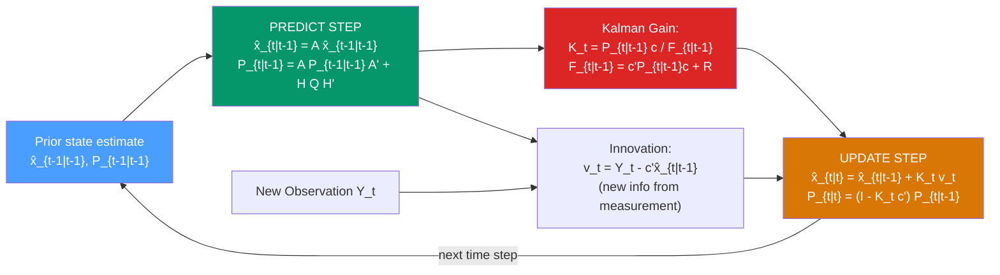

# 🎯 Kalman Filter

> [!abstract] TL;DR
> The **Kalman filter** is the optimal (minimum variance) linear estimator of the hidden state $\mathbf{x}_t$ in a linear Gaussian state-space model, given all observations up to time $t$. It operates via a **predict-update cycle**: the *prediction step* uses the state dynamics to forecast the next state; the *update step* incorporates the new observation via the **Kalman gain** $\mathbf{K}_t = \mathbf{P}_{t|t-1}\mathbf{c}_t(F_{t|t-1})^{-1}$. The **RTS smoother** runs backward to provide optimal smoothed estimates using all $T$ observations.

## Intuition — analogy FIRST

A detective is tracking a suspect (the hidden state). Each day, the detective gets two pieces of information:
1. **Prior prediction** (state transition): "Given where the suspect was yesterday and how fast they typically move, they're probably near location X today." This is imperfect — there's movement uncertainty.
2. **Witness report** (observation): "A witness says they saw the suspect near location Y." This is also imperfect — witnesses make mistakes.

The Kalman filter is the optimal way to combine these two noisy pieces of information. If the witness report is very reliable (low measurement noise), trust it more. If the prediction is very reliable (well-known dynamics, low process noise), trust it more. The **Kalman gain** exactly computes this trade-off.

---

## How It Works



---

## Key Concepts / Details

### The Predict-Update Recursion

Given state-space model: $Y_t = \mathbf{c}^\prime \mathbf{x}_t + \epsilon_t$ and $\mathbf{x}_t = \mathbf{A}\mathbf{x}_{t-1} + \mathbf{H}\boldsymbol{\eta}_t$

**Predict step** (given $\hat{\mathbf{x}}_{t-1|t-1}$ and $\mathbf{P}_{t-1|t-1}$):
$$\hat{\mathbf{x}}_{t|t-1} = \mathbf{A}\hat{\mathbf{x}}_{t-1|t-1}$$
$$\mathbf{P}_{t|t-1} = \mathbf{A}\mathbf{P}_{t-1|t-1}\mathbf{A}^\prime + \mathbf{H}\mathbf{Q}\mathbf{H}^\prime$$

**Innovation** (new information from the observation):
$$v_t = Y_t - \mathbf{c}^\prime\hat{\mathbf{x}}_{t|t-1}$$
$$F_{t|t-1} = \mathbf{c}^\prime\mathbf{P}_{t|t-1}\mathbf{c} + R \quad \text{(innovation variance)}$$

**Update step**:
$$\mathbf{K}_t = \mathbf{P}_{t|t-1}\mathbf{c} / F_{t|t-1} \quad \text{(Kalman gain)}$$
$$\hat{\mathbf{x}}_{t|t} = \hat{\mathbf{x}}_{t|t-1} + \mathbf{K}_t v_t$$
$$\mathbf{P}_{t|t} = (\mathbf{I} - \mathbf{K}_t\mathbf{c}^\prime)\mathbf{P}_{t|t-1}$$

**Interpretation of Kalman gain $\mathbf{K}_t$**:
- $\mathbf{K}_t \to \mathbf{0}$: ignore the new observation (measurement very noisy or state very precisely predicted)
- $\mathbf{K}_t \to 1/\mathbf{c}$: trust the observation completely (measurement very precise)
- $\mathbf{K}_t$ depends on the ratio of state uncertainty $\mathbf{P}_{t|t-1}$ to measurement noise $R$

### The Kalman Filter as Bayesian Updating

The filter maintains the **posterior distribution** of the state:
$$p(\mathbf{x}_t|\mathbf{Y}_{1:t}) = N(\hat{\mathbf{x}}_{t|t}, \mathbf{P}_{t|t})$$

**Predict step**: Chapman-Kolmogorov equation
$$p(\mathbf{x}_t|\mathbf{Y}_{1:t-1}) = \int p(\mathbf{x}_t|\mathbf{x}_{t-1})p(\mathbf{x}_{t-1}|\mathbf{Y}_{1:t-1})\,d\mathbf{x}_{t-1}$$

**Update step**: Bayes' theorem
$$p(\mathbf{x}_t|\mathbf{Y}_{1:t}) \propto p(Y_t|\mathbf{x}_t) \cdot p(\mathbf{x}_t|\mathbf{Y}_{1:t-1})$$

For the linear Gaussian model, both integrals have closed-form solutions (the Gaussian product formula), giving the Kalman recursions exactly.

### Steady-State Kalman Filter

For time-invariant SSMs, $\mathbf{P}_{t|t-1}$ converges to a fixed value $\mathbf{P}_\infty$ as $t \to \infty$, giving a constant steady-state Kalman gain:
$$\mathbf{K}_\infty = \mathbf{P}_\infty \mathbf{c} / (\mathbf{c}^\prime\mathbf{P}_\infty\mathbf{c} + R)$$

At steady state, the filter computes a weighted average of new observations and predictions with fixed weights — equivalent to exponential smoothing.

For the local level model at steady state:
$$K_\infty = \frac{q}{q + \sqrt{q(q+4)}/2} = \alpha \text{ (SES smoothing parameter)}$$

where $q = \sigma_\eta^2/\sigma_\epsilon^2$.

### RTS Smoother (Rauch-Tung-Striebel)

The **Kalman filter** is a *forward filter* — it uses observations $\mathbf{Y}_{1:t}$ to estimate the state at time $t$. The **RTS smoother** runs backward after the filter to produce *smoothed estimates* using all $T$ observations:

**Smoother gain**:
$$\mathbf{G}_t = \mathbf{P}_{t|t}\mathbf{A}^\prime(\mathbf{P}_{t+1|t})^{-1}$$

**Backward recursion** (from $t=T-1$ down to $t=1$):
$$\hat{\mathbf{x}}_{t|T} = \hat{\mathbf{x}}_{t|t} + \mathbf{G}_t(\hat{\mathbf{x}}_{t+1|T} - \hat{\mathbf{x}}_{t+1|t})$$
$$\mathbf{P}_{t|T} = \mathbf{P}_{t|t} + \mathbf{G}_t(\mathbf{P}_{t+1|T} - \mathbf{P}_{t+1|t})\mathbf{G}_t^\prime$$

**Filter vs smoother:**
- **Filtered** $\hat{\mathbf{x}}_{t|t}$: causal estimate — uses $\mathbf{Y}_{1:t}$ only. Used for real-time filtering and online forecasting.
- **Smoothed** $\hat{\mathbf{x}}_{t|T}$: uses all observations $\mathbf{Y}_{1:T}$. Better estimate for retrospective analysis, EM parameter estimation.

### Log-Likelihood from Kalman Filter

The log-likelihood is computed as a by-product:
$$\log L = -\frac{T}{2}\log(2\pi) - \frac{1}{2}\sum_{t=1}^{T}\left[\log F_{t|t-1} + v_t^2/F_{t|t-1}\right]$$

This is used to estimate SSM parameters by MLE (optimise over $\mathbf{A}$, $\mathbf{Q}$, $R$, etc.).

### Python: Kalman Filter from Scratch

```python
import numpy as np
import pandas as pd
import matplotlib.pyplot as plt
import statsmodels.api as sm
import warnings
warnings.filterwarnings('ignore')

def kalman_filter(y, A, c, H, Q, R, m0, P0):
    """
    Kalman filter for univariate observation, general state.
    y: (T,) observations
    A: (n,n) state transition
    c: (n,) observation loading
    H: (n,n) process noise input
    Q: (n,n) process noise covariance
    R: float observation noise variance
    m0, P0: initial state mean and covariance
    Returns: filtered means, covariances, log-likelihood
    """
    T = len(y)
    n = len(m0)
    m = np.zeros((T, n))    # filtered means
    P = np.zeros((T, n, n)) # filtered covariances
    loglik = 0.0

    m_pred = m0.copy()
    P_pred = P0.copy()

    for t in range(T):
        # Innovation
        v = y[t] - c @ m_pred
        F = c @ P_pred @ c + R

        # Kalman gain
        K = P_pred @ c / F

        # Update
        m[t]  = m_pred + K * v
        P[t]  = P_pred - np.outer(K, c) @ P_pred

        # Log-likelihood contribution
        loglik += -0.5 * (np.log(2*np.pi) + np.log(F) + v**2/F)

        # Predict next
        m_pred = A @ m[t]
        P_pred = A @ P[t] @ A.T + H @ Q @ H.T

    return m, P, loglik


# Local level model: x_t = x_{t-1} + η, Y_t = x_t + ε
# True parameters: Q = 0.1, R = 1.0
np.random.seed(42)
T = 100
Q_true, R_true = 0.2, 1.0
x = np.cumsum(np.random.normal(0, np.sqrt(Q_true), T))
y_obs = x + np.random.normal(0, np.sqrt(R_true), T)

# Scalar SSM (n=1 state)
A = np.array([[1.0]])
c = np.array([1.0])
H = np.array([[1.0]])
Q = np.array([[Q_true]])
R = R_true
m0 = np.array([y_obs[0]])
P0 = np.array([[10.0]])  # diffuse initialisation

m_filt, P_filt, loglik = kalman_filter(y_obs, A, c, H, Q, R, m0, P0)
print(f"Log-likelihood: {loglik:.2f}")

# Plot: true state, observations, filtered estimate
fig, ax = plt.subplots(figsize=(12, 5))
ax.plot(y_obs, alpha=0.4, label="Noisy observations", color='gray')
ax.plot(x, label="True state", color='blue', linewidth=2)
ax.plot(m_filt[:, 0], label="Kalman filtered", color='red', linestyle='--', linewidth=2)
ax.fill_between(range(T),
                m_filt[:, 0] - 2*np.sqrt(P_filt[:, 0, 0]),
                m_filt[:, 0] + 2*np.sqrt(P_filt[:, 0, 0]),
                alpha=0.2, color='red', label="±2σ filtered")
ax.set_title("Kalman Filter: Local Level Model")
ax.legend()
plt.show()

# Using statsmodels for full SSM with MLE
data = sm.datasets.get_rdataset("AirPassengers", "datasets").data
y_raw = pd.Series(data["value"].values,
                  index=pd.date_range("1949-01", periods=144, freq="MS"))
y_log = np.log(y_raw)

from statsmodels.tsa.statespace.structural import UnobservedComponents
model_ssm = UnobservedComponents(y_log, level='local linear trend',
                                  seasonal=12, stochastic_seasonal=True)
res_ssm = model_ssm.fit(disp=False)

# Kalman filter output
kf = res_ssm.filter_results
print(f"\nFiltered state shape: {kf.filtered_state.shape}")  # (n_states, T)
print(f"Filtered state cov shape: {kf.filtered_state_cov.shape}")  # (n_states, n_states, T)

# Forecast
fc = res_ssm.get_forecast(steps=12)
print(f"\n12-step ahead log forecast:\n{fc.predicted_mean.round(4)}")
```

### Extended and Unscented Kalman Filters

For **non-linear** or **non-Gaussian** state-space models:

| Method | Linearisation | Accuracy | Cost |
|--------|--------------|----------|------|
| **EKF** (Extended KF) | First-order Taylor expansion | Good for mildly nonlinear | Low |
| **UKF** (Unscented KF) | Sigma points (deterministic sampling) | Better for moderately nonlinear | Medium |
| **Particle filter** | Sequential Monte Carlo, no linearisation | Handles all nonlinear/non-Gaussian | High |

The **particle filter** (see [[Stochastic_Volatility]]) is required for the SV model because the observation equation ($Y_t = \exp(h_t/2)\epsilon_t$) is non-Gaussian.

---

## Real-World Notes

- **Apollo program**: Rudolf Kálmán developed the filter in 1960; it was used in the Apollo navigation computer — the first practical digital Kalman filter application.
- **Autonomous vehicles**: sensor fusion (GPS + lidar + accelerometers) uses extended Kalman filters to track vehicle position and velocity.
- **Finance**: risk models track "fair value" of bonds as a latent state; Kalman filter on yield curve captures level, slope, and curvature factors (Nelson-Siegel with Kalman).
- **Economic statistics**: the Congressional Budget Office and Federal Reserve use Kalman filters to estimate potential GDP (the latent non-inflationary output level).

---

## Common Pitfalls

1. **Forgetting the initialisation**: non-stationary models (local level, ARIMA with $d>0$) need diffuse initialisation. Set $\mathbf{P}_0$ very large (e.g., $10^6 \mathbf{I}$) or use the exact diffuse Kalman filter.
2. **Numerical stability**: direct Kalman gain computation can lose positive definiteness of $\mathbf{P}_{t|t}$. Use the Joseph form: $\mathbf{P}_{t|t} = (\mathbf{I}-\mathbf{K}_t\mathbf{c}^\prime)\mathbf{P}_{t|t-1}(\mathbf{I}-\mathbf{K}_t\mathbf{c}^\prime)^\prime + \mathbf{K}_t R \mathbf{K}_t^\prime$ for numerical stability.
3. **Confusing filter and smoother**: the filtered estimate $\hat{\mathbf{x}}_{t|t}$ uses data up to $t$; the smoothed $\hat{\mathbf{x}}_{t|T}$ uses all data. For real-time forecasting, use filtered; for retrospective analysis, use smoothed.
4. **MLE convergence issues**: the likelihood landscape for SSM parameters can be flat or multimodal. Use multiple starting points or Bayesian estimation with informative priors.
5. **Applying standard Kalman to SV model**: the SV model is non-Gaussian ($\epsilon_t^2 \sim \chi^2(1)$ in the log-squared-returns form). The quasi-Kalman filter is consistent but inefficient. Use particle filter for optimal inference.

---

## Related Concepts

- [[_MOC_Modern_Methods|↑ Section MOC]]
- [[State_Space_Models]] — the model framework; Kalman filter is the inference algorithm
- [[Factor_Models]] — DFM uses the Kalman filter/smoother to estimate latent factors
- [[Stochastic_Volatility]] — SV model uses particle filter (non-Gaussian generalisation of Kalman)
- [[Exponential_Smoothing]] — SES/Holt are special cases of steady-state Kalman filtering

---

## Review Questions

1. Explain the intuition behind the Kalman gain $K_t$. What happens to the filtered state estimate when $K_t \to 0$ and when $K_t \to 1$? What determines the value of $K_t$?
2. What is the difference between Kalman filtering and Kalman smoothing? In what contexts would you prefer each?
3. You fit a local level model and find that the smoothed state $\hat{x}_{t|T}$ shows much smoother trend than the filtered state $\hat{x}_{t|t}$. Explain why this occurs and which is appropriate for real-time forecasting.

---

## Sources

- Kalman (1960), *A New Approach to Linear Filtering and Prediction Problems*, ASME Journal of Basic Engineering
- Harvey (1989), *Forecasting, Structural Time Series Models and the Kalman Filter*, Cambridge UP
- Durbin & Koopman (2012), *Time Series Analysis by State Space Methods* (2nd ed.)

#time-series #modern-methods #Kalman-filter #state-space #filtering
