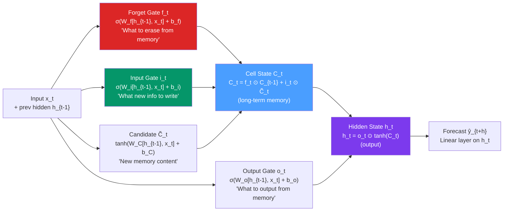

# 🧠 LSTM for Time Series

> [!abstract] TL;DR
> **LSTM** (Long Short-Term Memory) is a type of recurrent neural network designed to learn long-range dependencies in sequences. Its three **gates** (forget, input, output) control what information is stored in the **cell state** — a memory that can persist across hundreds of time steps. For time series, LSTMs learn feature representations from windows of past observations, capturing complex nonlinear patterns that ARIMA cannot. PyTorch or Keras implementation uses a sliding-window supervised learning formulation.

## Intuition — analogy FIRST

Imagine reading a very long novel. A simple RNN is like a person with severe short-term memory: by chapter 15, they have completely forgotten what happened in chapter 1. The gradients in a standard RNN vanish (or explode) over long sequences — the network cannot learn from information far in the past.

**LSTM** solves this by adding a "memory notebook" (the cell state $C_t$) that the network carries throughout the sequence. Three gatekeepers decide:
- **Forget gate**: "Should I erase old memories? (If the subject changed from weather to cooking, forget temperature.)"
- **Input gate**: "What new information should I write in the notebook?"
- **Output gate**: "What should I read from the notebook to make the next prediction?"

This gated architecture allows LSTMs to remember important information across thousands of time steps — solving the vanishing gradient problem that plagues vanilla RNNs.

---

## How It Works



---

## Key Concepts / Details

### LSTM Equations

Given input $x_t$ and previous states $(h_{t-1}, C_{t-1})$:

**Forget gate**: $f_t = \sigma(\mathbf{W}_f[h_{t-1}, x_t] + b_f)$
**Input gate**: $i_t = \sigma(\mathbf{W}_i[h_{t-1}, x_t] + b_i)$
**Candidate cell**: $\tilde{C}_t = \tanh(\mathbf{W}_C[h_{t-1}, x_t] + b_C)$
**Cell state update**: $C_t = f_t \odot C_{t-1} + i_t \odot \tilde{C}_t$
**Output gate**: $o_t = \sigma(\mathbf{W}_o[h_{t-1}, x_t] + b_o)$
**Hidden state**: $h_t = o_t \odot \tanh(C_t)$

where $\sigma(\cdot)$ is the sigmoid function, $\odot$ is element-wise multiplication, and $[h_{t-1}, x_t]$ is concatenation.

**Learnable parameters**: four weight matrices $\mathbf{W}_f, \mathbf{W}_i, \mathbf{W}_C, \mathbf{W}_o$ each of shape $(H + d_{in}) \times H$ where $H$ is hidden size and $d_{in}$ is input dimension.

### Supervised Learning Formulation for Time Series

Convert the sequence forecasting problem into supervised learning using a **sliding window**:

For horizon $h=1$: create pairs $(X_t, Y_t)$ where $X_t = (y_{t-L}, \ldots, y_{t-1})$ and $Y_t = y_t$.

```
Series: y_1, y_2, y_3, y_4, y_5, y_6, y_7, ...
Window L=3, h=1:
  Input: [y_1, y_2, y_3] → Target: y_4
  Input: [y_2, y_3, y_4] → Target: y_5
  Input: [y_3, y_4, y_5] → Target: y_6
```

For multi-step horizon $h > 1$: either predict directly (direct strategy) or predict one step and feed back (recursive strategy).

### Python: LSTM for Time Series (PyTorch)

```python
import numpy as np
import pandas as pd
import torch
import torch.nn as nn
from torch.utils.data import Dataset, DataLoader
import matplotlib.pyplot as plt
from sklearn.preprocessing import MinMaxScaler
import warnings
warnings.filterwarnings('ignore')

# --- Data preparation ---
# Generate seasonal time series
np.random.seed(42)
T = 600
t = np.arange(T)
y = (50 + 0.1*t + 15*np.sin(2*np.pi*t/52) + 8*np.sin(2*np.pi*t/7)
     + np.random.normal(0, 3, T))

# Normalise
scaler = MinMaxScaler(feature_range=(-1, 1))
y_scaled = scaler.fit_transform(y.reshape(-1, 1)).flatten()

# Sliding window dataset
WINDOW = 52
HORIZON = 1
BATCH_SIZE = 32

class TimeSeriesDataset(Dataset):
    def __init__(self, series, window, horizon):
        self.X, self.Y = [], []
        for i in range(len(series) - window - horizon + 1):
            self.X.append(series[i:i+window])
            self.Y.append(series[i+window:i+window+horizon])
        self.X = torch.tensor(np.array(self.X), dtype=torch.float32)
        self.Y = torch.tensor(np.array(self.Y), dtype=torch.float32)

    def __len__(self): return len(self.X)
    def __getitem__(self, idx): return self.X[idx], self.Y[idx]

# Train/test split
n_train = 500
train_ds = TimeSeriesDataset(y_scaled[:n_train], WINDOW, HORIZON)
test_ds  = TimeSeriesDataset(y_scaled[n_train-WINDOW:], WINDOW, HORIZON)

train_loader = DataLoader(train_ds, batch_size=BATCH_SIZE, shuffle=True)
test_loader  = DataLoader(test_ds,  batch_size=len(test_ds), shuffle=False)

# --- LSTM Model ---
class LSTMForecaster(nn.Module):
    def __init__(self, input_size=1, hidden_size=64, num_layers=2,
                 horizon=1, dropout=0.2):
        super().__init__()
        self.lstm = nn.LSTM(input_size=input_size,
                            hidden_size=hidden_size,
                            num_layers=num_layers,
                            batch_first=True,
                            dropout=dropout)
        self.fc   = nn.Linear(hidden_size, horizon)
        self.dropout = nn.Dropout(dropout)

    def forward(self, x):
        # x: (batch, seq_len) → reshape to (batch, seq_len, 1)
        x = x.unsqueeze(-1)
        out, _ = self.lstm(x)          # (batch, seq_len, hidden)
        out = self.dropout(out[:, -1]) # last time step
        return self.fc(out)            # (batch, horizon)

model = LSTMForecaster(hidden_size=64, num_layers=2, horizon=HORIZON)
print(f"Parameters: {sum(p.numel() for p in model.parameters()):,}")

# --- Training ---
optimizer = torch.optim.Adam(model.parameters(), lr=1e-3, weight_decay=1e-5)
scheduler = torch.optim.lr_scheduler.ReduceLROnPlateau(optimizer, patience=5, factor=0.5)
criterion = nn.MSELoss()

EPOCHS = 50
train_losses, val_losses = [], []

for epoch in range(EPOCHS):
    # Train
    model.train()
    epoch_loss = 0
    for X_batch, Y_batch in train_loader:
        optimizer.zero_grad()
        pred = model(X_batch)
        loss = criterion(pred, Y_batch)
        loss.backward()
        torch.nn.utils.clip_grad_norm_(model.parameters(), max_norm=1.0)
        optimizer.step()
        epoch_loss += loss.item()

    # Validate
    model.eval()
    with torch.no_grad():
        for X_test, Y_test in test_loader:
            val_pred = model(X_test)
            val_loss = criterion(val_pred, Y_test).item()

    scheduler.step(val_loss)
    train_losses.append(epoch_loss / len(train_loader))
    val_losses.append(val_loss)

    if (epoch + 1) % 10 == 0:
        print(f"Epoch {epoch+1:3d}: Train MSE={train_losses[-1]:.5f}, Val MSE={val_losses[-1]:.5f}")

# --- Evaluation ---
model.eval()
with torch.no_grad():
    for X_test, Y_test in test_loader:
        val_pred = model(X_test).numpy()
        y_true_scaled = Y_test.numpy()

# Inverse transform
val_pred_inv = scaler.inverse_transform(val_pred.reshape(-1, 1)).flatten()
y_true_inv   = scaler.inverse_transform(y_true_scaled.reshape(-1, 1)).flatten()

mape = np.mean(np.abs((y_true_inv - val_pred_inv) / y_true_inv)) * 100
print(f"\nTest MAPE: {mape:.2f}%")

# --- Plot ---
fig, (ax1, ax2) = plt.subplots(2, 1, figsize=(12, 8))
ax1.plot(train_losses, label="Train")
ax1.plot(val_losses, label="Validation")
ax1.set_title("Training Curve")
ax1.legend()

ax2.plot(y_true_inv[:100], label="Actual", color='blue')
ax2.plot(val_pred_inv[:100], label="LSTM Forecast", color='red', linestyle='--')
ax2.set_title("LSTM Forecast vs Actual (first 100 test points)")
ax2.legend()
plt.tight_layout()
plt.show()
```

### LSTM vs ARIMA: When to Use Each

| Situation | ARIMA | LSTM |
|-----------|-------|------|
| Small dataset ($T < 200$) | Better (fewer parameters) | Overfit risk |
| Large dataset ($T > 5000$) | Less competitive | Better |
| Long-range dependencies ($>100$ steps) | Poor | Good |
| Nonlinear dynamics | No | Yes |
| Multivariate inputs | Limited (VAR) | Natural (multi-feature) |
| Interpretability required | High | Low (black box) |
| Online updates | Easy | Requires retraining |
| Irregular timestamps | Needs preprocessing | Needs preprocessing |
| Uncertainty quantification | Prediction intervals | Dropout/ensembles needed |

### Architecture Choices

| Hyperparameter | Common values | Guidance |
|---------------|--------------|----------|
| Hidden size | 32–256 | Larger for more complex patterns |
| Num layers | 1–3 | Deep LSTMs: stochastic depth/dropout needed |
| Window (lookback) | 1–2 seasonal periods | Longer = more context, slower |
| Dropout | 0.1–0.3 | Regularise to prevent overfitting |
| Batch normalisation | Often not used | Layer norm better for RNNs |
| Bidirectional LSTM | Off for forecasting | On for classification (uses future) |

---

## Real-World Notes

- **Demand forecasting (e-commerce)**: Amazon, Alibaba use LSTM-based models for millions of SKUs. The key advantage: LSTMs naturally incorporate exogenous features (price, promotions, competitor actions) as additional input channels.
- **Energy load forecasting**: LSTM outperforms SARIMA for hourly electricity load due to complex weekday/weekend/holiday interactions across multiple hours.
- **Anomaly detection**: LSTMs trained to predict the next value flag anomalies when the prediction error exceeds a threshold — unsupervised anomaly detection for industrial IoT.
- **Financial series**: LSTMs have not consistently outperformed simpler baselines (random walk, ARIMA) for daily asset returns — the efficient market hypothesis means there is limited signal in short-horizon price patterns.

---

## Common Pitfalls

1. **Not normalising input data**: LSTM gates use sigmoid/tanh activations that saturate for large inputs. Always scale to $[-1,1]$ or $[0,1]$.
2. **Window too short**: a window of 7 days for annual seasonality (365 days) means the model never sees a full seasonal cycle in one input. Use at least 1–2 seasonal periods.
3. **Using MSE as the only evaluation metric**: MSE penalises large errors heavily but may mask systematic bias. Use MAPE, MAE, and directional accuracy together.
4. **No gradient clipping**: LSTM gradients can explode. Always use `clip_grad_norm_` (max_norm=1.0) during training.
5. **Training on global statistics but testing on local period**: if the test set covers a different regime (e.g., COVID period), a model trained pre-COVID will have large errors. Always inspect the test period's properties.

---

## Related Concepts

- [[_MOC_Modern_Methods|↑ Section MOC]]
- [[Transformer_Time_Series]] — attention-based sequence models; often competitive or superior to LSTM for long sequences
- [[ARIMA_and_Differencing]] — the classical alternative; better for small datasets and interpretability
- [[Prophet_Forecasting]] — an interpretable alternative that handles multiple seasonalities without neural networks

---

## Review Questions

1. Explain the role of the cell state $C_t$ in LSTM. How does it differ from the hidden state $h_t$, and why is it key to solving the vanishing gradient problem?
2. Describe the sliding window approach for converting a time series into a supervised learning problem. What are the trade-offs in choosing the window length?
3. You train an LSTM on 5 years of daily website traffic data and achieve 3% MAPE on the test set. A colleague says "just use ARIMA." Under what conditions would LSTM be justified over ARIMA for this problem?

---

## Sources

- Hochreiter & Schmidhuber (1997), *Long Short-Term Memory*, Neural Computation
- Brownlee, *Deep Learning for Time Series Forecasting* (2018), Machine Learning Mastery
- Hewamalage, Bergmeir & Bandara (2021), *Recurrent Neural Networks for Time Series Forecasting*, International Journal of Forecasting

#time-series #modern-methods #LSTM #deep-learning #RNN
